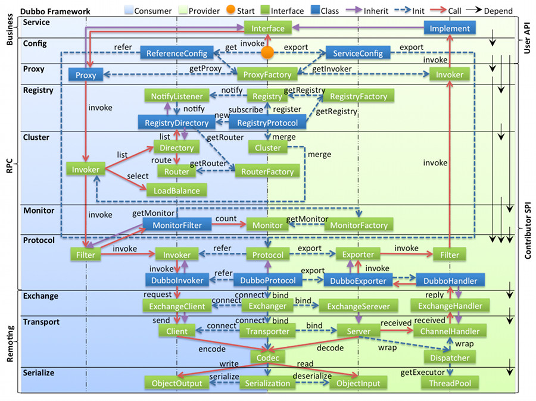

#Dubbo入门介绍及学习笔记


* [分布式简要说明](#1)
    * [应用架构及发展演变](#1.1)
    * [RPC简介](#1.2)
* [Dubbo核心概念](#2)
* [Dubbo特性一览](#3)
    * [dubbo设计架构](#3.1)
* [Dubbo的特性](#4)
* [Dubbo-admin](#5)
* [dubbo环境搭建，创建提供者，消费者项目](#6)

* [dubbo监控中心](#7)

* [dubbo与springboot整合](#8)
* [dubbo的配置](#9)

* [dubbo高可用](#10)
    * [dubbo zookeeper宕机](#10.1)
    * [dubbo 负载均衡](#10.2)
    * [dubbo 服务降级](#10.3)

* [dubbo原理](#11)
    * [RPC原理](#11.1)
    * [netty通信原理](#11.2)
    * [dubbo原理](#11.3)

#<span id=1>分布式简要说明</span>
##<span id=1.1>应用架构及发展演变</span>

随着互联网的发展，网站应用的规模不断扩大，常规的垂直应用架构已经无法应对，分布式服务架构以及流动计算架构势在必行，亟需一个治理系统确保架构有条不紊的演进。


###单一应用架构(ORM)
当网站流量很小时，只需一个应用，将所有功能都部署在一起，以减少部署节点和成本。此时，用于简化增删改查工作量的数据访问框架(ORM)是关键。

缺点：1.如果要添加某一个功能的话就要把一个项目重新打包，在分别部署到每一个服务器当中去。2.如果后期项目越来越大的话单台服务器跑一个项目压力会很大的。会不利于维护，开发和程序的性能。

###垂直应用架构(MVC)
当访问量逐渐增大，单一应用增加机器带来的加速度越来越小，提升效率的方法之一是将应用拆成互不相干的几个应用，以提升效率。此时，用于加速前端页面开发的Web框架(MVC)是关键。
（哪个应用的访问数量多就多增加几台服务器。）


###分布式服务架构
当垂直应用越来越多，应用之间交互不可避免，将核心业务抽取出来，作为独立的服务，逐渐形成稳定的服务中心，使前端应用能更快速的响应多变的市场需求。此时，用于提高业务复用及整合的分布式服务框架(RPC)是关键。


###流动计算架构
当服务越来越多，容量的评估，小服务资源的浪费等问题逐渐显现，此时需增加一个调度中心基于访问压力实时管理集群容量，提高集群利用率。此时，用于提高机器利用率的资源调度和治理中心(SOA)是关键。


##<span id=1.2>RPC简介</span>
###分布式应用架构(远程过程调用)
###RPC工作原理

1.Client像调用本地服务似的调用远程服务
2.Client stub接收到调用后，将方法，参数==序列化==
3.客户端将sockets将消息发送到服务端
4.Server stub 收到消息后进行解码（将消息对象反序列化）
5.Server stub 根据解码结构调用本地的服务
6.本地服务执行，并将结果返回给Server Stub
7.Server stub将结果打包成消息（将结果消息对象序列化）
8.服务端通过sockets将消息发送到客户端
9.Client stub接收到结果消息，并进行编码（将结果消息反序列化）
10.客户端得到最终结果。

###RPC调用分为以下两种：
**同步调用**：客户方等待调用执行完成并返回结果。
**异步调用**：客户方调用后不用等待执行结果返回，但依然可以通过回调通知等方式获取返回结果。若客户方不关心调用返回结果，则变成异步调用，单向调用不用返回结果。


#<span id=2>Dubbo核心概念</span>
>Dubbo 是一款高性能、轻量级的开源Java RPC框架，它提供了三大核心能力：**面向接口的远程方法调用，智能容错和负载均衡，服务自动注册和发现**。

#<span id=3>Dubbo特性一览</span>

##<span id=3.1>dubbo架构</span>


该图来自Dubbo官网，描述了服务注册中心，服务提供方，服务消费方，服务监控中心之间的调用关系。

###节点角色说明
Provider:暴露服务的服务提供方
Consumer:调用远程服务的服务消费方
Registry:服务注册与发现的注册中心
Monitor:统计服务的调用次数和调用时间的监控中心
Container:服务运行容器

###调用关系说明：
0.服务容器负责启动，加载，运行服务提供者。
1.服务提供者在启动时，向注册中心注册自己提供的服务。
2.服务消费者在启动时，向注册中心订阅自己所需的服务。
3.注册中心返回服务提供者地址列表给消费者，如果有变更，注册中心将基于长连接推送变更数据给消费者。
4.服务消费者，从提供者地址列表中，基于软负载均衡算法，选一台提供者进行调用，如果调用失败，再选另一台调用。
5.服务消费者和提供者，在内存中累计调用次数和调用时间，定时每分钟发送一次统计数据到监控中心。


#<span id=4>dubbo的特性</span>
##(1)服务注册中心
* 相比Hessian类RPC框架，dubbo有自己的服务中心，写好的服务可以注册到服务中心，客户端从服务中心寻找服务，然后再到相应的服务提供者机器获取服务。通过服务中心可以实现集群，负载均衡，高可用等重要功能。

* 服务中心一般使用给zookeeper，也有redis和其他一些方式，以使用zookeeper作为服务中心为例，服务提供者启动后会在zookeeper的/dubbo节点下创建提供的服务节点，包含服务提供者ip，port等信息，包含服务提供者ip。port等信息。服务提供者关闭时会从zookeeper中移除对应的服务。

* 服务使用者会从注册中心zookeeper中寻找服务，同一个服务可能会有多个提供者，dubbo会帮我们找到合适的服务提供者，也就是针对服务提供者的负载均衡。

##(2)负载均衡
* 当同一个服务有多个提供者在提供服务时，客户端如何正确的选择提供者实现负载均衡呢？dubbo也给我们提供了几种方案：
* random ==随机==选提供者，并可以给提供者设置权重
* roundrobin ==轮询==选择提供者
* leastactive 最少活跃调用数，相同活跃数的随机，活跃数：指调用前后计数差。使慢的提供者收到更少请求，因为越慢的提供者的调用前后计数差会越大。
* consistenthhash 一致性hash，相同参数的请求发到同一台 机器上。

##(3)简化测试，允许直连提供者
在开发阶段为了方便测试，通常系统客户端能指定调用某个服务提供者，那么可以在在引用服务时加一个url参数去指定服务提供者。配置如下:
><dubbo:reference id="xxxService"interface="com.alibaba.xxx.XxxService"url="dubbo://localhost:20890"/>


##(4)服务版本，服务分组
在dubbo配置文件中可以通过制定版本实现连接制定提供者，也就是通过服务版本可以控制服务的不兼容升级，当同一个服务有多种实现时，可以使用服务分组进行区分。


#<span id=5>dubbo-admin</span>
1. 启动zookeeper的zooServer.cmd
2. 启动zookeeper的zooCli.cmd
3. 将dubbo-admin的jar包启动
4. 访问localhost：7001,账号密码均为root


#<span id=6>Dubbo环境搭建，创建提供者、消费者项目</span>
基于以下图实现服务提供者、消费者


按照dubbo文档进行快速启动：
服务模型以及服务接口等公共的服务接口将被放在一个项目中：

##服务提供者
###定义服务接口（放在公共文件中）
DemoService.java ：
```java
package org.apache.dubbo.demo;

public interface DemoService {
    String sayHello(String name);
}
```


###在服务提供方实现接口
DemoServiceImpl.java :
```java
package org.apache.dubbo.demo.provider;
 
import org.apache.dubbo.demo.DemoService;
 
public class DemoServiceImpl implements DemoService {
    public String sayHello(String name) {
        return "Hello " + name;
    }
}

```

###需要用spring配置声明暴露服务，将服务接口暴露出去
provider.xml
```java
<?xml version="1.0" encoding="UTF-8"?>
<beans xmlns="http://www.springframework.org/schema/beans"
    xmlns:xsi="http://www.w3.org/2001/XMLSchema-instance"
    xmlns:dubbo="http://dubbo.apache.org/schema/dubbo"
    xsi:schemaLocation="http://www.springframework.org/schema/beans        http://www.springframework.org/schema/beans/spring-beans-4.3.xsd        http://dubbo.apache.org/schema/dubbo        http://dubbo.apache.org/schema/dubbo/dubbo.xsd">
 
    

     <!--1、指定当前服务/应用的名字(同样的服务名字相同，不要和别的服务同名)-->
    <dubbo:application name="user-service-provider"></dubbo:application>
    <!--2、指定注册中心的位置-->
    <!--<dubbo:registry address="zookeeper://127.0.0.1:2181"></dubbo:registry>-->
    <dubbo:registry protocol="zookeeper" address="127.0.0.1:2181"></dubbo:registry>
    <!--3、指定通信规则（通信协议? 服务端口）-->
    <dubbo:protocol name="dubbo" port="20880"></dubbo:protocol>
 
    <!-- 声明需要暴露的服务接口 -->
    <dubbo:service interface="org.apache.dubbo.demo.DemoService" ref="demoService" />
 
    <!-- 和本地bean一样实现服务 -->
    <bean id="demoService" class="org.apache.dubbo.demo.provider.DemoServiceImpl" />
</beans>
```

###加载spring 配置
Provider.java：
```java
import org.springframework.context.support.ClassPathXmlApplicationContext;
 
public class Provider {
    public static void main(String[] args) throws Exception {
        ClassPathXmlApplicationContext context = new ClassPathXmlApplicationContext(new String[]{"META-INF/spring/dubbo-demo-provider.xml"});
        context.start();
        System.in.read(); // 按任意键退出
    }
}
```

###maven依赖
因为注册中心使用了zookeeper，因此引入zookeeper客户端
并且引入dubbo
```xml
 <dependency>
            <groupId>com.alibaba</groupId>
            <artifactId>dubbo</artifactId>
            <version>2.6.2</version>
        </dependency>
        <!--注册中心是 zookeeper，引入zookeeper客户端-->
        <dependency>
            <groupId>org.apache.curator</groupId>
            <artifactId>curator-framework</artifactId>
            <version>2.12.0</version>
        </dependency>
```

##服务消费者
###在消费者工程中引入依赖
```xml
<!--dubbo-->
        <dependency>
            <groupId>com.alibaba</groupId>
            <artifactId>dubbo</artifactId>
            <version>2.6.2</version>
        </dependency>
        <!--注册中心是 zookeeper，引入zookeeper客户端-->
        <dependency>
            <groupId>org.apache.curator</groupId>
            <artifactId>curator-framework</artifactId>
            <version>2.12.0</version>
        </dependency>
```
###创建consumer.xml
```java
<?xml version="1.0" encoding="UTF-8"?>
<beans xmlns="http://www.springframework.org/schema/beans"
       xmlns:xsi="http://www.w3.org/2001/XMLSchema-instance"
       xmlns:dubbo="http://dubbo.apache.org/schema/dubbo"
       xmlns:context="http://www.springframework.org/schema/context"
       xsi:schemaLocation="http://www.springframework.org/schema/beans http://www.springframework.org/schema/beans/spring-beans.xsd
		http://www.springframework.org/schema/context http://www.springframework.org/schema/context/spring-context-4.3.xsd
		http://dubbo.apache.org/schema/dubbo http://dubbo.apache.org/schema/dubbo/dubbo.xsd
		http://code.alibabatech.com/schema/dubbo http://code.alibabatech.com/schema/dubbo/dubbo.xsd">
    <!--包扫描-->
    <context:component-scan base-package="com.wjj.gmall.service.iml"/>

    <!--指定当前服务/应用的名字(同样的服务名字相同，不要和别的服务同名)-->
    <dubbo:application name="order-service-consumer"></dubbo:application>
    <!--指定注册中心的位置-->
    <dubbo:registry address="zookeeper://127.0.0.1:2181"></dubbo:registry>

    <!--调用远程暴露的服务接口，生成远程服务代理-->
    <dubbo:reference interface="com.wjj.gmall.serivce.UserService" id="userService"></dubbo:reference>

    <bean id="orderService" class="com.wjj.gmall.service.iml.OrderServiceImpl"></bean>

</beans>
```

###对消费者实现类加上注解注入
```java

@Service
public class OrderServiceImpl implements OrderService {

    @Autowired
    public UserService userService;

    public void initOrder(String userID) {

        List<UserAdderss> userAddressList = userService.getUserAddressList(userID);

        //为了直观的看到得到的数据，以下内容也可不写
        System.out.println("当前接收到的userId=> "+userID);
        System.out.println("**********");
        System.out.println("查询到的所有地址为：");
        for (UserAdderss userAddress : userAddressList) {
            //打印远程服务地址的信息
            System.out.println(userAddress.getUserAddress());
        }

    }
}

```

###编写启动类
```java
public class ConsumerApplication {
    public static void main(String[] args) throws IOException {
        ClassPathXmlApplicationContext applicationContext = new ClassPathXmlApplicationContext("consumer.xml");
        OrderService orderService = (OrderService) applicationContext.getBean(OrderServiceImpl.class);

        //调用方法查询出数据
        orderService.initOrder("1");
        System.out.println("调用完成...");
        System.in.read();
    }
}
```

注意：消费者的运行测试需要先启动==提供者==。
启动服务提供者、消费者。及zookeeper的和dubbo-admin，查看监控信息。
localhost:7001


#<span id=7>dubbo监控中心</span>

##dubbo-admin
==图形化的服务管理页面==，安装时需要制定注册中心地址，即可从注册中心获取到所有的提供者/消费者进行配置管理。


##dubbo-monitor-simple
简单的监控中心
进入dubbo-monitor-simple文件，执行cmd命令，mvn package打包成jar包,然后
将 dubbo-monitor-simple-2.0.0-assembly.tar.gz 压缩包解压至当前文件夹，解压后config文件查看properties的配置是否是本地的zookeeper。
同时记得修改 port号，以免与8080重复。

打开解压后的 assembly.bin 文件，start.bat 启动dubbo-monitor-simple监控中心


**然后在服务者和消费提供者的xml配置中配置以下内从，然后重新启动服务提供和消费者启动类**
dubbo:monitor 配置规则如下：


在消费者与服务提供者的xml配置以下内容，再次启动服务提供和消费者提供类
```xml
 <!--dubbo-monitor-simple监控中心发现的配置-->
    <dubbo:monitor protocol="registry"></dubbo:monitor>
    <!--<dubbo:monitor address="127.0.0.1:7070"></dubbo:monitor>-->
```


#<span id=8>dubbo与spring-boot整合</span>
等以后学习spring-boot后再来


#<span id=9>dubbo属性配置</span>
##1.配置原则

优先级从高到低：

* JVM -D 参数：当你部署或者启动应用时，它可以轻易地重写配置，比如，改变 dubbo 协议端口；
* XML：XML 中的当前配置会重写 dubbo.properties 中的；
* Properties：默认配置，仅仅作用于以上两者没有配置时。
1.如果在 classpath 下有超过一个 dubbo.properties 文件，比如，两个 jar 包都各自包含了 dubbo.properties，dubbo 将随机选择一个加载，并且打印错误日志。
2.如果 id 没有在 protocol 中配置，将使用 name 作为默认属性。

##2.启动时检查
Dubbo 缺省会在启动时检查依赖的服务是否可用，不可用时会抛出异常，阻止 Spring 初始化完成，以便上线时，能及早发现问题，默认 ```check="true"```。

可以通过``` check="false" ```关闭检查，比如，测试时，有些服务不关心，或者出现了循环依赖，必须有一方先启动。

另外，如果你的 Spring 容器是懒加载的，或者通过 API 编程延迟引用服务，请关闭 check，否则服务临时不可用时，会抛出异常，拿到 null 引用，如果 ```check="false"```，总是会返回引用，当服务恢复时，能自动连上。
以**order-service-consumer**消费者为例，在consumer.xml中添加配置
关闭所有服务的启动时检查 (没有提供者时报错)：
```xml
<!--配置当前消费者的统一规则,当前所有的服务都不启动时检查-->
 <dubbo:consumer check="false"></dubbo:consumer>
```

关闭某个服务的启动时检查 (没有提供者时报错)：
```xml
 <dubbo:reference interface="com.wjj.gmall.serivce.UserService" id="userService" check="false"></dubbo:reference>
```
关闭注册中心启动时检查 (注册订阅失败时报错)：
```xml
<dubbo:registry check="false" />
```

##3.全局超时配置
```xml

<dubbo:provider timeout="5000" />

指定接口以及特定方法超时配置
<dubbo:provider interface="com.foo.BarService" timeout="2000">
    <dubbo:method name="sayHello" timeout="3000" />
</dubbo:provider>
```

##4.配置原则（不同粒度配置的覆盖关系）
以 timeout 为例，下图显示了配置的查找顺序，其它 retries, loadbalance, actives 等类似：

* 方法级优先，接口级次之，全局配置再次之。
* 如果级别一样，则消费方优先，提供方次之。

其中，服务提供方配置，通过 URL 经由注册中心传递给消费方。


##多版本
当一个接口实现，出现不兼容升级时，可以用版本号过度，版本号不同的服务相互间不引用。
可以按照以下的步骤进行版本迁移：

1.在低压力时间段，先升级一半提供者为新版本
2.再将所有消费者升级为新版本
3.然后将剩下的一半提供者升级为新版本

老版本服务提供者配置：
```xml
<dubbo:service interface="com.foo.BarService" version="1.0.0" />
```
新版本服务提供者配置
```xml
<dubbo:reference id="barService" interface="com.foo.BarService" version="1.0.0" />
```
老版本服务消费者配置：
```xml
<dubbo:reference id="barService" interface="com.foo.BarService" version="1.0.0" />
```
新版本服务消费者配置：
```xml
<dubbo:reference id="barService" interface="com.foo.BarService" version="2.0.0" />
```
如果不需要配置版本：
```xml
<dubbo:reference id="barService" interface="com.foo.BarService" version="*" />
```

##<span id=10>高可用</span>
高可用---减少系统不能提供服务的时间


###<span id=10.1>1. zookeeper宕机与dubbo直连</span>
现象：zookeeper注册中心宕机，还可以消费dubbo暴露的服务。

注册中心负责服务地址的注册与查找，相当于目录服务，服务提供者和消费者只在启动时与注册中心交互，注册中心不转发请求，压力较小。所以可以完全可以绕过注册中心：采用 dubbo 直连 ，即在服务消费方配置服务提供方的位置信息。


#### xml配置：
```java
<dubbo:reference id="userService" interface="com.zang.gmall.service.UserService" url="dubbo://localhost:20880" />

```
#### 注解方式：
```java
@Reference(url = "127.0.0.1:20880")   
 HelloService helloService;
```
==健壮性==
* 	监控中心宕掉不影响使用，只是丢失部分采样数据
*	数据库宕掉后，注册中心仍能通过缓存提供服务列表查询，但不能注册新服务
*	注册中心对等集群，任意一台宕掉后，将自动切换到另一台
*	注册中心全部宕掉后，服务提供者和服务消费者仍能通过本地缓存通讯
*	服务提供者无状态，任意一台宕掉后，不影响使用
*	服务提供者全部宕掉后，服务消费者应用将无法使用，并无限次重连等待服务提供者恢复

###<span id=10.2>2.集群下dubbo负载均衡配置</span>
在集群负载均衡时，Dubbo 提供了多种均衡策略，缺省为 random 随机调用。

####Random LoadBalance

随机，按权重设置随机概率。 在一个截面上碰撞的概率高，但调用量越大分布越均匀，而且按概率使用权重后也比较均匀，有利于动态调整提供者权重。
####RoundRobin LoadBalance

轮循，按公约后的权重设置轮循比率。
存在慢的提供者累积请求的问题，比如：第二台机器很慢，但没挂，当请求调到第二台时就卡在那，久而久之，所有请求都卡在调到第二台上。
####LeastActive LoadBalance

最少活跃调用数，相同活跃数的随机，活跃数指调用前后计数差。
使慢的提供者收到更少请求，因为越慢的提供者的调用前后计数差会越大。
####ConsistentHash LoadBalance

一致性 Hash，相同参数的请求总是发到同一提供者。
当某一台提供者挂时，原本发往该提供者的请求，基于虚拟节点，平摊到其它提供者，不会引起剧烈变动。算法参见：http://en.wikipedia.org/wiki/Consistent_hashing
缺省只对第一个参数 Hash，如果要修改，请配置 <dubbo:parameter key="hash.arguments" value="0,1" />
缺省用 160 份虚拟节点，如果要修改，请配置 <dubbo:parameter key="hash.nodes" value="320" />


####配置
服务段服务级别：
```xml
<dubbo:service interface="..." loadbalance="roundrobin" />
```
客户端服务级别（消费者)
```xml
<dubbo:reference interface="..." loadbalance="roundrobin" />
```
服务端方法级别
```xml
<dubbo:service interface="...">
    <dubbo:method name="..." loadbalance="roundrobin"/>
</dubbo:service>
```
客户端方法级别
```xml
<dubbo:reference interface="...">
    <dubbo:method name="..." loadbalance="roundrobin"/>
</dubbo:reference>
```

##<span id=10.3>整合hystrix，服务熔断与降级处理</span>

###1.服务降级
**当服务器压力剧增的情况下，根据实际业务情况及流量，对一些服务和页面有策略的不处理或换种简单的方式处理，从而释放服务器资源以保证核心交易正常运作或高效运作。**
可以通过服务降级功能临时屏蔽某个出错的非关键服务，并定义降级后的返回策略。
向注册中心写入动态配置覆盖规则：
```java
RegistryFactory registryFactory = ExtensionLoader.getExtensionLoader(RegistryFactory.class).getAdaptiveExtension();
Registry registry = registryFactory.getRegistry(URL.valueOf("zookeeper://10.20.153.10:2181"));
registry.register(URL.valueOf("override://0.0.0.0/com.foo.BarService?category=configurators&dynamic=false&application=foo&mock=force:return+null"));
```
其中：
mock=force:return+null 表示消费方对该服务的方法调用都直接返回 null 值，不发起远程调用。用来屏蔽不重要服务不可用时对调用方的影响。
还可以改为 mock=fail:return+null 表示消费方对该服务的方法调用在失败后，再返回 null 值，不抛异常。用来容忍不重要服务不稳定时对调用方的影响。


###2.集群容错
在集群调用失败时，Dubbo 提供了多种容错方案，缺省为 failover 重试。

==Failover Cluster==
失败自动切换，当出现失败，重试其它服务器。通常用于读操作，但重试会带来更长延迟。可通过 retries=“2” 来设置重试次数(不含第一次)。

重试次数配置如下：
<dubbo:service retries=“2” />
或
<dubbo:reference retries=“2” />
或
dubbo:reference
<dubbo:method name=“findFoo” retries=“2” />
</dubbo:reference>

==Failfast Cluster==
快速失败，只发起一次调用，失败立即报错。通常用于非幂等性的写操作，比如新增记录。

==Failsafe Cluster==
失败安全，出现异常时，直接忽略。通常用于写入审计日志等操作。

==Failback Cluster==
失败自动恢复，后台记录失败请求，定时重发。通常用于消息通知操作。

==Forking Cluster==
并行调用多个服务器，只要一个成功即返回。通常用于实时性要求较高的读操作，但需要浪费更多服务资源。可通过 forks=“2” 来设置最大并行数。

==Broadcast Cluster==
广播调用所有提供者，逐个调用，任意一台报错则报错 [2]。通常用于通知所有提供者更新缓存或日志等本地资源信息。

集群模式配置
按照以下示例在服务提供方和消费方配置集群模式
<dubbo:service cluster=“failsafe” />
或
<dubbo:reference cluster=“failsafe” />

###3.整合hystrix
参考博客：
https://blog.csdn.net/qq_41157588/article/details/106737191


#<span id=11>dubbo原理</span>
##<span id=11.1>RPC原理</span>

一次完整的RPC调用流程（同步调用，异步另说）如下： 
1）服务消费方（client）调用以本地调用方式调用服务； 
2）client stub接收到调用后负责将方法、参数等组装成能够进行网络传输的消息体； 
3）client stub找到服务地址，并将消息发送到服务端； 
4）server stub收到消息后进行解码； 
5）server stub根据解码结果调用本地的服务； 
6）本地服务执行并将结果返回给server stub； 
7）server stub将返回结果打包成消息并发送至消费方； 
8）client stub接收到消息，并进行解码； 
9）服务消费方得到最终结果。
RPC框架的目标就是要2~8这些步骤都封装起来，这些细节对用户来说是透明的，不可见的。

##<span id=11.2>netty通信原理</span>
Netty是一个异步事件驱动的网络应用程序框架， 用于快速开发可维护的高性能协议服务器和客户端。它极大地简化并简化了TCP和UDP套接字服务器等网络编程。

###BIO：(Blocking IO)


###NIO: (Non-Blocking IO)


Selector 一般称 为选择器 ，也可以翻译为 多路复用器，
Connect（连接就绪）、Accept（接受就绪）、Read（读就绪）、Write（写就绪）


###Netty原理
netty基本原理，可参考https://www.sohu.com/a/272879207_463994

##<span id=11.3>dubbo原理</span>

###dubbo设计结构

图中从下至上分为十层，各层均为**单向依赖**，右边的黑色箭头代表层之间的依赖关系，每一层都可以剥离上层被复用，其中，Service 和 Config 层为 **API**，其它各层均为 **SPI**。
####各层说明
* Service层，接口层，给服务提供者和消费者来实现的
* Config层，外配置接口，以 ServiceConfig, ReferenceConfig 为中心，可以直接初始化配置类，也可以通过 spring 解析配置生成配置类（配置dubbo）
* Proxy层，服务接口透明代理，生成服务的客户端Stub和服务器端Skeleton，以```ServiceProxy```为中心，扩展接口为```ProxyFactory```
* registry注册中心层：**封装服务地址的注册与发现**，以服务URL为中心，扩展接口为```RegistryFactory```,```Registry```,```RegistryService```
* cluster层，路由层：封装多个提供者的路由及负载均衡，并桥接注册中心，以```Invoker```为中心，扩展接口为```Cluster,Directory,Router,LoadBalance```
* monitor层，监控层，RPC调用次数和调用时间监控，以```Statistics```为中心，扩展接口为```MonitorFactory,Monitor,MonitorService```
* protocol远程调用层：封装RPC调用，以```Invocation,Result```为中心，扩展接口为```Protocol，Invoker，Exporter```
* exchange信息交换层，封装请求响应模式，同步转异步，以 ```Request, Response``` 为中心，扩展接口为 ```Exchanger, ExchangeChannel, ExchangeClient, ExchangeServer```
* transport网络传输层：抽象mina和netty为同一接口，以Message为中心，扩展接口为i```Channel,Transporter,Client,Server,Codec```
* serialize数据序列化层：可复用的一些工具，扩展接口为```Serialization,ObjectInput,ObjectOutput,ThreadPool   ```

###dubbo-启动解析，加载配置信息

spring对配置文件解析，spring有dubbo的解析


###dubbo服务暴露流程
具体看源码

###dubbo服务引用流程


###dubbo服务调用流程
