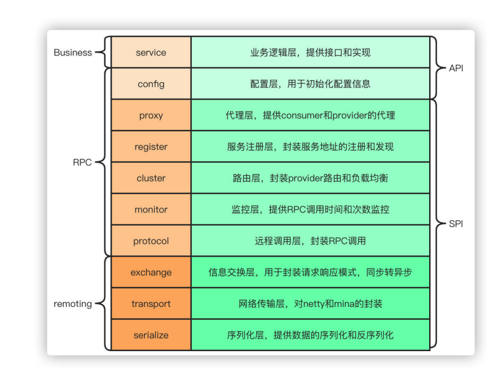
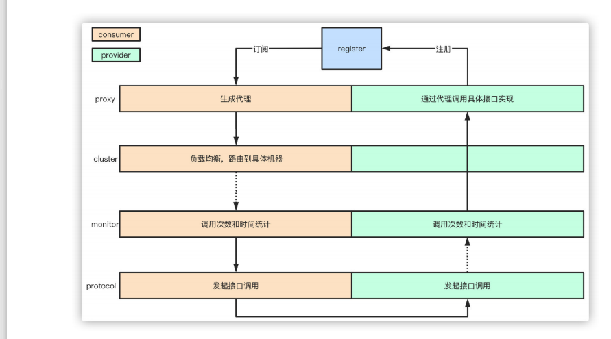

[toc]
# Dubbo 

## Dubbo 的分层？

从大的范围来说，dubbo分为三层，business业务逻辑层由我们自己提供接口和实现还有配置一些配置信息，

rpc层就是真正的RPC调用的核心层，封装整个rpc调用过程，负载均衡，集群容错，代理。

remoting则是对网络传输协议和数据转换的封装。

## Dubbo是如何做系统交互的？
Dubbo底层是通过RPC来完成服务和服务之间的调用的，Dubbo支持很多协议，比如默认的dubbo协议，比如http协议。

服务消费者在调用某个服务时，会将当前所调用的服务接口信息，当前方法信息，执行方法所传入的入参信息等组装为一个Invocation对象，然后不同的协议通过不同的数据组织方式和传输方式将这个对象传送给服务提供者，提供者接收到这个对象后，找到对应的服务实现，利用反射执行对应的方法，得到方法后再通过网络响应给服务消费者。

## Dubbo 的工作原理
1. 服务启动的时候，provider 跟 consumer 根据配置信息，连接到注册中心register，分别向注册中心注册和订阅服务
2. register根据服务订阅关系，返回provider信息到cosumer，同时consumer 会把provider 信息缓存到本地。如果信息有变更，consumer 会收到来自register 的推送。
3. consumer 生成代理对象，同时根据负载均衡策略，选择一台provider，同时定时向monitor记录接口的调用次数和时间信息
4. 拿到代理对象之后，consumer 通过代理对象发起接口调用
5. provider收到请求后对数据进行反序列化，然后通过代理调用具体的接口实现

## 为什么要通过代理对象通信
为了实现接口的透明代理，封装调用细节，让用户可以像调用本地方法一样调用远程方法，**同时代理实现一些其他的策略。**

1、 调用的负载均衡策略
2、 调用失败，超市，降级和容错机制
3、 做一些过滤操作
4、 接口调用数据统计

## 服务暴露的流程？

1. 在容器启动的时候，通过ServiceConfig解析标签，创建dubbo标签解析器来解析dubbo的标签，容器创建完成之后，触发ContextRefreshEvent 事件回调开始暴露服务
2. 通过ProxyFactory获取到invoker，invoker包含了需要执行的方法的对象信息和具体的URL地址
3. 再通过DubboProtocol的实现把包装后的invoker转换成exporter，然后启动服务器server，监听端口
4. 最后RegistryProtocol保存url地址和invoker的映射关系,同时注册到服务中心

## 服务引用的流程？
服务暴露之后，客户端就要引用服务，然后才是调用的过程。
1. 客户端根据配置文件信息从注册中心订阅服务
2. 之后DubboProtocol根据订阅的得到provider地址和接口信息连接到服务端server，开启客户端client，然后创建invoker
3. invoker创建完成之后，通过invoker为服务接口生成代理对象，这个代理对象用于远程调用provider，服务的引用就完成了。
 

 ## 有哪些负载均衡策略？
 1. 加权随机：假设我们有一组服务器servers=[A,B,C],他们对应的权重为weights=[5,3,2],权重总和为10。 现在把这些权重值平铺在一维坐标值上，[0,5)区间属于服务器A，[5,8）区间服务器B，[8,10） 属于服务器C。接下来通过随机数生成器生成一个范围在[0,10)之间的随机树，然后计算这个随机数会落到哪个区间上就可以了。

2. 最小活跃数：每个服务提供者对应一个活跃数active，初始情况下，所有服务提供者活跃数均为0。 每收到一个请求，活跃数+1，完成请求后则将活跃数减1.在服务运行一段时间后，性能好的服务提供者处理请求的速度更快，因此活跃数下降的也越快，此时这样的服务提供者能够优先获取到新的服务请求。

3. 一致性hash：通过hash算法，把provider的invoker 和随机节点生成hash，并将这个hash投射到[0,2^32-1]的圆环上，查询的时候根据key进行md5然后进行hash，得到第一个节点的值大于等于当前hash 的invoker、

4. 加权轮询： 比如服务器A，B，C权重比为5:2:1，那么在8次请求中，服务器A将收到其中的5次请求，服务器B会收到其中的2次请求，服务器C则收到其中的1次请求。

## 集群容错方式有哪些？

1. Failover Cluster： 失败自动切换：dubbo的默认容错方案，当调用失败时自动切换到其中可用的节点，具体的重试次数和间隔时间可用通过引用服务的时候配置，默认重试次数为1也就是只调用一次。
2. Failback Cluster： 失败自动恢复：在调用失败，记录日志和调用信息，然后返回空结果给consumer，并且通过定时任务每隔5秒对失败的调用进行重试
3. Failfast Cluster：快速失败：只会调用一次，失败后立刻抛出异常
4. Failsafe Cluster： 失败安全：调用出现异常，记录日志不抛出，返回空结果
5. Forking Cluster：并行调用多个服务提供者：通过线程池创建多个线程，并发调用多个provider，结果保存到阻塞队列，只要有一个provider成功返回了结果，就会立刻返回结果
6. Broadcast Cluster广播模式：逐个调用每个provider，如果其中一台报错，在循环调用结束后，抛出异常。

