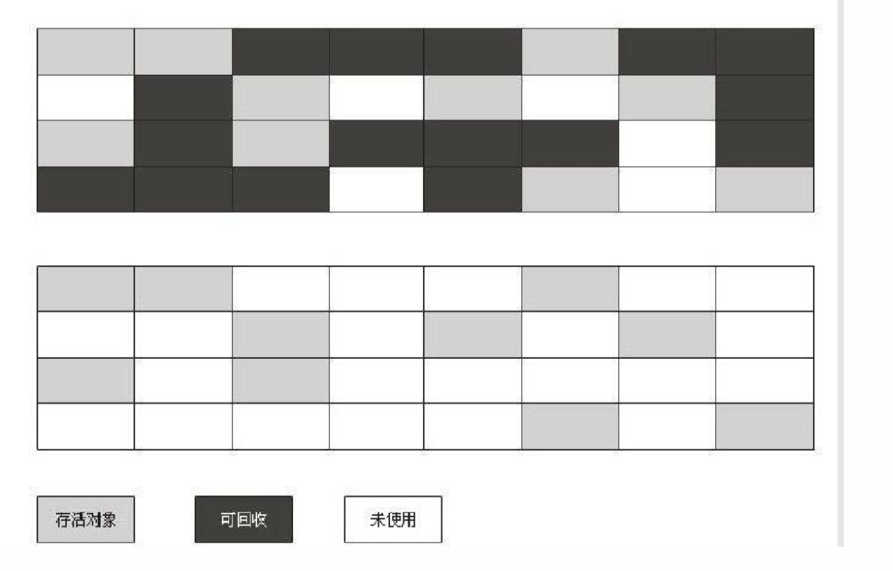
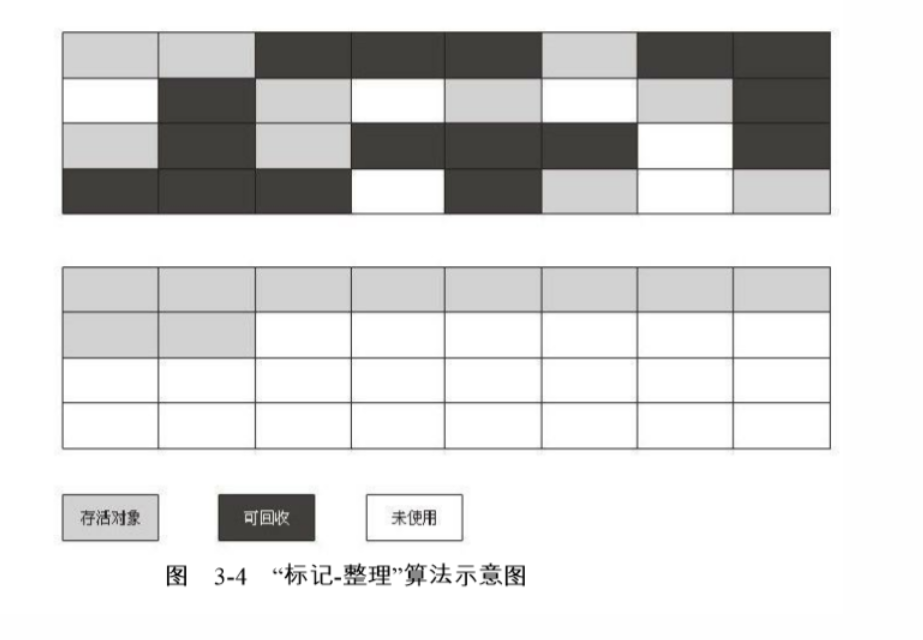

# 垃圾收集器与内存分配策略

## 对象存活判定算法

1.**引用计数算法**（主流JAVA虚拟机没有使用）

* 给对象添加一个引用计数器，每当一个地方引用它时，计数器值就加1；引用失效时，计数器值-1，计数器为0的对象不可能再次被使用
* 实现简单，判定效率高，当两个对象除了互相引用后没有别的对象引用他们时，无法回收他们。

2.**可达性分析算法**（主流实现）

* 以一系列**“GC Roots”**的对象为起始点，向下搜索，搜索走过的路径称为引用链，当一个对象到GC Roots没有任何引用链相连，对象不可达（已死）

* 可作为**GC Roots的对象包括**：
  * 栈帧中的本地变量表中引用的对象
  * 方法区中类静态属性引用的对象
  * 方法区中常量引用的对象
  * Native方法引用的对象
* **引用概念**
  * 强引用（Object obj=new Object()）
  * 软引用
  * 弱引用
  * 虚引用
* 即使不可达的对象至少要经历**两次**标记过程才会宣告死亡
  * 第一次标记为可达性分析
  * 第一次标记后进行筛选
    * 该对象是否有必要执行finalize()方法（对象没有覆盖finalize（）方法或者已经被虚拟机调用过，虚拟机将这两种情况视为“没有必要执行”）
    * 通过筛选后，放置在一个F-Queue的队列之中，虚拟机用一个低优先级的finalizer线程去执行它，如果在这个方法中拯救自己使得自己可达就不会被宣告死亡

## 回收方法区

* 方法区的垃圾收集的效率很低，大部分空间不会被当作垃圾回收

* 主要回收两部分内容：废弃常量和无用的类。

* 但是，大量使用反射，动态规划等框架频繁自定义ClassLoader,都需要虚拟机具备类卸载的功能，以保证方法区不会溢出

* 类需要同时满足下面3个条件才能算是“无用的类”，从而被垃圾回收

  * 该类所有的实例都已经被回收，也就是Java堆中不存在该类的任何实例
  * 加载该类的ClassLoader已经被回收
  * 该类对应的java.lang.Class对象没有在任何地方被引用，无法在任何地方通过反射访问该类的方法

  ​			

## 垃圾收集算法

**堆=新生代+老年代**

### **标记-清除算法**

* 思路
  * 标记：标记处所有需要回收的对象（细节上面有，可能是两次标记）
  * 清除：在标记完成后统一回收被标记的对象
* 不足
  * 效率：标记和清除的两个过程效率都不高
  * 空间：标记清除之后会产生大量不连续的内存碎片，导致后续分配大内存时没有没有足够的连续内存不得不提前出发另一次垃圾收集动作GC

### **复制算法**（解决效率问题）

* 思路

  * 将可用内存按容量划分为大小相等的两块，每次只使用其中的一块。当这一块的内存用完了，将活着的对象复制到另外一块上面，然后再把已经使用过的内存空间一次清理掉。

* 优点

  * 内存分配不用考虑内存碎片等复杂情况，只要移动堆顶指针，按顺序分配内存

* 不足

  * 可用内存只有原来的一般，代价较高

* 改进

  * 新生代空间不用1：1划分内存，按照Eden：Survivor1:Survivor2=8:1:1进行划分
  * 使用Eden空间和其中一块Survivor分配内存，回收时将活着的对象复制到另一个Survivor上，最后清理使用的Eden和Survivor空间
  * 如果存活对象超过10%，Survivor空间不够时直接分配到老年代

### **标记-整理算法**

* 对象存活率高时使用复制算法效率就会变低（额外的空间需要分配担保），所以堆内存中的老年代不使用复制算法

* 思路

  * 标记过程和标记-清除算法一样，标记完后不直接清理而是让存活的对象都向一端移动，然后直接清理端边界以外的内存

### **分代收集算法**

* 根据对象存活周期的不同将内存划分为几块（新生代，老年代）
* 新生代，每次垃圾收集都有大量的对象死去，只有少量存活，选用复制算法
* 老年代，使用“**标记-清理”/“标记-整理**”

## HotSpot 的算法实现

### 可达性分析-----枚举根节点

* 每一个对象内部的数据都有对应的类型，但是编译后就只有变量在栈上的位置信息了，所以类加载完成时就会把对象内什么偏移量上是什么类型数据计算出来，使用称为**OopMap**的数据结构记录栈上哪个位置是什么类型数据（栈上有引用类型也有基本数据类型，需要类似索引的结构记录哪些位置是引用类型，方便获取所有的GC Roots）

#### 安全点（SafePoint）

* 为什么要建立安全点
  * 造成OopMap内容变化的指令分厂多，若为每一条指令建立相应的OopMap需要大量的额外空间
  * HotSpot只在特定的位置建立了OopMap，这些点称为安全点，程序只有执行到安全点才能进行GC
* GC时如何让线程停顿下来
  * 抢占式中断
    * GC时，先把所有线程中断，不在安全点上的线程恢复起来然后运行到安全点上（现在几乎没有虚拟机采用这个方法）
  * 主动式中断
    * GC需要中断的时候，挂起一个标志，各个线程执行时主动去轮询这个标志，发现标志为真时主动将自己挂起。

JVM只会在特定位置放置safepoint，比如：

- 内存分配的地方（allocation，即new一个新对象的时候）
- 长时间执行区块结束的时刻（如方法调用，循环跳转等）

#### 安全区域（Safe Region）

* 有了安全点为什么还要安全区域
  * 如果线程储于Sleep状态或者Blocked状态，这时候线程无法相应JVM的中断请求，走到安全点主动挂起，这时候就需要安全区域来解决（难道说）
  * 安全区域可以看作扩展了的安全点，一段代码中引用关系不会发生变化，这个区域内任何地方GC都是安全的
* 执行步骤

- - 线程执行到安全区域时，标识自己进入安全区域了，GC时知道这个线程安全了，就不会管这个这个线程了
  - 随着线程执行要离开安全区域时检查是否发生了GC Roots枚举，如果发生了就一直等待直到收到信号

### 垃圾收集器

收集算法是内存回收的方法论，那么垃圾收集器就是内存回收的具体实现。

* **Serial收集器**
  * 单线程的收集器
  * GC时，必须暂停其他所有的工作线程
  * Serial收集器对于运行在Client模式下的虚拟机来说是一个很好的 选择。 

* **ParNew收集器**
  * Serial收集器的多线程版本
  * Server模式下首选的新生代收集器，有一个原因是目前只有它可以和CMS收集配合工作

●并行（Parallel）：指多条垃圾收集线程并行工作，但此时用户线程仍然处于等待状态。
●并发（Concurrent）：指用户线程与垃圾收集线程同时执行（但不一定是并行的，可能 会交替执行），用户程序在继续运行，而垃圾收集程序运行于另一个CPU上

* **Parallel Scavenge 收集器**

  * 使用复制算法
  * 特点
    * 吞吐量=运行用户代码时间/（运行用户代码时间+垃圾收集时间），
    * CMS等收集器目的是尽可能缩短垃圾收集时用户线程的停顿时间，但是Parallel Scavenge收集器目的是达到可控制的吞吐量(Throughput)
  * 停顿时间/高吞吐量

  - - - 【停顿时间短】适合与【用户交互】程序，响应速度较好
      - 【高吞吐量】适合后台运算，可以高效率地利用CPU时间
      - **GC停顿时间短是以牺牲吞吐量和新生代空间来换取的**

  - - - - 当新生代空间比较小时，收集300MB新生代肯定比500MB的快，但是会导致垃圾收集频率增加。
        - 比如原来10秒收集一次，一次停顿100毫秒，现在5秒停顿一次，一次停顿70毫秒

* **Serial Old 收集器**
  * Serial收集器的老年代版本，它同样是一个单线程收集器，使用“**标记-整理”**算法

* **Parralled Old**收集器

  * Parallel Scavenge收集器的老年代版本，使用**标记-整理算法**
  * 用途

  - - Parallel Scavenge配合应用在注重吞吐量以及CPU敏感的场景

- **CMS(Concurrent Mark Sweep)收集器**

- - 目的是获取最短停顿时间的垃圾收集器，使用【**标记-清除算法**】
  - 集中在互联网站或B/S系统的服务端上
  - 步骤

- - - 初始标记(CMS initial mark)【需要Stop The World】

- - - - 仅仅标记GC Roots可以直接关联的对象，速度很快

- - - 并发标记(CMS concurrent mark)

- - - - 实际就是**GC Roots Tracing**过程

- - - 重新标记(CMS remark)【需要Stop The World】

- - - - 修正并发标记期间因用户线程继续运行而导致标记产生变动的那一部分对象
      - 停顿时间比初始标记稍长但是远比并发标记短

- - - 并发清除(CMS concurrent sweep)

- - - - 这个阶段用户线程出现的垃圾称为浮动垃圾(Floating Garbage)只能留下一次GC再清理

- - **CMS缺点**

- - - 属于并发程序，对CPU非常敏感，由于程序占用了一部分用户进程导致总吞吐量降低
    - **一般的老年代收集器可以等到老年代几乎完全填满再执行，而CMS收集器必须留有一定的空间留给并发标记阶段的用户线程使用**。如果此时内存不满足需求就会出现Concurrent Mode Failure导致使用Serial Old再执行一次额外的Full GC
    - **由于使用标记-清除算法，会产生大量的内存碎片**

* G1收集器（Garbage-First）

  * 特点
    * 和CMS一样，目的都是降低停顿时间
    * 化整为零
      * 将整个JAVA堆划分为多个大小相等的独立区域，虽然还保留有新生代和老年代的概念，但新生代和老年代不再是物理隔离的了，它们都是一部分Region（不需要连续）的集合
    * **可预测时间停顿**
      * **和CMS比最大的优势，可以将停顿时间控制在根据使用者设定的时间**
      * **G1跟踪各个Region里垃圾的价值大小(回收需要的时间和释放的空间)，后台维护一个优先列表**，每次根据允许的收集时间，回收价值最大的Region
  * 步骤
    * 初始标记（Initial Marking）
    * 并发标记（Concurrent Marking）
    * 最终标记（Final Marking）
    * 筛选回收（Live Data Counting and Evacuation）
  * 使用Region必须解决的问题(所有垃圾收集器都有的问题，G1最明显)

  - - - Region不可能是独立的，老年代会引用新生代的对象，而新生代GC频率高于老年代，如果新生代内存不足GC时都扫描老年代会很浪费
      - 所以Region之间的引用和其他垃圾收集器新老代之间的引用都是使用Remembered Set避免扫描全堆
      - Remembered Set记录老年代引用新生代对象的关系
      - 新生代GC Roots=新生代GC Root+Remembered Set

## 内存分配策略

对象的内存分配，在堆上分配

* 堆内存被分为新生代和老年代，新生代包括Eden区，Survivor区
  * 新生代GC(Minor GC):指发生在新生代的垃圾收集动作，因为Java对象大多具备朝生夕死的特性，所以Minor GC非常频繁，一般回收速度也比较快。
  * 老年代GC(Major GC):指发生在老年代的GC，出现了Major GC,经常会伴随至少一次的Minor GC。Minor GC的速度一般会比Minor GC慢10倍以上。
* 对象优先在Eden分配，当Eden区没有足够空间进行分配时，虚拟 机将发起一次Minor GC。
* 大对象（大量连续内存空间的JAVA对象，很长的字符串以及数组）直接进入老年代
* 长期存活的对象将进入老年代

- - 每一个对象有对象年龄计数器，如果Eden出生的对象经历了Minor GC并复制到Survivor区则计数器+1，默认计数器达到15后进入老年代
  - 动态年龄判定
    - 如果Survivor区中相同年龄所有对象的大小大于Survivor空间的一半，则年龄大于或等于该年龄的对象直接进入老年代

* 空间分配担保

- - Minor GC时有多少对象存活是不确定的，Survivor空间可能不够，可以用老年代的空间进行担保。如果发现Minor GC后发现老年代连续空间也不够了就需要发起Full GC

