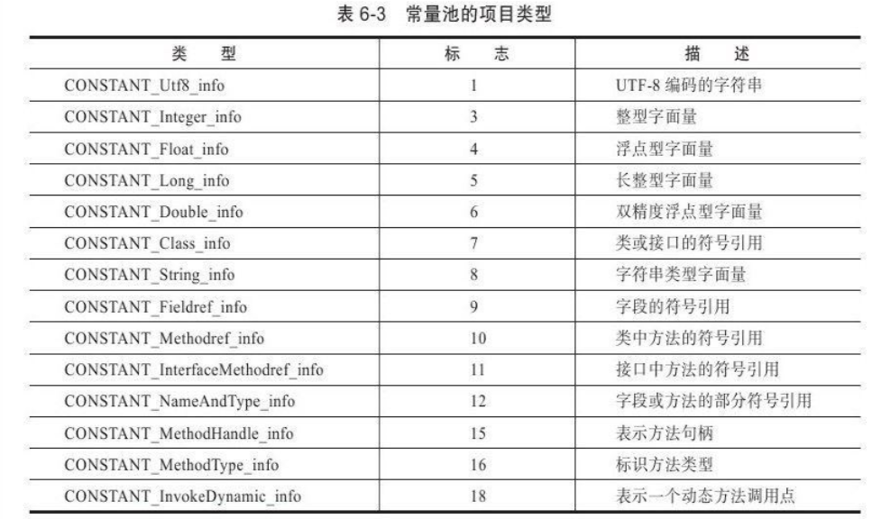
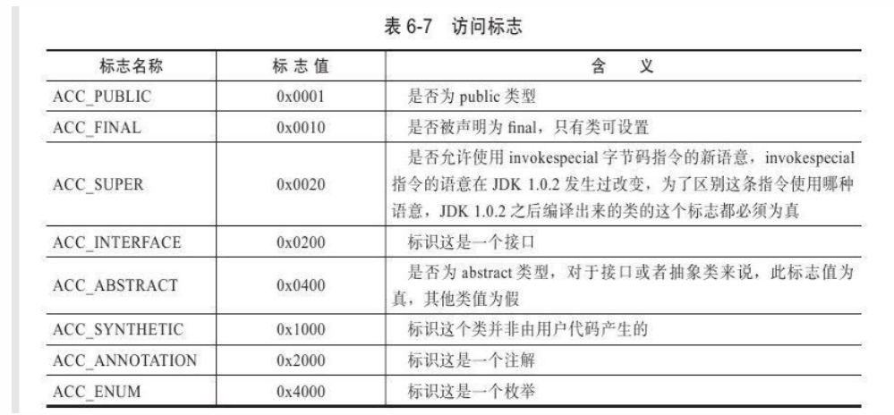
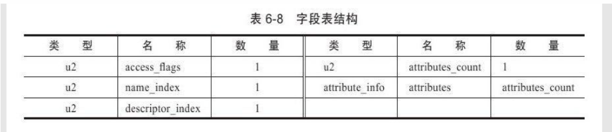
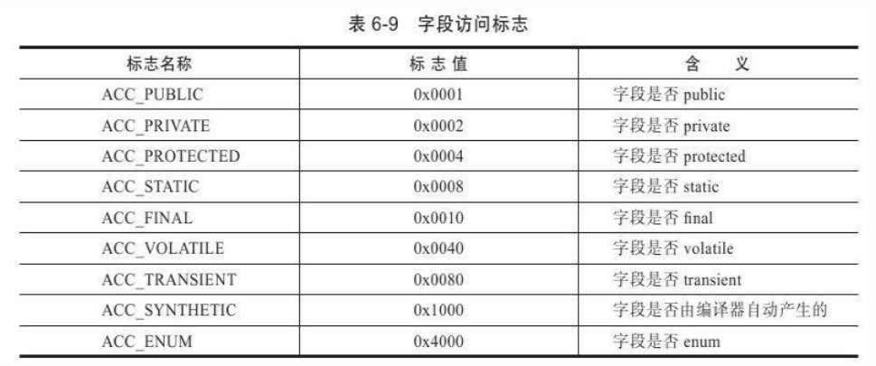
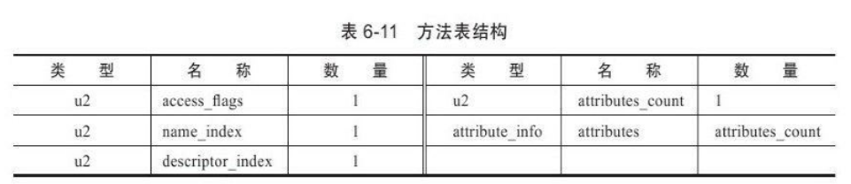
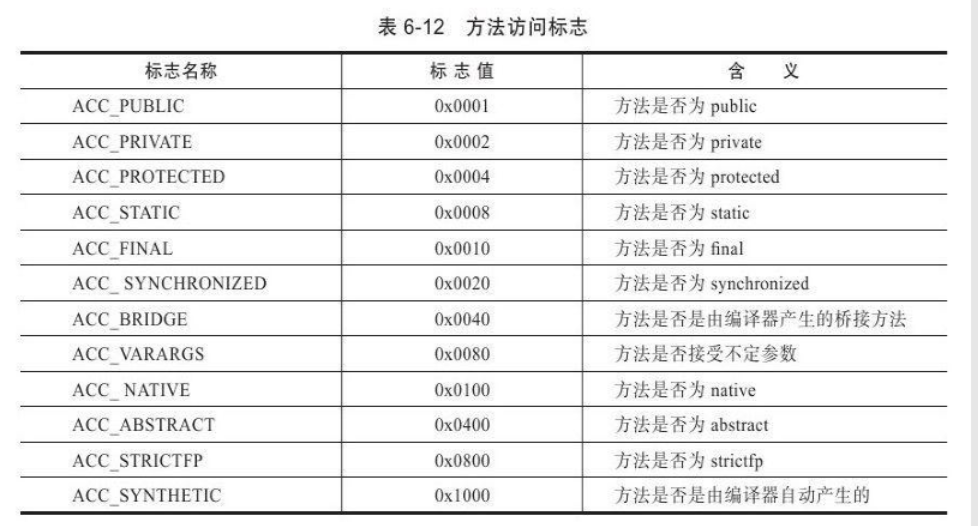
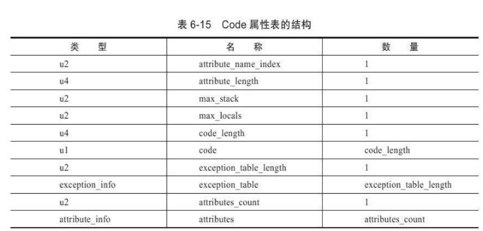

# 类文件结构

## class类文件的结构

* 任何一个class文件都对应着唯一一个类或接口的定义信息
* class文件以8位字节为基础单位的二进制流，各个数据项目之间紧凑排列没有分隔符
* class文件格式存储数据只有两种数据类型
  * 无符号数
    * 用u1,u2,u4,u8分别代表1个字节，2个字节，4个字节和8个字节
    * 可以描述数字，索引引用，数量值或者字符串
  * 表
    * 多个无符号数 或者其他表构成，"_info"结尾
    * 整个class文件本质上就是一个表

无论是无符号数还是表，当需要描述同一类型但数量不定的多个数据时，用**前置容器计数器**加若干连续数项的定义。

class结构没有分隔符号，上述class表的数据项，无论是顺序还是数量甚至于数据存储的字节序，都是严格限定不允许改变的。

### 魔数

* class文件的头4个字节
* 确定这个文件是否为一个能被虚拟机接受的class文件
* 0xCAFEBABE（咖啡宝贝）

### 版本号

* 5-6字节-----次版本号
* 7-8字节-----主版本号
* JDK向下兼容以前版本的class文件，但是虚拟机必须拒绝执行超过其版本号的class文件

### 常量池

* class文件之中的资源仓库
* 9-10字节-----常量池容量计数值（从1开始）
  * 0空出来表达“不引用任何一个常量池项目”
  * 其他集合类型（接口索引集合，字段表，方法表）从0开始
* class文件结构和其他项目关联最多的数据类型
* 占用class文件空间最大的数据项目之一
* 存放两大类常量
  * 字面量（Literal）
    * 类似于常量概念，如文本字符串，final修饰的常量值
  * **符号引用**（Symbolic references）（虚拟机new一个对象时查询是否有符号引用？）
    * 类和接口的全限定名
    * 字段的名称和描述符
    * 方法的名称和描述符
* 每一个常量都是**表**，第一字节都是u1类型的标志位，记录常量类型（类型有点多）

### 访问标志

* 常量池结束后的两个字节表示访问标志
* 识别类或者接口的访问信息
  * 这个class是类or接口
  * 是否public类型
  * 是否为abstract
  * 若是类是否为final

### 索引

* 类索引（this_class）
  * u2类型数据
  * 确定这个类的全限定名
  * 数据值是常量池的索引，指向CONSTANT_Class_info类型常量，然后指向CONSTANT_Utf8_info类型常量
* 父类索引（super_class）
  * u2数据类型，确定该类的父类的全限定名
  * java.lang.Object ，所有JAVA父类索引都不为0
  * 数据值是常量池的索引，指向CONSTANT_Class_info类型常量，然后指向CONSTANT_Utf8_info类型常量
* 接口索引集合
  * u2类型的数据的集合
  * 描述这个类实现了哪些接口
  * 被实现的接口按照implements从左到右排列在接口索引集合中
  * 第一个u2类型数据为接口计数器，表明索引表的容量

* 上述三个索引按照顺序排列在访问标志之后，

### 字段表集合

* 描述接口或者类中声明的变量
* 字段表结构

* 字段表包含的内容

  * access_flags(字段访问标志)

  

  * name_index(简单名称索引)

    * 例如add()方法和sum字段的简单名称就是add和sum

  * descriptor_index（描述符）

    * - - 描述字段的数据类型
        - 方法的参数列表

    - - - - 数量
          - 类型
          - 顺序
          - 返回值

    * attribute_info(属性表)
      * 字段表不一定还有这一项

    

    

    

    ### 方法表集合

    - * 方法表

    - * 结构同字段表一样，
      * 可能会有编译器自动添加的方法
        * 类构造器方法和类实例构造器

* 方法

  * JAVA中重载方法需要与原方法相同的简单名称和不同的特征签名
    * 特征签名：参数列表信息，不包括返回值
    * class文件中，重载父类方法时，即使只有返回值不同也可以存在

* 方法表内容

  * 访问标志
    * 相比于字段表
      * 少了不能修饰方法的volatile和transient关键字
      * 多了能修饰方法的synchronized，native，strictfp，abstract

 

* 简单名称索引
* 描述符
* 属性集集合
  * code属性：存储方法里的代码经过编译的字节码指令

### 属性表集合

* attribute_info(属性表)
* 限制稍微宽松
* JDK 1.7预定义属性增加到21项，虚拟机可以识别这些，自定义属性不能和这些重名
* Code属性
  * 方法体的代码经过编译后编程字节码指令存储在Code属性内
  * Code属性表结构

- - attribute_name_index：指向CONSTANT_Utf8_info的索引，固定为"Code"
  - attribute_length：属性值的长度
  - max_stack：操作数栈深度的最大值，虚拟机要根据这个值分配栈帧
  - max_locals：局部变量表所需的存储空间
  - code_length：字节码的长度
  - code：存储字节码指令

- - - Java程序可以分为两个部分

- - - - 代码(Code，在Code属性中存储)
      - 元数据(Meatdata，包括类、字段、方法定义及其他信息)

- - - 代码中的try-catch在编译后会生成一个异常表(Exception table)，负责执行区域内代码出现异常的跳转到那一行字节码上

- Exceptions属性

- - 和异常表(Exception table不同)，作用是列出方法可能抛出的异常，即方法throws后面的异常
  - 异常表实际上是Java代码的一部分，编译器使用异常表而不是简单的跳转命令来实现 Java异常及finally处理机制。 

  - 

- LineNumberTable属性

- - 用于描述Java源码行号与字节码行号之间的关系
  - 不使用的话，抛出异常时堆栈不会显示出错的行号

- LocalVariableTable属性

- - 栈帧中局部变量表与Java源码中变量之间的关系
  - 不使用的话，其他人引用这个方法时参数名称会丢失

- SourceFile属性

- - 记录生成Class文件的源码文件名称

- ConstantValue属性

- - 只有static关键字修饰的变量才可以使用这个属性，通知虚拟机自动为静态变量赋值
  - 有final关键词更符合"ConstantValue"的语义，但是虚拟机规范没有强制要求

- InnerClasses属性

- - 记录内部类与宿主类之间的关联，内部类中的常量池会存储宿主类的全限定名
  - 猜测：这个属性会在宿主类实例的字段(宿主类.this)的属性表集合中

- Deprecated属性

- - 标识某个类、字段、方法已经被弃用

- Synthetic属性

- - 标识该字段、方法不是Java源码直接产生的

- StackMapTable属性

- - 这个属性会在类加载的验证阶段被新类型检查验证器(Type Checker)使用

- Signature属性

- - 类、字段、方法如果使用了泛型，则Signature属性会记录泛型信息
  - 因为Java的泛型是伪泛型，编译后会被擦除。那么运行时做反射就无法获取泛型信息，所以需要这个属性

- BootstrapMethods属性

- - 与InvokeDynamic执行密切联系，后面会说

### 字节码指令简介

* 字节码概述

  * Java虚拟机的指令由一个字节长度的操作 码（Opcode）以及跟随其后的零至多个操作数（Operands）构 成。

  * 同一种操作根据操作数据类型的不同会有不同的操作码，比如加载指令由iload和fload分别加载int类型和float类型

    * i代表int

      s代表short

      b代表byte

      c代表char

      f代表float

      d代表double

      a代表reference

  * 同时操作码仅用一个字节标识，所以Java最多支持256中操作，不可能每一种操作都有所有数据类型的操作码

  - - 压缩字节码的操作包括，boolean,char,byte,short转为int类型进行操作

* 虚拟机指令
  * 加载和存储指令
  * 运算指令
  * 类型转换指令（将不同的数值类型进行互相转换）
  * 对象创建与访问指令
    * 创建类  new
    * 创建数组  newarray
    * 访问类  getstatic
  * 操作数栈管理指令
    * 栈顶出栈一个/两个元素：pop  pop2
    * 互换栈顶 swap
  * 控制转移指令
    * 虚拟机有条件或无条件转移
      * 条件分支：ifeq  iflt  ifle ifne  ifgt...
      * 无条件：goto
      * 等
  * 方法调用和返回指令
    * 第八章
  * 异常处理
    * 显式抛出异常（throw语句)：athrow
    * 处理异常（catch）由异常表
  * 同步指令
    * 方法级的同步和方法内部一段指令序列的同步（Monitor支持）
      * **方法级同步**
        * 无需通过字节码指令控制，实现在方法调用和返回操作中
        * **虚拟机通过方法表中的ACC_SYNCHRONIZED访问标志位得知一个方法是否为同步方法，如果是则要求执行线程先获取管程(Monitor)，并且在方法结束时释放管程**（在方法执行期间，执行线 程持有了管程，其他任何线程都无法再获取到同一个管程）
        * 一个同步方法执行期间抛出了异常，并且在方法内部无法处理此异常，那么这个同步方法所持有的管程将在异常抛到同步方法之外时自动释放。
      * 同步一段指令序列
        * **monitorenter和monitorexit指令对应synchronized关键字**
        * **monitorenter会将栈顶元素作为锁开始同步(此时栈顶元素就是synchronized的锁对象)**