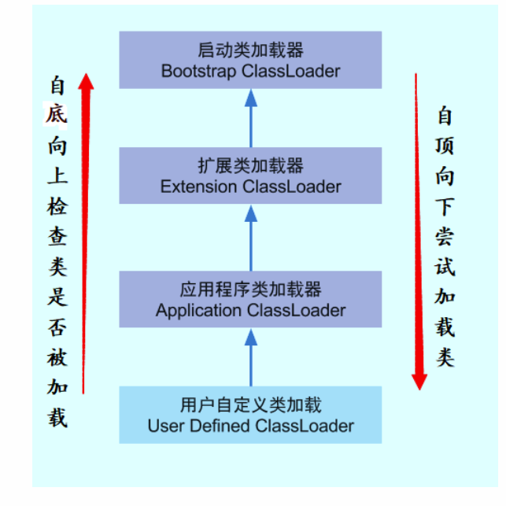

# 虚拟机类加载机制

* 类加载机制：

  虚拟机把描述类的数据从Class文件加载到内存，并对数据进行校验、转换解析和初始化，最终形成可以被虚拟机直接使用的Java类型，这就是虚拟机的类加载机制。

## 类加载的优势

* 类的加载，连接，初始化都是在程序运行期间完成的，虽然会令类加载时稍微增加一些性能开销，但是会为Java程序提供高度的灵活性
* 例如：面向接口的的应用程序可以等到运行时再指定其实际实现类，用户可以通过Java预定义/自定义类加载器在运行时从网络或其他地方加载一个二进制流作为程序代码的一部分

## 类加载的时机

* 类从加载到虚拟机内存中开始，到卸载出内存位置，它的整个生命周期包括：

 

* 加载、验证、准备、初始化和卸载这5个阶段的顺序是确定的
* 解析阶段则不一定:它在某些情况下可以在初始化阶段之后再开始
  * 为了支持Java语言的运行时绑定（动态绑定/晚期绑定）
* 加载的时机
  * 什么时候开始加载虚拟机规范没有强制约束
* 初始化阶段
  * 虚拟机规范严格规定了有且只有5种情况必须对类进行“初始化”（加载、验证、准备需要在其之前）
    * 遇到new、getstatic、putstatic或invokestatic这四条字节码指令时，常见的场景（使用new实例化对象、读取或设置一个类的静态字段）
    * 使用java.lang.reflect包的方法对类进行反射调用
    * 初始化一个类但是父类还没初始化时先初始化父类
    * 虚拟机启动时，初始化main（）
    * java.lang.invoke.MethodHandle实例后解析结果REF_getStatic, REF_putStatic, REF_inokeStatic的方法句柄，并且句柄对应的类没有初始化时

## 类加载的过程

### 加载

* 加载过程需要完成3件事情

  * 通过一个类的全限定名来获取定义此类的二进制字节流（class文件？）

    *  没有限制从什么地方获取，可以使用自定义类加载器，这是众多Java技术的基础（PowerMockito使用了自定义类加载器）

    -  1.从jar包获取
          - 2.从网络获取，如Applet
          - 3.运算时计算生成，如动态代理技术完成对原功能的增强，在java.lang.reflect.Proxy中，就是利用ProxyGenerator.generateProxyClass来为特定的接口生成形式为"*$Proxy"的代理类的二进制字节流
          - 4.其他文件生成，如由JSP文件生成Class类
          - 5.从数据库中读取，把程序安装到数据库完成程序代码在集群间的分发

  * 将这个字节流所代表的静态存储结构转化为方法区运行时的数据结构

  * 在内存中生成一个代表此类的java.lang.Class对象，作为方法区这个类的各种数据的访问入口

* 加载阶段尚未完成，连接阶段就可能开始了，如验证

### 验证

* 连接阶段的第一步，确保Class文件流中包含的信息符合当前虚拟机的要求，并且不会危害虚拟机自身的安全
* 文件格式验证
  * 如是否以魔术开头
  * 主、次版本是否在当前虚拟机处理范围之内
  * 常量池的长两种是否有不被支持的常量
* 元数据验证
  * 语义分析
    * 这个类是否有父类
    * 是否继承了final类
    * 是否实现了父类或借口要求实现的所有方法
    * 等
* 字节码验证
  * 最复杂的一个过程
  * 对方法体进行检验，保证被检验类的方法在运行时不会危害虚拟机：
    * 类型转换是否有效
    * 跳转指令不会调到方法体意外的字节码指令上
* 符号引用验证
  * 将在连接的解析阶段发生，符号引用确定的全限定名能否找到对应的类。
  * 在指定类中是否存在符合方法的字段描述符以及简单名称所描述的方法和字段
  * 符号引用的类、字段、方法的访问性是否可被当前类访问

### 准备

* 正式为类变量分配内存并设置类变量初始值（0）的阶段，

### 解析

* 将常量池内的符号引用替换为直接引用的过程
  * 符号引用：符号可以是任何形式的字面量，只要使用时能无歧义地定位到目标即可。
  * 虚拟机可以将第一次解析的结果缓存(在运行时常量池中记录直接引用，并把常量标记为已解析状态)，避免反复解析

### 初始化

* 类加载的最后一步，是类构造器方法的执行过程，由类变量的赋值(static) 和静态代码块(static{ }) 合并而成

### 卸载

* Class作为JVM中的一个特殊对象，也会被GC回收卸载
* Class的卸载就是清空方法区中Class的信息和堆区中的java.lang.Class对象。这时Class的声明周期就结束了
* Class被回收要满足以下三个条件:

- - No Instance：该类所有的实例都已经被GC;也就是java堆中不存在该类的任何实例
  - No ClassLoader：加载该类的ClassLoader实例已经被GC
  - No Reference：该类的java.lang.Class对象没有被引用。(XXX.class,静态变量/方法),即没有反射来使用class对象，

## 类加载器

### 类与类加载器

* 执行获取类的二进制字节流的操作的**代码模块**称为类加载器

* 任意一个类需要和它的加载器一起确定唯一性，每一个类加载器，都有独立的类名称空间。即，即使是同一个Class文件，只要类加载器不同，那么这两个类不相等

### 双亲委派模型

* 两种不同的类加载器

  * 启动类加载器/引导类加载器（Bootstrap ClassLoader）,使用C++实现
    * 虚拟机自身的一部分
  * 其他的类加载器
    * Java语言实现，独立于虚拟机外部，全部继承自抽象类java.lang.ClassLoader

* 系统提供了3种类加载器

  * 启动类加载器

    * 加载<JAVA_HOME>\lib目录的类库

  * 扩展类加载器

    * 加载<JAVA_HOME>\lib\ext中的类库
    * 开发者可以使用这个类加载器

  * 应用程序类加载器

    * 加载用户路径（ClassPath）上的类库
    * 开发者可以使用这个类加载器
    * 如何应用程序没有自定义加载器，一般情况下默认使用这个类加载器

   

* 双亲委派模型

  ​		双亲委派模型的工作过程是：如果一个类加载器收到了类加载的请求，它首先不会自己 去尝试加载这个类，而是把这个请求委派给父类加载器去完成，每一个层次的类加载器都是 如此，因此所有的加载请求最终都应该传送到顶层的启动类加载器中，只有当父加载器反馈自己无法完成这个加载请求（它的搜索范围中没有找到所需的类）时，子加载器才会尝试自 己去加载。 

  -  双亲委派模型保证了，无论哪个加载器要加载某个类，都是由同一个类加载器进行加载，保证了某个类在各种类加载器环境中都是同一个类

  -  例如，用户自己写了java.lang.Object类放在ClassPath下，不使用该模型的话，就有可能加载到不同的Object类

  - 双亲委派模型保证了越基础的类越上层的加载器进行加载

### 破坏双亲委派模型

- - 第一次破环：JDK1.2引入该模型，之前用的时java.lang.ClassLoader，现在不用管了
  - 第二次破坏：历史原因，出现了基础类调用用户类的代码，使用线程上下文类加载器。Java中的JDBC就是这样的(ˉ▽ˉ；)...
  - 第三次被破坏：OSGi模块化技术中不使用双亲委派模型，体统了代码热替换(HotSwap)，模块热部署(Hot Deplotment)技术