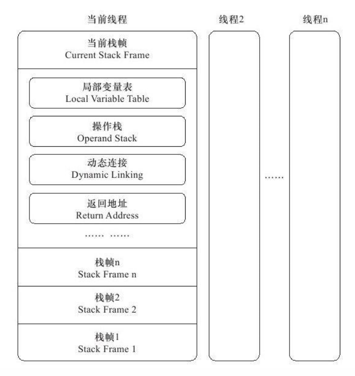
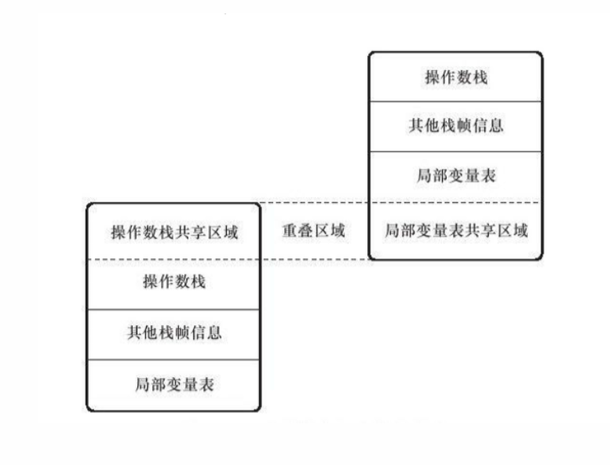

# 虚拟机字节码执行引擎


## 运行时栈帧结构

* 栈帧：虚拟机栈的栈元素

* 栈帧存储：局部变量表，操作数栈，动态连接，方法返回地址和一些额外的附加信息。

* 每一个方法从调用开始至执行完成的过程，都对应着一个栈帧在虚拟机栈里面从入栈到出栈的过程。

* 一个线程中的方法调用链可能很长，在活动线程中，只有栈顶的栈帧才是有效的（当前栈帧），所有字节码指令都只针对栈顶栈帧

 
### 局部变量表

* 存放方法参数和方法内部定义的局部变量

* 方法的Code属性的max_locals数据项确定了该方法的所需要分配的局部变量表的最大容量

* 局部变量表的容量以变量槽（variableslot）为最小单位，要求一个Slot存储32位数据，int ，char , reference等类型数据。64位则用两个slot存储

  ```java
  public static void main(String[] args){
          {
              byte[] placeholder = new byte[64  1024  1024];
          }
      int a = 0;
      System.gc();
  }如果没有int a = 0;则垃圾回收的时候不会回收placeholder
  ```

* 如果没有int a = 0;则垃圾回收的时候不会回收placeholder

* 原因：虽然离开了的placeholder作用域，但是占用的Slot还没有被其他变量复用，作为GC Roots一部分的局部变量表仍然保持着对其的关联


### 操作数栈

* 和局部变量表一样，最大深度也是由方法的Code属性的max_stacks确定的
* 各种字节码指令往操作数栈写入和提取内容
* 操作数栈元素的数据类型必须与字节码指令的序列**严格匹配**

（ 算术运算，在调用其他方法的时候通过操作数栈传递参数）


### 动态连接

* 动态连接：每个栈真包含指向运行时**常量池**中该栈帧所属方法的引用


### 方法返回地址

* 只有两种方式可以退出方法
  * 执行引擎遇到任意一个方法返回的字节码指令（正常完成出口）
  * 方法执行过程中遇到了异常，并且该异常没有在方法体内处理


## 方法调用

* 任务：确定调用的是哪一个方法
* 由于父子多态的存在，不同对象调用的方法也会不同
* 动态链接：方法调用在Class文件中存储的是符号引用，只有在类加载期间甚至到运行期间才能确定目标方法的直接引用。

### 解析

* 在解析阶段会将能够确定调用版本的方法的符号引用转化为直接引用（编译期可知，运行期不可变）如：
  * 静态方法
  * 私有方法
  * 都是不能通过继承或重写的办法
* 方法调用的字节码指令
  * invokestatic：调用静态方法。 
  * invokespecial：调用实例构造器＜init＞方法、私有方法和父类方法。
  *  invokevirtual：调用所有的虚方法。 
  * invokeinterface：调用接口方法，会在运行时再确定一个实现此接口的对象。 


### 分派

* 静态分派：重载

* Man,Woman类继承Human类并增加了sayHello重载方法

  三个类的sayhello的方法签名均不用，根据传入参数列表的对象进行分

```java
public class StaticDispatch {
    static abstract class Human {}
    static class Man extends Human{}
    static class Woman extends Human{}
    public void sayHello(Human guy) {
    	System.out.println("hello,guy!");
    }
    public void sayHello(Man man) {
    	System.out.println("hello,gentleman!");
    }
    public void sayHello(Woman woman) {
    	System.out.println("hello,lady!");
    }
    public static void main(String[] args) {
        Human man = new Man();
        Human woman = new Woman();
        StaticDispatch s = new StaticDispatch();
        s.sayHello(man);
        s.sayHello(woman);
    }
}
```

- - 输出：
    hello,guy!
    hello,guy!
  - 上面的man,woman变量的静态类型是Human，而实际类型是Man,Woman
  - 依赖静态类型定位方法执行版本的分派称为静态分派，例如重载

- 动态分派：重写

- - Man类和Woman类继承了Human类，并重写了sayHello方法
  - 子类重写了父类的方法，三个方法的方法签名是相同的

```java
public class DynamicDispatch {
    static abstract class Human {
    	protected abstract void sayHello();
    }
    static class Man extends Human {
        @Override  
        protected void sayHello() {
        	System.out.println("man say hello");
        }
    }
    static class Woman extends Human {
        @Override  
        protected void sayHello() {
        	System.out.println("woman say hello");
        }
    }
    public static void main(String[] args) {
        Human man = new Man();
        Human woman = new Woman();
        man.sayHello();
        woman.sayHello();
        man = new Woman();
        man.sayHello();
    }
}
```

- - 输出：
    man say hello
    woman say hello
    woman say hello
  - 上述代码中多次调用sayHello()部分的字节码是一致的：invokevirtual #22(翻译：调用常量池中第22项，即sayHello()的符号引用)
    即：编译期间不确定调用方法的版本
  - invokevirual调用时会根据操作数栈顶第一个元素所指对象的实际类型确定符号引用转化到哪个直接引用

- Java语言是静态多分派(多个可选方法版本)，动态单分派(确定唯一方法版本)


* 动态分派的实现

  

* 频繁的进行动态分派搜索不显示，常用的手段是：为类在方法区建立一个虚方法表，为接口建立接口方法表

* 使用虚方法表索引来代替查找

* 如果子类重写了父类的方法，那么子类方法表中该地址会替换为指向子类实现版本的入口地址

* 虚方法表

