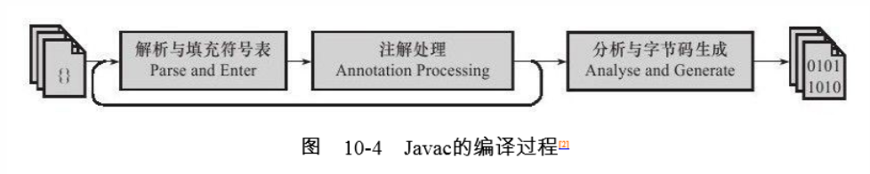
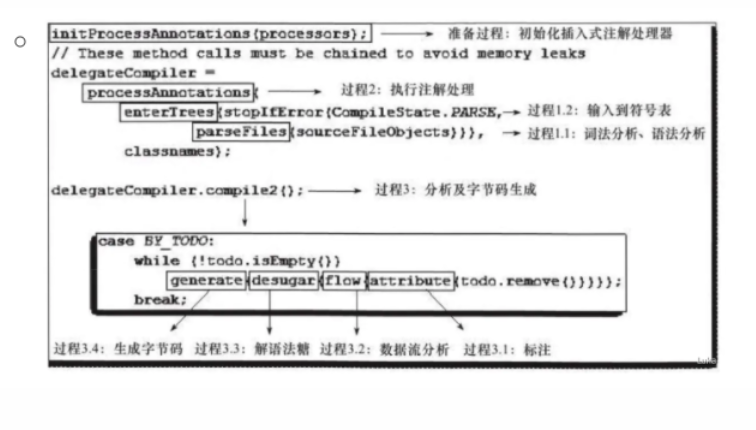

# 编译期优化

## 编译概述

编译期不确定的操作过程，可以包括三种操作

* 前端编译器，把.java文件转变为.class文件的过程

  举例：Javac编译器

* 后端运行期编译器，把字节码转变为机器码的过程

  举例：HotSpot VM的C1，C2编译器

* 静态提前编译器：把.java文件编译成本地机器代码的过程

    GCJ,JET

编译过程大致可以分为3个过程，分别是：

* 解析与填充符号表过程

* 插入时注解处理器的注解处理过程

* 分析与字节码生成过程

  * Javac编译过程图

 
  * Javac编译过程主体代码

## 解析与填充符号表

* 解析

  * 词法分析

      将源代码的字符流转变为标记（Token）集合，单个字符是程序编写过程的最小元素，而标记是**编译过程**的最小元素，如int a=b+2分为6个Token，int, a, =, b, +, 2,

  * 语法分析

    ​	根据Token序列构造**抽象语法树**的过程，语法树的每一个节点都代表 着程序代码中的一个语法结构（Construct），例如包、类型、修饰符、运算符、接口、返回值甚至代码注释等都可以是一个语法结构。 

* 填充符号表

  * 符号表由符号地址和符号信息构成

* **注解（Annotation）处理器**
  * 注解处理器可以读取，修改，添加抽象语法树中的任意元素。
  * 如果修改了语法树，则会回到解析与填充符号表的过程重新处理

* **语义分析与字节码生成**

  ​			语法分析之后，编译器获得了程序代码的抽象语法树表示，语法树能表示一个结构正确的源程序的抽象，但无法保证源程序是符合逻辑的。而语义分析的主要任务是对结构上正确 的源程序进行上下文有关性质的审查，如进行类型审查。

* **标注检查**

  * 检查如，变量使用前是否已被声明，变量与赋值之间的数据类型是否能够匹配
  * 常量折叠（int a=1+2）,1+2被常量折叠成3，因此在编译期进行了常量折叠，运行时 int a=3跟int a=1+2 运行量一致

* **数据及控制流分析**

  * 对程序上下文逻辑更进一步的验证，它可以检查出诸如程序局部变量在使用前是否有赋值。、，方法的每条路径是否有返回值，是否所有受查一场都被正确处理

* **解语法糖**

  如泛型，自动装箱/拆箱等，虚拟机运行不支持这些，需要在编译阶段还原

* **字节码生成**

  * 将实例构造器<init>() 方法和类构造器<clinit>方法添加到语法树
  * 将语法树，符号表转化成字节码写到磁盘中

  ​	