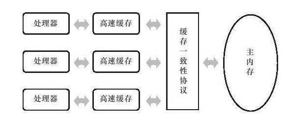
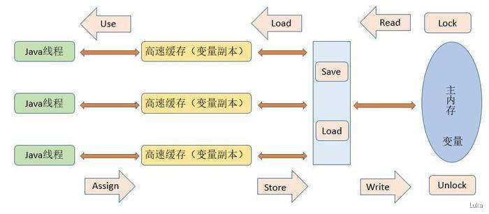

# Java 内存模型与线程

## 硬件的效率与一致性

* 由于计算的存储设备与处理器的运算速度有几个数量级的差距，所以不得不加入一层读写速度尽可能接近运算速度的高速缓存(Cache)来作为内存与处理器之间的缓冲；
* 将运算需要的数据赋值到缓存中，让运算能够快速进行，当运算结束后再从缓存同步回内存中
* 但是会引入一个新的问题：缓存一致性（Cache Coherence）
* 每个处理器都有自己的高速缓存，而它们又共享于同一主内存（返回内存时以谁为主--协议）
*   

  

## Java内存模型(JMM)
### JMM概述

Java虚拟机规范中试图定义一种Java内存模型(Java Memory Model,JMM)来屏蔽掉各种硬件和操作系统的内存访问差异，以实现让 Java程序在各种平台下都能达到一致的内存访问效果。
* 主要目标是定义程序中各个变量的访问规则，**即在虚拟机中将变量存储到内存和从内存中取出变量这样的底层细节。**
* 这里的变量和Java编程中的变量不一样，不包括局部变量和方法参数，这个是线程私有的不会被共享不会存在竞争问题（局部变量引用的对象可以是线程共享的）
* JMM规定所有变量都存储在主内存中，每条线程都有自己的工作内存（类比高速缓存）
* 线程对变量的所有操作（读取，赋值）都必须在工作内存中而不能直接读写主内存中的变量，不同线程也无法直接访问对方内存中的变量，线程间变量值的传递均需要通过主内存完成。
*   

### 内存间交互操作

* 主内存和工作内存之间操作有8种，每一种操作都是原子性的（对于double和long来说）
* 这些操作和字节码不是一个概念，这里应该说是JVM和物理内存与CPU打交道的操作
* 具体操作如下：
  * **lock**:作用于主内存的变量，把一个变量标识为一个线程独占的状态
  * **unlock**:作用于主内存的变量，它把一个处于锁定状态的变量释放出来，释放后的变量才可以被其他线程锁定。
  * **read**:作用于主内存的变量，他把一个变量的值从主内存传输到线程的工作内存中，以便随后的load使用
  * **load**:作用于工作内存的变量，它把read操作从主内存中得到的变量值放入工作内存的变量副本中
  * **use**:作用于工作内存的变量，它把工作内存中一个变量的值传递给执行引擎，每当虚拟机遇到一个需要使用到变量的值的字节码指令时会执行这个操作
  * **assign**:作用于工作内存的变量，它把一个从执行引擎接收到的值赋给工作内存的变量，每当虚拟机遇到一个给变量赋值的字节码指令时执行这个操作。
  * **store**:作用于工作内存的变量，它把工作内存中一个变量的值传送到主内存中，以便随后的write操作使用。
  * **write**：作用于主内存的变量，它把store操作从工作内存中得到的变量的值放入主内存的变量中。

* 如果要把一个变量从主内存复制到工作内存，就要顺序地执行read 和load，反之为store 和write
* JMM规定这些操作必须遵守的规则：
  * lock操作可以被同一个线程执行多次，且执行相同次数的unlock后变量才会解锁
  * 对一个变量执行lock操作，那将会清空工作内存中此变量的值，在执行引擎使用这个变量前，需要重新执行load或assign操作初始化变量的值（保证解锁前后变量值都是最新状态）
  * 对一个变量执行unlock操作，必须要把此变量同步回主内存中(执行store，write操作)(保证教唆前后变量值都是最新状态)
  * lock/unlock操作并没有直接开放给用户使用，提供了更高层次的字节码指令
  * monitorenter/monitorexit来隐式地使用这两个操作，对应到Java代码就是synchronized，因此synchronized块之间的操作也具备原子性。

### volatile

* volatile是JVM提供的最轻量级的同步机制
* 具备两种特性：可见性和禁止指令重排序优化(有序性)--》不能保证原子性
* 
* 
* 在某种意义上，volatile的同步机制的性能确实要优于锁(使用synchronized关键字或java.util.concurrent包里面的锁)
* volatile 修饰的变量和非volatile修饰的变量相比:写操作更加消耗性能，但是读操作差不多

### 原子性、可见性和有序性
* 这时JMM中的重要特征，也是JAVA并发的三大核心问题
* **原子性**：JMM直接保证原子性变量操作包括read，load，assign，user，store，write,我们大致可以认为基本数据类型的访问读写是具备原子性的。更大范围的原子性保证由lock/unlock操作实现，对应到JAVA代码就是synchronized
* **可见性**：（指当一个线程该修改了共享变量的值，其他线程能够立即得知这个修改。）
  * Java内存模型是通过变量修改后将新值同步回主内存，在变量读取前从主内存刷新变量值这种依赖主内存作为传递媒介的方式来实现可见性的，无论是普通变量还是volatile变量都是如此。只是 volatile 的特殊规则保证了多线程操作时变量的可见性，而普通变量则不能保证这一点。
  * ==synchronized 和final也可以实现可见性。==
  * 同步块的可见性是 对变量执行unlock操作之前，必须要把此变量同步回主内存中(执行store，write)
  * final的可见性
    * 被final修饰的字段在构造器中一旦初始化完成，并且构造器没有把"this"引用传递出去，那在其他线程中就看见final字段的值

* 有序性： volatile和synchronized 两个关键字保证线程之间的有序性。volatile关键字本身就禁止指令重排序，而synchronized是由与"一个变量统一时刻只允许一条线程对其进行lock"操作获得的

### 先行发生原则
先行发生是JAVA 内存模型中定义的两项操作之间的偏序关系，如果说操作A先行发生于操作B，其实就是说发生操作B之前，操作A产生的影响能被操作B观察到。 “影响”包括修改了了内存中共享变量的值、发送了消息、调用了方法等。

* java内存模型下  “天然的”先行发生关系(不在此列的，虚拟机可以对他们随意地进行重排序)
  * **程序次序规则(Program Order Rule)**
    * 按照控制流顺序，前面的的操作先行发生于书写在后面的操作
  * **管程锁定规则(Monitor Lock Rule)**
    * 一个unlock操作线性发生于后面对同一个锁的lock操作。
  * **volatile变量规则(Volatile Variable Rule)**
    * 对一个volatile变量的写操作先行发生于后面对这个变量的读操作。
  * **线程启动规则(Thread Start Rule)**
    * Thread()对象的start()方法先行
  * **线程终止规则(Thread Termination Rule)**
    * 线程中的所有操作都先行发生于对此线程的终止检测(Thread.join())
  * **线程中断规则(Thread Interruption Rule)**
    * 对线程interrupt()方法的调用先行发生于被中断线程的代码检测到中断时间的发生
    * (可通过Thread.interrupted())方法检测到是否有中断发生（并发那里有讲）
  * **对象终结规则（Finalizer Rule）**
    * 一个对象的初始化完成先行发生于finalize()方法的开始
  * **传递性**
    * 如果操作A先行发生于操作B，操作B先行发生于操作C，那就可以得出操作A先行发生于操作C的结论。

