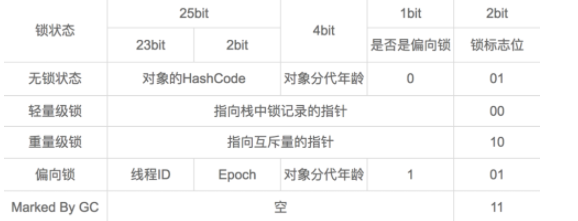
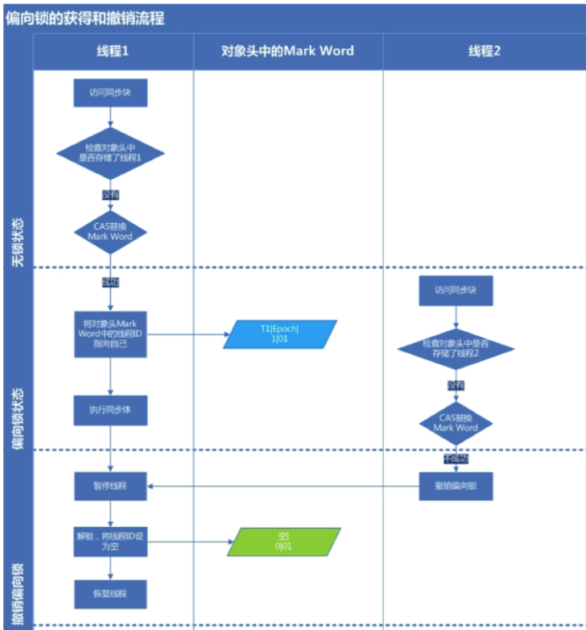

#9.线程安全与锁优化

##线程安全
* 定义：当多个线程访问一个对象时，如果不用考虑这些线程在运行时环境下的调度和交替执行，也不需要进行额外的同步，或者在调用方进行任何其他的协调操作，调用这个对象的而行为都可以获得正确的结果，那这个对象是线程安全的

##Java中的线程安全类型
线程安全的“安全程度”由强至弱来排序，
* **不可变**：只要一个不可变的对象被构造出来，外部的可见状态永远不会改变，永远不会看到它在多个线程之中处于不一致的状态。
  * final修饰的数据就是不可变的
* **绝对线程安全**：不管运行时环境如何，调用者都不需要任何额外的同步措施（JAVA API中标注是线程安全的类都不满足这一条）
* **相对线程安全**：通常意义上的线程安全，vector ， hashtable, synchronizedCollection()包装的集合
* **线程兼容**：对象本身不是线程安全的，但是可以通过在调用段正确地使用同步手段来保证对象在并发环境中可以安全地使用。  ArrayList   HashMap
* **线程对立**：无论调用端是否采取了同步措施，都无法在多线程环境下并发使用代码。

##线程安全的实现方法

###1.互斥同步(悲观锁)
* 互斥同步是常见的一种并发正确性保障手段，同步是指在多个线程并发访问共享数据时，保证共享数据在同一时刻只被一个线程使用。
* 互斥是方法，同步是目的
* 互斥同步手段包括synchronized，ReentrantLock
* synchronized编译后会在同步块的前后形成monitorenter 和monitorexit这两个字节码指令，这两个字节码都需要一个reference类型的参数来指明要锁定的对象。
* 在执行moniterenter指令时，首先要尝试获取对象的锁。如果这个对象没被锁定，或者当前线程已经拥有了这个对象的锁，把锁的计数器+1，相应的，在执行moniterexit指令时锁计数器-1

###2.非阻塞同步(Non-Blocking Synchronization)
* 互斥同步最主要的问题是进行线程阻塞和唤醒所带来的性能问题，因此这种同步称为阻塞同步
* 互斥同步属于悲观并发策略，随着硬件质量集的发展，有了新的选择：基于冲突检测的乐观并发策略。即，先进行操作，如果共享数据不争用则成功，如果争用则不断尝试直到成功，由于这种策略不需要挂起线程，所以称为非阻塞同步
* 乐观并发策略需要“硬件指令集的发展”才能进行，需要==操作和冲突检测==这两个步骤具备原子性。(即一次完成两个操作)
* 最常用的指令即  CAS(compare and swap)
* CAS(compare-and-swap)当且内存中变量的值等于旧预期值时才会写入新的值，原理基于MESI协议：
* 详细看juc部分

###3.无同步方案
要保证线程安全，并不是一定要进行同步，两者没有因果关系，同步只是保证共享数据征用时的正确性的手段。

* **可重入代码(Reentrant Code)**:任何时刻中断，再返回后都不会出现错误
  * 特点：不依赖存储在堆上的数据和公用的系统资源，用到的状态量都是参数中传入，不调用非可重入的方法等
* **线程本地存储**：ThreadLocal

##锁优化
###自旋锁和自适应自旋
* 许多应用中，共享数据的锁定状态只会持续很短的时间，为了这段时间去挂起和恢复线程并不值得
* 引入自旋锁，通过自旋等待自身避免线程切换的开销
* 使用自适应的自旋锁的自旋等待时间不固定，由前一次在同一个锁的自旋时间决定

###锁消除
* 通过逃逸分析，如果一段代码中，堆上的所有数据都不会逃逸被其他线程访问到，那就可以把它们当作栈上数据对待，认为是线程私有的，同步加锁自然就不用了

###锁粗化
* 如果虚拟机探测到一串零碎的操作都是对通一个对象加锁，那么将会把加锁同步的范围扩展（粗化）到整个操作序列的外部
  

###轻量级锁
* 本意是在没有多线程竞争的前提下，减少传统的重量级锁使用操作系统互斥量产生的性能消耗。
* 理解轻量级锁和下面的偏向锁，必须理解HotSpot虚拟机的对象的内存布局

####对象头的内存布局
* 对象头分为两部分信息:
  * 第一部分Mark Word：用于存储对象自身运行时数据，如哈希码，GC分代年龄等，32位/64位JVM分别是32bit/64bit
    * Mark Word 根据对象的状态复用自己的存储空间
    *   
  * 第二部分：用于存储指向方法区对象类型数据的指针，如果是数据对象的话还会由一个额外的部分用于存储数组长度

####轻量级锁的执行过程
* **加锁**
  * 代码进入同步块的时候，如果此同步对象没有被锁定(锁标志位为“01”状态)，虚拟机首先将在当前线程的栈帧中建立一个名为锁记录（Lock Record）的空间，用于存储锁对象目前的Mark Word的拷贝
  * 然后，虚拟机将使用CAS操作尝试 将对象的Mark Word更新为指向Lock Record的指针。（一个线程都有一个指针），如果操作成功，则这个线程就拥有了该对象的锁，并且锁标志变为00
  * CAS更新Mark Word操作如果失败了，虚拟机会首先检查对象的Mark Word是否指向当前线程的栈帧，如果是说明当前线程已经拥有了这个对象的锁，那就可以直接进入同步块继续执行，否则说明这个锁对象已经被其他线程抢占了。
  * 这样轻量级锁就不再有效，要膨胀为重量级锁，锁标志的状态值变为10

* **解锁**
  * 解锁也是通过CAS操作来进行的，如果对象的Mark Word仍然指向线程的锁记录，那就用CAS操作把对象当前的Mark Word和线程中加锁时复制的**Mark Word**替换回来
  * 如果替换成功则整个同步完成了，如果替换失败则说明其他线程尝试过获取该锁，那么释放锁的同时唤醒被挂起的线程

###偏向锁
* 目的是消除数据在无竞争下的同步原语，和轻量级锁相比连CAS都不做了
* **偏向锁是单线程执行代码块时使用的机制**，如果在多线程并发的环境下（即线程A尚未执行完同步代码块，线程B发起了申请锁的申请），则一定会转化为轻量级锁或者重量级锁
* 引入偏向锁主要目的是：为了在没有多线程竞争的情况下尽量减少不必要的轻量级锁执行路径。因为轻量级锁的解锁解锁操作依赖多次CAS原子指令的，而偏向锁只需要在置换ThreadID的时候依赖一次CAS原子指令（由于一旦出现多线程竞争的情况就必须撤销偏向锁，所以偏向锁的撤销操作的性能损耗也必须小于节省下来的CAS原子指令的性能消耗）

####偏向锁的执行过程
* 在 JVM启动偏向锁情况下（默认启动），当锁对象第一次被线程获取的时候，虚拟机将会把对象头中的标志位设为01，同时使用CAS操作把获取到的这个锁的线程ID记录在Mark Word里，如果操作成功，持有偏向锁的线程以后每次进入这个锁相关的同步块时，虚拟机都可以不在进行任何同步操作(例如Locking，UnLocking,及对Mark Word的Update等)
* 当有另外一个线程尝试获取这个锁时，偏向模式结束，后续的同步操作按照轻量级锁进行
  

###轻量级锁和偏向锁区别
* 轻量级锁时为了在线程交替执行同步块时提高性能，而偏向锁则是在只有一个线程执行同步块进一步提高性能
* 偏向锁时锁对象中的对象头包含线程ID
* 轻量级锁时锁对象中的对象头是一个指向一个线程栈帧的指针。