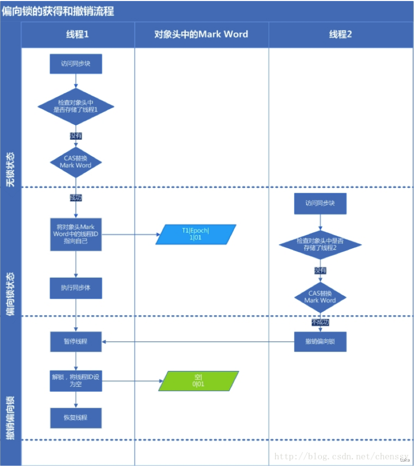

[TOC]
# 线程安全与锁优化

## 线程安全
* 定义：当多个线程访问一个对象时，如果不用考虑这些线程在运行时环境下的调度和交替执行，也不需要进行额外的同步，或者在调用方进行任何其他的协调操作，调用这个对象的行为都可以获得正确的结果，那这个对象是线程安全的。

## 线程安全的实现方法

### 互斥同步（悲观）
* 互斥是方法，同步是目的
* 互斥同步手段包括synchronized，ReentrantLock
* synchronized编译后会在同步块前后分别形成monitorenter指令，首先尝试获取对象的锁，如果这个对象没被锁定，或者当前线程已经拥有了那个对象的锁，则锁的计数器加1，相应的，执行monitorexit指令时锁计数器减1

### 非阻塞同步（CAS）（乐观）
* 互斥同步最主要的问题就是进行线程阻塞和唤醒所带来的性能问题，因此这种同步也称为阻塞同步
* 互斥同步属于悲观并发策略，随着硬件指令集的发展，有了新的选择：基于冲突检测的乐观并发策略。即，先进行操作，如果共享数据不争用则成功，如果争用则不断尝试直到成功，由于这种策略不需要挂起线程，所以称为非阻塞同步
* **非阻塞同步中，CAS是最著名的代表**
* CAS(Compare-and-swap)当且仅当内存中的变量的值等于旧预期值才会写入新的值。
* CAS 三大问题：ABA 问题，循环时间长开销大，只能保证一个共享变量的原子操作（AuomicReference）。
* CAS不会发现ABA的问题。

* ABA 问题的危害
  * 如果CAS操作的是链表头，ABA问题就是 先把A弹出，然后把B弹出，又把A入，尽管还是A，但是head指向了C
  * 大部分情况下ABA并不影响并发的正确性
* 解决ABA 问题，需要上层代码来处理，如使用版本戳

#### CAS 与volatile 相同与区别

1.volatile 关键字原理
用volatile关键字修饰的共享变量，编译成字节码后增加Lock 前缀指令，该指令要做两件事：
1. 将当前工作内存缓存行的数据立即写会到主内存。
2. 写回主内存的数据会使其他工作内存里缓存了该共享变量地址的数据无效（缓存一致性协议保证的操作）

Lock前缀指令还有内存屏障作用：
1. 确保指令重排序的时不会把后面的指令排到内存屏障之前的位置，也不会把前面的指令排到内存屏障的后面(即在执行到共享变量时，因为内存屏障的存在，会把它前面的操作都写回主内存，然后再执行共享变量的操作，对共享变量的操作一执行完也会写回主内存)

volatile: 可见性以及有序性

cas：原子性

### 无同步方案
保证线程安全并不一定需要同步，二者没有因果关系
* 可重入代码：任何时刻中断，在返回后都不会出现错误
  * 特点：不依赖存储在堆上的数据和公用的系统资源，用到的状态量都是参数中传入，不调用非可重入的方法等
* 线程本地存储：ThreadLocal，

## 锁优化

### 自旋锁与自适应自旋
* 许多应用中，共享数据的锁定状态只会持续很短的时间，为了这段时间去挂起和恢复线程并不值得
* 所以引入自旋锁，通过自旋等待自身避免线程切换的开销
* 使用自适应的自旋锁的自旋等待时间不固定，由前一次在同一个锁上的自旋时间决定

### 锁消除
* 通过逃逸分析，如果一段代码中，堆上的所有数据都不会逃逸被其他线程访问到，那就可以把他们当做栈上数据对待，认为是线程私有的，同步加锁自然就不用了

### 轻量级锁
* 在没有多线程竞争的前提下，减少传统的重量级锁的性能消耗（即**可以多线程交替加锁**）
* 理解轻量级锁和下面的偏向锁必须理解HotSpot虚拟机的对象的内存布局

#### 轻量级锁的执行过程
* 加锁
  * 代码进入同步块时，如果此同步对象没有被锁定（锁标志位为01，）,虚拟机首先在当前线程的栈帧中建立一个所记录（Lock Record）空间，用于存储锁对象目前的Mark Word 拷贝（官方把这份拷贝加了一个Displaced前缀，即Displaced Mark Word）
  * 然后，虚拟机使用CAS操作尝试将该对象的Mark Word更新为指向Lock Record的指针，如果更新失败，如果操作成功，则这个线程就拥有了该对象的锁，并且所标识变为00
  * CAS 更新Mark Word 如果失败了，虚拟机首先会检查对象的Mark Word 是否指向当前线程的栈帧，如果是说明了该线程已经拥有了这个对象的锁，那就可以直接进入同步块继续执行，否则说明这个锁对象已经被其他线程抢占了。
  * 这样轻量级锁就不再有效，要膨胀为重量级锁，锁标志的状态值变为10

* 解锁
  * 解锁也是通过CAS操作来进行的，如果对象的Mark Word仍然指向线程的所记录，那就用CAS把对象的Mark Word和线程中加锁时复制的Mark Word 替换回来
  * 如果替换成功则整个同步完成了,如果替换失败则说明其他线程尝试获取该锁，name释放锁的同时同时唤醒被挂起的线程

### 偏向锁
* 目的是消除数据在无竞争下的同步，和轻量级锁相比连CAS都不做了
* 偏向锁是在单线程执行代码块时使用的机制，如果在多线程并发的环境下（即线程A尚未执行完同步代码块，线程B发起了申请锁的申请），则一定会转化为轻量级锁或者重量级锁
* 引入偏向锁主要目的是：为了在没有多线程竞争的情况下尽量减少不必要的轻量级锁执行路径。因为轻量级锁的加锁解锁操作是需要依赖多次CAS原子指令的，而偏向锁只需要在置换ThreadID的时候依赖一次CAS原子指令（由于一旦出现多线程竞争的情况就必须撤销偏向锁，所以偏向锁的撤销操作的性能损耗也必须小于节省下来的CAS原子指令的性能消耗）
* 偏向锁设计者Dave Dice原话：一旦设置了偏向锁，该线程便可以对该对象执行lock和unlock操作，而无需诉诸昂贵的原子指令(即CAS) (Once biased, that thread can subsequently lock and unlock the object without resorting to expensive atomic instructions)

#### 偏向锁的执行过程
* 在JVM启动偏向锁情况下(默认启动)，当锁对象第一次被线程获取的时候，虚拟机将会把对象头中的标志位设为01，同时使用CAS操作把获取到这个锁的的线程ID记录在Mark Word里，如果操作成功，持有偏向锁的线程以后每次进入这个锁相关的同步块时，虚拟机都可以不再进行任何同步操作(例如Locking、unlocking、更新Mark Word等)
* 当有另外一个线程尝试获取这个锁时，偏向模式结束，后续的同步操作按照轻量级锁执行

####轻量级锁和偏向锁区别
* 轻量级锁是为了在线程交替执行同步块时提高性能，而偏向锁则是在只有一个线程执行同步块时进一步提高性能
* 偏向锁是锁对象中的对象头包含线程ID
* 轻量级锁是锁对象中的对象头是一个指向一个线程栈帧的指针