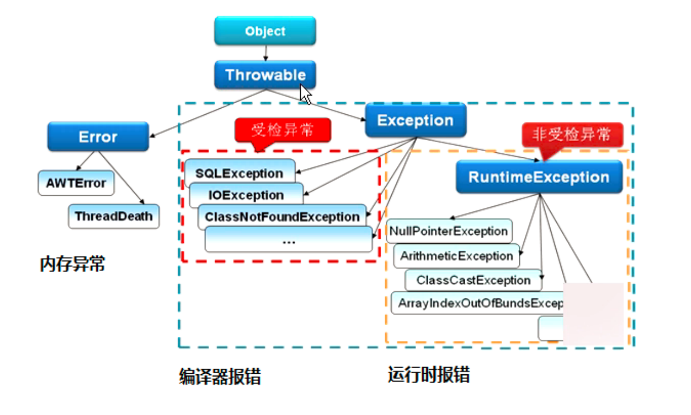

# JAVA异常分类及处理

## 概念
如果某个方法不能按照正常的途径完成任务，就可以通过另一种路径退出方法。在这种情况下会抛出一个封装了错误信息的对象。此时，这个方法会立即退出同时不返回任何值。另外，调用这个方法的其他代码也无法继续执行，异常处理机制会将代码执行交给异常处理器。



## 异常分类
Throwable 时Java 语言中所有错误或异常的超类。下一层分为Error和Exception。

Error
1. Error类是指java运行时系统的内部错误和资源耗尽错误。应用程序不会抛出该类对象。如果出现了这样的错误，除了告知用户，剩下的就是尽力使程序安全的终止。
Exception(RuntimeException,CheckedException)
2. Exception 又有两个分支，一个是运行时异常RuntimeException，一个是CheckedException。

RuntimeException 如： NullPointerException， ClassCastException;一个是检查异常CheckedException，如I/O错误导致的IOException，，SQLException。 RuntimeException 是那些可能在 Java 虚拟机正常运行期间抛出的异常的超类。 如果出现 RuntimeException，那么一定是程序员的错误.

检查异常CheckedException：一般是外部错误，这种异常都发生在编译阶段，Java编译器会强制程序去捕获此类异常，即会出现要求你把这段可能出现异常的程序进行try catrch，该类异常一般包括几个方面：
1. 试图在文件尾部读取数据
2. 试图打开一个错误格式的URL
3. 试图根据给定的字符串查找一个class对象，而这个字符串表示的类并不存在。


## 异常的处理方式
遇到问题不进行具体处理，而是继续抛给调用者（throw，throws）

抛出异常有三种形式，一是throw，一个throws，还有一种系统自动抛异常。

```java
public static void main(String[] args) { 
 String s = "abc"; 
 if(s.equals("abc")) { 
 throw new NumberFormatException(); 
 } else { 
 System.out.println(s); 
 } 
} 
int div(int a,int b) throws Exception{
return a/b;}
```

### Throw 和 throws的区别：
位置不同：
1. throws用在函数上，后面跟的是异常类，可以跟多个；而throw用在函数内，后面跟的是异常对象。
功能不同：
2. throws 用来声明异常，让调用者只知道该功能可能出现的问题，可以给出预先的处理方式；
   throw 抛出具体的问题对象，执行到throw，功能就已经结束了，跳转到调用者，并将具体的问题对象抛给调用者。也就是说，throw 语句独立存在时，下面不要定义其他语句，因为执行不到。
3. throws 表示出现异常的一种可能性，并不一定会发生这些异常；throw 则是抛出了异常，执行throw则一定抛出了某种异常对象。
4. 两种都是消极处理异常的方式，只是抛出或者可能抛出异常，但是不会由函数去处理异常，真正的处理异常由函数的上层调用处理。


