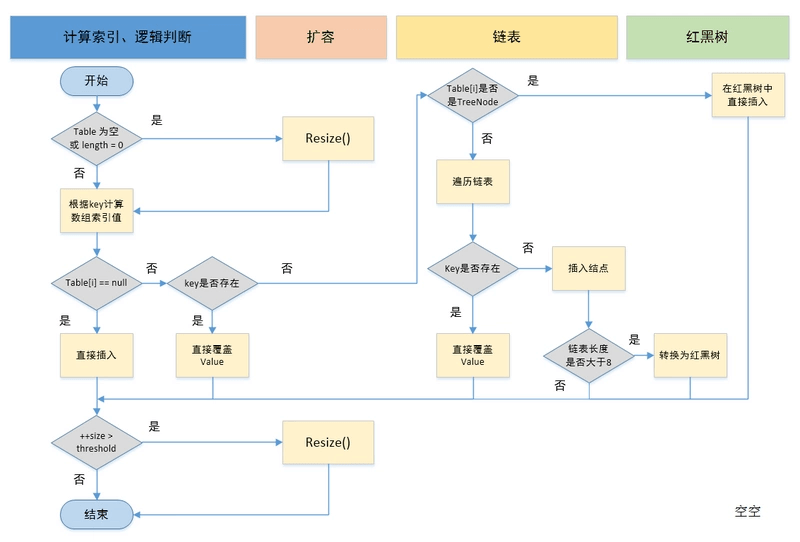
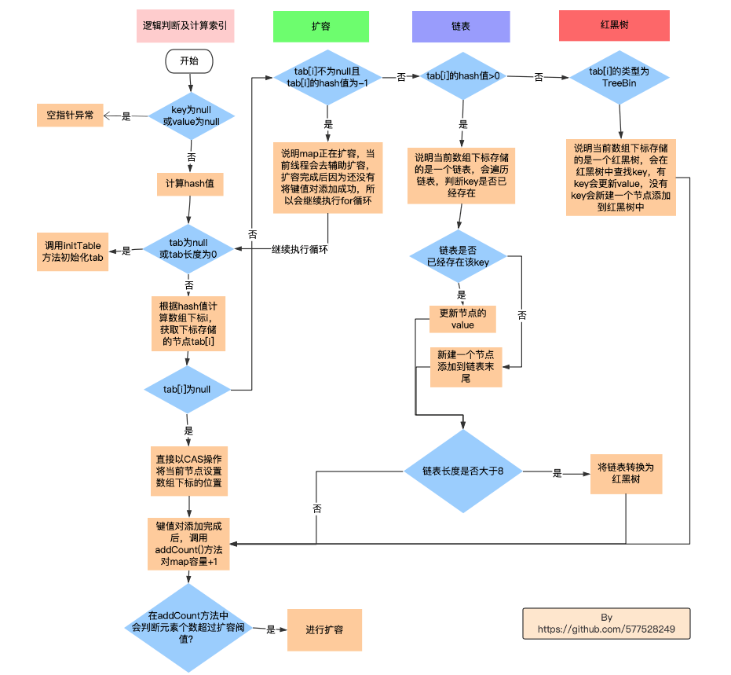
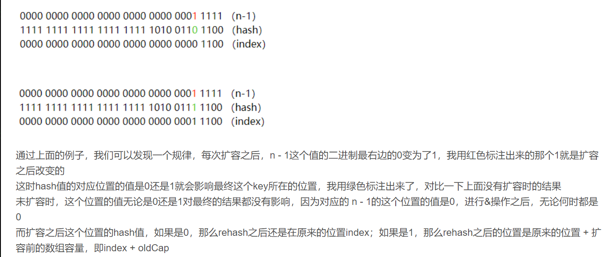

# Java Map

#### [HashMap添加一个键值对的过程是怎么样的？](#1)

#### [ConcurrentHashMap添加一个键值对的过程是怎么样的?](#2)

#### [HashMap与HashTable,ConcurrentHashMap的区别是什么？](#3)

#### [HashMap扩容后是否需要rehash?](#4)

#### [HashMap扩容是怎样扩容的，为什么都是2的N次幂的大小？](#5)

#### [ConcurrentHashMap是怎么记录元素个数size的？](#6)

#### [为什么ConcurrentHashMap,HashTable不支持key，value为null？](#7)

#### [HashSet和HashMap的区别?](#8)

#### [HashMap遍历时删除元素的有哪些实现方法？](#9)


## <span id=1>HashMap添加一个键值对的过程是怎么样的？</span>

### 1.初始化table
 判断table是否为空或为null，否则执行resize()方法（resize方法一般是扩容时调用，也可以调用来初始化table)。

```java
if ((tab = table) == null || (n = tab.length) == 0)
            n = (tab = resize()).length;
```
### 2.计算hash值
根据键值key计算hash值。(因为hashCode是一个int类型的变量，是4字节，32位，所以这里会被hashCode的低16位与高16位进行一个异或运算，来保留高位的特征，以便于得到的hash值更加均匀分布)

```java
static final int hash(Object key) {
    int h;
    return (key == null) ？ 0 : (h = key.hashCode()) ^ (h >>> 16);
}
```

### 3.插入或更新节点
根据(n - 1) & hash计算得到插入的数组下标i，然后进行判断

```java
 if ((p = tab[i = (n - 1) & hash]) == null)
            tab[i] = newNode(hash, key, value, null);

```

#### 3.1 数组为空(table[i]==null)
那么说明当前数组下标下，没有hash冲突的元素，直接新建节点添加。

#### 3.2 等于下标首元素，table[i].hash==hash &&(table[i]==key||(key!=null&&key.equals(table[i].key)))

判断table[i]的首个元素是否和key一样，如果相同直接更新value。

#### 3.3 数组下标存的是红黑树，table[i] instanceof TreeNode
判断table[i] 是否为treeNode，即table[i] 是否是红黑树，如果是红黑树，则直接在树中插入键值对。

#### 3.4 数组下标存的是链表
上面的判断条件都不满足，说明table[i]存储的是一个链表，那么遍历链表，判断是否存在已有元素的key与插入键值对的key相等，如果是，那么更新value，如果没有，那么在链表末尾插入一个新节点。插入之后判断链表节点数大于8，大于8的话的话调用treeifyBin方法

```java
  if (binCount >= TREEIFY_THRESHOLD - 1) // -1 for 1st
                            treeifyBin(tab, hash);

```
然而在该方法中，会对链表长度进行重新判断，如果小于64，进行resize(),否则转变为红黑树


#### 3.4扩容
插入成功后，判断实际存在的键值对数量size是否超多了最大容量threshold(一般是数组长度*负载因子0.75)，如果超过，进行扩容。

```java

if (++size > threshold)
     resize();
```

## <span id=2>ConcurrentHashMap添加一个键值对的过程是怎么样的？</span>
别人github上抄的


### 1.判断null值
判断key==null 或者 value == null，如果是，抛出空指针异常。

```java
 if (key == null || value == null) throw new NullPointerException();
```
### 2.计算hash
根据key计算hash值(计算结果跟HashMap是一致的，写法不同)。

### 3. **进入for循环，插入或更新元素**

#### 3.1 如果(tab == null || (n = tab.length) == 0)，说明数组未初始化
那么调用initTable()方法初始化tab。（在initTable方法中，为了控制只有一个线程对table进行初始化，当前线程会通过CAS操作对SIZECTL变量赋值为-1，如果赋值成功，线程才能初始化table，否则会调用Thread.yield()方法让出时间片）。

#### 3.2 ((f = tabAt(tab, i = (n - 1) & hash)) == null),说明当前下标没有哈希冲突的键值对
说明当前数组下标还没有哈希冲突的键值对。

Node<K,V> f是根据key的hash值计算得到数组下标，下标存储的元素，f可能是null，也有可能是链表头节点，红黑树根节点或迁移标志节点ForwardNode）

那么根据key和value创建一个Node，使用CAS操作设置在当前数组下标下，并且break出for循环。

#### 3.3 ((fh = f.hash) == MOVED)

说明ConcurrentHashMap正在在扩容，当前的节点f是一个标志节点，当前下标存储的hash冲突的元素已经迁移了。

那么当前线程会调用helpTransfer()方法来辅助扩容，扩容完成后会将tab指向新的table，然后继续执行for循环。

#### 3.4 除上面三种以外情况，说明是下标存储链表或者是红黑树

说明f节点是一个链表的头结点或者是红黑树的根节点，那么对f加sychronize同步锁，然后进行以下判断：
   (fh = f.hash)
* (fh >= 0)
如果是f的hash值大于0，当前数组下标存储的是一个链表，f是链表的头结点。
如果是f的hash值大于0，当前数组下标存储的是一个链表，f是链表的头结点。
对链表进行遍历，如果有节点跟当前需要插入节点的hash值相同，那么对节点的value进行更新，否则根据key，value创建一个Node<K,V>，添加到链表末尾。

* f instanceof TreeBin
如果f是TreeBin类型，那么说明当前数组下标存储的是一个红黑树，f是红黑树的根节点，调用putTreeVal方法，插入或更新节点。

#### 插入完成后，判断binCount（数组下标存储是一个链表时，binCount是链表长度），当binCount超过8时，并且数组的长度大于64时，那么调用treeifyBin方法将链表转换为红黑树。最后break出for循环。


#### 4.是否需要扩容
调用addCount()对当前数组长度加1，在addCount()方法中，会判断当前元素个数是否超过sizeCtl(扩容阈值，总长度*0.75)，如果是，那么会进行扩容，如果正处于扩容过程中，当前线程会辅助扩容。


##<span id=3>HashMap与HashTable，ConcurrentHashMap的区别是什么？</span>

主要从底层数据结构，线程安全，执行效率，是否允许Null值，初始容量及扩容，hash值计算来进行分析。

###1.底层数据结构
```java
transient Node<K,V>[] table; //HashMap

transient volatile Node<K,V>[] table;//ConcurrentHashMap

private transient Entry<？,？>[] table;//HashTable
```

* HashMap=数组+链表+红黑树
HashMap的底层数据结构是一个==数组+链表+红黑树==，数组的每个元素存储是一个链表的头结点，链表中存储了一组哈希值冲突的键值对，通过链地址法来解决哈希冲突的。为了避免链表长度过长，影响查找元素的效率，当链表的长度>8时，会将链表转换为红黑树，链表的长度<6时，将红黑树转换为链表(但是红黑树转换为链表的时机不是在删除链表时，而是在扩容时，发现红黑树分解后的两个链表<6，就按链表处理，否则就建立两个小的红黑树，设置到扩容后的位置)。之所以临界点为8是因为红黑树的查找时间复杂度为logN，链表的平均时间查找复杂度为N/2，当N为8时，logN为3，是小于N/2的，正好可以通过转换为红黑树减少查找的时间复杂度。


* ConcurrentHashMap=数组+链表+红黑树
ConcurrentHashMap底层数据结构跟HashMap一致，底层数据结构是一个==数组+链表+红黑树==。只不过使用了volatile来进行修饰它的属性，来保证内存可见性(一个线程修改了这些属性后，会使得其他线程中对于该属性的缓存失效，以便下次读取时取最新的值)。

* HashTable=**数组+链表**
Hashtable底层数据结构跟HashMap一致，底层数据结构是一个==数组+链表==，也是通过链地址法来解决冲突，只是链表过长时，不会转换为红黑树来减少查找时的时间复杂度。Hashtable属于历史遗留类，实际开发中很少使用。

### 2.线程安全
**HashMap 非线程安全**
HashMap是非线程安全的。（例如多个线程插入多个键值对，如果两个键值对的key哈希冲突，可能会使得两个线程在操作同一个链表中的节点，导致一个键值对的value被覆盖）

**HashTable 线程安全**
HashTable是线程安全的，主要通过synchronized关键字修饰大部分方法，使得每次只能一个线程对HashTable进行同步修改，性能开销较大。

**ConcurrentHashMap线程安全**
ConcurrentHashMap是线程安全的，主要是通过CAS操作+synchronized来保证线程安全的。

CAS是用于插入链表第一个，synchorinized 用于对链表同步

### 3.执行效率
因为HashMap是非线程安全的，执行效率会高一些，其次是ConcurrentHashMap，因为HashTable在进行修改和访问时是对整个HashTable加synchronized锁，多线程访问时，同一时间点，只有一个线程可以访问或者添加键值对，所以效率最低。

###4.是否允许null出现

HashMap可以,key为null时，计算的hash值为0，得到的的下标为0，存储在首元素的链表中
```java
static final int hash(Object key) {
	int h;
	return (key == null) ？ 0 : (h = key.hashCode()) ^ (h >>> 16);
}
```
HashTable不行，会抛出空指针异常


ConcurrentHashMap的键和值都不能为bull
```java
final V putVal(K key, V value, boolean onlyIfAbsent) {
    if (key == null || value == null) throw new NullPointerException();
    int hash = spread(key.hashCode());
    ...其他代码
}
```

### 5.初始容量及扩容
#### 不指定初始容量
如果不指定初始容量，HashMap和ConcurrentHashMap默认会是16，HashTable的容量默认会是11。

#### 扩容
扩容时，如果原长度是N，HashMap和ConcurrentHashMap扩容时会是2N，HashTable则是2N+1。

#### 6.hash值计算

##  <span id=4>HashMap扩容后是否需要rehash？</span>
在JDK1.8以后，不需要rehash，因为键值对的Hash值主要是根据key的hashCode()的高16位与低16位进行异或计算后得到，而数组下标的计算时通过（n-1）&(hash)


## <span id=5>HashMap扩容是怎样扩容的，为什么都是2的N次幂的大小？</span>
### 触发扩容
在没有指定初始长度的情况下，HashMap数组的默认长度为16，在添加一个新的键值对时，会调用putVal()方法，在方法中，成功添加一个新的键值对以后，会判断当前的元素个数是否超过阀值(数组长度*负载因子0.75)，如果超过那么调用resize方法进行扩容。具体的扩容步骤如下：

1.计算扩容后的长度
2.初始化新数组
3.迁移元素（）

## <span id=6>HashSet 与HashMap的区别</span>

HashMap主要存储非重复键值对，HashSet存储非重复的对象。HashMap继承于AbstractMap,实现了Map接口，HashSet继承于AbstractSet，实现了Set接口。它们都有去重的需求，然而HashSet主要实现都是基于HashMap。


在HashSet的构造方法中，创建了一个HashMap，赋值给map属性，之后再添加元素时，就是将元素作为key添加到HashMap中，只不过value是一个占位对象PRESENT.

在调用HashMap的putVal方法添加新的键值对时，会进行如下操作：

1.根据key计算hash值。

2.根据hash值映射数组下标，然后获取数组下标的对应的元素。

3.数组下标存储的是一个链表，链表包含了哈希冲突的元素，会对链表进行遍历，判断```hash1==hash2```，除此以外，还必须要```key1==key2```，或者```key1.equals(key2)```。

因为两个不同的对象的hashCode可能相等，但是相同的对象的hashCode肯定相等，

==是判断两个变量或实例是不是指向同一个内存地址，如果是同一个内存地址，对象肯定相等。
```java
int hash = hash(key);//根据key计算hash值
p = tab[i = (n - 1) & hash];//根据hash值映射数组下标，然后获取数组下标的对应的元素。
for (int binCount = 0; ; ++binCount) {//数组下标存储的是一个链表，链表包含了哈希冲突的元素，会对链表进行遍历，判断每个节点的hash值与插入元素的hash值是否相等，并且是存储key对象的地址相等，或者key相等。
if (e.hash == hash &&
	((k = e.key) == key || (key != null && key.equals(k))))
		break;
		p = e;
}
```