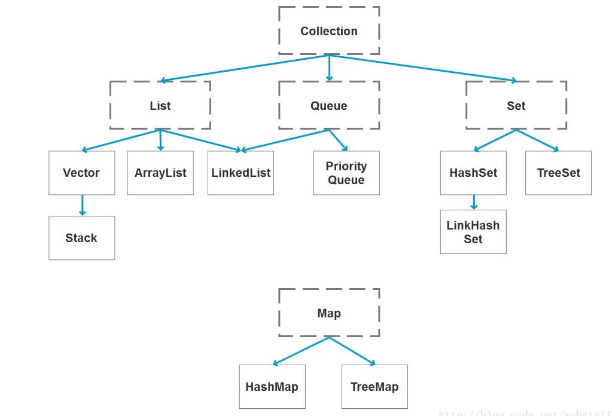

# Java列表

### [ArrayList与LinkedList的区别是什么？](#1)

### [ArrayList,LinkedList线程安全问题](#2)

### [ArrayList遍历时删除元素的方法](#3)

### [ConcurentModificationException是什么？](#4)

### [java容器类的层次是怎么样的？](#5)

## <span id=1>ArrayList与LinkedList的区别是什么？</span>

### 1.底层的数据结构

* ArrayList底层使用Object数组,初始化时就会指向的会是一个static修饰的空数组，数组长度一开始为0
```java
// jdk1.8
private static final Object[] DEFAULTCAPACITY_EMPTY_ELEMENTDATA = {}

 public ArrayList() {
        this.elementData = DEFAULTCAPACITY_EMPTY_ELEMENTDATA;
    }
```
插入第一个元素时数组长度会初始化为10，之后每次数组空间不够进行扩容时都是增加为原来的1.5倍。
```java
private static final int DEFAULT_CAPACITY = 10;

```

```java
int newCapacity = oldCapacity + (oldCapacity >> 1);

elementData = Arrays.copyOf(elementData, newCapacity;
```

ArrayList的空间浪费主要体现在list列表的结尾会预留一定的容量空间（避免频繁申请内存）

* 而LinkedList的数据结构时双向链表，每个节点保存了前驱节点和后继节点的指针。初始化时，不执行任何操作，添加第一个元素时，再去构造链表中的节点。LinkedList的空间花费则体现在它的每一个元素都需要消耗比ArrayList更多的空间。（前继结点的指针与后继节点的指针）

### 2.是否保证线程安全
ArrayList与LinkedList都是线程不安全的。

因为ArrayList的插入元素的方法就是裸奔的，直接将原数组index及后面的元素拷贝到index+1及后面的位置上，然后将index位置设置为插入的值，并发修改时保证不了数据安全性，所以也不允许并发修改，一旦检测到并发修改，会抛出ConcurrentModificationException异常。
```java
//ArrayList的插入元素的方法
public void add(int index, E element) {
        rangeCheckForAdd(index);
        ensureCapacityInternal(size + 1);  // Increments modCount!!
        System.arraycopy(elementData, index, elementData, index + 1,
                         size - index);//将原数组index之后的元素拷贝到原数组index+1后面的位置上
        elementData[index] = element;
        size++;
}
```

### 3.插入和删除的复杂度：

* ArrayList采用数组存储，元素的物理存储地址是连续的，支持O(1)的时间复杂度对元素进行快速访问。插入和删除元素后，需要将后面的元素进行移动，所以插入和删除的时间复杂度手元素位置的影响，复杂度是O(n)。

* LinkedList采用链表存储，所以不能快速访问。所以首尾插入，删除元素时间复杂度不受元素位置的影响，都是近O(1)。

### 4.继承树

```java
public class ArrayList<E> extends AbstractList<E>
        implements List<E>, RandomAccess, Cloneable, java.io.Serializable
```

```java
public class LinkedList<E>
    extends AbstractSequentialList<E>
    implements List<E>, Deque<E>, Cloneable, java.io.Serializable
```

AbstractSequentialList是AbstractList类的子类，实现了根据下标来访问元素的一些方法，主要是通过listIterator遍历获取特定元素。

List接口代表的是有序结合，与Set相反，List的元素是按照移动的顺序进行排列。

Cloneable接口代表类会重新父类Object的clone()方法，支持对实例对象的clone操作。

java.io.Serializable接口代表类支持序列化。

RandomAccess是一个标示性接口，代表ArrayList支持快速访问，而LinkedList不支持。

Deque接口是双端队列的意思，代表LinkedList支持两端元素插入和移除。

## <span id=2>ArrayList,LinkedList线程安全问题</span>

### 1.使用SynchronizedList

SynchronizedList是一个线程安全的包装类。继承于SynchronizedCollection，SynchronizedCollection实现了Collection接口，SynchronizedList包含一个List对象，对List的访问修改方法进行了一些封装，在封装的方法中会对list使用同步锁加锁，然后再进行存取和修改操作。

使用方法如下：
```java
LinkedList<Integer>    linkedList    = new LinkedList<Integer>();
//调用Collections的synchronizedList方法，传入一个linkedList，会返回一个SynchronizedList实例对象
List<Integer> synchronizedList =  Collections.synchronizedList(linkedList);

//调用Collections的synchronizedList方法，ArrayList，返回一个SynchronizedRandomAccessList实例对象
ArrayList<Integer>    arrayList    = new ArrayList<Integer>();
List<Integer> synchronizedRandomAccessList =  Collections.synchronizedList(linkedList);
```
(Collections.synchronizedList()方法会判断传入的对象是否实现了 RandomAccess接口，是的话，会返回一个SynchronizedRandomAccessList对象，SynchronizedRandomAccessList是SynchronizedList的子类，只是会多一个以线程安全的方式获取子数组的方法)。
```java
public static <T> List<T> synchronizedList(List<T> list) {
        return (list instanceof RandomAccess ?
                new SynchronizedRandomAccessList<>(list) :
                new SynchronizedList<>(list));
    }
```

SynchronizedList类的部分代码如下：
对于List的放法，均加了同步
```java
       public E get(int index) {
            synchronized (mutex) {return list.get(index);}
        }
        public E set(int index, E element) {
            synchronized (mutex) {return list.set(index, element);}
        }
        public void add(int index, E element) {
            synchronized (mutex) {list.add(index, element);}
        }
        public E remove(int index) {
            synchronized (mutex) {return list.remove(index);}
        }

        public int indexOf(Object o) {
            synchronized (mutex) {return list.indexOf(o);}
        }
        public int lastIndexOf(Object o) {
            synchronized (mutex) {return list.lastIndexOf(o);}
        }
```

### 2.使用CopyOnWriteArrayList
CopyOnWriteArrayList跟ArrayList类似，都是实现了List接口，只不过它的父类的是Object，而不是AbstractList。CopyOnWriteArrayList与ArrayList的不同在于，

#### 1.内部持有一个ReentrantLock类型的lock锁，用于控制并发访问

```java
final transient ReentrantLock lock = new ReentrantLock();
```

#### 2.使用volatile修饰Object数组，使得变量具备内存可见性

```java
 //CopyOnWriteArrayList
   private transient volatile Object[] array;
    
   //ArrayList
   private transient Object[] elementData;//transient
```
可以看到区别主要在于CopyOnWriteArrayList的Object是使用volatile来修饰的，==volatile可以使变量具备内存可见性==，一个线程在工作内存中对变量进行修改后，会立即更新到物理内存，并且使得其他线程中的这个变量缓存失效，其他线程在读取会去物理内存中读取最新的值。（volatile修饰的是指向数组的引用变量，所以对数组添加元素，删除元素不会改变引用，只有对数组变量array重新赋值才会改变。所以为了保证内存可见性，CopyOnWriteArrayList.add()方法在添加元素时，都是复制出一个新数组，进行修改操作后，再设置到就数组上）

注意事项:Object数组都使用transient修饰是因为transient修饰的属性不会参与序列化，ArrayList通过实现writeObject()和readObject()方法来自定义了序列化方法(基于反序列化时节约空间考虑，如果用默认的序列方法，源elementData数组长度为100，实际只有10个元素，反序列化时也会分配长度为100的数组，造成内存浪费。)

### 3.SynchronizedList和CopyOnWriteArrayList优缺点

#### SynchronizedList:读写都加锁：
SynchronizedList是通过对读写方法使用synchronized修饰来实现同步的，即便只是多个线程在读数据，也不能进行，如果是读比较多的场景下，会性能不高，所以适合读写均匀的情况。

#### CopyOnWriteArrayList:读不加锁，写加锁：
而CopyOnWriteArrayList是读写分离的，只对写操作加锁，但是每次写操作(添加和删除元素等)时都会复制出一个新数组，完成修改后，然后将新数组设置到旧数组的引用上，所以在写比较多的情况下，会有很大的性能开销，所以适合读比较多的应用场景。

## <span id=3>ArrayList遍历时删除元素的方法</span>

## <soan id=4> ConcurrentModificationException是什么</span>

根据ConcurrentModificationException的文档介绍，一些对象不允许并发修改，当这些修改行为被检测到时，就会抛出这个异常。（例如一些集合不允许一个线程一边遍历时，另一个线程去修改这个集合）。

一些集合（例如Collection, Vector, ArrayList，LinkedList, HashSet, Hashtable, TreeMap, AbstractList, Serialized Form）的Iterator实现中，如果提供这种并发修改异常检测，那么这些Iterator可以称为是"fail-fast Iterator"，意思是快速失败迭代器，就是检测到并发修改时，直接抛出异常，而不是继续执行，等到获取到一些错误值时在抛出异常。

异常检测主要是通过modCount和expectedModCount两个变量来实现的，

modCount 集合被修改的次数，一般是被集合(ArrayList之类的)持有，每次调用add()，remove()方法会导致modCount+1

expectedModCount 期待的modCount，一般是被Iterator(ArrayList.iterator()方法返回的iterator对象)持有，一般在Iterator初始化时会赋初始值，在调用Iterator的remove()方法时会对expectedModCount进行更新。（可以看看上面的ArrayList.Itr源码）

然后在Iterator调用next()遍历元素时，会调用checkForComodification()方法比较modCount和expectedModCount，不一致就抛出ConcurrentModificationException。

单线程操作Iterator不当时也会抛出ConcurrentModificationException异常。（上面的例子就是）

因为ArrayList和HashMap的Iterator都是上面所说的“fail-fast Iterator”，Iterator在获取下一个元素，删除元素时，都会比较expectedModCount和modCount，不一致就会抛出异常。
###总结
所以当使用Iterator遍历元素(for-each遍历底层实现也是Iterator)时，需要删除元素，一定需要使用 Iterator的remove()方法 来删除，而不是直接调用ArrayList或HashMap自身的remove()方法,否则会导致Iterator中的expectedModCount没有及时更新，之后获取下一个元素或者删除元素时，expectedModCount和modCount不一致，然后抛出ConcurrentModificationException异常。

##<span id=5>java容器类的层次是怎么样的？</span>


大致是这样一个图，Collection是一个接口，代表是集合，它有三个子接口，分别是有序集合List，队列Queue，无序集合Set。Map代表键值对。实际上关系会更加复杂一些，以ArrayList为例：

ArrayList不单是实现了List接口，而且还继承于AbstractList抽象类，同时实现了RandomAccess，Cloneable，Serializable接口。

HashMap不单是实现了Map接口，而且继承于AbstractMap抽象类，同时实现了Cloneable，Serializable接口。