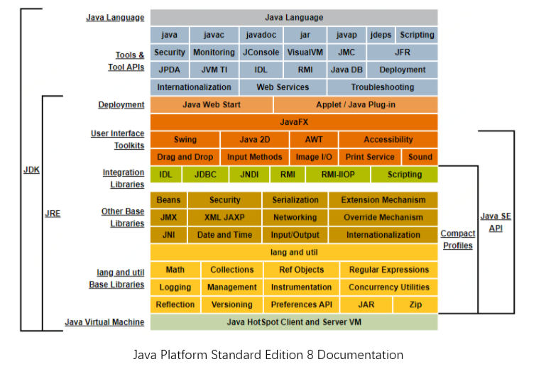

[TOC]

#JVM虚拟机

##JDK,JRE,JVM的区别
* JDK(Java Development Kit Java 开发工具包)，JDK是提供给Java 开发人员使用的，其中包含了 Java的开发工具，也包含了JRE。 开发工具包括编译工具（javac.exe）和打包工具（jar.exe）
* JRE(Java Runtime Environment Java运行环境)是JDK 的子集，JRE 提供了库，Java虚拟机和其他组件，用于运行Java编程语言，小程序，应用程序。
* JVM(Java Virtual Machine Java,Java 虚拟机)，可以理解为虚拟出来的计算机，主要负责把Java程序生成的字节码文件，解释成具体系统平台上的机器指令，让其在各个平台运行。

##Client模式，Server模式
在JVM中有两种不同风格的启动模式，Client模式，Server模式。
* Client 模式：加载速度较快。可以用于运行GUI交互程序。
* Server模式：加载速度较慢但运行起来较快。可以用于运行服务器后台程序。
