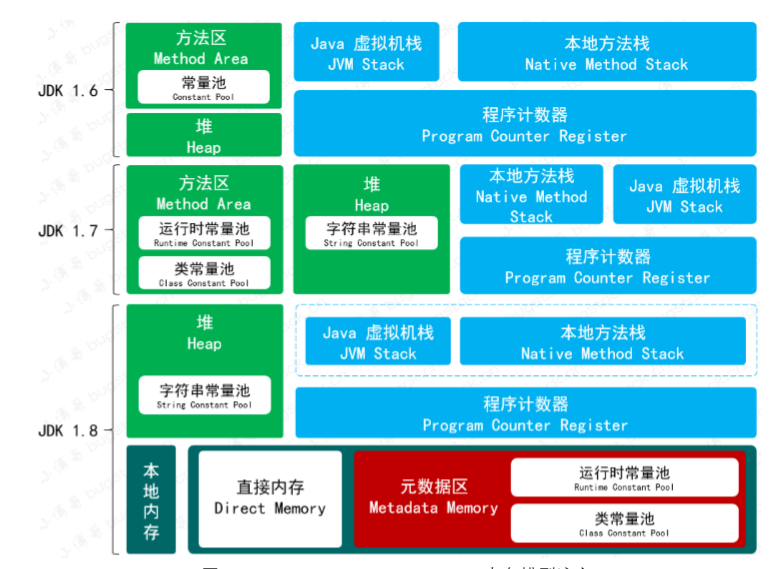
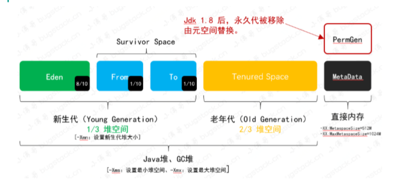
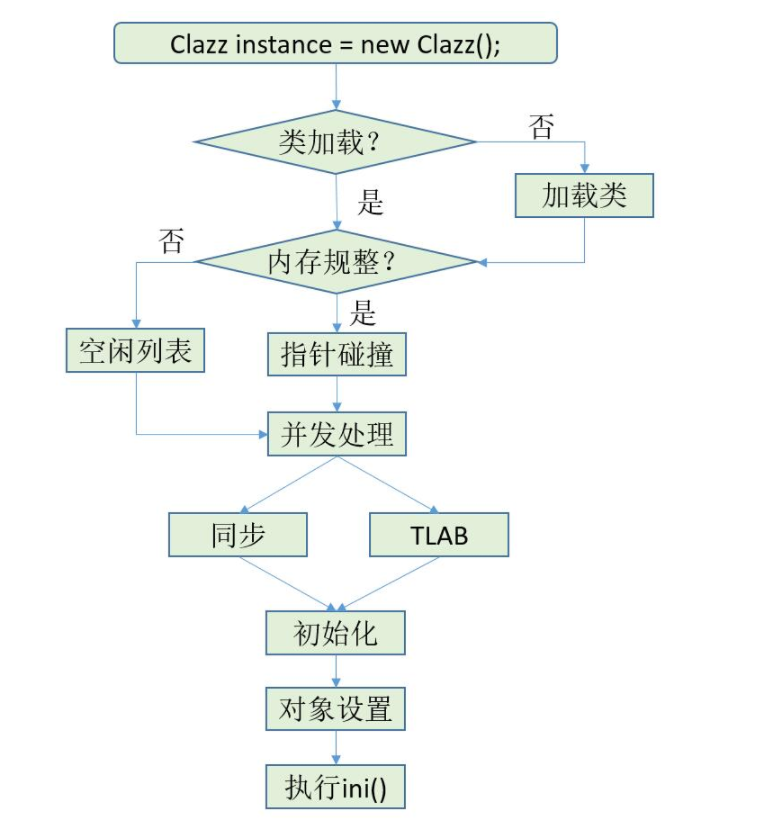
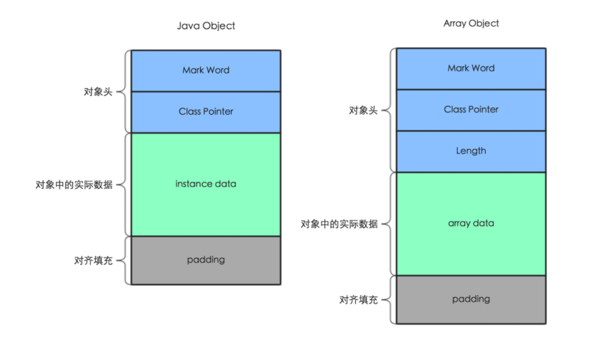
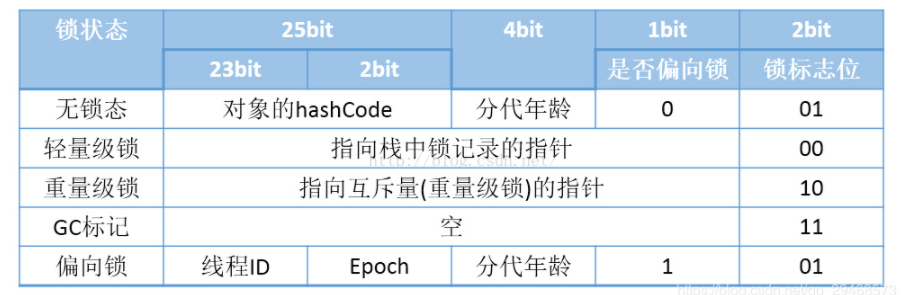

[toc]

#JVM内存模型

## JDK1.6,JDK1.7,JDK1.8的演变

* JDK1.6 ：有永久代，静态变量存放在永久代上。
* JDK1.7 ：有永久代，但已经把字符串常量池，**静态变量**，存放在堆上。逐渐的减少永久代的使用。
* JDK1.8 ：无永久代，运行时常量池，类常量池，都保存在元数据区，也就是常说的元空间。但字符串常量池仍然存放在堆上。

## 内存模型各区域介绍

### 1.程序计数器
* 较小的内存空间，**线程私有**，记录当前线程所执行的字节码行号。
* 如果执行Java方法，计数器记录虚拟机字节码当前指令的地址，本地方法则为空。
* 这一块区域没有任何OutOfMemoryError定义。

### 2. Java虚拟机栈
* **线程私有**
* 每一个方法在执行的同时，都会创建出一个栈帧，用于存放局部变量表，操作数栈，动态链接，方法出口，线程等消息。（因此在递归调用的时候容易一直进栈导致error）
* 方法从调用到执行完成，都对应者栈帧从虚拟机中入栈和出栈的过程。
* 局部变量表中存储了Java基本类型，对象引用(可以是对象的存储地址，也可以是代表对象的句柄等)和returnAddress类型（存储了一条字节码指令的地址）。
* 最终，栈帧会随着方法的创建到结束而销毁。

### 3.本地方法栈
* **线程私有**
* 本地方法栈与Java虚拟机栈作用类似，唯一不同的就是本地方法栈执行的是Native方法，而虚拟机栈是为JVM执行Java方法服务的。
* 与虚拟机栈一样，本地方法栈也会抛出StackOverflowError和OutOfMemoryError异常。
* JDK1.8 HotSpot虚拟机直接把本地方法栈和虚拟机栈合二为一。

### 4.堆

* **线程共享**

* JDK1.8 JVM的内存结构主要由三大块组成：堆内存，元空间和栈，Java堆是内存空间占据最大的一块区域。
* Java堆，由新生代和老年代组成，分别占据1/3和2/3.
* 而年轻代又分为三部分，Eden，From Survivor，To Survivor，占据比例为8：1：1，可调

* 堆上主要存放了存放对象实例和数组（所有线程共享）

### 5.元空间
* 方法区（jdk1.8以前属于永久代，现在属于元空间）存储了被虚拟机加载的类型信息
* 元空间从虚拟机Java堆中转移到本地内存，默认情况下，元空间的大小仅受本地内存的限制。
* Class 文件中除了有类的版本，字段，方法，接口等描述信息外，还有一项信息是**常量池（Constant Pool Table）**，用于存放编译期生成的各种字面量和符号引用，这部分内容将在类加载之后进入方法区的**运行时常量池**中存放。（无法申请内存时同样会抛出OutOfMemoryError）
  

### 6.直接内存区（不属于虚拟机运行时数据区）
直接内存区不属于虚拟机运行时数据区的一部分。它指的是使用Native 方法直接分配堆外内存，然后通过Java堆外内存，然后通过Java堆中的DirectByteBuffer来对内存的引用进行操作（可以避免Java对与Native堆之间的数据复制，提升性能）

### 5. 常量池
从jdk1.7开始把常量池从永久代中剥离，直到jdk1.8去掉了永久代。而字符串常量池一直放在堆空间，用于存储字符串对象，或是字符串对象的引用。

## Java中对象的创建过程是怎么样的？

###1. 类加载检查
首先代码中new关键字在编译后，会生成一条字节码new指令，当虚拟机遇到一条字节码new指令时，会根据类名去 **运行常量池**找类的符号引用，检查符号引用代表的类是否已加载，解析和初始化过。如果没有就执行相应的 **类加载** 过程。

###2.分配内存
虚拟机从Java堆中分配一块大小确定的内存（因为类加载时，创建一个此类的示例对象的所需的内存大小就确定了），并且初始化为零值。内存分配的方式**指针碰撞**和**空闲列表**两种，取决于虚拟机采用的垃圾回收器是否带有空间压缩整理的功能。

#### 指针碰撞

如果垃圾收集器是Serial，ParNew 等带有空间压缩整理的功能，Java堆是规整的，此时通过移动内存分界点的指针，就可以分配空闲内存。

#### 空闲列表
如果垃圾收集器是CMS这种基于清除算法的收集器时，Java堆中的空闲内存和已使用内存是相互交错的，虚拟机会维护一个列表，记录那些可用，哪些不可用，分配时从表中找到一块足够大的空闲内存分配给实例对象，并且更新表。

###3.对象初始化（虚拟机层面）
虚拟机会对 对象进行必要的设置，将对象的一些信息存储在Object header 中。

###4.对象初始化（Java层面）
在构造一个类的实例对象时，遵循的原则是先静后动，先父后子，先变量，后代码块，构造器。在Java程序层面会依次 进行以下操作：

* 初始化父类静态变量（如果是首次使用此类）

* 执行父类的静态代码块 （如果是首次使用此类）

* 初始化子类静态变量（如果是首次使用此类）

* 执行子类的静态代码块（如果是首次使用此类）

* 初始化父类的非静态变量

* 执行父类的非静态代码块

* 父类构造函数

* 子类非静态变量

* 子类非静态代码块

* 子类构造函数

####PS:如何解决内存分配时的多线程并发竞争问题？
内存分配不是一个线程安全的操作，在多个线程进行内存分配是，可能会存在数据不同步的问题。所以有两种方法解决：

##### 添加CAS锁
对内存分配的操作进行同步处理，添加CAS锁，配上失败重试的方式来保证原子性。(默认使用这种方式)
##### 预先给各线程分配TLAB
预先在Java堆中给各个线程分配一块TLAB(本地线程缓冲区)内存，每个线程现在各自的缓冲区中分配内存，使用完了再通过第一种添加CAS锁的方式来分配内存。

## Java中对象的内存布局是怎么样的？
对象在内存中存储布局主要分为对象头，实例数据和对齐填充三部分。

* **对象头**
  
对象头主要包含对象自身的运行时数据（Mark Word），类型指针（Class Pointer，指向对象所属的类）。如果对象是数组，还需要包含数组长度。

**Mark Word**：存储对象自身的运行时数据，例如hashcode，GC分代年龄，锁状态标志，线程所持有的锁等等。在32位系统占4字节，在64位系统中占8字节。

**Class Pointer**：用来指向对象对应的Class 的内存地址。在32位系统占4字节，在64位系统中占8字节。
**Length**：如果是数组对象，还有一个保存数组长度的空间，占4个字节。

**实例数据**
保存对象的非静态成员变量数据。实例数据存储的是真正的有效数据，即各个字段的值。无论是子类中定义的，还是从父类继承下来的都需要记录，这部分数据的存储顺序收到虚拟机的分配策略以及字段在类中的定义顺序的影响。

**对齐填充**
因为HotSpot虚拟机的自动内存管理系统要求对象起始地址是8字节的整数倍，所以任何对象的大小必须是8字节的整数倍，而对象部分一般是8字节的整数倍，如果实例数据不是8字节的整数倍，需要对齐填充来补全。