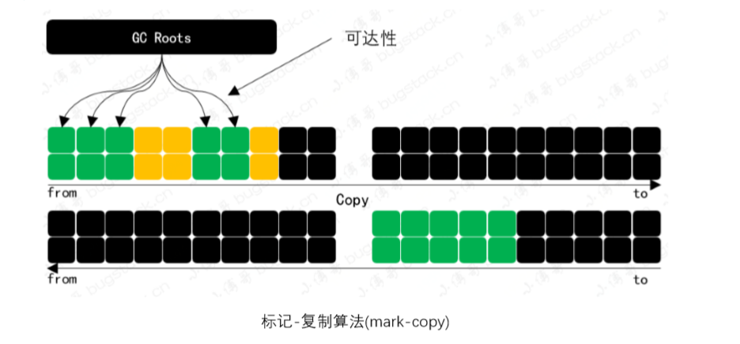

[toc]
## JVM垃圾回收

垃圾收集器主要做三件事：**哪些内存需要回收，什么时候回收，怎么回收**。

垃圾收集器的核心知识项主要包括： 判断对象是否存活，垃圾收集算法，各类垃圾收集器以及垃圾回收过程。

###1. 判断对象已死（哪些内存需要回收）

#### 1.1 引用计数器

* 1. 为每一个对象添加一个引用计数器，统计指向该对象的引用次数。
* 2. 当一个对象有相应的引用更新操作时，则对目标对象的引用计数器进行增减
* 3. 一旦当某个对象的引用计数器为0时，则表示此对象已经死亡，可以被垃圾回收。

主流的Java虚拟机中并没有选用引用技术算法来管理内存，因为这个简单的技术方式在处理一些 相互依赖，循环引用等就会非常复杂。可能会存在不再使用但又不能回收的内存 ,造成内存泄漏。

#### 1.2 可达性分析法
Java ， C#等主流语言的内存管理子系统，都是通过可达性分析算法来判定对象是否存活的。

它的算法思路是通过定义一系列称为 GC Roots 根节点作为起始节点集，向下搜索，搜索走过的路径称为引用链，当一个对象到GC Roots没有任何引用链相连，对象不可达（已死）

GC Roots包括：
1. 全局性引用，对方法区的静态对象，常量对象的引用
2. 执行上下文，对Java方法栈帧中的局部对象引用，对JNI handles对象引用
3. 已启动且未停止的Java线程

存在两大问题：
1. 误报：以死亡对象被标记为存活，垃圾收集不到，多占用一会内存，印象较小。
2. 漏报：引用的对象（正在使用）没有标记为存活，被垃圾回收了，那么直接导致的就是JVM奔溃。（SWT可以确保可达性分析法的准确性，避免漏报）

#####引用概念（强引用，软引用，弱引用，虚引用）

**强引用**：最常见的普通对象引用，只要还有强引用指向一个对象，就能表明对象还“活着”，垃圾收集器不会碰这个对象。

**软引用**：相对于强引用弱化一些的引用，可以让对象豁免一些垃圾收集，只有当JVM认为内存不足时，才会去试图回收软引用

**弱引用**：弱引用并不能使对象豁免垃圾收集，仅仅是提供一种访问在弱引用状态下对象的途径。这就可以用来构建一种没有特定约束的关系，比如维护一种非强制性的映射关系，如果视图获取时对象还在，就使用它，否则重新实现实例化。它同样是很多缓存实现的选择。

**虚引用**：所有类型中最弱的一个，一个持有虚引用的对象和没有引用几乎是一样的，随时可能被垃圾回收器回收，当试图通过虚引用的get()方法取得强引用时，总是会失败。

### 2. 垃圾回收算法（怎么回收）

#### 2.1 标记-清除算法(mark-sweep)

* 标记无引用的死亡对象所占据的空闲内存，并记录到空闲列表中。（free list）。
* 当需要创建新对象时，内粗难管理模块会从free list中寻找空闲内存，分配给新建的对象。
* 这种清理方式其实非常简单高效，但是也有一个问题内存碎片化太严重了。

#### 2.2 标记-复制算法(mark-copy)

* 这种方式是把内存分成两份，分别用两个指针from和to维护，并且只是用from指针指向的内存区域，
* 发生垃圾回收时，则把存活对象并交换from与to指针。
* 好处很明显，解决内存碎片化问题。但是带来了其他问题，对空间浪费了一半。

* 改进--

#### 2.3 标记-整理算法(mark-compact)

* 对于存活率较高时使用复制算法效率就会变低，因此堆内存中的老年代不适用复制算法。
* 标记过程与标记-清除一样，标记完后不直接清理还是让存活的对象都向一段移动，然后直接清理端边界以外的内存。
* 这种算法能够解决内存碎片化问题，但压缩算法的性能开销也不小。

#### 2.4 分代收集算法
* 根据对象存活周期的不同将内存划分为几块（新生代，老年代）
* 新生代，每次垃圾收集都有大量的对象死去，只有少量存活，选用复制算法
* 老年代，使用 标记-清理/ 标记-整理

### 3. 垃圾回收器

### 垃圾回收有哪些特点？
垃圾回收具有以下特点：
1. 只回收堆内存的对象，不回收其他物理资源（数据库连接等）
2. 无法精准控制内存回收的时机，系统会在合适的时候进行内存回收
3. 在回收对象之前会调用对象的finalize()方法清理资源，这个方法有可能会让其他变量重新引用对象导致对象复活。

### 在垃圾回收机制中，对象在内存中的状态有哪几种？
1. 可达状态
有一个及以上的变量引用着对象。
2. 可恢复状态
已经没有变量引用对象了，但是还没有被调用finalize()方法。系统在回收前会调用finalize()方法，

###4. 内存分配策略（什么时候回收）

####**内存划分策略**：

Serial收集器中，新生代与老年代的内存分配是1：2，然后新生代分为Eden区，From区，To区，比例是8：1：1

**新生代**
分为Eden，From Survivor，To Survivor，8：1：1
Eden用来分配新对象，满了时会触发Minor GC。
From Survivor是上次Minor GC后存活的对象。
To Survivor是用于下次Minor GC时存放存活的对象。
**老年代**
用于存放存活时间比较长的对象，大的对象，当容量满时会触发Major GC（Full GC）

####**内存分配策略**：
1. **对象优先在Eden 分配**
当 Eden 区没有足够空间进行分配时，虚拟机将发起一次Minor GC。现在的商业虚拟机一般采用复制算法来回收新生代，将内存分为一块较大的Eden空间和两块较小的Survivor空间，每次使用Eden和其中一块Survivor。 当进行垃圾回收时，将Eden和Survivor中还存活的对象一次性地复制到另外一块空闲的Survivor空间上，最后处理掉Eden和刚才的Survivor空间。（HotSpot虚拟机默认Eden和Survivor的大小比例是8:1）当Survivor空间不够用时，需要依赖老年代进行分配担保。

2. **大对象直接进入老年代**
所谓的大对象是指，需要大量连续内存空间的Java对象，最典型的大对象就是那种很长的字符串以及数组，为了避免大对象在Eden和两个Survivor区之间进行来回复制，所以当对象超过-XX:+PrintTenuringDistribution参数设置的大小时，直接从老年代分配

3. **长期存活的对象将进入老年代**
当对象在新生代存活经历过一定次数（XX:MaxTenuringThreshold参数设置的次数，默认为15）的Minor GC，就会被晋升到老年代中

4.**动态对象年龄判定**
为了更好地适应不同程序的内存状况，虚拟机并不是永远要求对象必须达到了MaxTenuringThreshold才能晋升老年代，如果在Survivor 空间中某个年龄所有对象的大小大于的总和>Survivor空间的50%，年龄大于或等于该年龄的对象就可以直接进入老年代，无需等到MaxTenuringThreshold中要求的年龄。

#### Minor GC和 FullGC？
**Minor GC**:对新生代进行回收，不会影响到老年代，因为新生代的Java对象大多死亡频繁，所以Minor GC非常频繁，一般在这里使用速度快，效率高的算法，使垃圾回收能尽快完成。

**Full GC**:也叫Major GC,对整个堆进行回收，包括新生代和老年代。由于Full GC 需要对整个堆进行回收，所以比Minor GC要慢，所以应该尽可能减少Full GC的次数，导致Full GC的原因包括：老年代被写满，System.gc()被显式调用等。

**触发Minor GC的条件有哪些？**
1. 为新对象分配内存时，新生代的Eden区空间不足。

**触发Full GC的条件有哪些？**
主要分为三种：
1. **system.gc()**
代码中调用system.gc()方法，建议JVM进行垃圾回收
2. **方法区空间不足**
方法区中存放的是一些类的信息，当系统中要加载的类、反射的类和调用的方法较多时，方法区可能会被占满，触发 Full GC（MaxMeteSpaceSize,当元空间使用大于这个size时，会回收方法区）
3. **老年代空间不足**
而老年代空间不足又有很多种情况： 
3.1 Minor GC后，老年代存放不下晋升对象 在进行 MinorGC 时， Survivor Space 放不下存活的对象，此时会让这些对象晋升，只能将它们放入老年代，而此时老年代也放不下时造成的。 还有一些情况也会导致新生代对象晋升，例如存活对象经历的垃圾回收次数超过一定次数（XX:MaxTenuringThreshold参数设置的次数，默认为15），那么会导致晋升， 或者在Survivor空间中相同年龄所有对象大小的总和大于Survivor空间的一半，年龄大于或等于该年龄的对象就可以直接进入老年代，无须等到MaxTenuringThreshold中要求的年龄。
3.2 Concurrent Mode Failure 在执行 CMS GC 的过程中，同时有对象要放入老年代，而此时老年代空间不足造成的。 
3.3 历次晋升的对象平均大小>老年代的剩余空间 这是一个较为复杂的触发情况， HotSpot为了避免由于新生代对象晋升到老年代导致老年代空间不足的现象， 在进行 Minor GC时，做了一个判断，如果之前统计所得到的 MinorGC 晋升到老年代的平均大小大于老年代的剩余空间，那么就直接触发 Full GC。 3.4 老年代空间不足以为大对象分配内存 因为超过阀值(-XX:+PrintTenuringDistribution参数设置的大小时)的大对象，会直接分配到老年代，如果老年代空间不足，会触发Full GC。