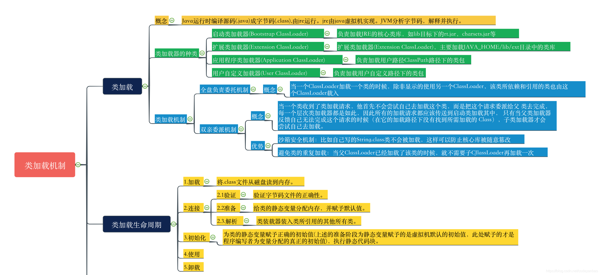
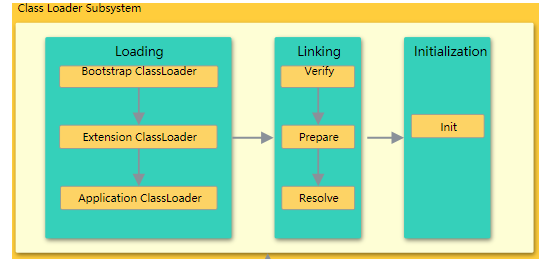
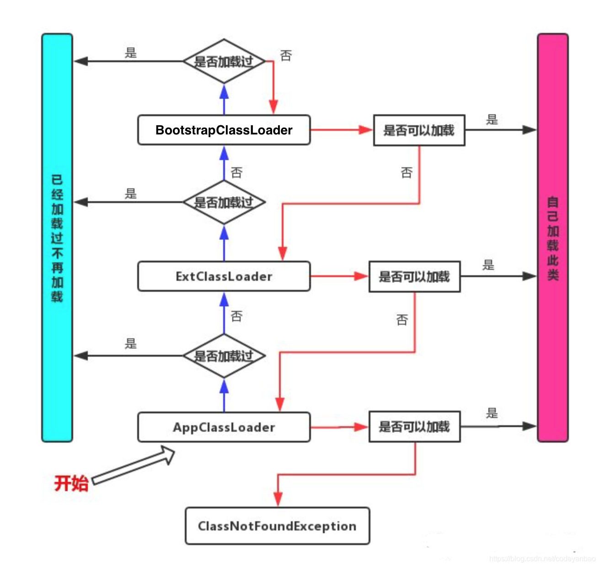

[TOC]
#类加载 



## 类加载的过程是什么样的？
### 类加载器
类加载器时Java运行时环境(Java Runtime Environment)的一部分，负责动态加载Java 类到Java 虚拟机的内存空间中。**类通常是按需加载，即第一次使用该类时才加载**。有了类加载器，Java运行时系统不需要文件与文件系统。 每个Java 类必须由每个类加载器装入到内存。



类加载器除了要定位和导入二进制class文件外，还必须负责验证被导入类的正确性，为变量分配初始化内存，以及帮助解析符号引用。这些动作必须严格按以下顺序完成：

1. **装载**：查找并装载类型的二进制数据。
2. **链接**：执行验证，准备以及解析(可选)--验证：确保被导入类型的正确性 --准备：为类变量分配内存，并将其初始化为默认值 --解析：把类型中的符号引用转换为直接引用

3. **初始化**：把类变量初始化正确的初始值。


####装载
**类加载器分类**
在Java虚拟机中存在多个类加载器，Java应用程序可以使用两种类加载器：
* **Bootstrap ClassLoader**：此装载器是Java虚拟机实现的一部分。由原生代码（如C语言编写），不继承自 ``` java.lang.ClassLoader```。负责加载核心Java库(java.lang.*等)，启动类装载器通常使用某种默认的方式从本地磁盘中加载类，包括Java API
* **Extention Classloader**:用来在```<JAVA_HOME>/jre/lib/ext``` , 或 java.ext.dirs 指明的目录中加载Java的扩展库，Java虚拟机的实现会提供一个扩展库目录。
* **Application Classloader**: 根据Java应用程序的类路径(java.class.path或CLASSPATH环境变量)来加载Java类。一般来说，Java 应用的类都是由它来完成加载的。 可以通过 **ClassLoader.getSystemClassLoader()** 来获取它。


**全盘负责双亲委托机制**
在一个JVM系统中，至少有3种类加载器，那么这些类加载器如何配合工作？在JVM种类加载器通过全盘负责和 **双亲委托机制** 来协调类加载器。
* **全盘负责**：指当一个```ClassLoader```装载一个类的时，除非显式地使用另一个 **ClassLoader** 该类所依赖及引用地类也由这个 ClassLoader 载入。
* **双亲委托机制**：指先委托父装载器寻找目标类，只有在找不到地情况下才从自己的类路径中查找并装载目标类。

全盘负责双亲委托机制只有Java推荐的机制，并不是强制的机制。实现自己的类加载器时，如果想保持双亲委派模型，就应该重写```findClass(name)```方法；如果想破坏双亲委派模型，可以重写```loadClass(name)```方法。


#####双亲委派机制的流程



#####为什么要用双亲委派机制
如果有人想要替换系统级别的类：String.java 。篡改它的实现，在这种机制下这些系统的类已经被Bootstrap classLoader加载过了（为什么？因为当一个类需要加载的时候，最先去尝试加载的就是BootstrapClassLoader），所以其他类加载器并没有机会再去加载，从一定程度上防止了危险代码的植入。

* 避免类的重复加载
* 保护程序安全，防止核心API被随意篡改


#### 链接

##### 验证
确认装载后的类型符合Java 语言的语义；并且不会危及虚拟机的完整性。
* 装载时验证：检查二进制数据以确保数据全部是预期格式，确保除Object以外的每个类都有父类
* 正式验证阶段：检查 final 类不能有子类、确保 final 方法不被覆盖、确保在类型和超类型之间没有不兼容的方法声明(比如拥有两个名字相同的方法，参数在数量、顺序、类型上都相同，但返回类型不同)。
* 符号引用的验证：当虚拟机搜寻一个被符号引用的元素(类型、字段或方法)时，必须首先确认该元素存在。如果虚拟机发现元素存在，则必须进一步检查引用类型有访问该元素的权限。

##### 准备
在准备阶段，Java虚拟机为类变量分配内存， **设置默认初始值**，但在到 初始化阶段之前，类变量都没有初始化真正的初始值。


##### 解析

解析的过程就是在类型的常量池总寻找类，接口，字段和方法的符号引用，**把这些符号引用替换为直接引用的**过程。

* 类或接口的解析：判断所要转化成的直接引用是数组类型，还是普通的对象类型的引用，从而进行不同的解析。
* 字段解析：对字段进行解析时，会现在本类中查找是否包含有简单名称和字段描述符都与目标相匹配的字段，如果有，则查找结束；如果没有，则会按照继承关系从上往下递归搜索该类所实现的各个接口和它们的父接口，还没有，则按照继承关系从上往下递归搜索其父类，直至查找结束。
  

####初始化
所有的类变量（即静态量）初始化语句和类型的静态初始化器都被Java编译器收集在一起，放到一个特殊的方法中，这个步骤就是 **初始化类静态变量和执行静态代码块**。对于类来说，这个方法被称作类初始化方法;对于接口来说，它被称为接口初始化方法。在类和接口的class文件中，这个方法被称为```<clinit>```。

1. 如果存在直接父类，且直接父类没有被初始化，先初始化直接父类。
2. 如果类存在一个类初始化方法，执行此方法。

这个步骤是递归执行的，第一个初始化的类一定是Object。
Java虚拟机必须确保初始化过程 被正确地同步。如果多个线程需要初始化一个类，仅仅允许一个线程来进行初始化，其他线程需等待。
> 这个特性可以用来写单例模式


Client
* 对于静态变量和静态初始化语句来说：执行地顺序和它们在类或接口中出现地顺序有关。
* 并非所有的类都需要在它们的class 文件中 拥有()方法，如果类没有申明任何类变量，也没有静态初始化语句，那么它就不会有```<clinit>()```方法。只有哪些需要执行Java代码来赋值的类才会有()
* final常量：Java虚拟机在使用它们的任何类的常量池或字节码中直接存放的是它们表示的常量池。


