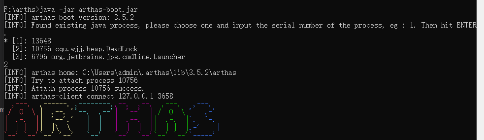
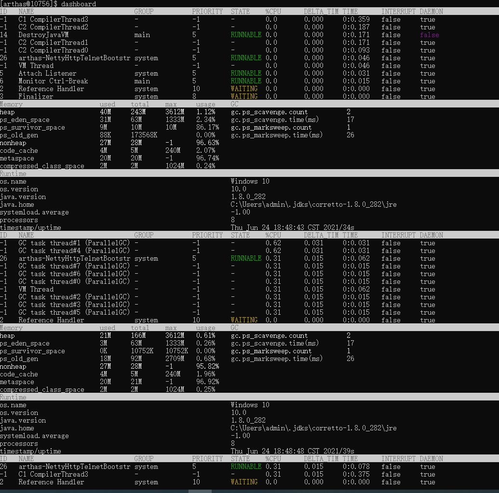
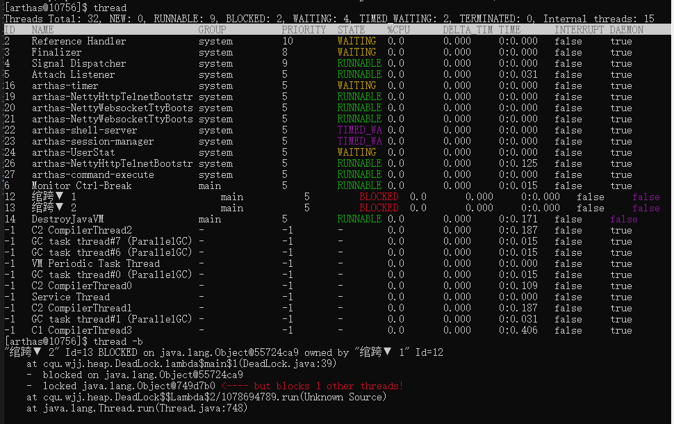

# Arthas

Arthas 是Alibaba开源的Java诊断工具，深受开发者喜爱。
Arthas用户文档：https://arthas.aliyun.com/doc/


## 启动arthas
下载：
```
java -jar arthas-boot.jar
```

启动arthas后会选择java进程，输入进程号就可以attach到目标进程上，并输出日志：



## 查看dashboard
输出 dashboard， 按回车/enter，会展示当前进程的信息，按ctrl+c可以中断执行。



这里可以查看哪个cpu使用率较高


## 通过thread 命令来获取到 进程的 main
* thread 命令可以看到进程中每个线程的状态，可以判断阻塞



* thread -n -3 可以展示当前最忙的前3个线程并打印堆栈

* thread -b 找出当前阻塞其他线程的线程


## 通过jad 来反编译Main Class
```shell
[arthas@10756]$ jad cqu.wjj.heap.DeadLock

ClassLoader:
+-sun.misc.Launcher$AppClassLoader@18b4aac2
  +-sun.misc.Launcher$ExtClassLoader@4aa1b4ce

Location:
/D:/IDEA/sort/sort/out/production/sort/

       /*
        * Decompiled with CFR.
        */
       package cqu.wjj.heap;

       public class DeadLock {
           private static Object resource1 = new Object();
           private static Object resource2 = new Object();

           public static void main(String[] args) {
               new Thread(() -> {
/*10*/             Object object = resource1;
                   synchronized (object) {
/*11*/                 System.out.println(Thread.currentThread() + "get resource1");
                       try {
/*14*/                     Thread.sleep(1000L);
                       }
                       catch (InterruptedException e) {
/*16*/                     e.printStackTrace();
                       }
/*18*/                 System.out.println(Thread.currentThread() + "waiting get resource2");
/*20*/                 Object object2 = resource2;
                       synchronized (object2) {
/*21*/                     System.out.println(Thread.currentThread() + "get resource2");
                       }
                   }
               }, "绾跨▼ 1").start();
               new Thread(() -> {
/*28*/             Object object = resource2;
                   synchronized (object) {
/*29*/                 System.out.println(Thread.currentThread() + "get resource2");
                       try {
/*32*/                     Thread.sleep(1000L);
                       }
                       catch (InterruptedException e) {
/*34*/                     e.printStackTrace();
                       }
/*36*/                 System.out.println(Thread.currentThread() + "waiting get resource1");
/*38*/                 Object object2 = resource1;
                       synchronized (object2) {
/*39*/                     System.out.println(Thread.currentThread() + "get resource1");
                       }
                   }
               }, "绾跨▼ 2").start();
           }
       }

Affect(row-cnt:1) cost in 809 ms.
```

## 7.退出arthas
使用quit 或者exit