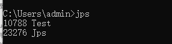
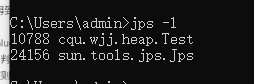
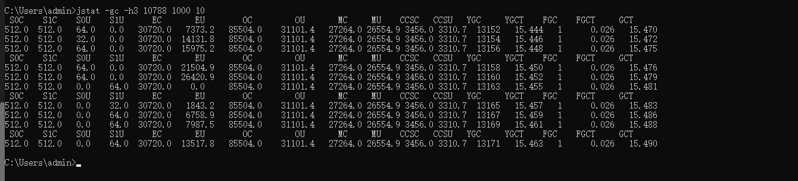
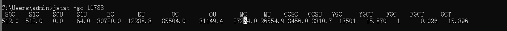
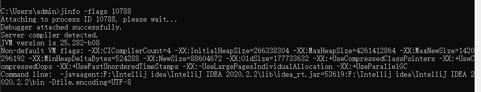
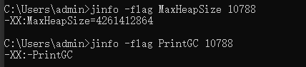
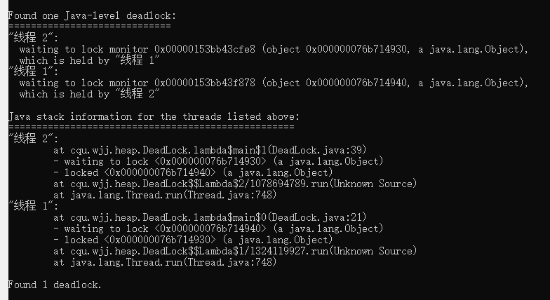
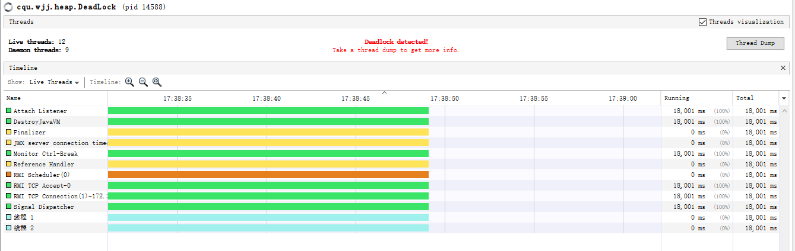

[toc]

# JVM监控与故障处理工具

给一个系统定位问题可以分析 **运行日志** ，**异常堆栈**，**GC日志**，**线程快照文件**，**堆转储快照**等内容。


## JDK的命令行工具


这些命令在JDK安装目录下的bin目录下：
|名称| 主要作用|
|--|--|
|jps|Jvm Process Status Tool,显示指定系统内所有的HotSpot虚拟机**进程**|
|jstat|Jvm Statistics Monitoring Tool,用于收集HotSpot**虚拟机各方面的运行数据**|
|jinfo|Configuration Info for Java,显示**虚拟机配置**信息|
|jmap|Memory Map for Java,生成虚拟机的**内存转储快照**（heapdump）文件|
|jhat|jvm Heap dump browser，用于**分析heapmap文件**，它会建立一个http/html 服务器让用户可以在浏览器上查看分析结果|
|jstack|Stack Trace for Java，显示虚拟机的**线程快照**|


### 1.jps 虚拟机进程状况工具
以列出正在运行的虚拟机进程，并显示虚拟机执行主类名称以及这些进程的本地虚拟机唯一ID。 看到ID之后就能定位到某个Java 应用，然后进行后续操作。jps命令格式：
jps [options] [hostid]
options 参数选项说明如下：
> -q # 不输出类名，jar名和传入main方法的参数
> -m # 输出传入main方法的参数
> -l # 输出main类或jar的全限名
> -v # 输出传入JVM的参数




* jps-l : 输出全类的全名，如果进程执行的jar包，输出jar路径。


* jps-v： 输出虚拟机进程启动时JVM参数

### 2. jstat 监视虚拟机各种运行状态信息
(1) 概述
jstat 是用于监视虚拟机各种运行状态信息的命令行工具。它可以显示本地或者远程虚拟机进程中的**类装载 、内存、垃圾回收、JIT编译**等运行数据，可以查看**堆内存各部分的使用量，以及加载类的数量**，在仅提供纯文本控制台环境的服务器上，它将是运行期 **定位虚拟机性能问题 的 首选工具**。 可以用于**内存分配调优，**需要用熟悉！

jstat的命令格式：
jstat [-命令选项] [vmid] [间隔时间(毫秒)] [查询次数]

常见的option 如下：
```
jstat -class vmid 		// 显示ClassLoader的相关信息
jstat -compiler vmid 	// 显示JIT编译的相关信息
jstat -gc vmid   		// 显示与GC相关的堆信息
jstat -gccapacity vmid 	// 显示整个堆内存的容量及使用情况
jstat -gcnew vmid 		// 显示新生代信息
jstat -gcnewcapcacity vmid 	// 显示新生代大小与使用情况
jstat -gcold vmid 		// 显示老年代和永久代的信息
jstat -gcoldcapacity vmid 	// 显示老年代的大小
jstat -gcpermcapacity vmid 	// 显示永久代大小
jstat -gcutil vmid 		// 显示垃圾收集信息
```

根据这些参数可以堆各个区参数进行查看，出来的参数大同小异。
例子 1：
```java
jstat -gc -h3 10788 1000 10
```


表示分析进程id 为 31736 的GC情况， 每隔 1000ms 打印依次记录，打印10次停止。


（2）垃圾回收统计
jstat -gc pid，可以评估程序内存使用及GC 压力整体情况，

* S0C：第一个幸存区的大小，单位 KB。
* S1C：第二个幸存区的大小。
* S0U：第一个幸存区的使用大小。
* S1U：第二个幸存区的使用大小。
* EC：伊甸园区的大小。
* EU：伊甸园区的使用大小。
* OC：老年代大小。
* OU：老年代使用大小。
* MC：方法区大小(元空间)。
* MU：方法区使用大小。
* CCSC：压缩类空间大小。
* CCSU：压缩类空间使用大小。
* YGC：年轻代垃圾回收**次数**，启动以来总共的次数。
* YGCT：年轻代垃圾回收消耗时间，单位 s，YGC 的**总时间**。
* FGC：老年代垃圾回收总次数。
* FGCT：老年代垃圾回收消耗时间，单位 s，FGC **总时间**。
* GCT：垃圾回收消耗总时间，单位 s，全部 GC 的**总时间**。


### 3. jinfo 实时查看与调整虚拟机各项参数

查看正在运行的Java 应用程序的扩展参数。
jinfo pid： 输出当前jvm进程的全部参数和系统属性
```
C:\Users\admin>jinfo 10788
Attaching to process ID 10788, please wait...
Debugger attached successfully.
Server compiler detected.
JVM version is 25.282-b08
Java System Properties:

java.runtime.name = OpenJDK Runtime Environment
java.vm.version = 25.282-b08
sun.boot.library.path = C:\Users\admin\.jdks\corretto-1.8.0_282\jre\bin
java.vendor.url = https://aws.amazon.com/corretto/
java.vm.vendor = Amazon.com Inc.
path.separator = ;
file.encoding.pkg = sun.io
java.vm.name = OpenJDK 64-Bit Server VM
sun.os.patch.level =
sun.java.launcher = SUN_STANDARD
user.script =
user.country = CN
user.dir = D:\IDEA\sort\sort
java.vm.specification.name = Java Virtual Machine Specification
java.runtime.version = 1.8.0_282-b08
java.awt.graphicsenv = sun.awt.Win32GraphicsEnvironment
os.arch = amd64
java.endorsed.dirs = C:\Users\admin\.jdks\corretto-1.8.0_282\jre\lib\endorsed
line.separator =

java.io.tmpdir = C:\Users\admin\AppData\Local\Temp\
java.vm.specification.vendor = Oracle Corporation
user.variant =
os.name = Windows 10
sun.jnu.encoding = GBK
java.library.path = C:\Users\admin\.jdks\corretto-1.8.0_282\bin;C:\WINDOWS\Sun\Java\bin;C:\WINDOWS\system32;C:\WINDOWS;C:\Program Files\NVIDIA GPU Computing Toolkit\CUDA\v10.1\lib\x64;C:\Program Files\NVIDIA GPU Computing Toolkit\CUDA\v10.1\libnvvp;C:\Windows\system32;C:\Windows;C:\Windows\System32\Wbem;C:\Windows\System32\WindowsPowerShell\v1.0\;C:\Windows\System32\OpenSSH\;F:\matlab2016\runtime\win64;F:\matlab2016\bin;F:\matlab2016\polyspace\bin;E:\MikTex\miktex\bin\;D:\ctex\CTeX;D:\ctex\CTeX\Packages\ctex\bin;D:\ctex\CTeX\Packages\cct\bin;D:\ctex\CTeX\Packages\ty\bin;C:\Program Files\dotnet\;E:\mingw64\bin;C:\Program Files\MySQL\MySQL Server 8.0\bin;C:\WINDOWS\system32;C:\WINDOWS;C:\WINDOWS\System32\Wbem;C:\WINDOWS\System32\WindowsPowerShell\v1.0\;C:\WINDOWS\System32\OpenSSH\;C:\Program Files (x86)\NVIDIA Corporation\PhysX\Common;C:\Program Files\NVIDIA Corporation\Nsight Compute 2019.4.0\;D:\maven\apache-maven-3.6.3-bin\apache-maven-3.6.3\\bin;E:\xshell\;E:\ftp\;C:\Program Files\Docker\Docker\resources\bin;C:\ProgramData\DockerDesktop\version-bin;D:\texliva\texlive\2020\bin\win32;C:\Program Files\MySQL\MySQL Shell 8.0\bin\;F:\Anaconda;F:\Anaconda\Library\mingw-w64\bin;F:\Anaconda\Library\usr\bin;F:\Anaconda\Library\bin;F:\Anaconda\Scripts;C:\Users\admin\AppData\Local\Microsoft\WindowsApps;F:\Pycharm\PyCharm Community Edition 2019.1.3\bin;F:\VS_code\Microsoft VS Code\bin;C:\Users\admin\AppData\Local\GitHubDesktop\bin;C:\Program Files\NVIDIA Corporation\NVSMI;E:\MiKTeX\miktex\bin\;C:\Users\admin\AppData\Local\Programs\MiKTeX 2.9\miktex\bin\x64\;C:\Users\admin\AppData\Local\Programs\MiKTeX 2.9\miktex\bin\;F:\pycharm_professional\PyCharm 2020.1\bin;;C:\Users\admin\AppData\Local\Microsoft\WindowsApps;F:\Intellij idea\IntelliJ IDEA 2020.2.2\bin;;F:\Intellij idea\IntelliJ IDEA 2020.2.2\jbr\bin;F:\Intellij idea\IntelliJ IDEA 2020.2.2\jbr\jre\bin;;.
sun.nio.ch.bugLevel =
java.specification.name = Java Platform API Specification
java.class.version = 52.0
sun.management.compiler = HotSpot 64-Bit Tiered Compilers
os.version = 10.0
user.home = C:\Users\admin
user.timezone = Asia/Shanghai
java.awt.printerjob = sun.awt.windows.WPrinterJob
file.encoding = UTF-8
java.specification.version = 1.8
user.name = admin
java.class.path = C:\Users\admin\.jdks\corretto-1.8.0_282\jre\lib\charsets.jar;C:\Users\admin\.jdks\corretto-1.8.0_282\jre\lib\ext\access-bridge-64.jar;C:\Users\admin\.jdks\corretto-1.8.0_282\jre\lib\ext\cldrdata.jar;C:\Users\admin\.jdks\corretto-1.8.0_282\jre\lib\ext\dnsns.jar;C:\Users\admin\.jdks\corretto-1.8.0_282\jre\lib\ext\jaccess.jar;C:\Users\admin\.jdks\corretto-1.8.0_282\jre\lib\ext\jfxrt.jar;C:\Users\admin\.jdks\corretto-1.8.0_282\jre\lib\ext\localedata.jar;C:\Users\admin\.jdks\corretto-1.8.0_282\jre\lib\ext\nashorn.jar;C:\Users\admin\.jdks\corretto-1.8.0_282\jre\lib\ext\sunec.jar;C:\Users\admin\.jdks\corretto-1.8.0_282\jre\lib\ext\sunjce_provider.jar;C:\Users\admin\.jdks\corretto-1.8.0_282\jre\lib\ext\sunmscapi.jar;C:\Users\admin\.jdks\corretto-1.8.0_282\jre\lib\ext\sunpkcs11.jar;C:\Users\admin\.jdks\corretto-1.8.0_282\jre\lib\ext\zipfs.jar;C:\Users\admin\.jdks\corretto-1.8.0_282\jre\lib\jce.jar;C:\Users\admin\.jdks\corretto-1.8.0_282\jre\lib\jfr.jar;C:\Users\admin\.jdks\corretto-1.8.0_282\jre\lib\jfxswt.jar;C:\Users\admin\.jdks\corretto-1.8.0_282\jre\lib\jsse.jar;C:\Users\admin\.jdks\corretto-1.8.0_282\jre\lib\management-agent.jar;C:\Users\admin\.jdks\corretto-1.8.0_282\jre\lib\resources.jar;C:\Users\admin\.jdks\corretto-1.8.0_282\jre\lib\rt.jar;D:\IDEA\sort\sort\out\production\sort;F:\Intellij idea\IntelliJ IDEA 2020.2.2\lib\idea_rt.jar
java.vm.specification.version = 1.8
sun.arch.data.model = 64
sun.java.command = cqu.wjj.heap.Test
java.home = C:\Users\admin\.jdks\corretto-1.8.0_282\jre
user.language = zh
java.specification.vendor = Oracle Corporation
awt.toolkit = sun.awt.windows.WToolkit
java.vm.info = mixed mode
java.version = 1.8.0_282
java.ext.dirs = C:\Users\admin\.jdks\corretto-1.8.0_282\jre\lib\ext;C:\WINDOWS\Sun\Java\lib\ext
sun.boot.class.path = C:\Users\admin\.jdks\corretto-1.8.0_282\jre\lib\resources.jar;C:\Users\admin\.jdks\corretto-1.8.0_282\jre\lib\rt.jar;C:\Users\admin\.jdks\corretto-1.8.0_282\jre\lib\sunrsasign.jar;C:\Users\admin\.jdks\corretto-1.8.0_282\jre\lib\jsse.jar;C:\Users\admin\.jdks\corretto-1.8.0_282\jre\lib\jce.jar;C:\Users\admin\.jdks\corretto-1.8.0_282\jre\lib\charsets.jar;C:\Users\admin\.jdks\corretto-1.8.0_282\jre\lib\jfr.jar;C:\Users\admin\.jdks\corretto-1.8.0_282\jre\classes
java.vendor = Amazon.com Inc.
file.separator = \
java.vendor.url.bug = https://github.com/corretto/corretto-8/issues/
sun.io.unicode.encoding = UnicodeLittle
sun.cpu.endian = little
sun.desktop = windows
sun.cpu.isalist = amd64

//JVM参数
VM Flags:
Non-default VM flags: -XX:CICompilerCount=4 -XX:InitialHeapSize=266338304 -XX:MaxHeapSize=4261412864 -XX:MaxNewSize=1420296192 -XX:MinHeapDeltaBytes=524288 -XX:NewSize=88604672 -XX:OldSize=177733632 -XX:+UseCompressedClassPointers -XX:+UseCompressedOops -XX:+UseFastUnorderedTimeStamps -XX:-UseLargePagesIndividualAllocation -XX:+UseParallelGC
Command line:  -javaagent:F:\Intellij idea\IntelliJ IDEA 2020.2.2\lib\idea_rt.jar=53619:F:\Intellij idea\IntelliJ IDEA 2020.2.2\bin -Dfile.encoding=UTF-8
```

* jinfo -flags pid： 单独查看JVM参数。

* jinfo -flag name vmid：输出对应名称的参数的具体值。 比如输出MaxHeapSize，查看当前JVM进程是否开启打印GC日志(-XX:PrintGCDetails:详细GC日志模式，这两个都是默认关闭的)。



### 4.jmap 生成堆转储快照

* 查看实例个数与占用内存的大小。
* 堆信息。
* 堆内存dump文件。
  
  jmap命令用于生成==堆转储快照==。jmap 的作用不仅仅为了获取dump文件，它还可以执行finalize执行队列，Java堆和永久代的详细信息。 如空间使用率，当前用的是哪种收集器等。

  jmap的命令格式：
  jmap [option] vmid

  先用jps获取正在运行的进程号


（1） 获取堆转储文件
**实例**：将指定应用程序的堆快照输出到桌面。后面可以通过jhat，Visual VM 等工具分析该堆文件。

```
C:\Users\admin>jmap -dump:format=b,file=C:\Users\admin\Desktop\heap.hprof 23736
Dumping heap to C:\Users\admin\Desktop\heap.hprof ...
Heap dump file created

```

Sun JDK 提供 jhat 与 jmap 搭配使用，来分析 dump 生成的堆快照。jhat 内置了一个微型的 HTTP/HTML 服务器，生成 dump 文件的分析结果后，可以在浏览器中查看。访问 http://localhost:7000/ 即可。

C:\Users\Nano>jhat C:\Users\SnailClimb\Desktop\heap.hprof
Reading from C:\Users\SnailClimb\Desktop\heap.hprof...
Dump file created Sat May 04 12:30:31 CST 2019
Snapshot read, resolving...
Resolving 131419 objects...
Chasing references, expect 26 dots..........................
Eliminating duplicate references..........................
Snapshot resolved.
Started HTTP server on port 7000
Server is ready.


可以用visual vm 工具导入dump文件分析


（2）查看实例个数与占用内存大小
主要使用 -histo 参数 **查看实例个数与占用内存大小**。


（3）自动生成dump文件
可以设置内存溢出自动导出dump文件（内存很大的时候，可能会导不出来）
-XX:+HeapDumpOnOutOfMemoryError
-XX:HeapDumpPath=./ （路径）

### 5.jstack 生成虚拟机当前时刻的线程快照
jstack命令用于生成虚拟机当前线程的线程快照。线程快照就是当前虚拟机内每一条线程正在执行的方法堆栈集合，生成线程快照的主要目的是定位线程出现长时间==停顿==的原因，如**线程死锁，死循环，请求外部资源导致长时间**等待等。线程出现停顿的时候通过jstack 来查看各个线程的调用堆栈，就可以直到没有响应的线程在后台做什么事情。

jstack 命令格式：
jstack [option] vmid(进程号)

(1) 死锁分析
下面是一个线程死锁的代码。通过jstack 命令进行死锁检查，输出死锁信息，找到发生死锁的线程。
```java
public class DeadLockDemo {
    private static Object resource1 = new Object();	// 资源 1
    private static Object resource2 = new Object();	// 资源 2

    public static void main(String[] args) {
        new Thread(() -> {
            // 锁定资源1
            synchronized (resource1) {
                System.out.println(Thread.currentThread() + "get resource1");
                try {
                    // 睡眠等待
                    Thread.sleep(1000);
                } catch (InterruptedException e) {
                    e.printStackTrace();
                }
                System.out.println(Thread.currentThread() + "waiting get resource2");
                // 请求资源2
                synchronized (resource2) {
                    System.out.println(Thread.currentThread() + "get resource2");
                }
            }
        }, "线程 1").start();

        new Thread(() -> {
            // 锁定资源1
            synchronized (resource2) {
                System.out.println(Thread.currentThread() + "get resource2");
                try {
                    // 睡眠等待
                    Thread.sleep(1000);
                } catch (InterruptedException e) {
                    e.printStackTrace();
                }
                System.out.println(Thread.currentThread() + "waiting get resource1");
                // 请求资源2
                synchronized (resource1) {
                    System.out.println(Thread.currentThread() + "get resource1");
                }
            }
        }, "线程 2").start();
    }
}

```

两个线程互相等待资源，造成死锁。输出：
Thread[线程 1,5,main]get resource1
Thread[线程 2,5,main]get resource2
Thread[线程 2,5,main]waiting get resource1
Thread[线程 1,5,main]waiting get resource2


**通过jstack 命令分析**：
第一步，确认进程号
```
C:\Users\admin>jps
10788 Test
7412
1896 Launcher
25192 Main
14588 DeadLock
17500 Jps
```

查看指定进程号的线程快照
```
jstack 14588
```



同样的visualVM 可以检测到死锁



（2）jstack 找出占用cpu最多的线程，从而找到是哪里的代码除了问题
1.使用命令 top -p <pid> ，显示 Java 进程的内存情况，PID 是 Java 进程号，比如 4977。
2.按 H，获取每个线程的内存情况。
3.找到内存和 CPU 占用最高的线程 PID，比如 4977。
4.转为十六进制得到 0x1371，此为线程 id 的十六进制表示。
执行 jstack 4977|grep -A 10 1371，得到线程堆栈信息中 1371 这个线程所在行的后面 10 行。
5.查看对应的堆栈信息找出可能存在问题的代码


## 堆转储
1. 什么是堆转储
Heap Dump 也叫堆转储文件，是一个Java进程在某个时间点上的内存快照。不过总体上 Heap Dump在触发快照的时候都保存了Java 对象和类的信息。通常在 写 Heap Dump文件前会触发一次 Full GC，所以 Heap Dump 文件中保存的是Full GC 后留下的对象信息。


2. 堆转储的用途
一般在Heap Dump 文件中可以获取到如下信息：
* **对象信息**：类，成员变量，直接量以及引用值
* **类信息**：类加载器，名称，超类，静态成员。
* **Garbage Collections Roots**:JVM可达的对象。
* **线程栈以及本地变量**： 获取快照时的线程栈信息，以及局部变量的详细信息。

因此可以分析如下原因：
* 找出**内存泄漏**的原因。
* 找出重复引用的jar或类
* 分析**集合**的使用
* 分析**类加载器**

3. 获取堆转储文件
jmap -dump：format=b, file=<filename.hprof><pid>