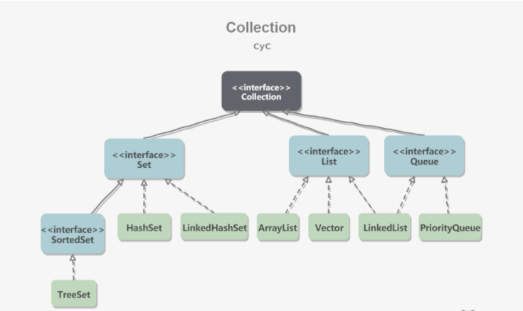

# Java 容器

## 一. 概览

容器主要包括Collection 和 Map 两种， Collection 存储着对象的集合，而Map存储着键值对的（两个对象）的映射表

### Collection



#### 1. Set
* TreeSet: 基于红黑树实现，支持有序性操作，例如根据一个范围查找元素的操作，但是查找效率不如HashSet，HashSet 查找的事件复杂度为 O(1),TreeSet则为O(logN)。
* HashSet：基于哈希表实现，支持快速查找，但不支持有序性操作。并且失去了元素的插入顺序信息，也就是说使用Iterator 遍历HashSet得到的结果是不确定的，
* LinkedHashSet： 具有HashSet的查找效率，并且内部使用双向链表维护元素的插入顺序


#### 2. List
* ArrayList：基于动态数组实现，支持随机访问
* Vector: 和ArrayList类似，但它是线程安全的
* LinkedList：基于双向链表实现，只能顺序访问，但是可以快速地在链表中间插入和删除元素。不仅如此，LinkedList还可以用作栈，队列和双向队列。


#### 3. Queue
* LinkedList：可以用它来实现双向队列
* PriorityQueue: 基于堆结构实现，可以用它来实现优先队列。


### Map

* TreeSet: 基于红黑树实现。
* HashMap：基于哈希表实现。
* HashTable：和HashMap类似，但它是线程安全的，这意味着同一时刻多个线程同时写入HashTable不会导致数据不一致。它是遗留类，不应该去使用它，而是使用ConcurrentHashMap 来支持线程安全，ConcurrentHashMap 的效率会更高，因为ConcurrentHashMap 引入了分段锁。
* LinkedHashMap：使用双向链表来维护元素的顺序，顺序为插入顺序或者最近最少使用(LRU)顺序。


## 容器类别

### 1. 普通容器类
* List: List 接口存储一组不唯一（可以有多个元素引用相同的对象），存储**有序**的对象。
* Set: 不允许重复的集合，不会有多个元素引用相同的对象。
* Map: 使用键值对存储。Map 会维护与Key有关联的值。两个Key可以引用相同的对象，但Key不能重复，典型的Key是String 类型，但也可能是任何对象。


### 2. 同步容器类

同步容器类就是将方法通过synchronized 修饰达到线程安全的类。这些类实现线程安全的方式多半是加锁而仅仅只实现同步。

常见的同步容器类：
* Vector(implements List)
* Hashtable(implements Map)
* Stack(extends Vector)
* Collection.synchronizedXxxx 。


####同步容器类存在两个问题，
1. 复合操作需要加锁
```java
public static Object getLast(Vector list) {
    int lastIndex = list.size() - 1;
    return list.get(lastIndex);
}

public static void deleteLast(Vector list) {
    int lastIndex = list.size() - 1;
    list.remove(lastIndex);
}

```
例如在上面这个函数中。尽管vecotr是线程安全的，但是size()方法与获取/删除之间没有锁保护，当获得Vector大小之后，如果另外一个线程删除了Vector末尾的元素，则每个函数的最后一句代码将报错

2. 同步容器将所有对容器状态的访问都串行化，以实现他们的线程安全性，然而这种操作严重降低并发性。


### 3.并发容器类
并发容器类可以改进同步容器类的性能，并发容器类主要是JUC下面的一些容器类，可以实现线程安全。同时性能也不错。

常见的有：
* CopyOnWriteArrayList
* ConcurrentHashMap