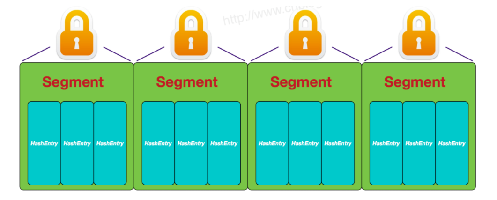
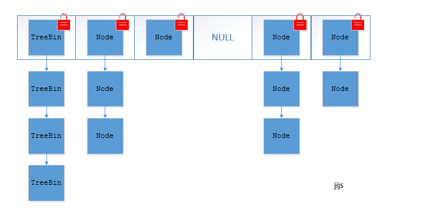
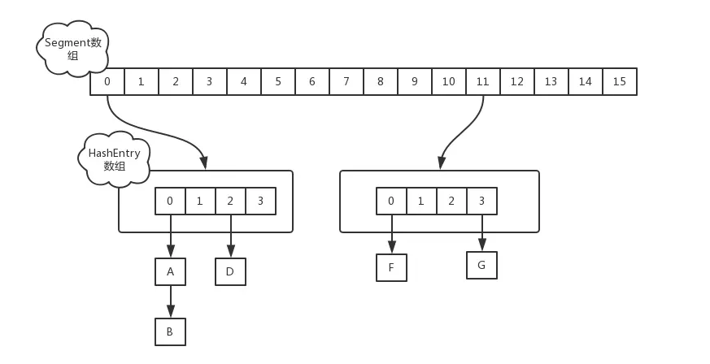
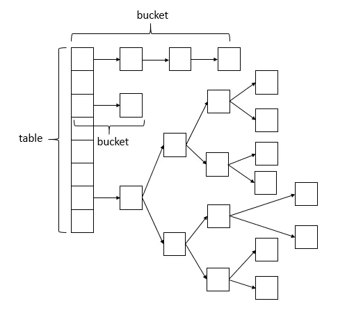

[toc]

# 并发容器ConcurrentHashMap


##  概念

HashMap 是线程**不安全**的。可以使用**同步容器**来保证线程安全，如Hashtable 或者Collections.synchronizedMap, 都是所有涉及到多线程操作的都加上了synchronized关键字来锁住整个table，性能**低下**。

其实 同步容器 有很多的优化空间，锁住整个table 这种全表锁的方式过于粗暴，比如在多线程的环境下，对不同数据集进行操作时其实根本就不需要去竞争同一个锁，因为他们hash值不同，不会因为rehash 造成线程不安全，所以互不影响，这就是**锁分离技术**，将**锁的粒度降低**，利用**多个锁**来控制多个table。

ConcurrentHashMap 就体现了这种思想，它同样实现了Map 接口，也是基于哈希表实现。

### 特点

* 并发安全，支持高并发，读操作完全并行，写操作 ==一定程度==并行。
* 直接支持一些原子符合操作。
* 与同步容器相比，迭代不需要加锁。
* 具有弱一致性。


### 内部实现与结构


JDK1.8 的ConcurrentHashMap (==TreeBin==: 红黑二叉树结点 ==Node==:普通链表节点)：



##源码分析

### jdk1.7
jdk1.7中， ConcurrentHashMap 的数据结构是由一个**Segment 数组**和多个**HashEntry数组**构成。这种结构会经历两次哈希计算。


Segment 数组的意义就是将一个大的 table 分割成多个小的 table 来进行加锁，也就是前面提到的锁分离技术，而每一个 Segment 元素存储的是 HashEntry 数组 + 链表，这个和 HashMap 的数据存储结构一样。
```java
static final class HashEntry<K, V> {
    final int hash;
    final K key;
    volatile V value;
    volatile HashEntry<K, V> next;
}
```
ConcurrentHashMap 和 HashMap 实现上类似，最主要的差别是 ConcurrentHashMap 采用了==分段锁（Segment）==，每个分段锁维护着几个桶（HashEntry），多个线程可以同时访问==不同分段锁==上的桶，从而使其并发度更高（最大并发度就是 Segment 的个数，Segment 个数的线程可以同时访问）。将数据分为多个段，每个段有一个独立的锁，每个段相当于一个独立的哈希表。

采用分段技术，可以大大提高并发度，多个段之间可以**并行读写**。默认段是 16 个。实现的效果是读操作可以并行，对于写操作需要获取锁，不能并行。

### jdk1.8
而基于Java8， jdk1.8的实现已经摒弃了Segment的概念，而是直接用 ==Node 数组+链表+红黑树==的数据结构来实现，并发控制使用==Synchronized 和 CAS==来操作，整个看起来就像是优化过且线程安全的HashMap。


说明：ConcurrentHashMap的数据结构(==数组+链表+红黑树==)，同种的结构可能是链表，也可能是红黑树，红黑树是为了提高查找效率。


### 源码解析
ConcurrentHashMap 源码解析：https://www.jianshu.com/p/865c813f2726


## 总结
synchronized 只锁定当前链表或红黑树的首节点，这样只要hash不冲突，就不会产生并发。

jdk1.8 使用了==CAS操作==来支持更高的并发度，在CAS操作失败时使用内置锁synchronized。不再使用分段锁！并且JDK1.8 的实现也在链表过长时会转换为红黑树。