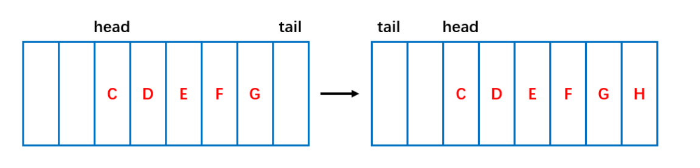
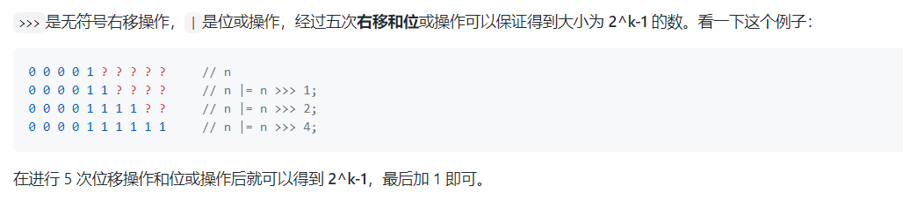
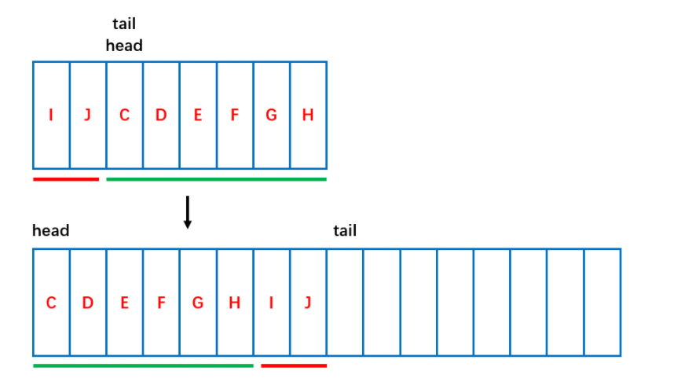

[TOC]


# ArrayDeque


## 基础

* ArrayDeque 实现了 Deque接口，可用于**队列 ， 双端队列， 栈**等。当作栈使用效率要高于Stack； 作为队列 使用时，效率也比基于双向链表的LinkedList要好一些。

* ArrayDeque 内部采用**环形动态数组**进行数据存储，但是要求**数组元素个数为2的幂次方**个，这样可以实现**环形索引**，更加高效。数组容量不够也会进行**自动扩容**，扩容时元素会**复制重排**放在环形数组的前面部分位置。

* ArrayDeque 不支持 值为**null**的元素
* ArrayDeque 在**迭代**时**检查并发修改并没有使用**类似于ArrayList 等容器中使用的modCount，而是通过**尾部索引**来确定的。这样有可能检查不到。


## ArrayDeque 源码分析
ArrayDeque 实现了Deque接口中的所有方法。ArrayDeque 会根据需求 自动扩充容量，因而在插入元素的时候不会抛出IllegalStateException 异常。

### 1. 基本属性
```java
// 用数组存储元素
transient Object[] elements; // non-private to simplify nested class access
// 头部元素的索引
transient int head;
// 尾部下一个将要被加入的元素的索引
transient int tail;
// 最小容量，必须为2的幂次方
private static final int MIN_INITIAL_CAPACITY = 8;

```

ArrayDeque 底部也是使用**数组**存储元素，同时还使用了head 和**tail 两个索引**来记录当前数组的**使用状态**。head 是头部元素的索引，但注意tail 不是尾部元素的索引，而是**尾部元素的下一位**，即**下一个**将要被加入的元素位置的索引。



### 2. 初始化
ArrayDeque 提供了三个构造方法，默认容量为16，也可指定容量。
```java

    /**
     * Constructs an empty array deque with an initial capacity
     * sufficient to hold 16 elements.
     */
    public ArrayDeque() {
        elements = new Object[16];
    }

    /**
     * Constructs an empty array deque with an initial capacity
     * sufficient to hold the specified number of elements.
     *
     * @param numElements  lower bound on initial capacity of the deque
     */
    public ArrayDeque(int numElements) {
        allocateElements(numElements);
    }

    /**
     * Constructs a deque containing the elements of the specified
     * collection, in the order they are returned by the collection's
     * iterator.  (The first element returned by the collection's
     * iterator becomes the first element, or <i>front</i> of the
     * deque.)
     *
     * @param c the collection whose elements are to be placed into the deque
     * @throws NullPointerException if the specified collection is null
     */
    public ArrayDeque(Collection<? extends E> c) {
        allocateElements(c.size());
        addAll(c);
    }
```
ArrayDeque 对**数组的大小**(即队列的容量)有特殊的要求，==必须是 2^n（2 的幂次方）==。传入的容量就算不是 2 的幂次方时也会被 allocateElements 方法修改为 2 的幂次方。
```java
private void allocateElements(int numElements) {
    int initialCapacity = MIN_INITIAL_CAPACITY;
    // Find the best power of two to hold elements.
    // Tests "<=" because arrays aren't kept full.
    if (numElements >= initialCapacity) {
        initialCapacity = numElements;
        initialCapacity |= (initialCapacity >>>  1);
        initialCapacity |= (initialCapacity >>>  2);
        initialCapacity |= (initialCapacity >>>  4);
        initialCapacity |= (initialCapacity >>>  8);
        initialCapacity |= (initialCapacity >>> 16);
        initialCapacity++;
        if (initialCapacity < 0)   // Too many elements, must back off
            initialCapacity >>>= 1;// Good luck allocating 2 ^ 30 elements
    }
    elements = new Object[initialCapacity];
}
```



### 3. 添加元素
向末尾添加元素：
```java
public void addLast(E e) {
    if (e == null)
        throw new NullPointerException();
    // tail中保存的是即将加入末尾的元素的索引
    elements[tail] = e;
    // tail向后移动一位
    // 把数组当作环形的，越界后到0索引
    if ( (tail = (tail + 1) & (elements.length - 1)) == head)
        // tail和head相遇，空间用尽需要扩容
        doubleCapacity();
}
```
```java
length = 2^n，二进制表示为: 第 n 位为1，低位 (n-1位) 全为0 
length - 1 = 2^n - 1，二进制表示为：低位(n-1位)全为1

如果 tail + 1 <= length - 1，则位与后低 (n-1) 位保持不变，高位全为0
如果 tail + 1 = length，则位与后低 n 全为0，高位也全为0，结果为 0
```

向头部添加元素的代码如下：
```java
public void addFirst(E e) {
    if (e == null) // 不支持值为null的元素
        throw new NullPointerException();
    elements[head = (head - 1) & (elements.length - 1)] = e;
    if (head == tail)
        doubleCapacity();
}
```
可见在容量保证为2^n的情况下 ，仅通过**位与**操作就可以完成==环形索引== 的计算，而不需要进行边界的判断，实现上更为高效。

向头部添加元素的代码如下:
```java
public void addFirst(E e) {
    if (e == null) // 不支持值为null的元素
        throw new NullPointerException();
    elements[head = (head - 1) & (elements.length - 1)] = e;
    if (head == tail)
        doubleCapacity();
}
```
其它的诸如add， offer， offerFirst，offerLast 等方法都是基于上面这两个方法实现的。

#### 4. 扩容
在每次添加元素后如果**头索引和尾部索引**相遇，则说明数组空间**已满**需要进行**扩容**。 ArrayDeque 每次扩容都会在原有的容量上**翻倍**，这也是保证数组容量必须是 **2 的幂次方**。如下图所示，扩容后会复制内容，复制后原数组内容被重排到新数组首部，并将 head 放在**第一个**位置。



```java
private void doubleCapacity() {
    assert head == tail; // 扩容时头部索引和尾部索引肯定相等
    int p = head;
    int n = elements.length;
    // 头部索引到数组末端(length-1处)共有多少元素
    int r = n - p; // number of elements to the right of p
    // 容量翻倍
    int newCapacity = n << 1;
    // 容量过大，溢出了
    if (newCapacity < 0)
        throw new IllegalStateException("Sorry, deque too big");
    // 分配新空间
    Object[] a = new Object[newCapacity];
    // 复制头部索引到数组末端的元素到新数组的头部
    System.arraycopy(elements, p, a, 0, r);
    // 复制其余元素
    System.arraycopy(elements, 0, a, r, p);
    elements = a;
    // 重置头尾索引
    head = 0;
    tail = n;
}
```

#### 5. 移除元素
ArrayDeque 支持从头尾两端移除元素，remove 方法是通过poll实现的。因为是基于数组的。

```java
public E pollFirst() {
    int h = head;
    @SuppressWarnings("unchecked")
    E result = (E) elements[h];
    // Element is null if deque empty
    if (result == null)
        return null;
    elements[h] = null;     // Must null out slot
    head = (h + 1) & (elements.length - 1);
    return result;
}

public E pollLast() {
    int t = (tail - 1) & (elements.length - 1);
    @SuppressWarnings("unchecked")
    E result = (E) elements[t];
    if (result == null)
        return null;
    elements[t] = null;
    tail = t;
    return result;
}

```

#### 6.获取队头和队尾的元素
```java
@SuppressWarnings("unchecked")
public E peekFirst() {
    // elements[head] is null if deque empty
    return (E) elements[head];
}

@SuppressWarnings("unchecked")
public E peekLast() {
    return (E) elements[(tail - 1) & (elements.length - 1)];
}
```


#### 7. 迭代器
ArrayDeque 在**迭代**时检查并发修改并没有使用类似于 ArrayList 等容器中使用的 **modCount**，而是通过尾部索引来确定的。具体参考 next 方法中的注释。但是这样**不一定**能保证检测到所有的并发修改情况，如果先**移除了尾部元素**之后又添加了一个**尾部元素**，这种情况下迭代器是没法检测出来的（类似 ABA 问题）。
```java
private class DeqIterator implements Iterator<E> {
    /**
     * Index of element to be returned by subsequent call to next.
     */
    private int cursor = head;

    /**
     * Tail recorded at construction (also in remove), to stop
     * iterator and also to check for comodification.
     */
    private int fence = tail;

    /**
     * Index of element returned by most recent call to next.
     * Reset to -1 if element is deleted by a call to remove.
     */
    private int lastRet = -1;

    public boolean hasNext() {
        return cursor != fence;
    }

    public E next() {
        if (cursor == fence)
            throw new NoSuchElementException();
        @SuppressWarnings("unchecked")
        E result = (E) elements[cursor];
        // This check doesn't catch all possible comodifications,
        // but does catch the ones that corrupt traversal
        // 如果移除了尾部元素，会导致tail != fence
        // 如果移除了头部元素，会导致 result == null
        if (tail != fence || result == null)
            throw new ConcurrentModificationException();
        lastRet = cursor;
        cursor = (cursor + 1) & (elements.length - 1);
        return result;
    }

    public void remove() {
        if (lastRet < 0)
            throw new IllegalStateException();
        if (delete(lastRet)) { // if left-shifted, undo increment in next()
            cursor = (cursor - 1) & (elements.length - 1);
            fence = tail;
        }
        lastRet = -1;
    }

    public void forEachRemaining(Consumer<? super E> action) {
        Objects.requireNonNull(action);
        Object[] a = elements;
        int m = a.length - 1, f = fence, i = cursor;
        cursor = f;
        while (i != f) {
            @SuppressWarnings("unchecked") E e = (E)a[i];
            i = (i + 1) & m;
            if (e == null)
                throw new ConcurrentModificationException();
            action.accept(e);
        }
    }
}
```