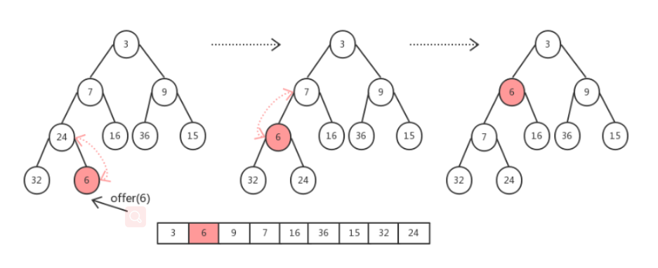

[toc]
# PriorityQueue


## 基础

* PriorityQueue 优先级队列，实现了队列接口Queue，每个元素都有优先级，对头的元素永远都是优先级最高的。 （采用建堆的思路，对每次插入的元素根据默认的自然排序或者通过提供的Comparator 建堆）

* 线程安全： PriorityQueue 也是线程不安全的


## 基本使用
PriorityQueue 使用跟 普通队列 一样，唯一区别是PriorityQueue 会根据 排序规则决定谁在队头。 使用方式如下：
```java
// 自定义比较器，降序排列
static Comparator<Integer> cmp = new Comparator<Integer>() {
    public int compare(Integer e1, Integer e2) {
        return e2 - e1;
    }
};
public static void main(String[] args) {
    // 不用比较器，默认升序排列
    Queue<Integer> q = new PriorityQueue<>();
    q.add(3);
    q.add(2);
    q.add(4);
    while(!q.isEmpty()) {
        System.out.print(q.poll()+" "); // 2 3 4 
    }

    // 使用自定义比较器，降序排列
    Queue<Integer> qq = new PriorityQueue<>(cmp);
    qq.add(3);
    qq.add(2);
    qq.add(4);
    while(!qq.isEmpty()) {
        System.out.print(qq.poll()+" "); // 4 3 2 
    }
}
```


## 源码分析


```java
public class PriorityQueue<E> extends AbstractQueue<E>
    implements java.io.Serializable {

    private static final long serialVersionUID = -7720805057305804111L;

    private static final int DEFAULT_INITIAL_CAPACITY = 11;

    /**
     * Priority queue represented as a balanced binary heap: the two
     * children of queue[n] are queue[2*n+1] and queue[2*(n+1)].  The
     * priority queue is ordered by comparator, or by the elements'
     * natural ordering, if comparator is null: For each node n in the
     * heap and each descendant d of n, n <= d.  The element with the
     * lowest value is in queue[0], assuming the queue is nonempty.
     */
    transient Object[] queue; // non-private to simplify nested class access

    /**
     * The number of elements in the priority queue.
     */
    private int size = 0;

    /**
     * The comparator, or null if priority queue uses elements'
     * natural ordering.
     */
    private final Comparator<? super E> comparator;

    /**
     * The number of times this priority queue has been
     * <i>structurally modified</i>.  See AbstractList for gory details.
     */
    transient int modCount = 0; // non-private to simplify nested class access
```
PriorityQueue 内部也是使用数组存储元素的（用于实现堆结构），而且也有记录结构性变化的 modCount 变量，不过这是自己定义的了，不像 ArrayList 是继承而来的。


### 2. 初始化
有很多个重载构造方法，可以传入**数组大小**、**比较器**，以及 Collection 对象等参数。利用 Collection 对象**构造堆**后面详述。
```java
public PriorityQueue() {
    this(DEFAULT_INITIAL_CAPACITY, null);
}

public PriorityQueue(int initialCapacity) {
    this(initialCapacity, null);
}

public PriorityQueue(int initialCapacity, Comparator<? super E> comparator) {
    // Note: This restriction of at least one is not actually needed,
    // but continues for 1.5 compatibility
    if (initialCapacity < 1)
        throw new IllegalArgumentException();
    this.queue = new Object[initialCapacity];
    this.comparator = comparator;
}
```

### 3.添加元素

队列的添加元素有两种，add和offer。
```java
public boolean add(E e) {
    return offer(e);
}
```

其内部调用offer 方法。
```java
public boolean offer(E e) {
    if (e == null)
        throw new NullPointerException();
    // 添加属于修改操作
    modCount++;
    // 获取当前元素个数
    int i = size;
    // 如果数组不够了则扩容
    if (i >= queue.length)
        // 扩容操作
        grow(i + 1);
    // 元素个数+1
    size = i + 1;
    // 如果之前没有元素，则直接放在第一个就好
    if (i == 0)
        queue[0] = e;
    else
        // 使用经典的siftUp上移最后添加的元素，保证我们的堆还是有序的
        siftUp(i, e);
    return true;
}
```

扩容的方法 grow 如下。当容量小于 64 时容量扩展为原来的两倍 + 2，如果大于等于 64 时扩容为原来的 1.5 倍。

```java
private void grow(int minCapacity) {
    // 旧的队列长度
    int oldCapacity = queue.length;
    // Double size if small; else grow by 50%
    // 当容量小于64时容量为原来的两倍+2，如果大于等于64时扩容为原来的1.5倍
    int newCapacity = oldCapacity + ((oldCapacity < 64) ?
                                     (oldCapacity + 2) :
                                     (oldCapacity >> 1));
    // overflow-conscious code
    // 当元素数量非常多时进行单独处理，也就是超过了Integer定义的最大值了
    // 这里MAX_ARRAY_SIZE = Integer.MAX_VALUE - 8;
    if (newCapacity - MAX_ARRAY_SIZE > 0)
        newCapacity = hugeCapacity(minCapacity);
    // 元素拷贝
    queue = Arrays.copyOf(queue, newCapacity);
}
```
接下来便是插入过程，参考下面的插入6的过程（小顶堆）。


新的元素被放到**数组的最后**，对应到完全二叉树的最后一个叶子结点。由于新插入元素后，可能会导致小顶堆的结构被破坏，因此需要将新插入的元素（在小顶堆的最低层）向上调整，如果插入的元素比父节点大，那么就把父节点调下来，记录父节点的位置后继续向上调整，直到新元素其比父节点元素值小为止。

下面看看**上浮**操作**siftUp**方法！
```java
private void siftUp(int k, E x) {
    if (comparator != null)
        siftUpUsingComparator(k, x);
    else
        siftUpComparable(k, x);
}
```

可以看到主要是看有没有传入自定义的比较器，然后进行不同的操作。先看没有自定义比较器的情况。
```java
private void siftUpComparable(int k, E x) {
    // 构造待插入的元素
    Comparable<? super E> key = (Comparable<? super E>) x;
    while (k > 0) {
        // 获取父节点位置
        int parent = (k - 1) >>> 1;
        // 获取父节点元素
        Object e = queue[parent];
        // 如果插入的元素大于父节点（构成小顶堆）则退出循环，这里就相当于直接就放好位置了
        if (key.compareTo((E) e) >= 0)
            break;
        // 如果插入的元素小于父节点元素，交换这个位置的父节点位置的元素，实现上浮
        queue[k] = e;
        // 记录父节点位置，继续向上判断调整
        k = parent;
    }
    // 调整后将插入的元素放在对应的位置上
    queue[k] = key;
}
```
如果是使用了**自定义**的比较器，那么就是下面的方法，其实都差不多。

```java
private void siftUpUsingComparator(int k, E x) {
    while (k > 0) {
        int parent = (k - 1) >>> 1;
        Object e = queue[parent];
        // 在这里使用自定义的比较器比较
        if (comparator.compare(x, (E) e) >= 0)
            break;
        queue[k] = e;
        k = parent;
    }
    queue[k] = x;
}

```


### 删除元素
移除元素的方法也有两个，分别是remove 与poll ，与 remove 不同的是poll 每次移除的是堆顶的元素，也就是最小的元素，remove 可以移除指定的任意元素，并且这个移除指挥移除第一次 出现的该元素，如果后面也有元素不会移除的。

因为poll 每次溢出的是堆顶的元素， 移除之后 需要把数组最后的元素移到堆顶，进而不断进行下沉操作。 **需要把数组最后的元素移到堆顶（也就是堆顶），进而不断进行下沉操作。** 而 remove 方法移除的元素可能是介于堆顶与堆尾的元素，这时就不仅需要向下调整了，必要的时候也需要向上进行调整才能维持小顶堆。

```java
   public E poll() {
        if (size == 0)
            return null;
        int s = --size;
        modCount++;
        E result = (E) queue[0];
        E x = (E) queue[s];
        queue[s] = null;
        if (s != 0)
            siftDown(0, x);
        return result;
    }


    private void siftDown(int k, E x) {
    // 判断是否自定义了比较器
    if (comparator != null)
        siftDownUsingComparator(k, x);
    else
        siftDownComparable(k, x);

        private void siftDownComparable(int k, E x) {
    // 获取待下沉的元素对象
    Comparable<? super E> key = (Comparable<? super E>)x;
    int half = size >>> 1;        // loop while a non-leaf
    while (k < half) {
        // 获取左孩子节点所在的位置
        int child = (k << 1) + 1; // assume left child is least
        // 获取左孩子节点元素值
        Object c = queue[child];
        // 右孩子节点所在位置
        int right = child + 1;
        if (right < size &&
            ((Comparable<? super E>) c).compareTo((E) queue[right]) > 0)
            // 记录左右孩子中最小的元素
            c = queue[child = right];
        // 如果父节点比两个孩子节点都要小，就结束循环
        if (key.compareTo((E) c) <= 0)
            break;
        // 把小的元素移到父节点的位置
        queue[k] = c;
        // 记录孩子节点所在的位置，继续向下调整
        k = child;
    }
    // 最终把父节点放在对应的位置上，使其保持一个小顶堆
    queue[k] = key;
}
}
```


### heapify 构造堆
前面构造方法部分可知，可也以 直接传入**集合类型**进行优先级队列的构造。
```java
public PriorityQueue(Collection<? extends E> c) {
    if (c instanceof SortedSet<?>) {
        SortedSet<? extends E> ss = (SortedSet<? extends E>) c;
        this.comparator = (Comparator<? super E>) ss.comparator();
        initElementsFromCollection(ss);
    }
    else if (c instanceof PriorityQueue<?>) {
        PriorityQueue<? extends E> pq = (PriorityQueue<? extends E>) c;
        this.comparator = (Comparator<? super E>) pq.comparator();
        initFromPriorityQueue(pq);
    }
    else {
        this.comparator = null;
        // 通过集合进行初始化
        initFromCollection(c);
    }
}
```

上面的操作就是传入一个集合类，一波操作之后利用集合进行堆的构造。
```java
private void initFromCollection(Collection<? extends E> c) {
    initElementsFromCollection(c);
    // ★
    heapify();
}
```

这里两步，第一步是将传入的集合类进行初始化，将**元素**放到对应的queue**数组**中。

第二步就是调用了heapify方法对queue数组进行对的构造，也就是普通数组堆化。

```java
private void heapify() {
    // 从数组的后面往前面不断进行下沉操作
    for (int i = (size >>> 1) - 1; i >= 0; i--)
        siftDown(i, (E) queue[i]);
}
```
可以看到是循环调用 siftDown 完成下沉操作。

从源码也可看出 PriorityQueue 并不是线程安全队列，因为 offer/poll 都没有对队列进行锁定，所以，如果要拥有线程安全的优先级队列，需要额外进行加锁操作。