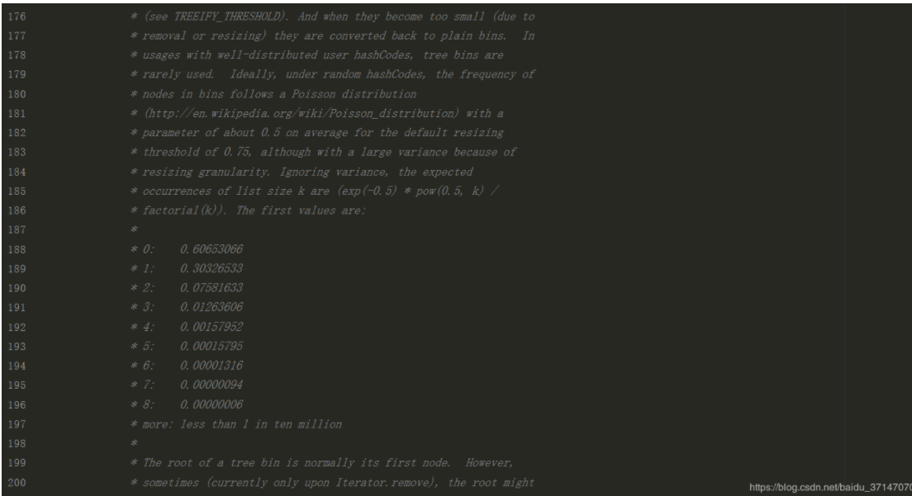

[toc]


# HashSet

## 基础


* HashSet 的底层是通过HashMap 实现的， HashSet 的方法，大部分是借助HashMap的方法。因为Map是无序的，因此HashSet 也无法保证顺序。

* Set 没有重复元素。相同的元素添加进去也只会保留一份。 HashSet 可以高效的添加， 删除元素，判断元素是否存在，效率都为O(1)。
* transient 修饰存储数据的数组可以保证其序列化时不被序列化。


## HashSet 源码解析
HashSet 内部使用HashMap存储数据，所以很多操作都是围绕HashMap开展的。HashSet的源码很少，因为除了clone()，writeObject(),readObject()是HashSet自己实现的之外，其他方法都是调用HashMap的方法。

实际上就是HashSet 的put 当key ，value 为一个空对象的HashMap


## HashSet 如何检查重复？
当添加对象到HashSet 时， HashSet 会先计算对象的hashcode 值来判断Set中是否已经有相同的哈希值的对象， 如果没有，则直接加入，如果发现有相同的hashcode 值的对象则说明发生了哈希冲突，此时需要调用equals()方法来检查hashcode 相等的对象是否真的相同，相同就会覆盖。
总计：先 hashCode，再 equals。所以一个对象一定要同时覆写 hashCode 与 equals 方法。


## HashMap 面试题

为什么链表长度到8 转为红黑树， 为什么不是其他数字？ 为了配合良好的hashCode ，树结点很少用到，在理想状态下，受随机分布的hashCode 影响，链表中的结点遵循泊松分布，根据统计，链表中节点数时8的概率已经接近千万分之一，而且此时链表的性能已经很差了。



所以在这种比较罕见和极端的情况下，才会把链表转变为红黑树。因为链表转换为红黑树也是需要消耗性能的，特殊情况特殊处理，为了挽回性能，权衡之下，才使用红黑树，提高性能。也就是大部分情况下，HashMap 还是使用的链表，如果是理想的均匀分布，节点数不到 8，HashMap 就自动扩容了。为什么这么说呢，再看如下：

```java
final void treeifyBin(Node<K,V>[] tab, int hash) {
    int n, index; Node<K,V> e;
    // 这里还要判断长度是否大于MIN_TREEIFY_CAPACITY
    if (tab == null || (n = tab.length) < MIN_TREEIFY_CAPACITY)
        resize();
    else if ((e = tab[index = (n - 1) & hash]) != null) {
        TreeNode<K,V> hd = null, tl = null;
        do {
            TreeNode<K,V> p = replacementTreeNode(e, null);
            if (tl == null)
                hd = p;
            else {
                p.prev = tl;
                tl.next = p;
            }
            tl = p;
        } while ((e = e.next) != null);
        if ((tab[index] = hd) != null)
            hd.treeify(tab);
    }
}
```

在链表转变为红黑树方法中，有这样一个判断，**数组长度**小于 MIN_TREEIFY_CAPACITY（64），**就会扩容**，而==不是直接转变==为红黑树，可不是什么链表长度为 8 就变为红黑树。现在回头想想，为啥用 8？因为通常情况下，链表长度很难达到 8，但是特殊情况下链表长度为 8，哈希表容量又很大，造成链表性能很差的时候，只能采用红黑树提高性能，这是一种应对策略。