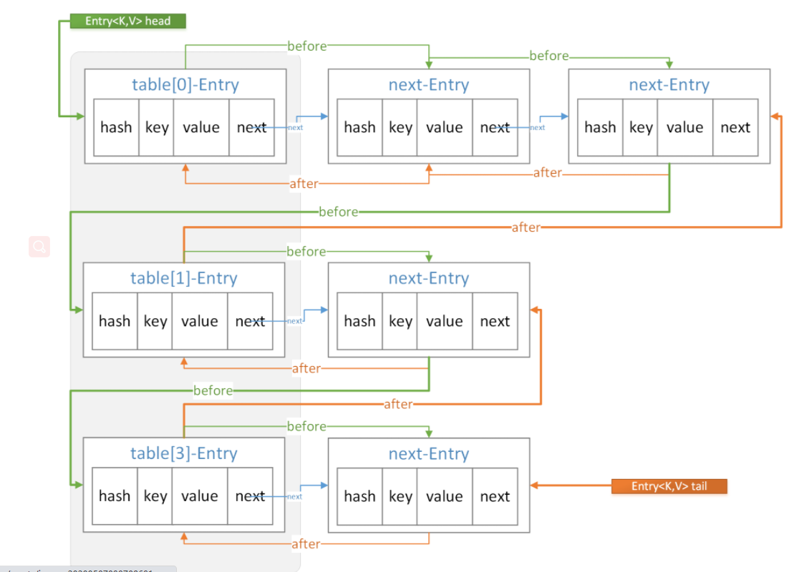
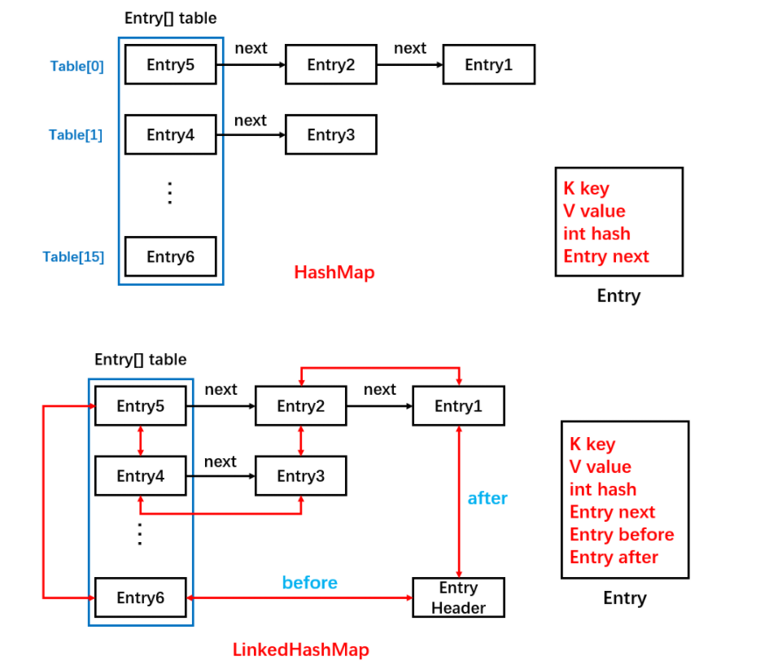

# LinkedHashMap

##基础


* LinkedHashMap 是HashMap的**子类**，**覆写了** HashMap 的一些**空方法**，从而实现了对顺序的控制。比如 newNode(插入新节点时用)，afterNodeAccess(get,put方法中用)，afterNodeInsertion(put方法中)方法等。
* LinkedHashMap 可以保持元素按**插入或访问有序**，顺序为**插入顺序**(accessOrder为true)。与 TreeMap **按键**排序不同。
* HashMap 是**线程不安全**的， LinkedHashMap 同样是线程**不安全**的。
* LinkedHashMap 其实可以看成 **HashMap** + **双向链表** 组成。
* 访问顺序可用于LRU。 基于LinkedHashMap 要实现最大缓存值的 LRU，需要继承LinkedHashMap 并开启accessOrder 为true，同时覆写 removeEldestEntry方法。


## 基本使用
HashMap 是无序的，当需要有顺序地去存储 key-value 时，就需要使用 LinkedHashMap。跟 HashMap 一样，它也是提供了 key-value 的存储方式，并提供了 put 和 get 方法来进行数据存取。

```java
// 使用HashMap
Map<String, String> hashMap = new HashMap<String, String>();
hashMap.put("name1", "josan1");
hashMap.put("name2", "josan2");
hashMap.put("name3", "josan3");
Set<Entry<String, String>> set = hashMap.entrySet();
Iterator<Entry<String, String>> iterator = set.iterator();
while(iterator.hasNext()) {
    Entry entry = iterator.next();
    String key = (String) entry.getKey();
    String value = (String) entry.getValue();
    System.out.println("key:" + key + ",value:" + value);
}
// 无序
// key:name3,value:josan3
// key:name1,value:josan1
// key:name2,value:josan2

// 使用LinkedHashMap
Map<String, String> linkedHashMap = new LinkedHashMap<>();
linkedHashMap.put("name1", "josan1");
linkedHashMap.put("name2", "josan2");
linkedHashMap.put("name3", "josan3");
Set<Entry<String, String>> set = linkedHashMap.entrySet();
Iterator<Entry<String, String>> iterator = set.iterator();
while(iterator.hasNext()) {
    Entry entry = iterator.next();
    String key = (String) entry.getKey();
    String value = (String) entry.getValue();
    System.out.println("key:" + key + ",value:" + value);
}
// 有序
// key:name1,value:josan1
// key:name2,value:josan2
// key:name3,value:josan3

```
结果可知，LinkedHashMap是有序的，且默认为 ==插入顺序==，就是插入元素的 顺序(还有一种访问顺序)


## 源码分析

继承自 HashMap，因此具有和 HashMap 一样的**快速查找**特性。LinkedHashMap 的大多数方法的实现**直接使用了父类** HashMap 的方法。LinkedHashMap 可以说是 HashMap 和 LinkedList 的集合体，既使用了 HashMap 的数据结构，又借用了 LinkedList **双向链表**的结构。
```java
public class LinkedHashMap<K,V> extends HashMap<K,V> implements Map<K,V>
```
### HashMap 中静态内部类Node 是这样定义的。
```java
static class Node<K,V> implements Map.Entry<K,V> {
    final int hash;
    final K key;
    V value;
    // Next指针
    Node<K,V> next;
}
```
LinkedHashMap 的内部静态结点类 Entry 直接继承了 HashMap 的结点类 Node，并拓展了前后两个指针 before 和 after，因此可以实现双向链表结构。
```java
static class Entry<K,V> extends HashMap.Node<K, V> {
    // 前后指针
    Entry<K, V> before, after;
    // 父类HashMap中Node类的构造方法
    Entry(int hash, K key, V value, Node<K, V> next) {
        super(hash, key, value, next);
    }
}
```
此时一个Entry 结点拥有 before,after和next 三个指针，它们之间的关系如下图所示。


LinkedHashMap 的put 实际上是HashMap的put方法。
```java
public V put(K key, V value) {
    return putVal(hash(key), key, value, false, true);
}
```

回顾HashMap的putVal方法。
```java
final V putVal(int hash, K key, V value, boolean onlyIfAbsent, boolean evict) {
    Node<K,V>[] tab; Node<K,V> p; int n, i;
    /**
     * 如果当前HashMap的table数组还未定义或者还未初始化其长度，则先通过resize()进行扩容,
     * 返回扩容后的数组长度n
     */
    if ((tab = table) == null || (n = tab.length) == 0)
        n = (tab = resize()).length;
    // 通过数组长度与hash值做按位与&运算得到对应数组下标,若该位置没有元素,则直接生成新元素节点插入
    if ((p = tab[i = (n - 1) & hash]) == null)
        tab[i] = newNode(hash, key, value, null);
    // 否则该位置已经有元素了，我们就需要进行一些其他操作
    else {
        Node<K,V> e; K k;
        // 如果插入的key和原来的key相同，则替换一下就完事了
        if (p.hash == hash && ((k = p.key) == key || (key != null && key.equals(k))))
            e = p;
        /**
         * 否则key不同的情况下，判断当前Node是否是TreeNode,如果是则执行putTreeVal将新的元素插入
         * 到红黑树上。
         */
        else if (p instanceof TreeNode)
            e = ((TreeNode<K,V>)p).putTreeVal(this, tab, hash, key, value);
        // 如果不是TreeNode,则进行链表遍历
        else {
            for (int binCount = 0; ; ++binCount) {
                /**
                 * 在链表最后一个节点之后并没有找到相同的元素，则进行下面的操作，直接new Node插
                 * 入,但条件判断有可能转化为红黑树
                 */
                if ((e = p.next) == null) {
                    // 直接new了一个Node
                    p.next = newNode(hash, key, value, null);
                    /**
                     * TREEIFY_THRESHOLD=8,因为binCount从0开始,也即是链表长度超过8（包含）
                     * 时,转为红黑树。
                     */
                    if (binCount >= TREEIFY_THRESHOLD - 1) // -1 for 1st
                        treeifyBin(tab, hash);
                    break;
                }
                /**
                 * 如果在链表的最后一个节点之前找到key值相同的(和上面判断不冲突，上面是直接通过数组
                 * 下标判断key值是否相同)，则替换
                 */
                if (e.hash == hash &&
                    ((k = e.key) == key || (key != null && key.equals(k))))
                    break;
                p = e;
            }
        }
        // 当某个槽中已有数据的时候此时是覆盖值
        if (e != null) { // existing mapping for key
            V oldValue = e.value;
            // onlyIfAbsent为true时:当某个位置已经存在元素时不去覆盖
            if (!onlyIfAbsent || oldValue == null)
                e.value = value;
            // 这里保证覆盖之后这个结点跑到链表尾部
            afterNodeAccess(e);
            return oldValue;
        }
    }
    ++modCount;
    // 最后判断临界值，是否扩容。
    if (++size > threshold)
        resize();
    afterNodeInsertion(evict);
    return null;
}
```
当put 元素时，不但要把它加入到HashMap 中去，还要加入到双向链表中，所以LinkedHashMap 就是==HashMap+双向链表==。

###(1) newNode 方法
首先LinkedHashMap 覆写了newNode()方法，通过此方法保证了插入的顺序性。
```java
/**
 * 使用LinkedHashMap中内部类Entry
 */
Node<K, V> newNode(int hash, K key, V value, Node<K,V> e) {
    LinkedHashMap.Entry<K,V> p = new LinkedHashMap.Entry<K,V>(hash, key, value, e);
    linkNodeLast(p);
    return p;
}
```

这里将节点类型改成了LinkedHashMap的内部节点类型LinkedHashMap.Entry. 同时调用了linkNodeLast 方法。

```java
private void linkNodeLast(LinkedHashMap.Entry<K,V> p) {
    // 记录当前链的末尾节点
    LinkedHashMap.Entry<K, V> last = tail;
    // 将新的节点设置为末尾节点
    tail = p;
    // 如果当前链末尾节点为null，说明此事链表为空，则新的节点直接是头结点
    if (last == null)
        head = p;
    else {
        // 改变指针将新节点插入链表尾部
        p.before = last;
        last.after = p;
    }
}
```

上述方法也就是把新的节点放到双向链表的末尾。

###（2）afterNodeAccess 方法
关于afterNodeAccess()方法，在HashMap中虽然有这个方法，但是给的空实现，而在LinkedHashMap覆写了，目的时保证操作过的Node节点永远在最后， 从而保证读取的顺序性，在调用put 方法和get 方法时都会用到。
这个方法不管是访问顺序还是插入顺序都会执行的，但是内部会进行accessOrder的判断，只有accessOrder 值为true， 也就是访问顺序时，才会执行后面的将节点放到链尾的逻辑。

当一个节点被访问时，如果accessOrder 为true(即访问顺序，则会执行后面的将节点放到链尾的逻辑)。


当一个节点被访问时，如果accessOrder 为 true(即访问顺序)，则会将该节点移到链表尾部。也就是说指定为LRU 顺序之后，在每次访问一个节点时，会将这个被访问的节点移到链表尾部。保证链表尾部是最近访问的节点，那么链表首部就是==最近最久未使用==的节点。适合用于来作LRU.


```java
/**
 * 当accessOrder为true并且传入的节点不是最后一个时，将传入的node移动到最后一个
 */
void afterNodeAccess(Node<K,V> e) {
    // 在执行方法前的上一次的尾结点
    LinkedHashMap.Entry<K,V> last;
    // 当accessOrder为true并且传入的节点并不是上一次的尾结点时,执行下面的方法
    if (accessOrder && (last = tail) != e) {
        LinkedHashMap.Entry<K,V> p =
            (LinkedHashMap.Entry<K,V>)e, b = p.before, a = p.after;
        // p：当前节点
        // b：当前节点的前一个节点
        // a：当前节点的后一个节点；
 
        // 将p.after设置为null，断开了与后一个节点的关系，但还未确定其位置
        p.after = null;
        /**
         * 因为将当前节点p拿掉了，那么节点b和节点a之间断开了，我们先站在节点b的角度建立与节点a
         * 的关联，如果节点b为null,表示当前节点p是头结点，节点p拿掉后，p的下一个节点a就是头节点了；
         * 否则将节点b的后一个节点设置为节点a
         */
        if (b == null)
            head = a;
        else
            b.after = a;
        /**
         * 因为将当前节点p拿掉了，那么节点a和节点b之间断开了，我们站在节点a的角度建立与节点b
         * 的关联，如果节点a为null,表示当前节点p为尾结点，节点p拿掉后，p的前一个节点b为尾结点，
         * 但是此时并没有直接将节点p赋值给tail,而是给了一个局部变量last(即当前的最后一个节点)，因为
         * 直接赋值给tail与该方法最终的目标不一致；如果节点a不为null将节点a的前一个节点设置为节点b
         * （因为前面已经判断了(last = tail) != e，说明传入的节点不是尾结点，既然不是尾结点，那么
         * e.after必然不为null，那为什么这里又判断了a == null的情况？
         * java可通过反射机制破坏封装，因此如果都是反射创建出的Entry实体，可能不会满足前面
         * 的判断条件）
         */
        if (a != null)
            a.before = b;
        else
            last = b;
        /**
         * 正常情况下last应该也不为空，为什么要判断，原因和前面一样
         * 前面设置了p.after为null,此处再将其before值设置为上一次的尾结点last,
         * 同时将上一次的尾结点last设置为本次p
         */
        if (last == null)
            head = p;
        else {
            p.before = last;
            last.after = p;
        }
        // 最后节点p设置为尾结点，完事
        tail = p;
        ++modCount;
    }
}
```
前面说到的 linkNodeLast(Entry e) 方法和现在的 afterNodeAccess(Node e) 都是将传入的 Node 节点放到最后，那么它们的使用场景有何区别？

HashMap 的 put 流程，如果在对应的 hash 位置上还没有元素，那么直接 newNode() 放到数组 table 中，这个时候对应到 LinkedHashMap 中，调用了 newNode() 方法，就会用到 linkNodeLast()，将新 node 放到最后，而如果对应的 hash 位置上有元素，进行元素值的覆盖时，就会调用 afterNodeAccess()，将原本可能不是最后的 node 节点拿到了最后。

如下面例子将 accessOrder 改为 true。此时为访问顺序。
```java
LinkedHashMap<String, Integer> map = new LinkedHashMap<>(16, 0.75f, true);
map.put("1月", 20);
// 此时就会调用到linkNodeLast()方法，也会调用afterNodeAccess()方法，但会被阻挡在
// if (accessOrder && (last = tail) != e) 之外
map.put("2月", 30);
map.put("3月", 65);
map.put("4月", 43);
// 下面键已经有了是覆盖值
// 这时不会调用linkNodeLast()，会调用afterNodeAccess()方法将key为“1月”的元素放到最后
map.put("1月", 35);
// 这时不会调用linkNodeLast()，会调用afterNodeAccess()方法将key为“2月”的元素放到最后
map.get("2月");
// 调用打印方法
for (Map.Entry<String, Integer> entry : map.entrySet()){
    System.out.println("key: " + entry.getKey() + ", value: " + entry.getValue());
}
```

结果如下：
```java
key: 3月, value: 65
key: 4月, value: 43
key: 1月, value: 35
key: 2月, value: 30
```
而如果是执行下面这段代码，将 accessOrder 改为 false。此时就是**插入顺序**。此时真正 afterNodeAccess() 就会失效。
```java
LinkedHashMap<String, Integer> map = new LinkedHashMap<>(16, 0.75f, false);
map.put("1月", 20);
// 此时就会调用到linkNodeLast()方法，也会调用afterNodeAccess()方法，但会被阻挡在
// if (accessOrder && (last = tail) != e) 之外
map.put("2月", 30);
map.put("3月", 65);
map.put("4月", 43);
// 这时不会调用linkNodeLast()，会调用afterNodeAccess()方法将key为“1月”的元素放到最后
map.put("1月", 35);
map.get("2月");
// 调用打印方法
for (Map.Entry<String, Integer> entry : map.entrySet()){
    System.out.println("key: " + entry.getKey() + ", value: " + entry.getValue());
}
```
当 accessOrder 为 false 时，访问的顺序就是按照你第一次插入的顺序；而 accessOrder 为 true 时，你任何一次的 put、get 操作，都会改变 map 中已有的存储顺序。


### afterNodeInsertion 方法
在使用put方法插入结点后会调用afterNodeInsertion 方法，而get 方法不会调用。

LinkedHashMap 中还重写了afterNodeInsertion(boolean evit)方法，这个方法也是在 HashMap 中是空实现，它的目的是移除链表中最老的节点对象，也就是当前在头部的节点对象，但实际上在 JDK8 中不会执行，因为removeEldestEntry 方法始终返回 false。看源码：

```java
void afterNodeInsertion(boolean evict) { // possibly remove eldest
    LinkedHashMap.Entry<K,V> first;
    if (evict && (first = head) != null && removeEldestEntry(first)) {
        K key = first.key;
        removeNode(hash(key), key, null, false, true);
    }
}
protected boolean removeEldestEntry(Map.Entry<K,V> eldest) {
    return false;
}

```
注意：removeEldestEntry() 默认返回为 false，如果需要让它为 true，需要继承 LinkedHashMap 并且覆写这个方法的实现，这在实现 LRU 的缓存中特别有用，通过移除最近最久未使用的节点，从而保证缓存空间足够，并且缓存的数据都是热点数据。后面有 demo ！


### 扩容
在 HashMap 的 put 方法中，如果发现前元素个数超过了扩容阀值时，会调用 resize 方法。LinkedHashMap 覆写了 transfer 方法实现数据的迁移。LinkedHashMap 扩容时数据的再散列和 HashMap 是不一样的。

HashMap 是先遍历旧 table，再遍历旧 table 中每个元素的单向链表，取得 Entry 以后，重新计算 hash 值，然后存放到新 table 的对应位置。

LinkedHashMap 是遍历的双向链表，取得每一个 Entry，然后重新计算 hash 值，然后存放到新 table 的对应位置。

从遍历的效率来说，遍历双向链表的效率要高于遍历 table，因为遍历双向链表是直接遍历 N 个元素；而遍历 table 则是 N + table 的空余个数（N 为元素个数）。


### get方法
LinkedHashMap 的get 方法与HashMap 中的get方法的不同点也在于多了afterNodeAccess()方法。
```java
public V get(Object key) {
    Node<K,V> e;
    if ((e = getNode(hash(key), key)) == null)
        return null;
    // 如果是true就是访问顺序，就会把最近访问的数据放到末尾
    if (accessOrder)
        // 顺序调整
        afterNodeAccess(e);
    return e.value;
}
```

### remove 方法
这里的删除也有两重含义：
* table 的角度看，需要将该entry从对应的bucket里删除，如果对应的冲突链表不为空，需要修改冲突链表的响应引用。
* 从header 的角度来看，需要将该entry从双向链表中删除，同时修改链表中前面以及后面的响应引用。


### 比较
1. HashMap 与LinkedHashMap对比


* LinkedHashMap 是**继承于**HashMap ，是基于HashMap 和双向链表来实现的，双向链表只是为了**保证顺序**。
* HashMap 无序; LinkedHashMap有序，可分为插入顺序和访问顺序两种。 如果是访问顺序，那put 和 get 操作已经在的entry时，都会把entry移动到双向链表的表尾
* HashMap 与LinkedHashMap 都是线程不安全的，
* LinkedHashMap及其节点类LinkedHashMap.Node 覆写了部分方法如afterNodeAccess，afterNodeInsertion 来实现对顺序的控制。


## LRU 缓存应用
LinkedHashMap 设置accessOrder 为true 时，是按照**访问顺序**进行存储的，此时非常适合用于**LRU缓存**。

根据源码解析，因为removeEldestEntry 方法返回值始终为false 。 一直加入节点会一直扩容下去而不会删除。 向现置LRU缓存的最大值怎么办？那就继承 LinkedHashMap 并覆写removeEldestEntry 方法。

>如何设置最大缓存值？
以下是使用 LinkedHashMap 实现的一个LRU缓存(表现为一个FIFO).
* 设定最大缓存空间MAX_ENTRIES 为3；
* 使用LinkedHashMap 的构造函数将accessOrder 设置为true ，开启LRU顺序；
* 覆盖removeEldestEntry()方法实现，在节点多余MAX_ENTRIES就会将最近最久未使用的数据移除。

```java
public class LRUCache<K, V> extends LinkedHashMap<K, V> {
    // 设置缓存最大值
    private static final int MAX_ENTRIES = 3;

    // 覆写这个方法使其在数量超出时返回true、
    @Override
    protected boolean removeEldestEntry(Map.Entry eldest) {
        // 如果当前的size大于最大缓存值就返回true
        return size() > MAX_ENTRIES;
    }

    LRUCache() {
        // 同时开启accessOrder为true
        super(MAX_ENTRIES, 0.75f, true);
    }
}
```


```java
public static void main(String[] args) {
    LRUCache<Integer, String> cache = new LRUCache<>();
    cache.put(1, "a");
    cache.put(2, "b");
    cache.put(3, "c");
    cache.get(1);
    cache.put(4, "d");
    System.out.println(cache.keySet());
}
```

结果
```
[3, 1, 4]
```