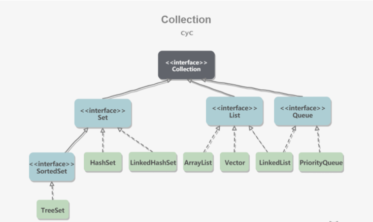
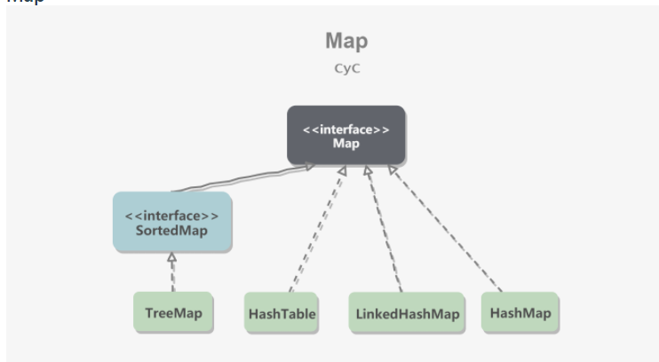

# Java 容器

## 一. 概览

容器主要包括Collection 和 Map 两种， Collection 存储着对象的集合，而Map存储着键值对的（两个对象）的映射表

### Collection

#### 1. Set
* TreeSet: 基于红黑树实现，支持有序性操作，例如根据一个范围查找元素的操作，但是查找效率不如HashSet，HashSet 查找的事件复杂度为 O(1),TreeSet则为O(logN)。
* HashSet：基于哈希表实现，支持快速查找，但不支持有序性操作。并且失去了元素的插入顺序信息，也就是说使用Iterator 遍历HashSet得到的结果是不确定的，
* LinkedHashSet： 具有HashSet的查找效率，并且内部使用双向链表维护元素的插入顺序

#### 2. List
* ArrayList：基于动态数组实现，支持随机访问
* Vector: 和ArrayList类似，但它是线程安全的
* LinkedList：基于双向链表实现，只能顺序访问，但是可以快速地在链表中间插入和删除元素。不仅如此，LinkedList还可以用作栈，队列和双向队列。

#### 3. Queue
* LinkedList：可以用它来实现双向队列
* PriorityQueue: 基于堆结构实现，可以用它来实现优先队列。

### Map

* TreeSet: 基于红黑树实现。
* HashMap：基于哈希表实现。
* HashTable：和HashMap类似，但它是线程安全的，这意味着同一时刻多个线程同时写入HashTable不会导致数据不一致。它是遗留类，不应该去使用它，而是使用ConcurrentHashMap 来支持线程安全，ConcurrentHashMap 的效率会更高，因为ConcurrentHashMap 引入了分段锁。
* LinkedHashMap：使用双向链表来维护元素的顺序，顺序为插入顺序或者最近最少使用(LRU)顺序。

