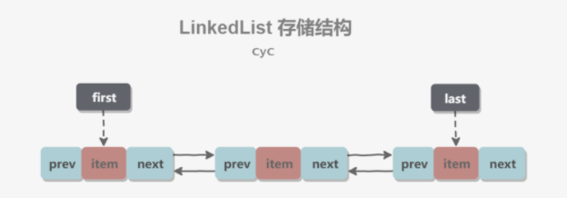

# LinkedList

## 概览

基于双向链表实现，使用Node 存储链表节点信息。

```java
private static class Node<E> {
    E item;
    Node<E> next;
    Node<E> prev;
}
```
每个链表存储了 first 和 last 指针：
```java
transient Node<E> first;
transient Node<E> last;
```



## 与ArrayList 的比较
ArrayList 基于动态数组实现，LinkedList基于双向链表实现。ArrayList和LinkedList的区别可以归结为数组和链表的区别：

* 数组支持随机访问，但插入删除的代价很高，需要移动大量元素;
* 链表不支持随机访问，但插入删除只需要改变指针。 