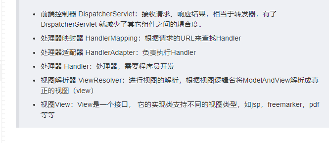

Spring MVC 是对Servlet 的封装，屏蔽了Servlet 的很多细节。

例如刚开始在学Servlet 的时候，要获取参数需要不断地getParameter

现在只要在SpringMVC方法定义对应地JavaBean，只要属性名和参数名一致，Spring MVC就可以帮我们实现 [将参数封装到JavaBean]上了。

之前使用Servlet[上传文件]，需要处理各种细节，写一大堆处理的逻辑(还得导入对应的jar)
现在只要在方法上定义出MultipartFile接口，又可以屏蔽掉上传文件的细节。

Spring MVC总体流程是这样的：
1）用户发送请求至前端控制器DispatcherServlet;
2) DispatcherServlet收到请求后，调用HandlerMapping 处理映射器，请求获取Handler；
3) 处理器映射器根据请求url找到具体的处理器Handler，生成处理器对象即处理器拦截器，一并返回给DispatcherServlet；
4) DispatcherServlet 调用  HandlerAdapter处理器适配器，请求执行Handler；
5) HanderAdapter 经过适配调用 (Controller)，进行处理业务逻辑；
6) Handler 执行完成返回ModelAndView；
7) HandlerAdapter 将Handler 执行结果ModelAndView 返回给DispatcherServlet；
8) DispatcherServlet将ModelAndView传给ViewResolver视图解析器进行解析；
9) ViewResolver解析返回具体View；
10) DispatcherServlet对View 进行渲染视图
11) DispatcherServlet响应用户。

