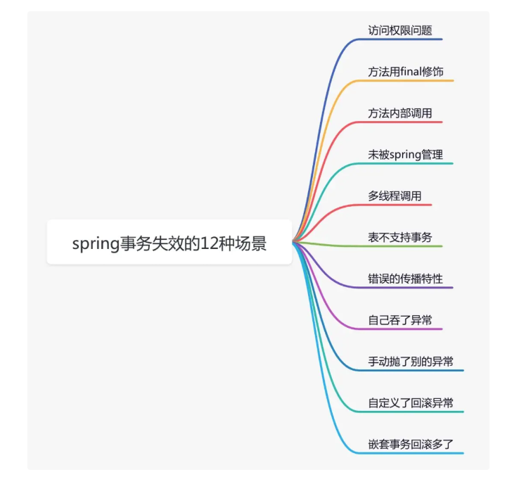

[toc]


# Spring 面试题汇总

## 1.Spring 是什么
Spring是一个轻量级的开源应用框架，旨在降低应用程序开发的复杂度。
Spring是非侵入性，允许应用系统自由选择和组装Spirng框架中的各个功能模块，而不要求应用必须对Spring的某个类继承或实现，极大地提高一致性。
使用IOC容器管理对象的生命周期，以及对象间的依赖关系，降低系统耦合性。
基于AOP的面向切面编程，将具有横切性质的业务放到切面中，从而与核心业务逻辑分离并提高组件复用性。

Spring可以很好地与其他框架集成，被称为框架的框架。


## 2.Spring的特性
* IOC
* AOP
* 事务
* 低侵入性

## 3. 什么是Spring IOC DI
IOC 即 控制反转，即 将对象的创建权 反转给了Spring，实现了程序的解耦。

Ioc的底层实现原理是 **工厂设计模式+反射+XML配置文件。**


DI，即依赖注入。 指的是 Spring在管理某个类的时候会将类依赖的属性注入进来，也就是说在创建对象的过程中，向类里面的属性中设置值。


## 4.Spring IOC 容器的初始化过程
Spring IOC容器的初始化简单的可以分为三个过程：
1. Resource 资源定位，这个Resource 指的是 BeanDefinition的资源定位。这个过程就是容器找数据的过程
2. BeanDefinition 载入，这个载入过程就是把用户定义好的bean 表示成ioc 内部的数据结构（BeanDefinition）
3. 向IOC容器注册这些BeanDefinition的过程，这个过程就是将前面的BeanDefition保存到HashMap中的过程。


## 5. BeanFactory 和 FactoryBean的区别？
* BeanFactory 是接口，定义了IOC容器的基本功能，所有的bean都是由BeanFactory 来进行管理的。
使用场景：
  * 从ioc容器中获取bean
  * 检索ioc容器中收纳柜是否包含指定的bean
  * 判断bean是否为单例
  
* FactoryBean 是个接口，实现了该接口的类是一个bean，这个Bean 不是简单的Bean，而是一个能生产或者修饰对象生成的工厂Bean，它的实现与设计模式中的工厂模式和装饰器模式类似
使用场景
* ProxyFactoryBean

## 6. Spring AOP 的实现原理？
当bean 执行完 init-method 后， spring 会postProcessAfterInitialization 为bean 的方法匹配 通知器，如果匹配成功则为bean 生成代理对象，并返回给 spring 容器。


而代理对象在调用方法时，会启动拦截器链，这里会根据前置通知 以及后置通知先执行哪些 方法。


Spring AOP使用的动态代理，所谓的动态代理就是说AOP 框架不会去修改字节码，而是在内存中临时为方法生成一个AOP对象，这个AOP对象包含了目标对象的全部方法，并且在特点的切点做了增强处理，并回调原对象的方法。


Spring AOP 的动态代理主要有两种方式，JDK动态代理和CGLIB动态里。
JDK动态代理通过反射来接收被代理的类，并且要求被代理的类必须实现一个接口。
如果目标类没有实现接口，那么Spring AOP 会选择使用CGLIB 来动态代理类。 CGLIB，是一个代码生成的类库，可以在运行时动态的生成某个类的子类，注意，CGLIB是通过继承的方式做的动态代理，因此如果某个类被标记为final，那么它是无法使用CGLIB做动态代理的。


## 7. Spring 是如何管理事务的
@Transaction 注解

使用aop方式实现的，

缺点：注解的最细粒度作用于方法上，如果像代码块也有事务需求，只能变通下，将代码块变为方法。

1. Spring事务底层是基于数据库事务和AOP机制的
2. 对于使用了@Transactional注解的Bean，Spring会创建一个代理对象作为Bean
3. 当调用了代理对象的方法时，会先判断该方法上是否加了@Transactional注解
4. 如果加了，利用事务管理器创建一个数据库连接
5. 并且修改数据库连接的autocommit属性为false，禁止此连接的自动提交，这是实现Spring事务非常重要的一步
6. 然后执行当前方法，方法中会执行sql
7. 执行完方法后，没有异常就直接提交事务
8. 出现了异常，这个异常需要回滚就回滚事务，否则仍然提交事务
9. Spring事务的隔离级别对应的是数据库的隔离级别
10. Spring事务的传播机制是Spring事务自己实现的，也是Spring事务中最复杂的
11. Spring事务的传播机制是基于数据库连接来做的，一个数据库连接一个事务，如果传播机制配置为需要新开一个事务，实际上就是先建立一个数据库连接，在此新数据库连接上执行sql

## Spring事务传播机制
多个事务方法相互调用时，事务如何在这些方法间传播
> 方法A是一个事务的方法，方法A执行过程中调用了方法B，那么方法B有无事务以及方法B对事务的要求不同都会对方法A的事务具体执行造成影响，同时方法A的事务对方法B的事务执行也有影响，这种影响具体是什么就由两个方法所定义的事务传播类型所决定。

REQUIRED(Spring默认的事务传播类型)：如果当前没有事务，则自己新建一个事务，如果当前存在事务，则加入这个事务。

SUPPORTS:当前存在事务，则加入当前事务，如果当前没有事务，就以非事务方法执行。

MANDATORY：当前存在事务，则加入当前事务，如果当前事务不存在，则抛出异常。

REQUIRES_NEW: 创建一个新事务，如果存在当前事务，则挂起该事务。（各自回滚自己的）

NOT_SUPPORTED:以非事务方式执行，如果当前存在事务，则挂起当前事务

NEVER:不使用事务，则如果当前事务存在，则抛出异常

NESTED:如果当前事务存在，则在嵌套事务中执行，否则REQUIRED的操作一样（开启一个事务）


## @Transactional失效

<!-- Spring事务的原理是AOP，进行了切面增强，那么失效的根本原因是这个AOP不起作用了！常见情况有如下几种

1. 发生自调用，类里面使用this调用本类的方法（this通常省略），此时这个this对象不是代理类，而是UserService本身
   让this变为UserService本身即可

2. 方法不是public的
   @Transactional 只能用于public的方法上，否则事务不会实现，如果要用到非public方法上，可以开启AspectJ代理模式。

3. 数据库不支持事务（MyIsam）
4. 没有被spring管理（该类没有被spring管理 ，如没有@controller，@service）
5. 异常不会回滚，事务不会回滚（或者抛出的异常没有被定义，默认为RuntimeException）
（try catrch） -->



### 一. 事务不生效
#### 1. 访问权限问题
  众所周知，java的访问权限主要有四种:private,default,protected,public,它们的权限从左到右，依次变大。

如果在开发过程中，把某些事务方法，定义了错误的访问权限，就会导致事务功能出问题，例如：
```java
@Service
public class UserService {
    
    @Transactional
    private void add(UserModel userModel) {
         saveData(userModel);
         updateData(userModel);
    }
}
```
我们可以看到add方法的访问权限被定义成了**private**，这样会导致事务失效，spring要求代理方法必须是public的。

#### 2. 方法用final修饰
  有时候，某个方法不想被子类重写，这时候可以将该方法定义成**final**的。普通方法这样定义是没问题的，但如果将事务方法定义成**final**，例如：
```java
@Service
public class UserService {

    @Transactional
    public final void add(UserModel userModel){
        saveData(userModel);
        updateData(userModel);
    }
}
```
我们可以看到add方法被定义成了**final**的，这样会导致事务失效。

如果你看过spring事务的源码，可能会知道spring事务底层使用了aop，也就是通过jdk动态代理或者cglib，帮我们生成了代理类，在代理类中实现的事务功能。

> 注意，如果某个方法是static的，同样无法通过动态代理，编程事务方法。

#### 3.方法内部调用
有时候需要在某个Service类的某个方法中，调用另外一个事务方法，比如：
```java
@Service
public class UserService {

    @Autowired
    private UserMapper userMapper;

    @Transactional
    public void add(UserModel userModel) {
        userMapper.insertUser(userModel);
        updateStatus(userModel);
    }

    @Transactional
    public void updateStatus(UserModel userModel) {
        doSameThing();
    }
}
```
看到事务方法add中，直接调用事务方法updateStatus. 从前面介绍的内容可以知道，updateStatus方法拥有事务的能力是因为spring aop生成了代理对象，但是这种方法直接调用了this对象的方法，所以updateStatus方法不会生成事务。

由此可见，在同一类中的方法直接内部调用，会导致事务失效。


##### 3.1 新加一个Service方法
这个方法非常简单，只需要新加一个Service方法，把@Transactional 注解加到新Service方法上，把需要事务执行的代码移到新方法中。具体代码如下：
```java
@Servcie
public class ServiceA {
   @Autowired
   prvate ServiceB serviceB;

   public void save(User user) {
         queryData1();
         queryData2();
         serviceB.doSave(user);
   }
 }

 @Servcie
 public class ServiceB {

    @Transactional(rollbackFor=Exception.class)
    public void doSave(User user) {
       addData1();
       updateData2();
    }

 }
```

##### 3.2 在该Service类中注入自己
如果不想再新家一个Service类，在该Service类中注入自己也是一种选择。
```java
@Servcie
public class ServiceA {
   @Autowired
   prvate ServiceA serviceA;

   public void save(User user) {
         queryData1();
         queryData2();
         serviceA.doSave(user);
   }

   @Transactional(rollbackFor=Exception.class)
   public void doSave(User user) {
       addData1();
       updateData2();
    }
 }
```

##### 3.3 通过AopContent类
在该Service类中使用AopContent.currentProxy()获取对象。


#### 4.未被spring管理

通常情况下，通过@Controller,@Service,@Component,@Repository等注解，可以自动实现bean实例化和依赖注入的功能。

```java
//@Service
public class UserService {

    @Transactional
    public void add(UserModel userModel) {
         saveData(userModel);
         updateData(userModel);
    }    
}
```
从上面的例子，我们可以看到UserService类没有加 **@Service** 注解，那么该类不会交给spring管理，所以它的add方法也不会生成事务。

#### 5.多线程调用
```java
@Slf4j
@Service
public class UserService {

    @Autowired
    private UserMapper userMapper;
    @Autowired
    private RoleService roleService;

    @Transactional
    public void add(UserModel userModel) throws Exception {
        userMapper.insertUser(userModel);
        new Thread(() -> {
            roleService.doOtherThing();
        }).start();
    }
}

@Service
public class RoleService {

    @Transactional
    public void doOtherThing() {
        System.out.println("保存role表数据");
    }
}
```
从上面的例子中，可以看到事务方法add中，调用了事务方法doOtherThing， 但是事务方法doOtherThing 是在另外一个线程中调用的。

这样会导致两个方法不再同一个线程中，获取到的数据库连接不一样，从而是两个不同的事务。如果想doOtherThing方法中抛了异常，add方法也回滚是不可能的。

而我们平常说的同一事务，其实是指同一个数据库连接，只有拥有同一个数据库连接才能同时提交和回滚。如果在不同的线程，拿到的数据库连接肯定是不一样的，所以是不同的事务。

#### 6. 表不支持事务
在mysql5 之前，默认的数据库引擎是myisam。
它的好处就不用多说了：索引文件和数据文件是分别存储的，对于查多写少的单表操作，性能比innodb更好。

有些老项目中，可能还在用它。
在创建表的时候，只需要把ENGINE参数设置成MyISAM即可。

然而myisam：**不支持事务/**

如果只是单表操作还好，不会出现大问题。但是如果需要跨多张表操作，由于其不支持事务，数据极有可能会出现不完整的情况。

此外，myisam 还不支持行锁和外键。
在实际业务场景中，myisam使用的并不多。在mysql5以后，myisam已经主键推出了历史的舞台，取而代之的是innodb。

>有时候我们在开发的过程中，发现某张表的事务一直都没有生效，那不一定是spring事务的锅，最好确认一下你使用的那张表，是否支持事务。


#### 7. 未开启事务
事务没有生效的根本原因是没有开启事务。

如果你使用的是springboot项目，那么你很幸运。因为springboot通过DataSourceTransactionManagerAutoConfiguration类，已经默默的帮你开启了事务。

你所要做的事情很简单，只需要配置spring.datasource相关参数即可。


### 二. 事务不回滚
#### 1. 错误的传播特性
在使用@Transactional注解时，是可以指定propagation参数的。

#### 2. 自己吞了异常
事务不会回滚，最常见的问题是：开发者在代码中手动try..catch了异常。比如：
```java
@Slf4j
@Service
public class UserService {
    
    @Transactional
    public void add(UserModel userModel) {
        try {
            saveData(userModel);
            updateData(userModel);
        } catch (Exception e) {
            log.error(e.getMessage(), e);
        }
    }
}
```
如果想要spring事务能够正常回滚，**必须抛出它能够处理的异常。**如果没有抛异常，则spring认为程序是正常的。

#### 3. 手动抛了别的异常
即使开发者没有手动捕获异常，但如果抛的异常不正确，spring事务也不会回滚。
```java
@Slf4j
@Service
public class UserService {
    
    @Transactional
    public void add(UserModel userModel) throws Exception {
        try {
             saveData(userModel);
             updateData(userModel);
        } catch (Exception e) {
            log.error(e.getMessage(), e);
            throw new Exception(e);
        }
    }
}
```
上面的这种情况，开发人员自己捕获了异常，又手动抛出了异常：Exception，事务同样不会回滚。

因为spring事务，默认情况下只会回滚RuntimeException（运行时异常）和Error(错误)，对于普通的Exception(非运行时异常)，它不会回滚。

#### 4.自定义了回滚异常
在使用@Transactional注解声明事务时，有时我们想自定义回滚的异常，spring也是支持的。可以通过设置rollbackFor参数，来完成这个功能。
```java
@Slf4j
@Service
public class UserService {
    
    @Transactional(rollbackFor = BusinessException.class)
    public void add(UserModel userModel) throws Exception {
       saveData(userModel);
       updateData(userModel);
    }
}
```
如果在执行上面这段代码，保存和更新时，程序报错了，抛了sqlException，DuplicateKeyException等异常。而BusinessException 是我们自定义的异常，报错的异常不属于BusinessException，所以事务也不会回滚。
即使rollbackFor 有默认值，但阿里巴巴开发者规范中，还是要求开发者重新指定该参数。

因为如果使用默认值，一旦程序抛出了Exception，事务不会回滚，这会出现很大的bug。所以，建议一般情况下，将该参数设置为：Exeption或Throwable。

#### 5.嵌套事务回滚多了
```java
public class UserService {

    @Autowired
    private UserMapper userMapper;

    @Autowired
    private RoleService roleService;

    @Transactional
    public void add(UserModel userModel) throws Exception {
        userMapper.insertUser(userModel);
        roleService.doOtherThing();
    }
}

@Service
public class RoleService {

    @Transactional(propagation = Propagation.NESTED)
    public void doOtherThing() {
        System.out.println("保存role表数据");
    }
}
```

这种情况使用了嵌套的内部事务，原本是希望调用roleService.doOtherThing 方法时，如果出现了异常，只回滚doOtherThing 方法里的内容，不回滚userMapper.insertUser里的内容，即回滚保存点。。但事实上，inserUser也回滚了。

这是因为doOtherThing方法出现了异常，没有手动捕获，会继续往上抛，到外层add方法的代理方法中捕获了异常。所以，这种情况是直接回滚了整个事务，不只回滚单个保存点。
怎么样只回滚保存点呢？
```java
@Slf4j
@Service
public class UserService {

    @Autowired
    private UserMapper userMapper;

    @Autowired
    private RoleService roleService;

    @Transactional
    public void add(UserModel userModel) throws Exception {

        userMapper.insertUser(userModel);
        try {
            roleService.doOtherThing();
        } catch (Exception e) {
            log.error(e.getMessage(), e);
        }
    }
}
```
可以将内部嵌套事务放在try/catch中，并且不继续往上抛异常，这样就能保证，如果内部事务中出现异常，只回滚内部事务，而不影响外部事务。

## 8. spring 自动装配
在spring中，对象无需自己查找或创建与其关联的其他对象，由容器负责把需要协作的对象引用赋予各个对象，使用Autowired 来配置自动装载模式：

spring框架xml配置中共有5种自动装配：
（1）no：默认的方式是不进行自动装配的，通过手工设置ref属性来进行装配bean
（2）byName：通过bean 的名称进行自动装配，如果一个bean的property 与另一bean 的名称相同，就进行装配
（3）byType：通过参数的数据类型进行自动装配
（4）constructor：利用构造函数进行装配，并且构造函数的参数通过byType进行装配
（5） autodetect:自动


基于注解的方式：
使用@Autowired注解来指定自动装配指定的bean
（1） @Autowired  默认按照类型来装配注入的，默认情况下它要求依赖对象必须存在
（2） @Resource   默认按照名称来注入的，只有找不到名称匹配的bean来装配注入。

## 9. 有多少种方式完成依赖注入
* setter注入
* 构造函数注入
* 基于注解的注入（接口注入）
  （@Autowired）

## 10. 依赖注入发生在什么时刻
* 第一次通过getBean 方法 向IOC索要Bean时，IOC容器触发依赖注入。
* 在Bean定义资源中为元素配置了lazy-init属性，即让容器在解析注册Bean定义时进行预实例化，触发依赖注入


## 11. Bean的作用域
在Spring中，Bean 是组成 应用程序的主体及由Spring IOC容器所管理的对象，被称之为bean。 

singleton：每个spring ioc 容器仅有一个单实例。
prototype：每次请求都会产生一个新的实例
request：每一次http请求都会产生一个新的实例，同时该bean仅在当前Http 请求内有效。
session：每一次http请求都会产生新的bean，同时该bean仅在当前当前的http session 内有效。
gloabal session-类似于session，不过仅在portlet web应用中才有意义。

后面三种仅当用户使用支持web 的applicationcontext 是才使用。

## 12. bean的生命周期

1. spring容器根据配置中的bean定义， 实例化bean。
2. spring使用依赖注入填充所有属性，如bean中所定义的配置
3. 如果bean实现了BeanNameAware接口，则调用setBeanName()
4. 如果bean实现了BeanFactoryAware接口，工厂通过传递自身的实例来调用setBeanFactory()
5. 如果存在与bean关联的BeanPostProcessor，则调用preProcessBeforeInitialization()方法
6. 如果为bean制定了init方法， 调用它
7. 执行preProcessorAfterInitialization()方法
8. bean 实现 DisposableBean 接口，当 spring 容器关闭时，会调用destory()
9. 调用destory()方法


## 13. Spring 常用的注解

1. 声明bean的注解
@Component 组件，没有明确的角色
@Service （Service层）
@Repository （Dao层）
@Controller （Controller层）

2. 注入bean的注解
@Autowired （）
@Resource

3. java配置类
@Configuration  声明当前类为配置类
@Bean  注解作用在方法上，声明当前方法的返回值是一个bean，代替xml的方式
@ComponentScan 用于对compoent 扫描
4. 切面（AOP）相关注解
@Aspect  声明一个切面
使用@After,@Before,@Around 定义 advice ，可直接将拦截规则作为参数


5. @Bean 的属性支持
@Scope 定义bean 的作用域

6. @Value 为属性注入值


7. @Enable *注解说明
@EnableAspectJAutoProxy
@EnableAsync
@EnableWebMvc
@EnableTransactionManagement 开启注解


## 14. Spring 中后置处理器的作用
Spring 中的后置处理器分为BeanFactory后置处理器和Bean后置处理器，它们是Spring底层源码架构设计中非常重要的一种机制，同时开发者也可以利用这两种后置处理器来进行扩展。BeanFactory 后置处理器表示针对BeanFactory的处理器，Spring启动过程中，会先创建出BeanFacoty实例，然后利用BeanFactory处理器来加工BeanFactory，比如Spring扫描的BeanFactory后置处理器实现的，而Bean后置处理器也类似，spring在创建一个Bean的过程中，首先会实例化得到一个对象，然后再利用Bean后置处理器来对该实例对象进行加工，比如我们常说的依赖注入就是基于一个Bean后置处理器来实现的，通过该Bean后置处理器来给实例对象中加了@Autowired注解的属性自动赋值，还比如我们常说的AOP，也是利用一个Bean后置处理器来实现的，基于原实例对象，判断是否需要进行AOP，如果需要，那么就基于原实例对象进行动态代理，生成一个代理对象。


## 15.Spring 种的设计模式
工厂模式：--BeanFactory
          -- FactoryBean

适配器模式 -- AdvisorAdapter接口，对Advisor进行了适配
访问者模式 -- PropertyAccessor接口，属性访问器，用于访问和设置某个对象的某个属性

装饰器模式 -- BeanWrapper
代理模式  -- AOP
模板模式  -- JDBCTemplate
观察者模式 -- 事件监听模式
策略模式  -- 
委派模式
责任链模式 --BeanPostProcessor

