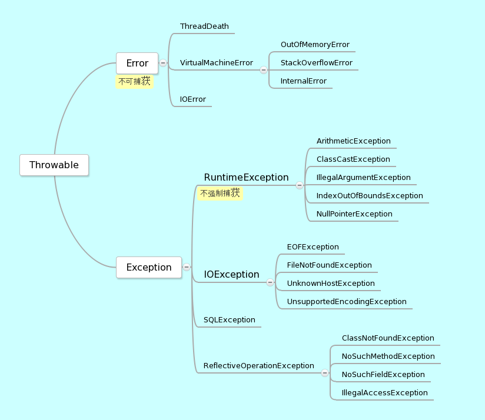
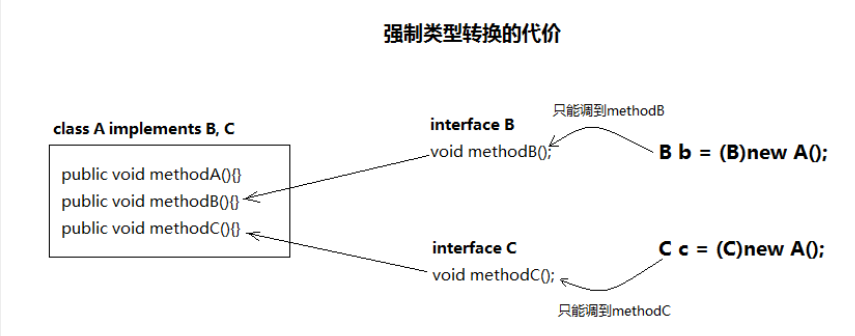
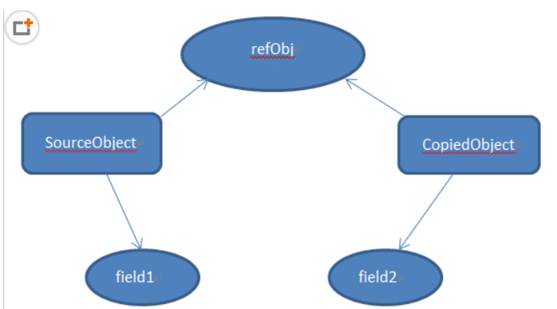
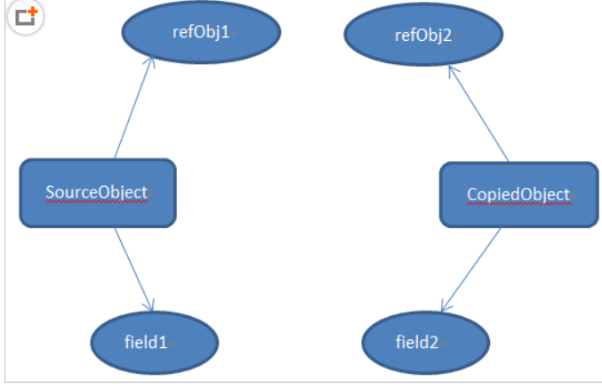
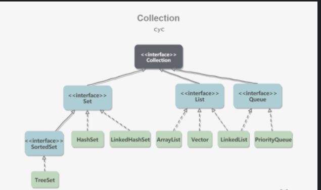
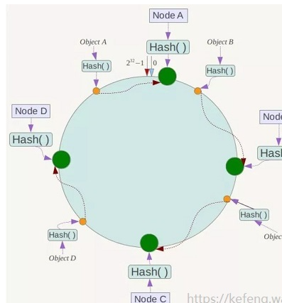
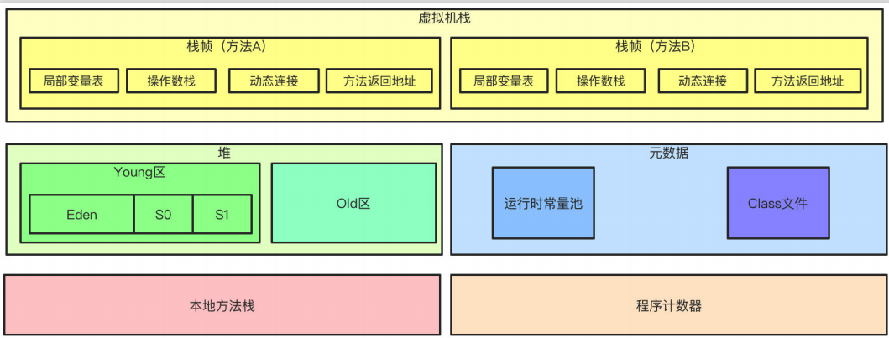
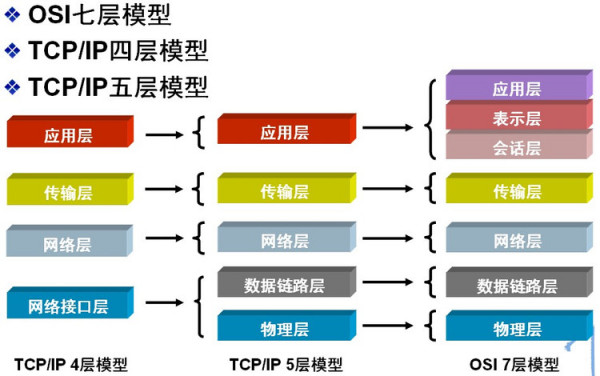
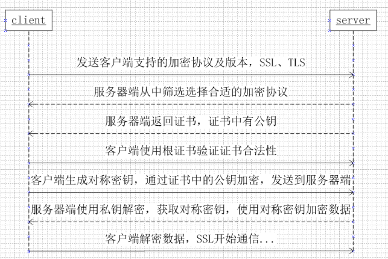

[TOC]
# vivo面经分类汇总

## Java 基础

### 1. JDK JRE
JRE 是Java 运行时环境，包含了java虚拟机，java基础类库，提供给运行java程序的用户使用的。

JDK是 Java Development Kit,java 开发工具包，包含了JRE，以及一些开发工具，javav，jconsole。


### 2.Java 异常了解吗？说说平时遇到的异常。说出六种常见的java异常。写程序遇到过哪些异常，运行时异常有哪些？



### 3.面向对象的几大特性 多态怎么理解
封装： 抽象一个对象，形成一个有机的整体
继承： 子类继承父类的特征和行为
多态： 同一个接口具有多个不同表现形式，是指一个实例对象的相同方法在不同情形有不同的表现形式。（继承，重写，父类引用调用子类方法）


### 4.修饰符：public;protect;default;private 优先级
public:最宽的，修饰的类属性方法可以跨包访问
private：最窄的，只允许被该类自己访问，子类不准访问
protect：介于public 和private 之间的一种访问修饰符，可以跨包
default:只允许一个包内访问


### 5.String类的理解。stringbuilder，stringbuffer
这三个都是final类，不允许被继承.
StringBuffer 是线程安全，加了sychronized同步方法
StringBuilder 非同步，
String 是不可改变的，因为String下面的char[]也是用final修饰的，基本数据类型不可改变


### 6.反射机制，还有动态代理的好处与坏处
反射就是可以在运行时根据指定的类名获得类的信息。

为什么要用反射：Java程序可以加载一个运行时才得知名称的class，获取其完整构造，并生成对象实体，并对他的字段设值。

动态代理的好处：可以不用在修改源码的情况下，增强一些方法；在方法的前后做想做的事情。
坏处：动态生成的一个代理对象，可以用接口接收，和目标对象可以形成了多态，但是切换的时候，只能使用该接口定义的方法。

### 7. bio，nio，aio分别介绍一下，nio的实现方式。

bio(blocking IO):同步阻塞IO，这种IO模型数据的读取写入必须阻塞在一个线程内等待其完成。


nio（non-block io）同步非阻塞IO：Nio有三大组件，Channel，Buffer， Selector。

客户端和服务器通过Channel操作，NIO可以在Channel上进行读写操作，这些Channel会被注册到Selector上。而如果配置Channel的通道为非阻塞，那么Channel上的IO事件还未到达时，就不会进入阻塞状态，而是会轮询其他的Channel。

### 8.接口 和抽象类的区别

接口的设计目的，是对类的行为进行约束（约束了行为的有无）
抽象类的设计目的，是代码复用。 当不同的类有某些相同的行为的时候，其中一部分的实现方式一致时，可以让这些类派生于一个抽象类，抽象类中实现了B，避免所有的子类来实现它。


### 9. 有一个public static final的HashMap，里边对象的属性能不能修改？ 


### 10.为什么java平台无关性 机器码和字节码的区别， JVM加载代码的一个流程
java源代码通过javac编译器编译成一个二进制的.class字节码文件（java的跨平台性就是指的.class文件的跨平台性，该文件是与平台无关的） .class 文件在运行在JVM上，JVM将其翻译成二进制的机器码文件，再进行执行。所以java所谓的跨平台就是在不同的平台上安装了不同的JVM，而在不同的平台上生成相同的.class，而.class 文件再通过对应平台的JVM解释成对应的平台的机器码执行。

虚拟机加载Class文件到内存，并到数据进行校验，转换解析和初始化，最终形成可被虚拟机直接使用的Java类型，这一系列过程就是类的加载机制。

加载（获取此类的二进制字节流）--验证（文件格式验证，元数据验证，字节码验证，符号引用验证）--准备（为变量分配内存设置初值）--解析（将符号引用变为直接引用）--初始化（执行构造器方法）--使用--卸载


### 11. 自动拆箱和自动装箱，以及自己的应用什么时候用到的。
自动装箱可以理解为将基本数据类型分装为对象类型
自动拆箱就是将对象转换为基本数据类型
```java
Integer num=10;
System.out.println(num--);
```

### 12.什么是值传递和引用传递，区别及应用
值传递始对基本型变量而言，传递的是该变量的一个副本，改变副本不影响原变量。
引用传递一般是对于对象型变量，传递的对象地址的一个副本。

### 13.重写(Override)和重载(Overload)
子类中把父类本身有的方法重新写一遍。

重载就是一个类中同样的方法有不同的参数列表，（对返回类型没有要求，不能通过返回类型是否相同来判断重载）

>>>方法的重载和重写都是实现多态的方式，区别在于前者实现的是编译时的多态性，而后者实现的是运行时的多态性。重载发生在一个类中，同名的方法如果有不同的参数列表（参数类型不同、参数个数不同或者二者都不同）则视为重载；重写发生在子类与父类之间，重写要求子类被重写方法与父类被重写方法有相同的参数列表，有兼容的返回类型，比父类被重写方法更好访问，不能比父类被重写方法声明更多的异常（里氏代换原则）。重载对返回类型没有特殊的要求，不能根据返回类型进行区分。


### 14.static方法能否被重写
不可以


### 15. java是一种怎么样的语言以及java特性
面向对象
平台无关性
简单性
解释执行
高性能
安全性

### 16. lamda表达式了解吗？1.8新特性有什么？
匿名内部类（接口的实现只需要使用唯一的一次，因此可以省掉该类的定义）

新特性：

Lambda表达式


函数式接口(只定义了一个抽象方法的接口)

Stream API

### 17. 内存泄漏怎么造成的，怎么排查
在Java中，无用的对象都有GC负责回收。
因此，发生内存泄漏的原因是，存在一些对象，这些对象有引用，存在GC Roots与之相连，其次，这些对象是无用的，之后不会再使用这些对象。

### 18. 讲讲final修饰符
final修饰 基本变量，变量不可变
          引用变量，引用不可变

          方法，方法不可重写
          类，类不可被继承

### 19. 一个对象占多少内存

对象在内存中存储布局主要分为对象头，实例数据和对齐填充三部分。
对象头在32位系统占4字节，在64位系统中占8字节。

实例数据

### 20. java浅拷贝和深拷贝
浅拷贝：1.对于数据类型是基本数据类型的成员变量，浅拷贝会直接进行值传递，也就是复制该属性值给新的对象，2.对于数据类型是引用类型的成员变量，比如说成员变量是某个数组，某个类的对象等，浅拷贝会进行引用传递，这样一来两个对象的修改会互相影响。

使用拷贝构造方法或者重写clone 方法

深拷贝：不仅要复制所有的基本数据类型的成员变量值，还要为所有的引用数据类型申请存储空间，并复制每个引用数据类型成员变量所引用的对象，直到对象可达。

### 21. 说说静态变量和非静态变量的区别，用类名调用静态变量和用实例对象调用静态变量有区别吗？非静态方法里可以有静态变量吗？
静态变量(被static修饰的变量):,加载类的时候被创建,不随对象的创建而改变,静态变量位于方法区,类消失对应的变量消失.

非静态变量:不被static修饰的变量,每创建一次对象,就会为变量分配一次内存,存放在堆内存中,对象消失对应的变量消失.

### 22.序列化，反序列化，什么时候用，如何对一个对象序列化
序列化：把对象转换为字节序列的过程称为对象的序列化
反序列化：把字节序列恢复为对象的过程称为对象的反序列化。


就是要把内存中的对象状态保存到一个文件中或者数据中的时候
在网络上传送对象的时候

实现Serializable接口


## Java集合类

### 1. Hashmap底层（数组+链表+红黑树）hashmap为什么不安全，如何保证线程安全，就扯到concurrenthashmap 。 hashmap底层实现  多线程会出现什么情况  扩容机制是什么 为什么会死锁 如何解决碰撞 jdk1.8的优化，为什么使用红黑树，它是如何做到效率优化的？ hashmap 了解不，原理是什么，位图了解不，跳跃表了解下，红黑树插入过程，B+树了解不，B+树特点和插入过程，邻接表和邻接矩阵区别，分别在什么地方用到，插入和查询的流程。

HashMap 底层 是 数组+链表+红黑树
因为hashmap的方法不是同步的，

ConcurrentHashMap 1.8用了volatile来保证内存可见性，同时用CAS 以及synchronized 来保证线程安全。

红黑树在检索的时候与avl树效率差不多，都是通过平衡来二分查找。但对于插入删除等操作效率要提高很多，红黑树不像avl树一样追求绝对的平衡，它允许局部很少的不完全平衡，这样对于效率影响不大，但省去了很多没有必要的调平衡操作，avl树调平衡有时候代价较大，所以效率不如红黑树。


### 2. ConcurrentHashMap1.7和1.8的区别；ConcurrentHashMap说说，它是如何保证线程安全的？jdk1.7的HashEntry和Segment锁。具体说说Segment锁？能讲下ConcurrentHashMap的实现原理么 JDK7或者8都行


ConcurrentHashMap 1.7 使用 Segment 和HashEntry分段锁的方式实现，

一个ConcurrentHashMap是由Segment数组结构和HashEntry数组结构组成。
实际上每个Segment都是一个HashMap，默认的Segment长度是16，也就是支持16个线程的并发写，Segment之间相互不会受到影响。

1.8则抛弃了Segment，该用CAS+synchronized+Node实现。


put
1.计算hash，遍历node数组，如果node是空的话，通过cas+自旋的方式初始化。
2.如果当前数组位置是空则直接通过CAS自旋写入数据
3.如果hash==MOVED，说明需要扩容，执行扩容
4.如果都不满足，使用synchronized 写入数据。

get 由于使用了volatile修饰变量，因此通过key计算hash，然后查询数据。


### 3.常用集合类，实现类


### 4.list和set区别（重复/不重复）


### 5. set，list，map

### 6. 红黑树介绍一下，跟平衡二叉树比较一下，红黑树有哪些应用场景


### 7. 你常用的数据结构有哪些？


### 8.红黑树的特点，AVL树

### 9.一致性哈希函数


1. 设计hash函数，要求取值范围为[0,2^32)
   各哈希值在上图Hash环上的分布：时钟12点位置为0，按顺时针方向递增，临近12点的左侧位置为2^32-1
   
2. 节点映射至哈希环
如上图绿球所示

3. 对象映射于哈希环
4. 对象映射至节点
   按照顺时针方向查找，找到的第一个节点就是该对象的节点

### 10.数组，二叉查找树，B树，B+树
B+ 树中的节点不存储数据，只是索引，而B树中的节点存储数据（因此B树结点存储的key更少，树会更高）
B 树中的叶子节点不需要链表来串联（只能依靠中序遍历来进行范围查询）

### 11. 堆和栈，堆，栈
堆是一种特殊的完全二叉树。
栈是一种先进后出的队列。

### 12.二叉树的最大节点个数；


## Java并发
### 1.Java 创建线程的方式，runnable和callable区别（参数不同）
1. 继承 Thread 类，重写run方法
2. 实现Runnable 方法
3. 实现callable 方法（有返回值）

### 2.java线程的状态有哪些；线程的几种状态
```java
public enum State {
    NEW,//新建态
    RUNNABLE,//运行态
    BLOCKED,//阻塞态
    WAITING,//等待态
    TIMED_WAITING,//有时间限制的等待态
    TERMINATED;//死亡态
}
```

### 3.wait 和sleep的区别；wait和notify的使用场景

wait释放锁，因此需要在同步块中使用

需要注意的是，其他线程调用notify()方法只会唤醒单个等待锁的线程，如果有多个线程都在等待这个锁的话，不一定会唤醒到之前调用wait()方法的线程。

sleep不需要释放锁，可以在任何地方使用，sleep需要设定时间


### 4.介绍volatile以及原理；volatile介绍一下volatile底层是如何实现的？说了内存可见性和内存屏障，volatile是绝对线程安全的嘛？
volatile是相比于synchronized的加锁方式来解决共享变量的内存可见性的问题，更轻量的一种选择。

使⽤volatile声明的变量，可以确保值被更新的时候对其他线程⽴刻可⻅。
volatile使⽤内存屏障来保证不会发⽣指令重排，解决了内存可⻅性的问题。
不是绝对线程安全的，没有保证原子性。

### 5.介绍一下synchornized以及原理； lock和synchornized的区别；synchronized锁的升级过程？Synchronized，底层是如何实现的？
synchornized是java内置的原子性锁，使用synchorinized修饰的代码，会在编译前后的代码块前后加上monitorenter和monitorexit字节码指令，它依赖操作系统底层互斥锁实现。

执行monitorenter指令时会尝试获取对象锁，如果对象没有被锁定或者已经获得了锁，锁的计数器+1，此时竞争锁的线程则会进入entryList

执⾏monitorexit指令时则会把计数器-1，当计数器值为0时，则锁释放，处于等待队列中的线程再继续竞争锁。

相比于synchornized,ReentrantLock需要显式的获取锁和释放锁，ReentrantLock的效率基本可以持平。
1.等待可中断：当持有锁的线程长时间不释放锁的时候，等待中的线程可以选择放弃等待
2.公平锁：ReentrantLock可以使用公平锁
3.绑定多个条件：ReentrantLock可以同时绑定多个Condition条件对象。


### 6. synchornized优化

优化机制包括 自适应锁， 自旋锁，锁消除，锁粗化，轻量级锁和偏向锁。

**自旋锁**：线程执行一个忙循环，啥也不干，防止用户态转入内核态

**锁消除**：当JVM检测到一些同步的代码块，不存在数据竞争的场景，不需要加索，就会进行锁消除

**锁粗化**：锁粗化指的是有很多操作都是对同一个对象进行加锁，就会把锁的同步范围扩展到整个操作序列之外。

**偏向锁**：当线程访问同步块获取锁时，会在对象头和栈帧中的锁记录⾥存储偏向锁的线程ID，之后这个线程再次进⼊同步块时都不需要CAS来加锁和解锁了，偏向锁会永远偏向第⼀个获得锁的线程，如果后续没有其他线程获得过这个锁，持有锁的线程就永远不需要进⾏同步，反之，当有其他线程竞争偏向锁时，持有偏向锁的线程就会释放偏向锁。

**轻量锁**：JVM的对象的对象头中包含有⼀些锁的标志位，代码进⼊同步块的时候，JVM将会使⽤CAS⽅式来尝试获取锁，如果更新成功则会把对象头中的状态位标记为轻量级锁，如果更新失败，当前线程就尝试⾃旋来获得锁。

**重量锁**：如果自旋失败则升级为重量锁。


### 7. 介绍一下AQS
抽象队列同步器，，很多同步类的实现都是基于它的。

AQS内部维护了一个state状态位，尝试加锁的时候通过CAS修改值，如果成功设置为1，则把当前线程ID赋值，则代表加锁成功，其他的线程则会被阻塞进入阻塞队列自旋。释放锁的时候会把state置为0，同时当前线程ID置为空。


### 8. 介绍一下公平锁和非公平锁的原理

公平锁的实现与非公平锁很像，再获取锁的时候**不用CAS**来获取锁，
只有当队列没节点并且state为0的时候才会去获取锁，不然直接把线程放到队列中

### 9. cas操作是什么，以及可能出现的问题；
cas包含三个操作数：
1. 变量内存值：V
2. 旧的预期值：A
3. 准备设置的新值，B
   只有当V==A，才会用B去更新V的值，否则就不会执行更新操作。

ABA问题：加入了版本号，
循环时间长开销大
只能保证一个共享变量的原子操作

### 10. 线程池的五大参数
corePoolSize(核心线程数量)
maximumPoolSize(最大线程数量)
keepAliveTime(线程空余时间)
workQueue(阻塞队列)
handler(任务拒绝策略)

当提交任务时，线程池会根据corePoolSize大小创建若干任务数量线程执行任务。

当任务的数量超过corePoolSize数量，后续的任务将会进入阻塞队列阻塞排队

当阻塞队列也满了之后，那么将会继续创建（maximumPoolSize-corePoolSize）个数量的线程来执行任务，如果任务处理完成，maximumPoolSize-corePoolSize 额外创建的线程等待keepAliveTime之后被自动销毁。

如果达到了maximumPoolSize,阻塞队列还是满状态，则执行拒绝策略

拒绝策略：


1. AbortPolicy：直接丢弃任务，抛出异常，这是默认策略
2. CallerRunsPolicy：只⽤调⽤者所在的线程来处理任务
3. DiscardOldestPolicy：丢弃等待队列中最旧的任务，并执⾏当前任务
4. DiscardPolicy：直接丢弃任务，也不抛出异常


用ThreadPoolExecutor创建

### 11.乐观锁和悲观锁，乐观锁有哪些，乐观锁有什么缺点？（ABA问题）

**悲观锁**：
就是假定在每次取数据的时候会修改这个数据，所以在取数据的时候就会进行加锁，这样其他调用者就不能取数据，阻塞等待，一直到获取到锁。Java中的同步锁synchronized和ReentrantLock 就是悲观锁思想的实现。

**乐观锁**：
就是假定在每次取数据时不会修改这个数据，所以在取数据的时候不会加锁，只有在真正修改数据的时候才加锁，Java中的atomic原子变量就是乐观锁的实现。


### 12.知道Java中的内存模型吧，它有8个指令你给我说一下
Java内存模型（Java Memory Model）JMM, 描述的是一组规范，通过这组规范定义了程序各个变量的访问方式。

JMM 规定所有变量都存储在主内存，主内存是共享内存区域，所有线程都可以访问，但是每个线程对变量的操作都必须在自己的工作内存中进行，首先要将变量从主内存拷贝到自己的工作内存空间，然后对变量进行操作，完成后再将变量写回主内存。 

**lock:** 作用于主内存的变量，把一个变量标识为一个线程独占的状态
**unlock:** 作用于主内存的变量，它把一个处于锁定状态的变量释放出来，释放后的变量才可以被其他线程锁定。
**read:** 作用于主内存的变量，他把一个变量的值从主内存传输到线程的工作内存中，以便随后的load使用
**load:** 作用于工作内存的变量，它把read操作从主内存中得到的变量值放入工作内存的变量副本中
**use:** 作用于工作内存的变量，它把工作内存中一个变量的值传递给执行引擎，每当虚拟机遇到一个需要使用到变量的值的字节码指令时会执行这个操作
**assign:** 作用于工作内存的变量，它把一个从执行引擎接收到的值赋给工作内存的变量，每当虚拟机遇到一个给变量赋值的字节码指令时执行这个操作。
**store:** 作用于工作内存的变量，它把工作内存中一个变量的值传送到主内存中，以便随后的write操作使用。
**write：** 作用于主内存的变量，它把store操作从工作内存中得到的变量的值放入主内存的变量中。

### IO多路复用


## JVM

### 1.JVM运行时内存区域划分？哪些线程私有？堆区内存如何分配。

程序计数器：线程私有
虚拟机栈：线程私有
堆：区分为年轻代(1/3)跟老年代(2/3)，年轻代Eden,S0,S1 , 8:1:1
本地方法栈：
元数据： 运行时常量池，Class文件


### 2. 对象的生命周期
1.创建阶段（Createed）
为对象分配内存空间
构造对象
初始化

2.应用阶段（In Use）
至少被一个强引用持有着

3.不可见阶段（Invisible）
即使有强引用持有对象，但是这些强引用对于程序来说是不能访问的（accessible），就会进入这个阶段(非必须经历的阶段)

举例：
```java
public void run() {
    try {
        Object foo = new Object();
        foo.doSomething();
    } catch (Exception e) {
        // whatever
    }
    while (true) { // do stuff } // loop forever
}
```
在上面的例子上，foo是在try catch block中新建的，当try catch执行完后，foo便不能被访问了，在run方法返回之前，foo是强引用，是gc root，所以它不能被回收。这就有可能产生内存泄漏（比如例子中一直死循环），对于这种情况必须显式的置null来保证垃圾回收。

4. 不可达阶段（Unreachable）
对象处于不可达就是没有gc root的强引用的引用链可达的状态。

先说哪些是gc root：
* 虚拟机栈中引用的对象
* 类静态变量引用的对象
* 类常量引用的对象
* ...

5. 收集阶段（Collected）
当垃圾回收器已经发现对象处于不可达，并且垃圾回收器已经对该对象的内存空间重新分配做好准备时，对象进入“收集阶段”


6. 终结阶段（Finalized）
对象执行完finalize()方法，该对象进入终结阶段。在该阶段，等待垃圾回收器回收该对象空间。
7. 重新分配阶段（Deallocated）
如果在完成上述所有工作完成后对象仍不可达，则垃圾回收器对该对象的所占用的内存空间进行回收或者再分配，该对象彻底消失。


### 3.JVM垃圾回收器，cms跟G1的特点，两者的区别是什么，比G1更加先进的垃圾回收器有了解么？

CMS:使用了标记-清除算法，目的是为了最短暂停时间，它只回收老年代。（可以并行收集）


G1:不再区分年轻代跟老年代，将内存划分为多个Region，然后G1在回收的时候会在后台维护一个优先级列表，每次根据用户设定的收集停顿时间优先回收收益最大的Region。
GI 的一大优势在于可预测的停顿时间， 能够尽可能快地在指定时间内完成垃圾回收任务。在 JDK11中，已经将 GI 设为默认 垃圾回收器。


ZGC:和G1相同，但是它的Region大小不是固定的。

### 4.JVM内存模型 类的生命周期 类加载过程 双亲委派机制了解吗 进入老年代过程 什么情况下直接进入老年代
JVM内存模型则是 程序计数器，虚拟机栈，堆，元数据（运行时常量池，class文件），本地方法栈

一个类的生命周期：  加载->连接->初始化->使用->卸载

双亲委派机制： 即一个类在加载时，会向上询问自己的父加载器是否已经加载，没有则依次向上访问，如果没有加载，则从上到下依次尝试是否能加载当前类，直到加载成功。

YGC之后，存活的对象会被复制到未使用的S区，如果S区放不下，进入老年代，
对于哪些一直在S区来回复制的对象，超过15次进入老年代
如果Survivor区的相同年龄的所有对象大小的总和大于Survivor空间的一般，大于该年龄的可以进入老年代。


### 5.类加载机制，过程，类加载机制？如何自定义实现类加载器？双亲委派模型、类加载器类别，双亲委派模型本质是解决了什么问题？安全性，有哪几种类加载器？类加载的流程。知道哪些类加载器。类加载器之间的关系？双亲委派模型。为什么使用双亲委派模型？


### 6. 栈什么情况下会溢出？

1. 使用了大量的递归
2. 类中引用变量过多
3. 全局变量是否过多
4. 数组数据是否过大

### 7.静态变量存放在内存哪个区域？
堆中

### 8.怎么查看java虚拟机内存占用

jstat 可以查看堆内存


### 9.怎么减少full gc的次数？方法区是否需要gc

1.对象不用时置为null
2.尽量少使用System.gc()
3.尽量少使用静态变量
4.尽量使用StringBuilder 而不是用String来累加字符串
5.分散对象创建或删除的时间
6.使用图片，尽量使用软引用
7.增大 eden内存


方法区可以被回收,主要回收废弃常量和无用类。（方法区回收效率很低，可以不回收）
（该类的所有对象都已经从堆中回收，加载这个类的classloader已经被回收，该类的class文件没有任何引用）

### 11.4个引用类型
**强引用**：最常见的普通对象引用，只要还有强引用指向一个对象，就能表明对象还“活着”，垃圾收集器不会碰这个对象。

**软引用**：相对于强引用弱化一些的引用，可以让对象豁免一些垃圾收集，只有当JVM认为内存不足时，才会去试图回收软引用

**弱引用**：弱引用并不能使对象豁免垃圾收集，仅仅是提供一种访问在弱引用状态下对象的途径。这就可以用来构建一种没有特定约束的关系，比如维护一种非强制性的映射关系，如果视图获取时对象还在，就使用它，否则重新实现实例化。它同样是很多缓存实现的选择。

**虚引用**：所有类型中最弱的一个，一个持有虚引用的对象和没有引用几乎是一样的，随时可能被垃圾回收器回收，当试图通过虚引用的get()方法取得强引用时，总是会失败。


## 计算机网络
### 1. 输入一个url后的过程，浏览器从发送请求的全部过程
1.浏览器拿到url时，首先会对url进行解析，使用DNS协议，通过域名得到IP地址。
（PS：浏览器会查询缓存，如果有这个网址的缓存则可以直接获取到ip，如果没有查询本机缓存，如果没有则进行DNS请求）。

2.得到ip后浏览器与服务器通过TCP三次握手建立连接。


3.浏览器构建HTTP请求报文，并通过TCP协议传送到服务器的指定端口。http请求报文一共包括三个部分：
* 请求行：指定http请求的方法，url，http协议版本等
* 请求头：描述浏览器的相关信息，语言，编码等。
* 请求正文：当发送POST,PUT等请求时，通常需要向服务器传递数据。这些数据就储存在请求正文中。
  
4.服务器处理HTTP请求，并回复响应报文。响应报文分为三个部分：
* 状态码：http服务常用的状态码及其含义如下
* 响应头：包含了响应的相关信息，如日期等
* 响应正文：服务器返回给浏览器的文本信息

5.浏览器页面渲染

6.断开tcp连接
四次挥手


### 2. OSI七层和TCP四层协议，OSI七层模型/五层模型，每一层有哪些协议，http，tcp，ip位于哪一层


物理层：RJ45、CLOCK、IEEE802.3（中继器、集线器）
数据链路层：PPP、FR、HDLC、VLAN、MAC（网桥、交换机）
网络层：IP、ARP、 RARP、ICMP、OSPF、IPX、RIP、IGRP（交换机）
传输层：TCP、UDP、 SPX
会话层：NFS、SQL、NETBIOS、RPC
表示层：JPEG、MPEG、ASII
应用层：FTP、DNS、Telnet、SMTP、HTTP、HTTPS、WWW、NFS


### 3.TCP三次握手四次分手，tcp四次挥手为什么要四次，为什么TCP是安全的

三次握手：
1.client发送SYN=1以及序列号x给server，client变为SYN_SENT状态
2.server接收到后，如果决定建立连接，则发送SYN=1,序列号y，确定序列号x+1，ACK=1发送给clint，SYN_RCVD
3.client收到后，发送ACK=1,序列号x+1,确定序列号y+1 给server,双方变为ESTABLISHED

因为TCP是双⼯传输模式，不区分客户端和服务端，连接的建⽴是双向的过程。
如果只有两次，⽆法做到双向连接的建⽴，从建⽴连接server回复的SYN和ACK合并成⼀次可以看出来，
他也不需要4次。
挥⼿为什么要四次？因为挥⼿的ACK和FIN不能同时发送，因为数据发送的截⽌时间不同


四次挥手：
1.client向server发送FIN包，进入FIN_WAIT_1状态，这时候表明client没有数据要发送了
2.server收到后，发送一个ACK,进入CLOSE_WAIT 等待关闭的状态，因为server端可能还有未发送完成的数据
3.等待server端数据都发送完毕之后，server端就向client发送FIN，进入LAST_ACK状态
4.client收到ACK之后，进入TIME_WAIT的状态，同时回复ACK，server收到之后直接进入CLOSED状态，连接关闭。但是client要等待2MSL（报文最大生成时间），才会进入CLOSED状态


### 4.TCP报文结构，HTTP结构， TCP，UDP，HTTP的报文格式
TCP报文：

UDP报文：

HTTP报文：
请求报文：

响应报文：


### 5.设计一个应用层协议


### 6.HTTP协议连接过程，HTTPS连接过程，HTTP的长连接是怎么做的HTTP2和HTTP1区别，HTTP请求过程http的几种方法，HTTP跟HTTPS的区别，https加密过程

HTTP协议连接过程：
第1步：TCP通过三次握手建立双方连接；
第2步：客户端通过发送请求报文及请求数据给服务端；
第3步：服务端返回响应报文及响应数据给客户端；
第4步：TCP通过四次挥手进行断开连接。

HTTPS连接过程：


长连接：
header 设置 Connection=keep-alive

HTTP2跟HTTP1的区别：

 HTTP 2.0 通过头压缩、分帧、二进制编码、多路复用等技术提升性能；


## 操作系统

### 1.进程和线程的区别
进程是计算机已运行程序的实体，进程是操作系统**资源分配**的最小单位，每一个进程都有它自己的内存空间和系统资源


线程是进程中执行的一个任务，是CPU调度和执行的最小单位。

它们两个本质的区别是  是否单独占有内存地址空间及其它系统资源（比如I/O）：

区别如下：

* 进程单独占有一定的内存地址空间，所以进程间存在内存隔离，数据是分开的，数据共享复杂但是同步简单，各个进程之间互不干扰；而线程共享所属进程占有的内存地址空间和资源，数据共享简单，但是同步复杂。


* 进程单独占有一定的内存地址空间，一个进程出现问题不会影响其他进程，不影响主程序的稳定性，可靠性高;一个线程崩溃可能影响整个程序的稳定性，可靠性较低。

* 进程单独占有一定的内存地址空间，进程的创建和销毁不仅需要保存寄存器和栈信息，还需要资源的分配回收以及页调度，开销较大；线程只需要保存寄存器和栈信息，开销较小。


### 2.什么时候情况下要用多线程？

需要提升并发能力。

### 3.进程之间怎么通信的？

* 管道（pipeline）：数据只能单向流动，只能在具有亲缘关系的进程间使用。进程的亲缘关系通常是指父子进程关系。

* 信号：信号是软件层次上对中断机制的一种模拟，是一种异步通信方式。
    在计算机中，信号就是一个内核对象或者是一个内核数据结构。发送方将该数据结构的内容填好，并指明该信号的目标进程后，发出特定的软件中断（这就是一个发电报的操作）。OS接收到特定的中断请求后，知道是有进程要发送信号，于是到特定的内核数据结构里查找信号接收方，并进行通知。接到通知的进程则对信号进行相应处理。

* 信号量（semaphore）：作为进程间以及同一进程之间的同步手段。
    在计算机中，信号量实际上就是一个简单整数。一个进程在信号变为0或1的情况下推进，并将信号变为1或0来防止别的进程同时推进。当该进程完成任务后，则将信号再改为0或1，从而允许其他进程执行。从而我们也可以看出，信号量已经不只是一种通信机制，更是一种同步机制。

* 共享内存：把一个物理内存映射到不同的进程各自的进程地址空间，这样就可以通向一个区域。

* 套接字：可以为一般的进程间通信，不同机器之间的进程间通信


* 消息队列：消息队列是一列具有头和尾的消息队列，新来的消息放在队列尾部，而读取消息则从队列头部开始。

    （1）消息队列无固定的读写进程，任何进程都可以读写，
    （2）消息队列可以同时支持多个进程，多个进程可以读写消息队列；即所谓的多对多，而管道是点对点
    （3）消息队列只在内存中实现，而管道可以在磁盘上实现


### 4. 死锁，怎么解死锁，死锁条件，怎么预防
死锁的四个必要条件：
1.互斥性：线程对资源的占有是排他性的，一个资源只能被一个线程占有，直到释放
2.请求和保持条件：一个线程对请求被占有资源发生阻塞时，对已经获得的资源不释放
3.不剥夺：一个线程在释放资源之前，其他的线程无法剥夺占用。
4.循环等待：发生死锁时，线程陷入死循环，永久阻塞。

破坏死锁的方法：
1. 破坏请求和保持条件：
   进程在申请资源时，一次性申请所有需要用到的资源（比较浪费资源）
2. 破坏不可抢占条件：
   设定优先级，让线程可以抢占资源
3. 破坏循环等待条件：
   将系统的所有资源统一编号，线程必须按照编号递增的顺序去请求资源，释放则相反。

### 5.进程的状态：阻塞+就绪+执行

public enum State {
    NEW,//新建态
    RUNNABLE,//运行态
    BLOCKED,//阻塞态
    WAITING,//等待态
    TIMED_WAITING,//有时间限制的等待态
    TERMINATED;//死亡态
}


### 6.线程的应用，举例，线程的阻塞


### 7.主线程和子线程的区别
主线程：在一个程序运行时，有一个进程被os创建，于此同时一个线程也立即运行，该线程通常叫做主线程，而后面创建的线程，就是这个主线程的子线程。

主线程的重要性体现在两方面：
1.是产生其他子线程的线程；
2.通常它必须最后完成执行比如执行各种关闭动作。


## Mysql

### 1.  数据库引擎事务隔离级别，串行化如何实现，数据库的隔离级别？四个。你平常使用的是哪个隔离级别。数据库隔离级别以及分别解决了什么问题 
读未提交
读提交
可重复读（默认使用）  脏读： 
可串行化：可对每一行加锁，读加读锁，写加写锁，读写锁互斥


### 2.MySQL的存储引擎有哪些？它们之间的区别？你用的mysql存储引擎？为什么选择它？实现原理？ 
MyISAM存储引擎：不支持事务，不支持外键，支持表锁，使用B+树作为索引
InnoDB存储引擎：支持事务，支持行锁，使用B+树作为索引
Memory存储引擎：hash做为索引


### 3.怎么判断一个SQL语句有没有走索引？紧接着问explain知道哪些字段吗 
explain ***
table：顾名思义，显示这一行的数据是关于哪张表的；

type：这是重要的列，显示连接使用了何种类型。从最好到最差的连接类型为：const、eq_reg、ref、range、indexhe和ALL；

possible_keys：显示可能应用在这张表中的索引。如果为空，没有可能的索引。可以为相关的域从where语句中选择一个合适的语句；

key： 实际使用的索引。如果为NULL，则没有使用索引。很少的情况下，MySQL会选择优化不足的索引。这种情况下，可以在Select语句中使用USE INDEX(indexname)来强制使用一个索引或者用IGNORE INDEX(indexname)来强制MySQL忽略索引；

key_len：使用的索引的长度。在不损失精确性的情况下，长度越短越好；

ref：显示索引的哪一列被使用了，如果可能的话，是一个常数；

rows：MySQL认为必须检查的用来返回请求数据的行数；

Extra：关于MySQL如何解析查询的额外信息。


### 4. 数据库索引B+树
B+树的叶子节点通过链表串联在一起，方便顺序查找
B+树的是一个m叉树，因此树的高度比较低，相比于二叉查找树减少了磁盘的IO操作
B+树的非叶子节点不存储数据，因此相比于B树可以存储更多的索引


### 5.sql查询过程
1. 连接器
第一步，连接数据库，这时候接待你的就是连接器。 连接器负责跟客户端建立连接，获取权限，维持和管理连接。连接命令一般如下：
```mysql
mysql -u root -p
```

之后发送语句给Mysql server，如果是查询语句则会先去查询缓存中看，有的话直接返回。（由于查询缓存的失效非常频繁，只要有一个表的更新，这个表上的查询缓存都会被清空）。因此， ==MYSQL 8.0 版本将查询缓存的整块功能删掉了。==


2.分析器
如果没有命中缓存，则要开始真正的执行语句了。首先，MYSQL 需要知道你要做什么，因此需要对SQL语句进行解析。


分析器首先会做“词法分析”。你输入的由多个字符串和空格组成一条 SQL 语句， MYSQL 需要识别里面的字符串分别是什么，代表什么。

MYSQL 从你输入的“select” 这个关键字识别出来，这是一个查询语句。 它也要把字符串 “T” 识别成 “表名T” , 把字符串 “ID” 识别成 “列 ID”。

做完了这些识别以后，就要做“语法分析”。 根据词法分析的结构，语法分析器会根据语法规则，判断你输入的SQL 语句是否满足MYSQL 语法。


3.优化器
经过了分析器， MYSQL就知道 命令的内容了，再开始执行之前，还需要经过**优化器**的处理。

优化器 是在表里面有多个索引的时候，决定使用哪个索引；或者在一个语句有多表关联(join)的时候，决定各个表的连接顺序。

优化器阶段完成后，这个语句的执行方案就确定下来了，然后进入执行器阶段。


4.执行器
MYSQL 通过分析器知道了要做什么， 知道优化器知道如何做， 然后进入执行器阶段，开始执行语句。

执行的时候需要判断对表 有没有查询的权限，如果没有，就会返回没有权限的错误。

如果有权限，就打开表继续执行。打开表的时候，执行器就会根据表的引擎定义，去使用这个引擎提供的接口。


### 6.InnnoDB 存储引擎中的MVCC解决了什么问题，能说下MVCC的实现原理么
幻读问题。


### 7.什么情况下不该建立索引

### 8.mysql有几种锁？怎么实现？
行锁：  Record Lock (记录锁)：单个行记录的锁
       Gap Lock（间隙锁）：锁定一个范围，不包括记录本身
       Next-Key Lock（临键锁）：记录锁和间隙锁，锁定一个范围，并且锁定记录本身
表锁：对当前操作的整张表加锁
页级锁：一次锁定相邻的一组记录


### 9.innodb事务的级别
读未提交
读已提交
可重复读
可串行化

### 10.聚簇索引跟红黑树
主键索引的叶子节点存的是整行数据。 在 InnoDB里， 主键索引也被称为聚簇索引(clustered index)。
非主键索引的叶子节点内容是主键的值。在 InnoDB里，非主键索引也被称为二级索引

## redis

### 为什么redis快
1.完全基于内存操作
2.C语言实现，优化了数据结构
3.基于非阻塞的IO多路复用机制

### 1.redis中zset，说了一下跳跃表的插入，删除过程；


### 2.redis数据类型，redis 的应用场景


### 3.redis的key的写入和删除的原理
惰性删除：当查询key的时候才对key进行检测，如果已经达到过期时间，则删除。
然后没有被访问，则不会被删除。


定期删除：定期删除指的是redis每隔一段时间对数据库做一次检查，删除里面的过期key。（随机选择）

如果都没有删除过期的key，走内存淘汰机制。
1. volatile-lru:从已设置过期时间的key中，移出最近最少使用的key进行淘汰
2. volatile-ttl：从已设置过期时间的key中，移除将要过期的key
3. volatile-random：从已过期时间的key中随机选择key淘汰
4. allkeys-lru：从key中选择最近最少使用的进行淘汰
5. allkeys-random：从key中选择选择随机的key进行taotie
6. noeviction：当内存到达阈值时，新写入操作报错。


### 4.怎么保证redis的高可用

主从架构：
主从模式是最简单的实现高可用的方案，核心就是主从同步。
主从同步就是slave 发送 sync命令到master，
master执行bgsave，然后生成RDB全量文件
这时候master将写命令缓存，
发送RDB文件到slave，slave执行
将写命令也发送到slave，slave执行

主从架构没有自动故障转移机制。
哨兵：
哨兵可以同时监视多个主从服务器，当被监视的master下线时，自动将某个slave提升未master，然后由新的master 继续接收命令。整个过程如下：

6. sentinel每隔1秒向所有服务器发送ping命令，如果某台服务器在配置的响应时间内连续返回⽆效回
复，将会被标记为下线状态
7. 选举出领头sentinel，领头sentinel需要半数以上的sentinel同意
8. 领头sentinel从已下线的的master所有slave中挑选⼀个，将其转换为master
9. 让所有的slave改为从新的master复制数据
10. 将原来的master设置为新的master的从服务器，当原来master重新回复连接时，就变成了新master的从服务器


### 5.单线程还是多线程？
redis6.0 采用了多线程。

redis使用多线程来处理数据的读写和协议解析，执行命令还是使用单线程。

这样做的目的是因为redis的性能瓶颈在于网络IO而不是CPU，使用多线程能提升IO读写的效率，从而整体提高redis 的性能。

### 6.用什么样的队列？你是怎么实现？


### 7.分布式锁


## mq
### 重复消费
通过幂等性来解决重复消费的问题。
在生产者端保持幂等：1.RocketMQ支持消息查询（命令行，客户端api），只要去RocketMQ查询以下是否已经发送过该条消息就可以了，不存在则发送，存在则不发送

2. mq在消息发送成功后，写入redis， 生产者在发送时向redis时插入数据就行了

3. 生产者端产生唯一标识 UUID 等，

在消费者端保持幂等：消费者消费时在数据库是否已经被更新过。如果是，判断是否返回消费完成，否则执行消费。

首先准备一个消息记录表，在消费成功的同时插入一条已经处理成功的消息id记录到该表中，注意一定要 与业务操作处于同一个事物 中，当新的消息到达的时候，根据新消息的id在该表中查询是否已经存在该id，如果存在则表明消息已经被消费过，那么丢弃该消息不再进行业务操作即可。


### 消息丢失
可分为 三部分， 生产者数据丢失， mq消息丢失， 消费者数据丢失
生产者数据丢失： 同步发送+超时重试
mq消息丢失： 同步刷盘+主从同步（同步双写）
消费者数据丢失：at least once+超时重发


## 设计模式

### 双重检查单例
```java
public class Singleton {
    private volatile static Singleton unqueInstance;
    Singleton() {

    }

    static Singleton getUnqueInstance(){
        if(unqueInstance==null){
            synchronized (Singleton.class){
                if(unqueInstance==null)
                    unqueInstance=new Singleton();
            }
        }
        return unqueInstance;
    }

}
```
目前使用比较多的方法：静态内部类的方法
```java

public class Singleton{

    Singleton(){

    }

    private static class SingletonHolder{
        private static Singleton INSTANCE=new Singleton();
    }

    public static Singleton getInstance(){
        return SingletonHolder.INSTANCE;
    }

}
```


### 设计模式分为哪三类，各有什么？设计模式，用过哪些设计模式，讲几个，设计模式和原则
行为型：在不同的对象之间划分责任和算法的抽象化。关注它们之间的相互作用。
模板方法：
策略模式：
命令模式：
责任链模式：
状态：
观察者：
中介者：
迭代器：
访问者：
备忘录：
解释器：

创建型：对类的实例化过程进行了**抽象**，能够将软件模块中**对象的创建和对象的使用分离**。
单例
模型
工厂
抽下工厂
建造者

结构型：将类或者对象结合在一起形成更大的结构。
代理模式
适配器模式
桥接模式
装饰器模式
享元模式
外观
组合

### 代理模式属于哪一类
结构型

### 生产者消费者模式


### 描述适配器


### 单例模式，装饰模式


## spring