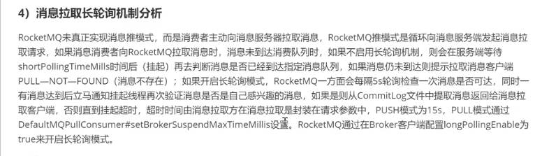

推测他可能会问的问题

## 简单介绍你的项目
我的研究方向是智能计算，即就是通过一些启发式算法如 遗传算法，模拟退火算法来对旅行商问题进行 优化求解。

我的项目就是在实验室课题衍生的，物流配送优化平台。
这个项目背景就是 利用现实生活中的任务的关联性，如配送这个订单，可能前几个月前几个星期存在类似的任务，而通过在历史数据库中匹配到离它最相似的topK任务，找到相似任务之后利用它们的相似性可以来促进当前任务的求解。 

整个平台我用springboot进行开发，用RocketMQ对任务进行存取，在消费者端调用dubbo接口实现，对于topK任务的匹配，采用milvus 搜索引擎进行搜索。

对于存在相似任务的任务，该平台可以 在提高收敛速度的情况下，同时可以搜索到更优的结果。

## 职业规划

## 优缺点
优点：比较乐观，我觉得我这个不容易妄自菲薄，
缺点：很难拒绝别人的请求，或者拒绝后良心会不安，唱歌难听

## 最近在看什么书

多线程与高并发
大话设计模式

## 项目承担的角色和做的工作？

项目的课题来源来自我的毕业课题，因此整个项目都是我在做，平台的开发以及算法的编写。

## 项目遇到的困难有哪些？
1. 消费者如何把消费结果返回给用户
2. 面对海量的特征数据，如何进行匹配topK问题

## 如何解决这些困难
1. 最开始我是想重新建立一个 生产者与消费者，将原来的生产者与消费者颠倒，之前的消费者消费的结果发送到 一个topic下，让原来的生产者去监听，然而我觉得这样的话随着用户的增加每次都需要启动一个生产者，而且我实现的时候也出现了一个问题。后来我就用一个中间表去保存这个结果，让用户去访问这个表去得到这个结果

2. 对于这个海量特征数据，在我发现存在向量搜索引擎的时候就已经解决了，我可以说一下没找到之前的思路，我当时是想构建一个k-d树，然后把

## RocketMQ
### 为什么要使用rocketmq

当时调研了几个mq
1. 选型时qps压力主流的mq都能满足
2. 功能全面，RocketMQ支持顺序消息，事务消息等
3. RocketMQ 开发语言时java，使用的时候我可以看源码学习
4. 当时学了RocketMQ,想要拿来使用一下，锻炼一下

### RocketMQ 没有Push

## Dubbo

### 为什么要使用dubbo？
为了方便以后的机器的扩展，可以增加同门的电脑来跑实验，因此就使用dubbo来进行负载均衡
同时dubbo框架还提供了一些 查看接口调用次数等等功能。

### dubbo工作原理
从大的范围来说，dubbo分为三层，business业务逻辑层由我们自己来提供接口和实现还有一些配置信息，RPC层就是真正的RPC调用的核心层，封装整个RPC的调用过程，负载均衡，集群容错，代理，
remoting则是对网络协议和数据转换的封装。

1.服务启动的时候，provider和consumer根据配置信息，连接到注册中心register，分别向注册中心注册和订阅服务

2.register根据服务订阅关系，返回provider 信息到consuer，同时consumer会把provider 信息缓存到本地。如果信息有变更，consumer 会收到来自register 的推送。

3.consumer 生成代理对象，同时根据负载均衡策略，选择一台provider,同时定时向monitor记录接口的调用次数和时间信息

4.拿到代理对象之后，consumer通过代理对象发起接口调用

5.provider 收到请求后对数据进行反序列化，然后通过代理调用具体的接口实现接口实现

### 注册中心挂了可以继续通信嘛？

可以，因为客户端第一次从注册中心获取服务端的服务后，会缓存在自己本地，下一次调用服务端不用去请求注册中心，因此注册中心挂了是可以继续通信的

### dubbo支持不同的协议
1. dubbo协议（默认走dubbo协议，单一长链接，NIO异步通信）
   （NIO通信原理，NIO采用了Reactor模式（类似于观察者模式，不同之处在于Reactor模式可以监听多个主题），通过一个多路复用器来监听多个客户端的网络句柄，一旦监听到客户端的请求消息，将对应的请求消息转发给对应的Handler（业务处理类))）
   适合场景：传输数据量较小，但是并发很高
2. rmi协议
   java 二进制序列化，多个短连接，适合消费者和提供者数量差不多，适用于文件的传输，一般较少

3. hessian协议
   走hessian序列化协议，多个短连接，较少使用
4. http协议
   走json序列化
5. webservice
   走soap文本序列化

### dubbo负载均衡策略和集群容错策略？动态代理策略？
dubbo负载均衡策略
1. random loadbalance
2. roundrobin loadbalance
3. leastactive loadbalance
4. consistanthash loadbalance
dubbo集群容错
1. failover cluster模式
   失败自动切换，自动重试其他机器
2. failfast cluster模式
   一次失败就立即失败，常见于写操作
3. failsafe cluster模式
   出现异常忽略
4. failback cluster模式
   失败了自动记录请求，然后定时发送，比较适合消息队列这种情况
5. focking cluster模式
    并行的调用多个provider，只要一个成功就立即返回
6. broadcast cluster模式
   逐个调用所有的provider

### dubbo 的动态代理策略
默认使用javassist动态字节码生成，创建代理类

## Spring

### IOC 和AOP 的理解？它们的实现原理是什么？
IOC 叫做控制反转，指的是通过Spring来管理对象的创建，配置和生命周期，这样相当于把控制权交给了Spring，不需要人工来管理对象之间的复杂的依赖关系，这样做的好处就是解耦。在Spring里面，主要提供了BeanFactory和ApplicationContext 两种IOC 容器，通过他们来实现对Bean的管理。

AOP叫做面向切面编程，它是一个编程范式，目的提高代码的模块性。Spring AOP基于动态代理的方式实现，如果是实现了接口的话就会使用JDK动态代理，反之则使用CGLIB代理，Spring 中AOP的应用主要体现在事务，日志，异常处理等方面，通过在代码的前后做一些增强处理，可以实现对业务逻辑的隔离。

### JDK动态代理和CGLIB代理有什么区别？
JDK 动态代理 针对类实现了某个接口，AOP则会使用JDK动态代理的方式实现，他基于反射的机制实现，生成一个实现同样接口的一个代理类，然后通过重写方法的方式，实现对代码的增强。

而如果某个类没有实现接口，AOP则会使用CGLIB代理。他的底层原理是基于asm第三方框架，通过
修改字节码生成一个子类，然后重写父类的方法，实现对代码的增强。

## 为什么要选择华为？
因为我觉得华为是一家富有创新能力与活力的公司，对我来说是一个能够得到成长的好平台。而且华为对我来说比较亲切。

## 职业规划？

我对我未来的职业规划是，在工作的几年内，提升自己的技术的广度和深度，比对分布式

## 如何看待华为文化？
我对华为文化的理解  就感觉华为像只军队一样，团结一致，有着家国情怀。每个人都像军人一样艰苦奋斗。
