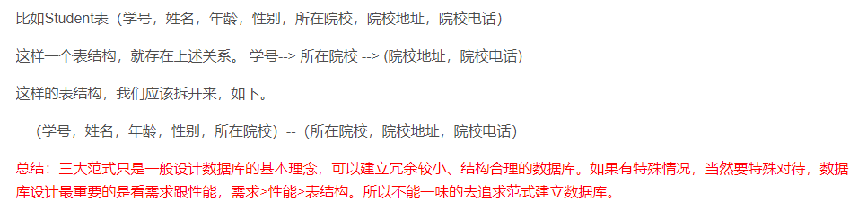
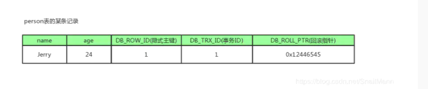

# 牛客字节面经汇总
[toc]
# MySQL
## mysql 索引八股，redo log 说一说
redo log 重做日志。redo log 中记录了物理层面的数据页，偏移量作了XXX更新。应对的问题是：MySQL异常宕机后，如何将没来得及提交的事物数据重作出来。

## 三大范式
第一范式（1NF):列不可再分
1. 每一列属性都是不可再分的属性值，确保每一列的原子性
2. 两列的属性相近或相似或一样，尽量合并属性一样的列，确保不产生冗余数据
第二范式 (2NF)：每一行可唯一被区分
第二范式（2NF）是在第一范式的基础上建立起来的，即满足第二范式（2NF）必须先满足第一范式（1NF）.
第二范式（2NF）要求数据库表中的每个实例或行必须可以被唯一地区分。为实现区分通常为表加上一个一个列，即主键。


第三范式 (3NF)：属性直接依赖于主键
数据不存在传递关系，即每个属性都跟主键有直接关系而不是间接关系。



## mysql索引优化（结合项目从设计表，explain以及join优化详细聊了自己的看法）

## MVCC
MVCC,多版本并发控制。它在数据库中的目的就是为了提高数据库并发性能，是一种用来解决读-写冲突的无锁并发控制，也就是为事务分配单向增长的时间戳，为每个修改保存一个版本，版本与事务时间戳关联，读操作只读该事务开始前的数据库的快照。
### MVCC的实现原理
MVCC的实现原理主要是依赖记录中的3个隐式字段，undo log，Read View来实现的。

#### 隐式字段
每行记录除了自定义的字段外，还有数据库隐式定义的 DB_TRX_ID, DB_ROLL_PTR,DB_ROW_ID等字段

* DB_TRX_ID:
  6 byte,最近修改（修改/插入）事务ID:记录创建这条记录/最后一次修改该事务的事务ID
* DB_ROLL_PTR:
  7 byte,回滚指针，指向这条记录的上一个版本（存储于rollback segment里）
* DB_ROW_ID:
  6 byte,隐含的自增ID（隐藏主键），如果数据库没有主键，InnoDB会自动以DB_ROW_ID产生一个聚簇索引


#### undo日志
undo log 主要分为两种：
* insert undo log
  代表事务在insert新纪录时产生的undo log，只在事务回滚时需要，并且在事务提交后可以被立即丢弃
* update uodo log
  事务在进行update 或delete时产生的undo log，不仅在事务回滚时需要，在快照读时也需要；所以不能随便删除，只有在快照读或事务回滚不涉及该日志时，对应的日志才会被purge 线程统一清除。


#### Read View

Read View就是事务进行快照读操作的时候生产的读视图（Read View），在该事务执行的快照读的那一刻，会生成数据库系统当前的一个快照，记录并维护系统当前活跃事务的ID（当每个事务开启时，都会被分配一个ID, 这个ID是递增的，所以最新的事务，ID值越大）


#### 整体流程
可重复读是使用多版本并发控制实现的，即 MVCC。在 innodb 中，对每一行记录都会有三个隐藏列(行号，事务 id，回滚指针)。开启事务后第一条增删改语句会生成比事务 id。第一条查询语句会生成 readView(存放当前未提交的事务 id ，且在可重复读隔离级别下会沿用此 readView)，后面再查询会从最新纪录的事务 id 与当前 readView 中比对，如果存在则沿着回滚指针向前寻找，直到对应纪录的事务 id 不在未提交事务 id 中，则返回结果集，此过程保证了可重复读。幻读也是使用 mvcc 解决的，查询时，某条数据事务 id 大于 readview 中的最大事务 id 则其不可见。


## RC, RR 级别下的InnoDB快照读有什么不同？
正是Read View生成时机的不同，从而造成RC,RR级别下快照读的结果的不同

* 在RR级别下的某个事务的对某条记录的第一次快照读会创建一个快照即Read View，将当前系统活跃的其他事务记录起来，此后在调用快照读的时候
* RC下，事务在每次Read操作时，都会建立Read View

## mysql 说一下隔离级别，分别解决什么问题

* 读未提交：啥也没解决，会出现脏读，不可重复读，幻读
* 读已提交：解决了脏读问题，但是不可重复读
* 可重复读：解决了不可重复问题，配合mvcc+间隙锁解决了幻读问题
* 可串行化：解决了幻读问题

# Redis

## redis zset八股，和红黑树比较，为什么用跳表？
在做范围查找的时候，红黑树比跳表要复杂，红黑树做范围查找时，还需要用中序遍历查找，实现比较困难。而跳表只需要在对底层的链表进行遍历即可。

平衡树的插入和删除操作可能会引起子树的调整，逻辑复杂。而跳表的插入和删除只需要修改相邻节点的指针即可。

跳表在插入的时候，考虑将要插入的数据也插入到索引中去，在这里使用的策略就是通过随机函数生成一个随机数k，然后将要插入的数据同时插入到k级以下的每级索引中。

## redis 缓存穿透，缓存击穿，缓存雪崩，继续八股
缓存雪崩：大量的key在同一时间过期，导致大量的请求从缓存打到数据库中，或者可能是因为redis宕机了。

前者可通过在设置过期时间，后者可以通过部署redis 高可用集群，redis哨兵或者主从架构

缓存击穿：热点数据过期

不设置过期时间

缓存穿透：是指数据既不在redis 也不在 数据库中，导致请求在访问缓存时，发生缓存缺失，再去访问数据库时，也没有。

设置布隆过滤器判断数据是否存在

在前端判断请求是否合法


## Redis单线程为什么这么快，然后深挖底层epoll（为什么单个线程监听多个套接字不会阻塞）

1. redis完全基于内存
2. 数据结构简单，
3. 使用IO多路复用模型，非阻塞IO
4. 采用单线程，避免了不必要的上下文切换和竞争条件（redis6.0 使用了多线程，但是它只是用多个IO线程来处理网络请求，提高网络请求处理的并行度。但是，Redis 的多IO线程只是用来处理网络请求的，对于对写命令，Redis 仍然使用单线程来处理。）


## Redis单线程潜在风险点


## Redis的淘汰算法（LRU算法与常规LRU哪里不同）
8个
noeviction---不淘汰，因此没法解决
volatile-random---随机淘汰---肯定不能
volatile-ttl---针对过期时间找到时间最短的淘汰---不一定（除非你知道数据再什么时候被访问）
volatile-lru---
volatile-lfu---
allkeys-lru----
allkeys-random----随机访问，肯定不行
allkeys-lfu----

为了避免操作链表的开销，Redis 在实现LRU策略使用了两个近似方法：

Redis 使用RedisObject 结构来保存数据的，RedisObject 结构中设置了一个lru字段，用来记录数据的访问时间戳；
Redis 并没有为所有的数据维护了一个全局的链表，而是通过随机采样方式，选取一定数量的数据（例如10个）的数据放入候选集合，后续在候选集合中根据lru字段值的大小进行筛选。


## Redis持久化（RDB,AOF,混合持久化）


## AOF重写
重写可以让日志文件变小。
重写机制为什么可以让日志文件变小？重写机制具有“多变一”功能。所谓“多变一”，也就是说，旧日志文件中的多条命令，再重写后的新日志中变成了一条命令。

# Java
## String 要动态代理的时候，用哪个？

jdk动态代理

## synchronized 和static synchronized区别
synchronized 锁的是对象，static synchronized 锁得是类模板
## 多态

同一个接口具有多个不同表现形式，是指一个实例对象的相同方法在不同情形有不同的表现形式。（继承，重写，父类引用调用子类方法）
## 数组和链表查询某值谁快？
数组快
## Hashmap 八股

## Linkedhashmap和hashmap的区别
相比于hashmap，linkedhashmap维护了一个链表的结构，如果是访问顺序，那put和get操作已存在的Entry时，都会把Entry移动到双向链表的表尾(其实是先删除再插入)。
## ThreadLoacl的原理

threadlocal 本质上应该是一个map，key是线程 的句柄，而value是需要保持的值。

1、ThreadLocal是线程本地存储，在每个线程中都创建了一个ThreadLocalMap对象，每个线程可以访问自己内部ThreadLocalMap对象内的value。

## 为什么key使用弱引用可以解决一部分内存泄漏，但是不能完全解决
每个thread都存在一个map，map的类型是ThreadLocal.ThreadLocalMap
key为threadlocal实例，为弱引用，
因此当threadlocal置为null时，threadlocal会被回收

不能完全时value 无法被回收。
只有当thread结束后，才会被回收。

可以调用threadlocal remove方法。但是在threadlocal 使用get，set方法发现key为null时会清楚


## 四大引用的区别 这里一直扯到了垃圾回收机制
强引用：一个对象具有强引用，那么它无法被垃圾回收
软引用：软引用，如果内存足够，就不会被回收，内存不够，就会
弱引用：不管内存够不够，都会被回收
虚引用：在任何时候都可能被垃圾回收。虚引用必须和引用队列联合使用。


## 虚引用的具体作用
为一个对象设置虚引用的目的就是能在这个对象被回收的时候收到一个系统通知

## 如何解决hash冲突
1. 开放定址法

2. 再hash

3. 链地址法

4. 公共溢出区


# Spring
## spring bean 依赖如何解决？
三级缓存 
## Spring ioc 和Aop 两大核心思想
ioc : 控制反转，指容器控制程序对象之间的关系，而不是传统实现中，由程序代码直接操控。

aop：面向切面编程，指的是在运行时，动态地将代码切入到类地指定方法，指定位置上的编程

## SpringIOC的优势说一个具体的例子
比如说一个类修改了构造函数，如果没有使用ioc，那么还需要修改依赖对象调用者
但是使用了则不需要。

## Spring AOP的具体使用，是怎么实现的，动态代理具体是怎么实现的


spring aop 基于动态代理实现，在init方法后的，beanPostProcess 实现。


# 设计模式

## 单例模式
意图：保证一个类仅有一个实例，并提供一个访问它的全局访问点。
主要解决：一个全局使用的类频繁地创建与销毁。


## 工厂模式了解嘛？单例做什么的，怎么实现
工厂模式是指创建对象不会对客户端暴露逻辑，使用一个共同的接口来指向新创建的对象。
```java
public class Singleton {
    private static Singleton instance = null;

    private Singleton() {
    }

    public static Singleton getInstance() {
        // 两层判空，第一层是为了避免不必要的同步
        // 第二层是为了在null的情况下创建实例
        if (instance == null) {
            synchronized (Singleton.class) {
                if (instance == null) {
                    instance = new Singleton();
                }
            }

        }
        return instance;
    }
}
```


# IO模型

## IO多路复用，epoll和select区别

# 操作系统
## 线程通信方式
volatile 关键字
wait(),notify()方法
juc工具

套接字

## 进程有哪些状态

## 怎么实现这些状态转换的

## 阻塞和等待状态的区别

## 进程和线程的区别

## 线程的共享的资源


## 用户态和内核态的转变
为了需要限制不同的程序之间的访问能力，防止他们获取别的程序的内存数据，或者获取外围设备的数据，并发送到网络，CPU划分出两个权限等级--用户态和内核态。


## 虚拟内存

## 缺页中断，页面置换算法

## 磁盘调度算法

# Linux
## a是b的父进程，如果a挂了b会怎样？
## 僵尸进程和孤儿进程

# 计网
## 浏览器输入一个域名，会发生什么
1.浏览器拿到url时，首先会对url进行解析，使用DNS协议，通过域名得到IP地址。
（PS：浏览器会查询缓存，如果有这个网址的缓存则可以直接获取到ip，如果没有查询本机缓存，如果没有则进行DNS请求）。

2.得到ip后浏览器与服务器通过TCP三次握手建立连接。

3.浏览器构建HTTP请求报文，并通过TCP协议传送到服务器的指定端口。http请求报文一共包括三个部分：

请求行：指定http请求的方法，url，http协议版本等
请求头：描述浏览器的相关信息，语言，编码等。
请求正文：当发送POST,PUT等请求时，通常需要向服务器传递数据。这些数据就储存在请求正文中。
4.服务器处理HTTP请求，并回复响应报文。响应报文分为三个部分：

状态码：http服务常用的状态码及其含义如下
响应头：包含了响应的相关信息，如日期等
响应正文：服务器返回给浏览器的文本信息
5.浏览器页面渲染

6.断开tcp连接
四次挥手
## 计算机网络各种 从osi七层，https，tcp两次握手会怎样，如何保证不丢包，保证顺序。

## tcp和udp

## tcp怎么保证可靠性传输
1. 校验和
2. 序列号
3. 确认应答
4. 超时重传
5. 连接管理
6. 流量控制
7. 拥塞控制

## 拥塞控制

## ssl握手
## 客户端怎么验证ca证书，连接后怎么传输数据
## 现在我们进行这样一个视频面试，可能会用到哪些协议，你能想到的都说。
```
DNS、HTTP、HTTPS、TCP
```
## 视频传输你觉得会用到什么协议，为什么？

udp

# JVM
## JVM的垃圾回收机制
标记-清除：易产生垃圾

标记-复制：
标记-整理：
分代收集：
## 说下JVM中有哪些内存
程序计数器，
虚拟机栈：
堆：
本地方法栈：
元数据区：运行时常量池，classs文件


## 讲讲GC过程，标记整理算法怎么实现的
标记部分标记出需要清除的对象，完成标记后，不直接清理回收对象，而是将存货对象都想一端移动，然后，清理掉端边界意外的内存。

## 类加载机制

双亲委派机制。
jvm类加载器在加载一个类的时候，首先会让它的父加载器加载，父加载器加载不了，才会自己加载。


## GCroot都有那些呢
栈中引用的对象
静态变量引用的对象
本地方法栈引用的对象


## 内存什么时候会出现一个锯齿状的波动
频繁gc

## 为什么垃圾回收次数发生很多会不好。

## 那内存的波形图是很小的锯齿形，很很大的锯齿形那种好
## 那波动很大怎么解决？
## 在一个for循环中每次都需要建立一个很大的对象，这一个对象就快把内存占满了，不想每次都发生GC又不想每次都重新设置该怎么办。缓存的设计

