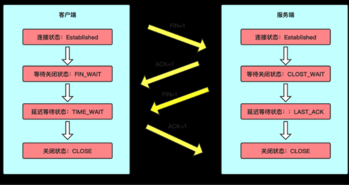
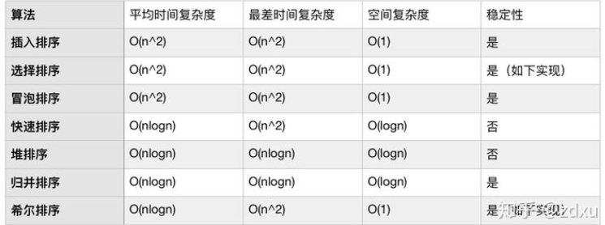
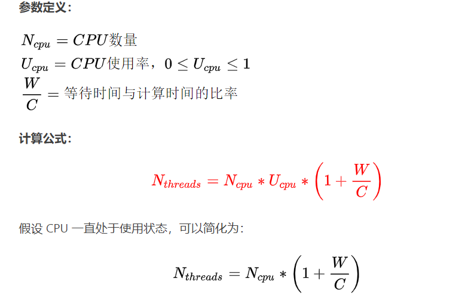
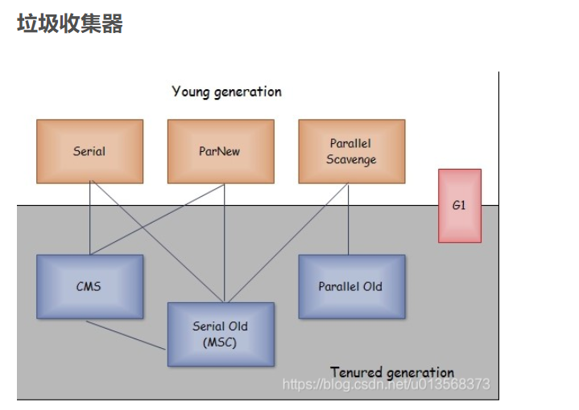

[toc]


# 美团牛客后端面经

#1.
##  Java 接口和抽象类的区别

接口的设计目的，是对类的行为进行约束（约束了行为的有无）
抽象类的设计目的，是代码复用。 当不同的类有某些相同的行为的时候，其中一部分的实现方式一致时，可以让这些类派生于一个抽象类，抽象类中实现了B，避免所有的子类来实现它。

相同点：
（1）都不能实例化
（2）接口的实现类或抽象类的子类都只有实现了接口或抽象类的方法后才能实例化

不同点：
（1）接口只有定义，不能有方法的实现，而抽象类可以有定义和实现
（2）实现接口的关键字为implements，继承抽象类的而关键字为extends。一个类可以实现多个接口，但一个类只能继承一个抽象类。所以，使用接口可以间接地实现多重继承。
（3）接口强调特定功能的实现，而抽象类强调所属关系
（4）接口成员变量默认为public static final，必须赋初值，不能被修改

## 浏览器输入网址经历哪些过程？

url解析：dns解析
知道ip地址后：tcp三次握手
发起http请求，
HTTP 请求发出后会将数据包交给下层协议栈处理，在传输层和网络层该数据包会被分别加上 TCP 头和 IP 头，并且被发送出去，沿路的网关会收到这个数据包并进行识别和转发，直到该数据包被服务器收到，通过相同的流程返回回复数据包。


## DNS域名解析使用哪个传输层协议，解析后得到的ip地址属于网络模型中的哪一层？

udp，应用层。

## HTTP与WebSocket区别
HTTP 是单向的，客户端发送请求，服务器发送响应。举例来说，当客户端向服务器发送请求时，该请求以HTTP或HTTPs的形式发送，在接收到请求后，服务器会将响应发送给客户端。每个请求都与一个对应的响应。一个request 对应一个responce。

websocket 是双向的，在客户端-服务器端通信的场景中使用的全双工协议，他基于http完成一部分握手。它即可以让客户端去拉，也可以让服务器去推送内容。


## 线程池参数有哪些，具体应该怎么配置？
核心线程数
最大线程数
队列
拒绝策略
线程空余时间


## Java主要用过哪些容器？ HashMap


## HashMap1.8怎么实现？和1.7之前有什么区别？和ConcurrentHashMap 有什么区别？
jdk1.7 用的是头插法，而jdk1.8及之后使用得都是尾插法。
头插法能够提高插入得效率，但是会出现（并发时）链表死循环问题。
jdk1.8后hashmap中加入了红黑树这个数据结构
 
 concurrentHashMap在jdk1.8中取消了segment, 采用synchronized + volatile+cas 来进行并发。


## letcode347


# 2.
## 1.面向对象和面向过程的区别


## 2.什么时候适合使用面向对象，什么时候使用面向过程


##  3.多态的底层原理，重载和重写在jvm的实现（只知道重写是方法表，重载不太清楚）

##  4.public和private是在运行时进行验证还是在编译时就进行验证。（不清楚）

##  5.如果让你设计创建对象的底层实现，你会怎么实现？ （直接按照jvm内存结构来说）


##  6.jvm的内存结构？

程序计数器：
虚拟机栈：
本地方法栈：
元数据区：
堆：
## 7.jvm线程和操作系统线程之间的区别和联系（不清楚）
Jvm线程实质上就是操作系统的线程，通过系统调用，将程序的线程交给操作系统内核进行调度。

jvm线程的状态跟操作系统状态是不一致的。


## 8.进程的通信方式，讲到了共享内存


## 9.紧接上面，共享内存的生命周期（不清楚）
共享内存的生命周期跟内核的生命周期是一致的。

## 10.socket可以TCP和UDP共用吗？（回答不可以，面试官让我回去再看看）

## 11.socket种accept()和TCP三次握手之间的前后顺序。

## 12.DNS和HTTP，在传输层使用那些协议。
dns使用了tcp，udp
http 大多都是使用tcp
## 13.为什么DNS即使用TCP又使用UDP
DNS使用udp是进行域名解析，保证 速度
而使用tcp则是在区域传送中使用，dns服务器主从复制时保证传输数据的可靠
## 14.HTTP默认端口号，可以有其他端口吗？进程可以共用多个端口号吗？
80

## 15.数据库的隔离级别
1. 读未提交 
2. 读提交 
3. 可重复读  
4. 可串行化 
## 16.object类的equals()方法和clone()方法是做什么的，以及应用场景，什么时候需要equals和hashcode保持一致


# 3.


## 项目中如何实现登录操作？

## 有没有考虑到分布式session 问题？有哪些解决方案，项目中用到了哪种？

## cookie 和session ，token 的区别


## get 和post 的区别
get 把请求放在url中，post通过请求体来传递参数

get产生一个tcp数据包

post产生两个数据包。
post先发送header，浏览器响应100continue，浏览器在发送data，服务器响应200 ok

据研究，在网络环境好的情况下，发一次包的时间和发两次包的时间差别基本可以无视。而在网络环境差的情况下，两次包的TCP在验证数据包完整性上，有非常大的优点。

并不是所有浏览器都会在POST中发送两次包，Firefox就只发送一次。

## osi有哪些协议？http属于哪一层？tcp和udp属于哪一层


## tcp如何实现的安全可靠
 使用三次握手，四次挥手保证了连接
 使用序列号保证了按序到达
 使用滑动窗口保证了接收方能够接收到消息
 拥塞控制保证了网络的可靠
 校验和保证了包的准确
 超时重传


## hashmap和concurrenthashmap介绍一下？ 一个线程读，一个线程写，另一个线程写的过程有clone 操作，concurrentHashMap怎么保证线程安全？

volatile

## Synchronized 关键字底层原理，四种锁状态什么情况下会怎么转变？轻量级锁是直接变成重量级锁吗？

## gc算法，垃圾回收器有哪些？ G1收集器会收集哪些对象？

## gcroot有哪些？
虚拟机栈（栈帧中的本地变量表）中引用的对象
方法区中类静态属性引用的对象
方法区中常量引用的对象
本地方法栈中JNI（即一般说的Native方法）引用的对象

## 1、介绍项目
## 2、项目中哪些场景中用到了redis（缓存和分布式锁）？使用CAS如何实现并发？
## 3、说一下cookie、session和token的区别？
## 4、说一下spring的IOC和AOP？
ioc : 控制反转，指容器控制程序对象之间的关系，而不是传统实现中，由程序代码直接操控。

aop：面向切面编程，指的是在运行时，动态地将代码切入到类地指定方法，指定位置上的编程
## 5、spring用到了哪些设计模式？
单例
简单工厂：beanFactory
模板：JdbcTemplate
适配器： HandlerAdaptor
代理模式：aop底层
策略模式：spring框架的资源访问resource接口。根据不同的文件提供了不同的实现类


## 6、讲一下动态代理如何实现的？jdk与cglib的区别？

## 7、springMVC的原理

## 8、一个请求是如何通过RequestMapping注解到达对应的方法的？（对SpringMVC底层了解不够，我没答上来）

## 9、项目当中用到了Histrix，讲一下什么是服务熔断和服务降级？
## 10、算法题：从source字符数组中找target字符数组的第一次出现位置，找不到就返回-1.
## 11、手写单例的懒加载模式，懒加载模式有什么并发问题？如何改进？
```java
public class Singleton {

    private static volatile Singleton instance;

    public static Singleton getSingleton(){
        if(instance==null){
            synchronized (Singleton.class){
                if(instance==null){
                    instance=new Singleton();
                }
            }
        }
        return instance;
    }
}

```
# 4.


## 1. 进程线程的区别

## 2. 进程之间的通信方式

## 3. 共享内存xxx（不会，也忘记是啥问题了）

## 4. 僵尸进程是什么，为什么会产生

## 5. 虚拟内存到物理内存的寻址方式

## 6. 页表的作用
页表存储了虚拟内存跟物理内存的映射关系。

## 7. 进程调度算法

## 8. fork xxx（不会，没看到过的问题）

## 9. B+树的数据结构 ，B+树是怎么分裂的（不会）

## 10. 为什么是三次握手，两次会怎么样

## 11. 他介绍了time-wait，问为什么要有这个状态
1）可靠终止tcp连接，如果最后一个ack应答丢失，那么server没有收到ack则会超时重传fin报文，处于time-wait的client可以继续对fin报文做回复，向server发送ack报文
2） 保证让迟来的tcp报文段有足够的时间被识别和丢弃，以免影响建立的新连接。

## 12. tcp怎么保证数据的可靠性

## 13. volatile
volatile是相比于synchronized的加锁方式来解决共享变量的内存可见性的问题，更轻量的一种选择。

使⽤volatile声明的变量，可以确保值被更新的时候对其他线程⽴刻可⻅。
volatile使⽤内存屏障来保证不会发⽣指令重排，解决了内存可⻅性的问题。
不是绝对线程安全的，没有保证原子性。


## 14. threadLocal介绍，key是什么（不会，只说了key是弱引用）
key 是threadLocal 实例

## 15. java的4种引用
强 软 弱 虚

## 16. cms垃圾回收器介绍 

## 17. 如何判断对象死亡
1. 引用计数法
2. 可达性分析

## 18. 垃圾回收中的三色标记法（不会）
黑 白 灰
因为原本的垃圾回收算法都是需要stop the world的，
而三色标记法之前叫标记清扫（Mark and Sweep），这个算法就是严格按照追踪式算法的思路来实现的。这个算法会设置一个标志位来记录对象是否被使用。最开始所有的标记位都是0，如果发现对象是可达的就会置为1，一步步下去就会呈现一个类似树状的结果。等标记的步骤完成后，会将未被标记的对象同一清理，再将所有标记位设置位0的清除。这个算法最大的问题就是GC 执行期间需要把整个程序完全暂停，不能异步进行GC操作。

三色标记法可以异步执行，从而可以以中断时间极少的代价或者完全没有中断来进行整个GC.

三色标记法很简单，首先将对象用三种颜色表示，白，灰，黑，最开始所有对象都是白色的，然后把其中全局变量和函数栈的对象置为灰色。第二步把灰色的对象全部置为黑色，然后把原先灰色对象指向置为灰色。一次类推，等到没有对象被置为灰的时候截至。


因为多了一个白色的状态存放不确定的对象，所以可以异步地执行。当然异步执行地代价可能灰造成遗漏。

## 19. cpu到达100%了，如何排查代码（不会）


# 5.


## 1.MySQL这个是你个人在用，还是学校里有大范围的使用？

## MySQL数据库的事务隔离级别有哪些？

## 事务有哪些特性？
acid

## 了解主从容灾吗？

## 数据库里的一些协议处理，数据复制协议、日志复制协议，这些了解吗？

## 计算机网络一般分几层？
应用层
表示层
会话层
传输层
网络层
物理链路层
物理层
## TCP和IP分别在哪层？

传输层
网络层

## TCP协议的结构是怎么样的？
16位源端口
16位目标端口
32 序列号
32 确认序列号
6个flag
16位窗口
16位紧急指针
16位校验和


## TCP的三次握手、四次挥手。四次挥手中客户端和服务端所在的具体状态分别都叫什么？




## HTTP 状态码
100： 表示当前信息没问题，可以继续
200： 请求成功，一般用于get与post请求，
201： 成功请求并创建了资源
204： 无内容

300：表示请求资源包含多个位置
301：永久重定向
302：临时移动
305:使用代理

400：客户端请求语法错误，无法理解
403：服务器理解该请求，并拒绝
404：客户端请求的资源无法找到

500：服务器内部错误
502：无效响应


## Linux命令熟悉哪些？
head
tail
grep
vim
cd
netstat
top


## 有一个.log文件里存了一些电话号码，写一个Linux命令去统计某一个电话号码出现的次数
grep -n "" filename
查看前10行
head filename


## 快速排序和归并排序的算法思想说一下
快速排序的思想是  分治与递归
归并排序的思想是


## 这两个排序的时间复杂度是多少？怎么去计算？


## 对一个排序算法，你觉得哪方面是最需要考量的？

1. 时间效率
2. 内存消耗
3. 稳定性





# 6.
作者：牛客866557176号
链接：https://www.nowcoder.com/discuss/711243?type=2&channel=-1&source_id=discuss_terminal_discuss_hot_nctrack
来源：牛客网

##1. 线程池，核心线程数、最大线程数、阻塞队列所带来的线程数变化流程，抛弃策略
##2. JVM的垃圾回收方法（讲了5种，把一面中不会的三色标记法讲了一下）
##3. StringBuilder与StringBuffer的区别
##4. HashMap的底层结构
##5. 除了拉链法以外，还有什么方法可以解决hash冲突（忘了...hashmap很早看的）
##6. ConcurrentHashMap为什么可以保证并发安全
   cas+synchornized+volatile
##7. tcp的四次挥手
##8. 服务端如果在收到客户端的挥手信号的时候，已经没有需要发送的数据了，能不能改成三次挥手（我回答可以，面试官说这是一题开放题）
##9.  Redis的主从复制
##10. Redis主从复制过程中发生宕机了怎么办（不会）
##11. 消息队列的选择，项目中用到了rabbitmq，简单介绍了为什么选它，以及其他的常见mq
##12. 快排与堆排序的比较（堆排序具体过程忘了...）
##13. 如果在排序后，两个相同的数的前后位置保持不变，就认为排序是稳定，那么快排是稳定的吗？（不稳定）


#7. 
作者：孤傲的虎王
链接：https://www.nowcoder.com/discuss/711060?source_id=profile_create_nctrack&channel=-1
来源：牛客网

##4.AQS中的加锁解锁大概过程

##5.项目中使用多线程有考虑过负面作用吗，怎么解决

##6.线程池参数（这里自己详细扩展了阻塞队列ArrayBlockingQueue,LinkedBlockingQueue在源码上的区别）

##7.SPI了解吗（只知道JDBC那里用到了Driver和DriverManager），这里引到了双亲委派
Service Provider Interface，是一种服务发现机制，它通过在classpath路径下的meta-inf/services文件夹查找文件。

##8.介绍一下双亲委派（自己详细介绍了双亲委派，什么时候会打破双亲委派，tomcat中的类加载）——会说就多说点。。。。
第二种，是JNDI、JDBC等需要加载SPI接口实现类的情况。

第三种是为了实现热插拔热部署工具。为了让代码动态生效而无需重启，实现方式时把模块连同类加载器一起换掉就实现了代码的热替换。

第四种时tomcat等web容器的出现。

第五种时OSGI、Jigsaw等模块化技术的应用。


##9.Mysql索引了解吗，介绍一下底层结构，为什么选用B+树

##10.设置索引的原则（这里结合实习项目用例子解释）


##11.sql优化（讲到了实习中的的join优化，开启MRR, join buffer，使用BKA算法）


##12.算法题：最长回文子串（两种方法实现）


#8.  
作者：julia_
链接：https://www.nowcoder.com/discuss/730153?type=all&order=time&pos=&page=1&ncTraceId=&channel=-1&source_id=search_all_nctrack
来源：牛客网

## 1.Spring AOP 底层原理
使用了动态代理的技术，利用截取消息的方式，对该消息进行装饰，以取代原有对象行为的执行

## 2.HashMap
### 2.1 底层数据结构
数组+链表+红黑树
### 2.2 如何扩容
数组变为2倍，然后将原数组的数据迁移过去，
因为新的索引为hash&(n-1)，意味着原来的hash所对应的那一位是否为0，0不变，1则新位置为原位置+旧数组长度。

## 3.ConcurrentHashMap
### 3.1 如何实现线程安全
synchornized +cas +volatile
### 3.2 size()方法是加锁的吗？如何实现的（baseCount+counterCells）
没有加锁，用volatile修饰的baseCount

## 4. 线程池参数
核心线程数
最大线程数
阻塞队列
keepAliveTime
拒绝策略
ThreadFactory
Unit

## 5. 线程池大小如何设置
根据计算密集型以及 IO密集型



## 6.IO 密集=N cpu*2如何计算


## 7.synchronized 的锁优化

1. 偏向锁
2. 轻量级锁
3. 重量级锁
4. 锁消除
5. 锁粗化
6. 自旋锁

## 8.常用垃圾收集器


serial:单线程
parnew：serial的多线程版本
parallel scavenge：多线程的收集器，目的是为了增加吞吐量
cms：划时代的意义在于垃圾回收线程可以跟用户线程同时工作，
使用标记清除算法收集老年代垃圾
工作流程主要有如下4个步骤：
* 初始标记：仅仅只是标记一下GC Roots能直接关联到的对象，速度很快，需要停顿（stop-the-world）
* 并发标记：进行gc roots tracing的过程，它在整个回收过程中耗时最长，不需要停顿
* 重新标记：为了修正并发标记期间因用户程序继续运作而导致标记产生变动的那一部分对象的标记记录，需要停顿
* 并发清除：清理垃圾，不需要停顿
**在整个过程中耗时最长的并发标记和并发清除过程中，收集器线程都可以与用户线程一起工作，不需要进行停顿。**


g1：它是面向服务端应用的垃圾收集器，在多cpu和大内存的场景下有很好的性能。


## 9. G1有哪些特点
G1 把堆划分成多个大小相等的Region，新生代和老年代不再物理隔离。

## 10. 如果线上 OOM， 如何排查
使用top命令查看一下线上的CPU，内存是否正常。
定位异常进程，看日志。
如果是OOM,用jstat -gc pid 1000 100(每秒)监控JVM内存运行状况和gc频率
jmap -dump ，使用jmap dump 内存快照
使用工具进行分析

## 11. MySQL事务隔离级别
读未提交：
读已提交：
可重复读：
可串行化

## 12. 可重复读解决了哪些问题
脏读、幻读、不可重复读的区别：1、脏读就是指当一个事务正在访问数据，并且对数据进行了修改；但是未提交，这时候另一个事务可以看到该事务没有提交的更新结果，这样造成的问题就是，如果第一个事务回滚，那么第二个事务在此所“看到”的数据就是一笔脏数据。


2、不可重复读是指在一个事务内，多次读同一数据；
3、幻读是指当事务不是独立执行时发生的一种现象。

不可重复读的重点是修改 :同一事务，两次读取到的数据不一样。

幻读的重点在于新增或者删除

同样的条件 , 第 1 次和第 2 次读出来的记录数不一样

脏读：强调的是第二个事务读到的不够新。


## 13. 脏读，不可重复读  幻读


## 14 聚集索引 非聚集索引
对于聚簇索引存储来说，行数据和主键B+树存储在一起，辅助键B+树只存储辅助键和主键，主键和非主键B+树几乎是两种类型的树。对于非聚簇索引存储来说，主键B+树在叶子节点存储指向真正数据行的指针，而非主键。

## 15.慢查询优化，会考虑哪些优化


## 16. 分页查询
select * from table limit 5;
## 17. redis分布式锁

## 18. 缓存穿透，缓存击穿 ，缓存雪崩以及解决方法

缓存穿透：数据既不在数据库中也缓存中，布隆过滤器

缓存击穿：热点数据在缓存中失效，大量请求打击到了数据库中， 热点数据不失效


缓存雪崩：大量数据在缓存中失效，给expire命令给过期时间加一个随机数，防止同时失效。

## 19 二叉搜索树第K小的元素
```java
class Solution {

    int res,k;
    public int kthLargest(TreeNode root, int k) {
        this.k=k;
        dfs(root);
        return res;
    }

    void dfs(TreeNode root){
        if(root==null) return;

        dfs(root.right);
        if(k==0) return;
        k--;
        if(k==0) res=root.val;
        dfs(root.left);
    }
}

```


##3. HashMap
###3.1 数据结构
###3.2 扩容
###3.3 扩容过程中链表如何迁移到新的位置（如果hash值第N+1位为0，则表示不需要调整该链表节点位置；如果为1，表示需要调整到 原索引+原数组长度的位置）
###3.4 为什么线程不安全
put 的时候导致多线程数据不一致
resize 多线程的时候导致形成环状

###3.5 什么情况下成为一个环状
头插法
##4. CurrentHashMap

##5. LRU是什么？如何实现
使用双向链表+哈希表来实现。

##6. 平衡二叉树
##7. 堆是什么？如何调整
##8. 口述：二叉树最近的祖先节点
```java
class Solution {
    public TreeNode lowestCommonAncestor(TreeNode root, TreeNode p, TreeNode q) {
        if(root == null || root == p || root == q) return root;
        TreeNode left = lowestCommonAncestor(root.left, p, q);
        TreeNode right = lowestCommonAncestor(root.right, p, q);
        if(left == null) return right;
        if(right == null) return left;
        return root;
    }
}

```
##9. 栈和队列，举个使用场景例子
##10. MySQL为什么InnoDB是默认引擎
##11. MySQL为什么使用B+ 树
##12. B+树的叶子节点链表是单向还是双向？双向，用于倒序
##13. MVCC是什么？作用？
##14. 更新是如何保证一致的？当前读
##15. 如何回滚一条记录？undo log
##16. undo log具体怎么回滚
##17. 如何查询慢sql产生的原因
##18. 索引失效的情况
##19. redis数据集合
##20. 有序集合
###20.1 应用场景、底层实现
###20.2 为什么数据量小的时候用压缩列表
###20.3 压缩列表 跳跃表的区别
##21. redis主从复制
###21.1 原理
###21.2 通过什么复制？RDB
###21.3 增量复制命令存在哪里？缓冲区
##22. RDB AOF优缺点
##23. Spring AOP原理 好处
##24. bean的初始化过程
##25. 算法题：topK