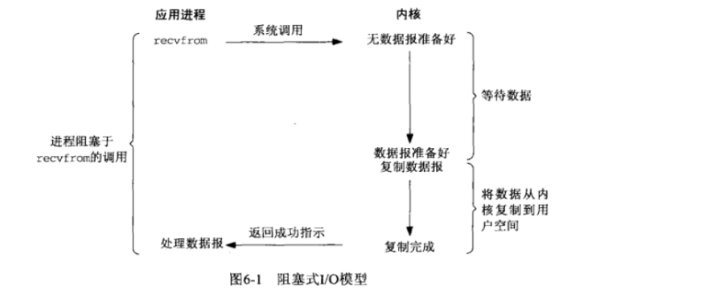
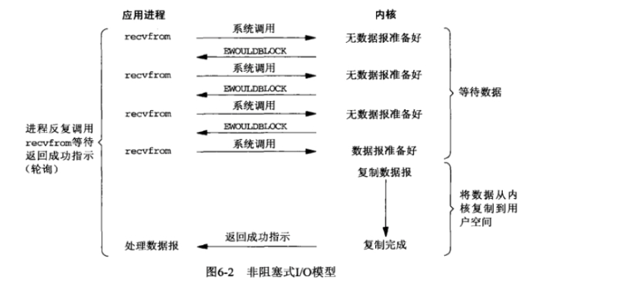
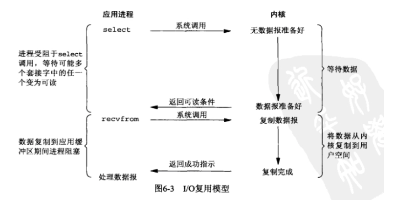
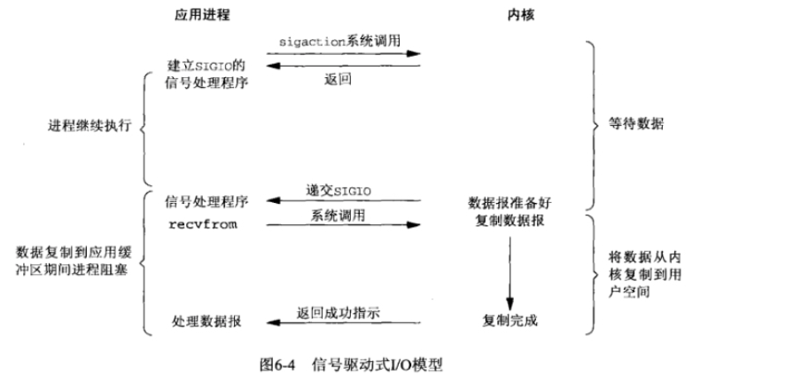
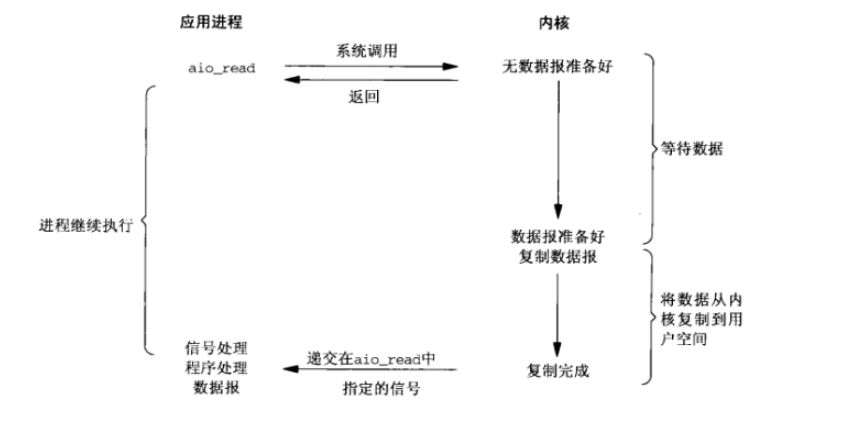
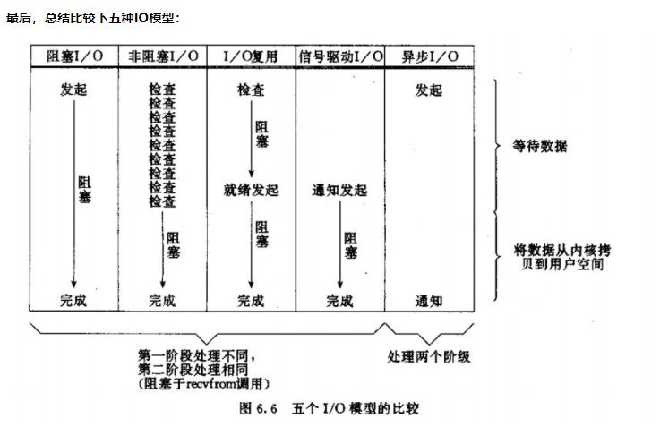
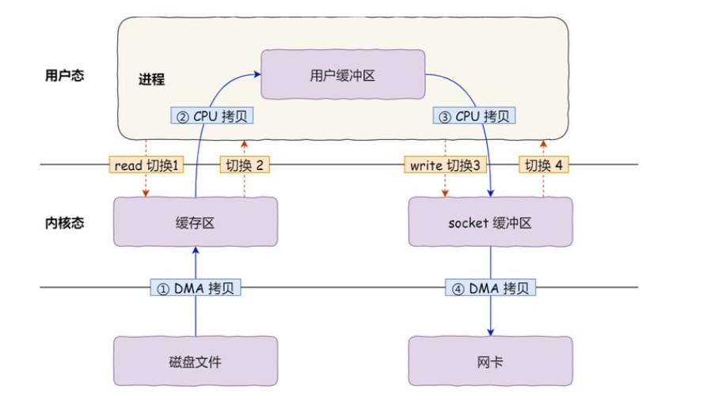
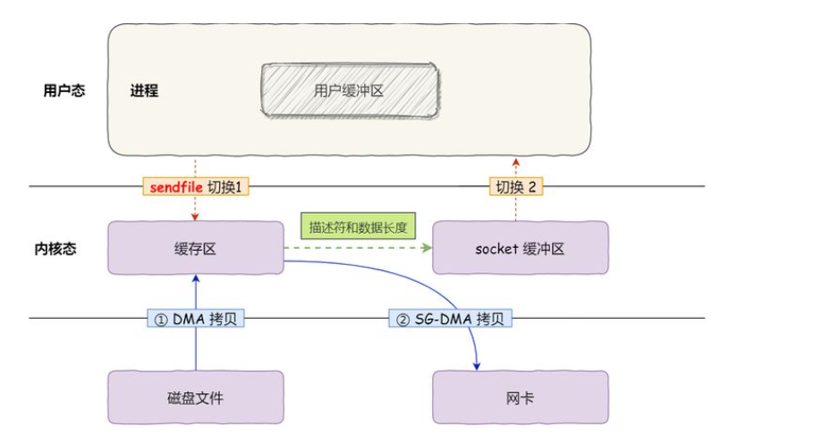

# 阿里java面经

1. 项目
2. 2TB的文件，如何在2GB的内存里，完成topN 的搜索
   复盘： 采用分治策略，把一个文件分解成多个小文件，保证每个文件大小都小于2GB，然后遍历这些文件，对遍历到的每个ip取hash（ip）%1000，把结果为i的ip存放到文件ai中.这样的一般每个小文件的大小为2GB左右，如果有的小文件仍然超过2GB，继续分解。

   接着统计每个小文件出现频数最高的N个词，
3. threadlocal（强引用跟虚引用）
4. 设计模式有哪些（单例，原型，工厂，适配器，动态代理，建造者，观察者，装饰器）
5. 分布式锁（分布式id，setnx，zookeeper）
6. java多继承
7. redis为什么快
   1. 完全基于内存
   2. 优化后了数据结构，性能极高
   3. 使用单线程，无上下文的切换成本
   4. 基于非阻塞的IO多路复用机制
8. io多路复用
   
9.  非阻塞io以及异步io的区别
    1. 阻塞io模型：一直等数据直到拷贝到用户空间，这段时间内进程始终阻塞。A同学用被子装水，打开水龙头装满水离开。
    2. 非阻塞io模型：不管有没有获取到数据都返回，如果没有数据过一段时间再看看，如此循环。B同学也用杯子装水，打开水龙头后发现没有水，它离开了，他也要等到有水并装满杯子才能离开去做别的事情。
    3. io复用模型：通过select，poll，epoll机制，等待文件描述符就绪时。 这个时候C同学来装水，发现有一排水龙头，宿管阿姨告诉他这些水龙头都没有水，等有水了在告诉他。于是等啊等，过了一会有水了。但不知道哪个水龙头有水了，一个个去试。
    4. 信号驱动io模型
       通过sigacation注册信号函数，等内核数据准备的时候系统中断当前程序，执行信号函数。 
    5. 异步io模型
        让内核等数据准备号，并且复制到用户进程空间后执行实现制定好的函数。E同学让宿管将杯子装满水后通知他。整个过程E同学都可以做别的事情，这才是真正的异步IO。
    
    
    
    
    
    
  
10. 零拷贝
    如果服务端要提供文件传输的功能，我们能想到的最简单的方式是：将磁盘上的文件读取出来，然后通过网络协议发送给客户端。
    传统io的工作方式，数据读取和写入是从用户空间到内核空间来回复制，而内核空间的数据是通过操作系统层面的I/O接口从磁盘读取或写入。
    
    期间，共发生了四次用户态和内核态的上下文切换，因为发生了两次系统调用，一次是read(),一次是write(),每次系统调用都得先从用户态切换到内核态，等内核完成任务后，再从内核态切换回用户态。
    其次，还发生了四次数据拷贝，其中两次是DMA的拷贝，另外两次则是通过CPU拷贝的，下面说一下这个过程：
    * 第一次拷贝，把磁盘上的数据拷贝到操作系统的内核缓冲区里，这个拷贝的过程是通过DMA搬运的
    * 第二次拷贝，把内核缓冲区的数据拷贝到用户的缓冲区里，于是我们应用程序就可以使用这部分数据了，这个拷贝过程是CPU完成的
    * 第三次拷贝，把用户缓冲区的数据拷贝到内核的socket缓冲区里，这个过程依然还是由CPU搬运的
    * 第四次拷贝，把内核的socket缓冲区里的数据，拷贝到网卡的缓冲区里，这个过程又是由DMA搬运的。
    
    而所谓的零拷贝，就是没有在内存层面去拷贝数据，也就是说全程没有通过CPU来搬运数据，所有的数据都是DMA（Direct Memory Access）进行传输的，而且两次的数据拷贝过程，都不需要CPU，2次都是由DMA来搬运。
    
    总体来看，零拷贝技术可以把文件传输的性能提高至少一倍以上。

11. 详细介绍rocketmq的实现原理
12. rocketmq 为什么快
    写入commitlog是顺序写入的，这样比随机写入的性能就会提高很高
    写入commitlog的时候不是直接写入磁盘，而是先写入操作系统的PageCache，
    最后操作系统异步写回
13. dubbo
14. dubbo负载均衡
15. 一致性哈希
16. 面向对象的设计原则（单一职责，开闭，里氏代换，依赖倒置，接口隔离，迪米特法则：一个软件实体应当尽可能少地与其他实体发生相互作用）
17. 单例模式的实现
    1. 饿汉式单例
    2. 懒汉式单例
    3. DCL(双重校验锁，volatile关键字，用来防止指令重排序)
    4. 枚举单例
 
18. synchronized 跟 ReentrantLock的区别
    synchronized是jvm自带的
19. 数据库的事务，以及各自的问题
    （读未提交：
    读提交：
    可重复读：
    可串行化：）
20. 脏读和幻读的区别
    （脏读是指一个事务读取到其他事务没有提交的数据。
    不可重复读：一个事务内多次根据同一查询查询出来的同一行记录的值不一致
    幻读：是指一个事务内多次根据同一条件查询出来的记录行数不一致）
21. 比赛经历
22. 英语
23. 高考语文

