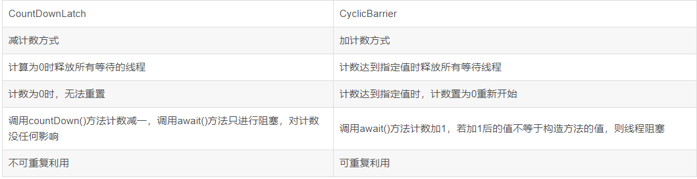

[toc]
# CountDownLatch 和CyclicBarrier 区别





## CountDownLatch 用法

CountDownLatch 类只提供了一个构造器
```java
public CountDownLatch(int count) {  };  //参数count为计数值
```

然后这三个方法是countDownLatch类中最重要的方法：
```java
public void await() throws InterruptedException { };   //调用await()方法的线程会被挂起，它会等待直到count值为0才继续执行
public boolean await(long timeout, TimeUnit unit) throws InterruptedException { };  //和await()类似，只不过等待一定的时间后count值还没变为0的话就会继续执行
public void countDown() { };  //将count值减1

```

CountDownLatch,一个同步辅助类，在完成一组正在其他线程中执行的操作之前，它允许一个或多个线程一直等待。

举例说明：
```java

package main.java.CountDownLatch;
 
import java.util.concurrent.CountDownLatch;
 

public class countDownlatchTest {
    public static void main(String[] args) throws InterruptedException {
        CountDownLatch countDownLatch = new CountDownLatch(5);
        for(int i=0;i<5;i++){
            new Thread(new readNum(i,countDownLatch)).start();
        }
        countDownLatch.await();
        System.out.println("线程执行结束。。。。");
    }
 
    static class readNum  implements Runnable{
        private int id;
        private CountDownLatch latch;
        public readNum(int id,CountDownLatch latch){
            this.id = id;
            this.latch = latch;
        }
        @Override
        public void run() {
            synchronized (readNum.class){
                System.out.println("id:"+id);
                latch.countDown();
                System.out.println("线程组任务"+id+"结束，其他任务继续");
            }
        }
    }
}


```
```
运行结果
id:0
线程组任务0结束，其他任务继续
id:4
线程组任务4结束，其他任务继续
id:3
线程组任务3结束，其他任务继续
id:2
线程组任务2结束，其他任务继续
id:1
线程组任务1结束，其他任务继续
线程执行结束。。。。
```

==线程在countDown()之后，会继续执行自己的任务，==
而CyclicBarrier会在所有线程任务结束之后，才会进行后续任务，

## CyclicBarrier 用法
CyclicBarrier 提供2个构造器
```java
public CyclicBarrier(int parties, Runnable barrierAction) {
        if (parties <= 0) throw new IllegalArgumentException();
        this.parties = parties;
        this.count = parties;
        this.barrierCommand = barrierAction;
    }

public CyclicBarrier(int parties) {
        this(parties, null);
    }
```

参数parties 是指让多少个线程或者任务等待至barrier状态，参数barrierAction为当这些线程都达到barrier状态时会执行的内容。

CyclicBarrier中最重要的是await方法
```java
public int await() throws InterruptedException, BrokenBarrierException { };//挂起当前线程，直至所有线程都到达barrier状态再同时执行后续任务；
public int await(long timeout, TimeUnit unit)throws InterruptedException,BrokenBarrierException,TimeoutException { };//让这些线程等待至一定的时间，如果还有线程没有到达barrier状态就直接让到达barrier的线程执行后续任务
```
实例代码
```java

public class CyclicBarrierTest {
    public static void main(String[] args) {

        CyclicBarrier s= new CyclicBarrier(7,()->{
            System.out.println("达到目的");
        });

        for (int i = 0; i < 15; i++) {
            final int temp=i;
            new Thread(()->{
                System.out.println("获取到了第"+temp+"目标");

                try {
                    s.await();
                } catch (InterruptedException e) {
                    e.printStackTrace();
                } catch (BrokenBarrierException e) {
                    e.printStackTrace();
                }
            }).start();


        }

    }
}
```

结果
```java
获取到了第2目标
获取到了第4目标
获取到了第0目标
获取到了第6目标
获取到了第7目标
获取到了第3目标
获取到了第1目标
达到目的
获取到了第9目标
获取到了第8目标
获取到了第5目标
获取到了第10目标
获取到了第11目标
获取到了第12目标
获取到了第13目标
获取到了第14目标
达到目的

```

值得注意的是：await()是对index做减法，而当index为0时，执行barrierCommand,同时会重新对index赋值parties，这就是可复用的原因