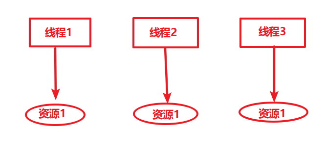
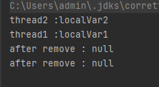
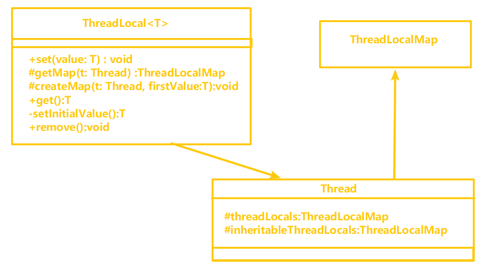
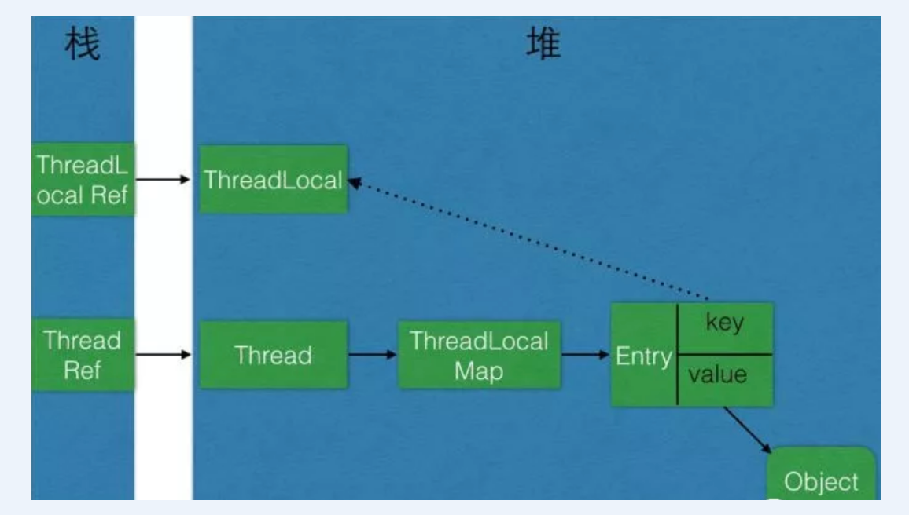
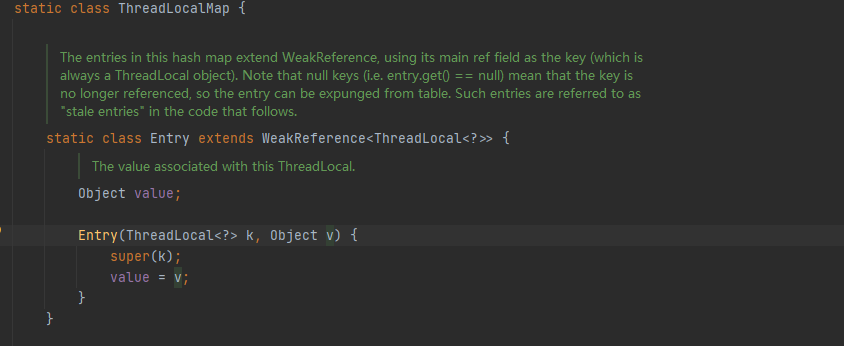

[toc]

#ThreadLocal


##什么是ThreadLocal

多线程访问同一个共享变量的时候容易出现并发问题，特别是多个线程对一个变量进行写入的时候，为了保证线程安全，一般使用者在访问共享变量的时候需要进行额外的同步措施才能保证线程安全性。ThreadLocal 是除了加锁这种同步方式之外的一种规避多线程访问出现线程不安全的方法，当我们在创建一个变量后，如果每个线程对其进行访问的时候访问的都是线程自己的变量这样就不会存在线程不安全问题。

ThreadLocal是JDK包提供的，它提供线程本地变量，如果创建了ThreadLocal变量，那么访问这个变量的每个线程都会有这个变量的一个副本，在实际多线程操作的时候，操作的是自己本地内存中的变量，从而规避了线程安全问题，如下图所示



## ThreadLocal的简单使用
```java
public class ThreadLocalTest {

        static ThreadLocal<String> localVar = new ThreadLocal<>();

        static void print(String str) {
            //打印当前线程中本地内存中本地变量的值
            System.out.println(str + " :" + localVar.get());
            //清除本地内存中的本地变量
            localVar.remove();
        }

        public static void main(String[] args) {
            Thread t1  = new Thread(new Runnable() {
                @Override
                public void run() {
                    //设置线程1中本地变量的值
                    localVar.set("localVar1");
                    //调用打印方法
                    print("thread1");
                    //打印本地变量
                    System.out.println("after remove : " + localVar.get());
                }
            });

            Thread t2  = new Thread(new Runnable() {
                @Override
                public void run() {
                    //设置线程1中本地变量的值
                    localVar.set("localVar2");
                    //调用打印方法
                    print("thread2");
                    //打印本地变量
                    System.out.println("after remove : " + localVar.get());
                }
            });

            t1.start();
            t2.start();
        }
    }

```

实验结果：


## ThreadLocal 的实现原理

根据ThreadLocal的类图结构


由上图可知，Thread类中由两个变量threadLocals 和 inheritableThreadLocals,二者都是ThreadLocal 内部类ThreadLocalMap类型的变量，我们通过查看内部ThreadLocalMap可以发现它类似于一个HashMap,只有当线程第一次调用ThreadLocal的set或者get方法的时候才会创建他们。

这里看了一下源码，发现是这样的，首先在线程里调用 ThreadLocal的设置里
```java
 localVar.set("localVar1");
```

进入ThreadLocal的源码
```java
public void set(T value) {
        Thread t = Thread.currentThread();
        ThreadLocalMap map = getMap(t);
        if (map != null)
            map.set(this, value);
        else
            createMap(t, value);
}

//返回Thread的threadlocals
ThreadLocalMap getMap(Thread t) {
        return t.threadLocals;
}
```

ThreadLocal 类型的本地变量是存放在具体的线程空间上，其本身相当于一个装载本地变量的工具壳，通过set方法将value添加到调用线程的**threadLocals**中，当调用线程调用get方法时候能够从它的**threadLocals**中取出变量。如果调用线程一直不终止，那么这个本地变量将会一直存放在他的**threadLocals**中，所以不使用本地变量的时候需要调用remove方法将**threadLocals**中删除不用的本地变量。下面我们通过查看ThreadLocal的set、get以及remove方法来查看ThreadLocal具体实怎样工作的


### set()方法源码
```java
public void set(T value) {
        Thread t = Thread.currentThread();
        ThreadLocalMap map = getMap(t);
        if (map != null)
            map.set(this, value);
        else
            createMap(t, value);
```

createMap不仅创建了threadLocals,同时也将要添加的value添加到了threadLocals

### get()方法源码
```java
 public T get() {
        Thread t = Thread.currentThread();
        ThreadLocalMap map = getMap(t);
        if (map != null) {
            ThreadLocalMap.Entry e = map.getEntry(this);
            if (e != null) {
                @SuppressWarnings("unchecked")
                T result = (T)e.value;
                return result;
            }
        }
        return setInitialValue();
    }
```


### remove()方法源码
remove 方法判断当前线程对应的threadlocals是否为null，不为null就直接删除当前线程中指定的threadLocals变量

```java
public void remove() {
         ThreadLocalMap m = getMap(Thread.currentThread());
         if (m != null)
             m.remove(this);
}
```


### ThreadLocal 内存泄漏




以上 ThreadLocal Ref -> ThreadLocal  : 强引用

ThreadLocalMap Entry key ->ThreadLocal : 弱引用


只要ThreadLocal 没被回收(使用时强引用不置null)，那ThreadLocal Entry key 的指向就不会在GC时 断开被回收，也没有内存泄漏一说法。


而 ThreadLocalMap 是依附在Thread销毁，那ThreadLocalMap也会销毁

那么这种非线程池环境下，也不会有长期性的内存泄漏问题

而线程池环境下，即（Thread 没有销毁），如果还会调用ThreadLocal的set/get/remove方法

发现**key为null**会进行清除，不会有长期性的内存泄漏问题


#### 长期性的内存泄漏需要满足条件

ThreadLocal被回收（线程的threadLocalMap 的key 为null，value不为空）
线程被复用(线程id不变，只是操作被清除)
线程被复用后不再调用ThreadLocal的 set/get/remove 方法


#### 为什么要将Entry的key设为弱引用
弱引用反而可以预防大多数的内存泄漏。

如果**key 为弱引用**，引用的ThreadLocal的对象被置null了,下一次调用set/get/remove的时候 ThreadLocal 内部会清除掉

#### 如何避免的内存泄漏

使用完ThreadLocal 后，及时调用remove方法清除数据


# 参考文章

ThreadLocal与内存泄漏：https://zhuanlan.zhihu.com/p/58636499
面试造火箭：ThreadLocal
