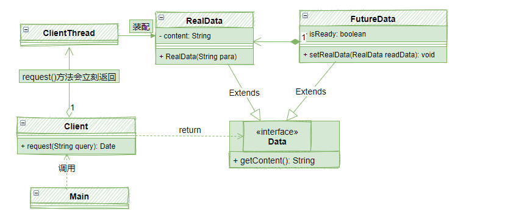
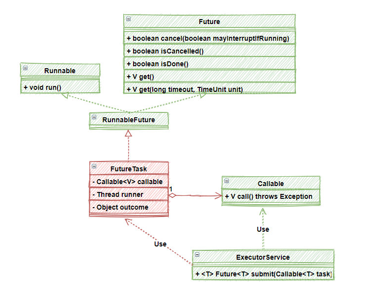

# Future 类详解


Future 模式很好的解决了 那些**需要返回值**的  **异步调用**。

## Future 模式中的主要角色

一个典型的Future模式由以下几个部分组成：
* Main:系统启动，调用Client 发出请求
* Client：返回Data对象，立即返回FutureData，并开启ClientThread 线程装配 RealData
* Data：返回数据的接口
* FutureData：Future数据，构造很快，但是是一个虚拟的数据，需要装配RealData
* RealData： 真实数据，其构造是比较慢的。

他们之间的相互关系如下图。



## 简单的Future模式

首先是Data 接口，代表数据：
```java
public interface Data {
    public String getResult ();
}
```

接着是FutureData,也是整个Future 模式的核心：
```java
public class FutureData implements Data {
    // 内部需要维护RealData
    protected RealData realdata = null;          
    protected boolean isReady = false;
    public synchronized void setRealData(RealData realdata) {
        if (isReady) { 
            return;
        }
        this.realdata = realdata;
        isReady = true;
        //RealData已经被注入，通知getResult()
        notifyAll();                            			
    }
    //会等待RealData构造完成
    public synchronized String getResult() {        	
        while (!isReady) {
            try {
                //一直等待，直到RealData被注入
                wait();                        			
            } catch (InterruptedException e) {
            }
        }
        //真正需要的数据从RealData获取
        return realdata.result;                    		
    }
}

```
下面是RealData：
```java
public class RealData implements Data {
    protected final String result;
    public RealData(String para) {
        StringBuffer sb=new StringBuffer();
        //假设这里很慢很慢，构造RealData不是一个容易的事
        result =sb.toString();
    }
    public String getResult() {
        return result;
    }
}

```

然后从Client得到Data：
```java
public class Client {
    //这是一个异步方法，返回的Data接口是一个Future
    public Data request(final String queryStr) {
        final FutureData future = new FutureData();
        new Thread() {                                      
            public void run() {                    	
                // RealData的构建很慢，所以在单独的线程中进行
                RealData realdata = new RealData(queryStr);
                //setRealData()的时候会notify()等待在这个future上的对象
                future.setRealData(realdata);
            }                                               
        }.start();
        // FutureData会被立即返回，不会等待RealData被构造完
        return future;                        		
    }
}


```
最后一个Main函数，把所有一切都串起来：
```java
public static void main(String[] args) {
    Client client = new Client();
    //这里会立即返回，因为得到的是FutureData而不是RealData
    Data data = client.request("name");
    System.out.println("请求完毕");
    try {
        //这里可以用一个sleep代替了对其他业务逻辑的处理
        //在处理这些业务逻辑的过程中，RealData被创建，从而充分利用了等待时间
        Thread.sleep(2000);
    } catch (InterruptedException e) {
    }
    //使用真实的数据，如果到这里数据还没有准备好，getResult()会等待数据准备完，再返回
    System.out.println("数据 = " + data.getResult());
}

```


## Java中的Future模式


首先，JDK内部有一个Future 接口，这就是类似前面提到的订单，当然了，作为一个完整的商业化产品，这里的Future的功能更加丰富了，除了get()方法来获得真实数据以外，还提供一组辅助方法，比如：

* cancel():如果等太久，你可以直接取消这个任务
* isCancelled():任务是不是一ing去校了
* isDone():任务是不是已经完成了
* get()：有2个get方法，不带参数的标识无穷等待，或者可以只等给定时间。


