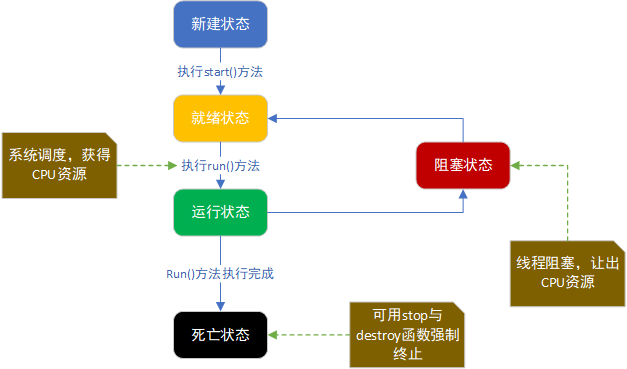
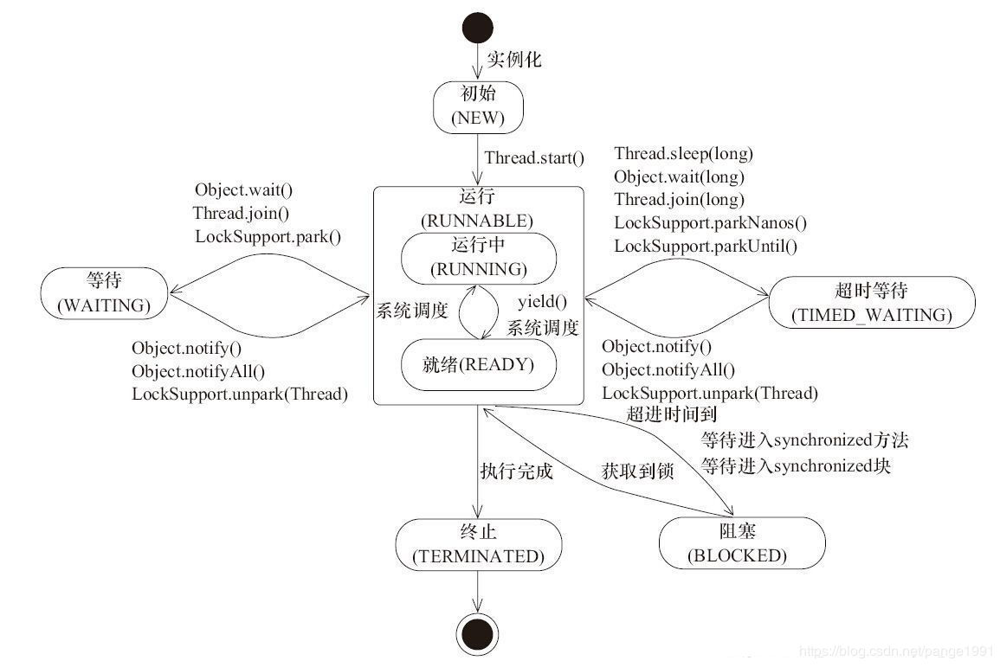
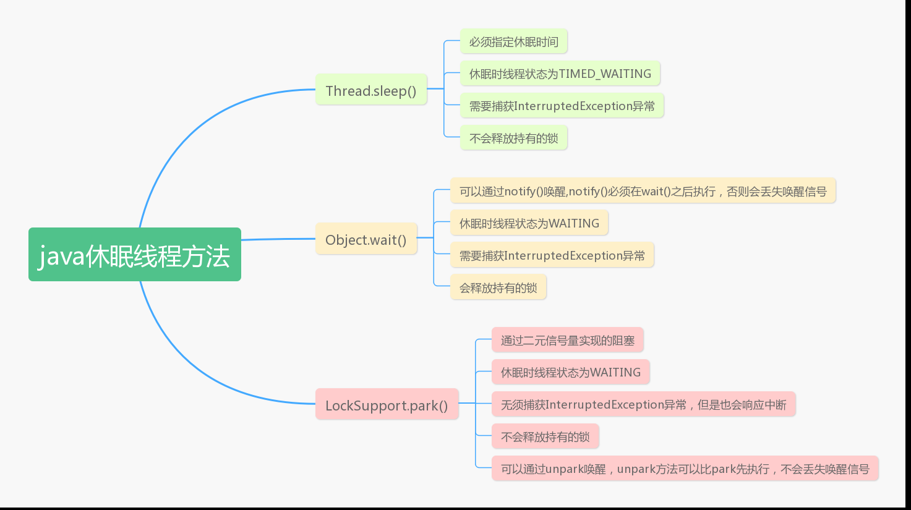

# 多线程
[toc]

## 进程与线程的区别是什么？

进程是计算机已运行程序的实体，进程是操作系统**资源分配**的最小单位，每一个进程都有它自己的内存空间和系统资源


线程是进程中执行的一个任务，是CPU调度和执行的最小单位。

它们两个本质的区别是  是否单独占有内存地址空间及其它系统资源（比如I/O）：

区别如下：

* 进程单独占有一定的内存地址空间，所以进程间存在内存隔离，数据是分开的，数据共享复杂但是同步简单，各个进程之间互不干扰；而线程共享所属进程占有的内存地址空间和资源，数据共享简单，但是同步复杂。


* 进程单独占有一定的内存地址空间，一个进程出现问题不会影响其他进程，不影响主程序的稳定性，可靠性高;一个线程崩溃可能影响整个程序的稳定性，可靠性较低。

* 进程单独占有一定的内存地址空间，进程的创建和销毁不仅需要保存寄存器和栈信息，还需要资源的分配回收以及页调度，开销较大；线程只需要保存寄存器和栈信息，开销较小。


## Java中线程的状态是怎么样的？

###操作系统中的线程状态

在操作系统中，线程等同于轻量级的进程。


所以传统的操作系统线程一般有以下状态

1. **新建状态**：使用new 关键字和Thread类或其子类建立一个线程对象后，该线程对象就处于新建状态。它保持这个状态直到程序 start()这个线程。

2. **就绪状态**：当线程调用了start()方法之后，该线程就进入就绪状态。就绪状态的线程处于就绪队列中，要等待JVM里线程调度器的调度。

3. **运行状态**：如果就绪状态的线程获取CPU资源，就可以执行run(),此时线程就处于运行状态。处于运行状态的线程最为复杂，它可以变为阻塞状态，就绪状态和死亡状态。

4. **阻塞状态**：
   如果一个线程执行了sleep（睡眠），suspend（挂起）等方法，失去所占用资源之后，该线程就从运行状态进入阻塞状态。在睡眠时间。在睡眠时间已到或获得设备资源后可以重新进入就绪状态。可以分为三种：
   * 等待阻塞：运行状态中的线程执行wait()方法，使线程进入到等待阻塞状态。
   * 同步阻塞：线程在获取synchronized同步锁失败（因为同步锁被其他线程占用）
   * 其他阻塞：通过调用线程的sleep()或join()发生了I/O请求时，线程就会进入到阻塞状态。当sleep()状态超时，join()等待线程终止或超时，或者I/O处理完毕，线程重新转入就绪状态。

5. **死亡状态**：一个运行状态的线程完成任务或者其他终止条件发生时，线程就切换到终止状态。


### Java Thread对象的状态划分跟传统的操作系统线程状态有一些区别。
```java
public enum State {
    NEW,//新建态
    RUNNABLE,//运行态
    BLOCKED,//阻塞态
    WAITING,//等待态
    TIMED_WAITING,//有时间限制的等待态
    TERMINATED;//死亡态
}
```




* NEW 新建态
 处于NEW状态的线程此时尚未启动，还没调用Thread 实例的start()方法。

* RUNNABLE 运行态
  表示当前线程正在运行中。处于RUNNABLE状态的线程可能在Java虚拟机中运行，也有可能在等待其他系统资源（比如I/O）
>JAVA 线程的RUNNABLE状态其实是包括了传统操作系统线程的**ready**和**running**两个状态的。

* BLOCKED 阻塞态
阻塞状态。线程没有申请到synchronized同步锁，就会陷入阻塞态，等待锁的释放以进入同步区。

* WAITTING 等待态
等待状态。处于等待状态的线程变成RUNNABLE状态需要其他线程唤醒。
调用如下3个方法会使线程处于等待状态：

* Object.wait():使当前线程处于等待状态直到另一个线程调用notify唤醒它。
* Thread.join():等待线程执行完毕，底层调用的是Object实例的wait()方法；
* LockSupport.park():除非获得调用许可，否则禁用当前线程进行线程调度。

* TIME_WAITING 超时等待状态
超时等待状态。线程等待一个具体的事件，时间到后会被自动唤醒。
调用如下方法会使线程进入超时等待状态：

  * Thread.sleep(long millis)：使当前线程睡眠指定时间；

  * Object.wait(long timeout)：线程休眠指定时间，等待期间可以通过notify()/notifyAll()唤醒；

  * Thread.join(long millis)：等待当前线程最多执行millis毫秒，如果millis为0，则会一直执行；

  * LockSupport.parkNanos(long nanos)： 除非获得调用许可，否则禁用当前线程进行线程调度指定时间；

  * LockSupport.parkUntil(long deadline)：同上，也是禁止线程进行调度指定时间；
  
* TERMINATED 终止态
 终止状态。此时线程已执行完毕。


## wait(),join(),sleep()方法有什么用？


### Object.wait()方法是什么？
调用wait()方法前线程 必须持有对象Object的锁。线程调用wait()方法后，会释放当前的Object锁，进入锁的monitor对象的等待队列，直到有其他线程调用notify()/notifyAll()方法唤醒等待锁的线程。

需要注意的是，其他线程调用notify()方法只会唤醒单个等待锁的线程，如果有多个线程都在等待这个锁的话，不一定会唤醒到之前调用wait()方法的线程。

同样，调用notifyAll()方法唤醒所有等待锁的线程之后，也不一定会马上把时间片分给刚才放弃锁的那个线程，具体要看系统的调度。


### Thread.join()方法是什么？
join()方法是Thread类的一个实例方法。它的作用是让当前线程陷入“等待”状态，等join的这个线程threadA执行完成后， 再继续执行当前线程。

实现原理是join()方法本身是一个sychronized修饰的方法，也就是调用join()这个方法首先要先获得**threadA**的锁，获得锁之后再调用 **wait()** 方法来进行等待，一直到threadA执行完成后，threadA会调用 **notify_all()** 方法，唤醒所有等待的线程，当前线程才会结束等待。
```java
Thread threadA = new Thread();
threadA.join();
```

join()方法的源码：
```java
public final void join() throws InterruptedException {
    join(0);//0的话代表没有超时时间一直等下去
}
public final synchronized void join(long millis)
throws InterruptedException {
    long base = System.currentTimeMillis();
    long now = 0;

    if (millis < 0) {
        throw new IllegalArgumentException("timeout value is negative");
    }

    if (millis == 0) {
        while (isAlive()) {
            wait(0);
        }
    } else {
        while (isAlive()) {
            long delay = millis - now;
            if (delay <= 0) {
                break;
            }
            wait(delay);
            now = System.currentTimeMillis() - base;
        }
    }
}
```
这是jvm Thread的源码，在线程执行结束后会调用notify_all来唤醒等待的线程。
```c++
//一个c++函数：
void JavaThread::exit(bool destroy_vm, ExitType exit_type) ；
//里面有一个贼不起眼的一行代码
ensure_join(this);

static void ensure_join(JavaThread* thread) {
  Handle threadObj(thread, thread->threadObj());

  ObjectLocker lock(threadObj, thread);

  thread->clear_pending_exception();

  java_lang_Thread::set_thread_status(threadObj(),        java_lang_Thread::TERMINATED);
  java_lang_Thread::set_thread(threadObj(), NULL);
  //同志们看到了没，别的不用看，就看这一句
  //thread就是当前线程，是啥？就是刚才例子中说的threadA线程
  lock.notify_all(thread);
  thread->clear_pending_exception();
}

```
### Thread.sleep()方法是什么?
sleep方法是Thread类的一个静态方法。它的作用是让当前线程睡眠一段时间。：sleep方法是不会释放当前线程持有的锁，而wait方法会。

sleep与wait方法的区别：

wait可以指定时间，也可以不指定；而sleep必须指定时间。

wait释放cpu资源，同时释放锁；sleep释放cpu资源，但是不释放锁，所以易死锁。（调用join()方法也不会释放锁）

wait必须放在同步块或同步方法中，而sleep可以再任意位置。


## Thread.sleep(),Object.wait(),LockSupport.park()有什么区别？

1. 这三个方法都会让线程挂起，释放CPU时间片，进入到等待态。但是Object.wait()需要释放锁，所以必须在synchronized同步锁中使用，同理配套的Object.notify()也是。而Thead.sleep(),LockSupport.park()不需要在synchronized同步锁中使用，并且在调用时也不会释放锁。


2. 由于**Thread.sleep()** 没有对应的唤醒线程的方法，所以必须指定超时时间，超过时间后，线程恢复。所以调用**Thread.sleep()** 后的线程一般是出于TIME_WAITING状态，而调用了**Object.wait()**，**LockSupport.park()** 的方法是进入到WAITING状态。


3. **Object.wait()** 对应的唤醒方法为**Object.notify()**,**LockSupport.park()** 对应的则是 **LockSupport.unpark()**

4. 在代码中必须能保证wait方法比notify方法先执行，如果notify方法比wait方法早执行的话，就会导致因wait方法进入休眠的线程接收不到唤醒通知的问题。而park、unpark则不会有这个问题，我们可以先调用unpark方法释放一个许可证，这样后面线程调用park方法时，发现已经许可证了，就可以直接获取许可证而不用进入休眠状态了。（LockSupport.park() 的实现原理是通过二元信号量做的阻塞，要注意的是，这个信号量最多只能加到1，也就是无论执行多少次unpark()方法，也最多只会有一个许可证。）

5. 三种方法让线程进入阻塞态后，都可以响应中断，也就是调用**Thread.interrupt()** 方法会设置中断标志位，之前执行 **Thread.sleep(),Object.wait()** 了的线程会抛出**InterruptedException** 异常，然后需要代码进行处理。而调用了**park()** 方法的线程在响应中断只会相当于一次正常的唤醒操作（等价于调用unpark()方法），让线程唤醒，继续执行后面的代码，不会抛出**InterruptedException** 异常。





