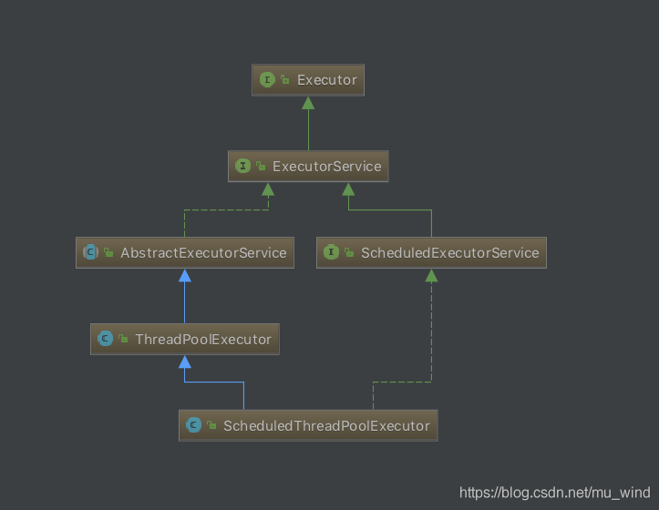
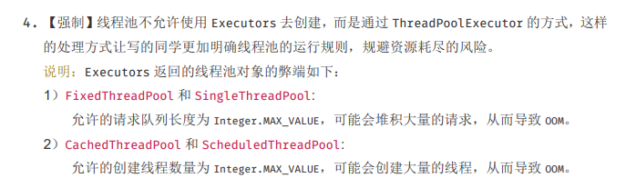
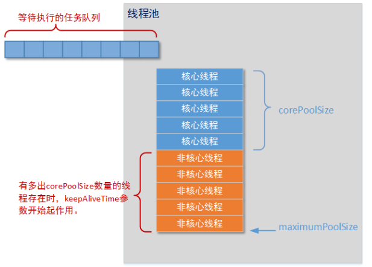
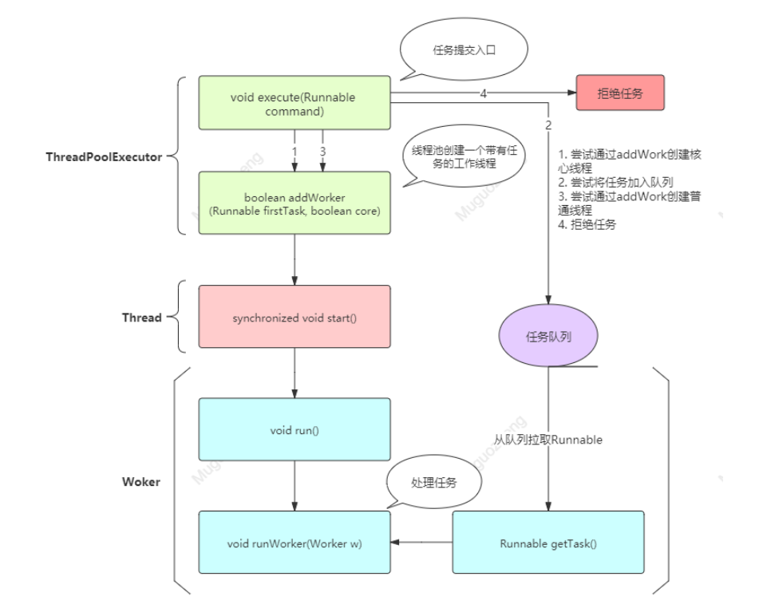
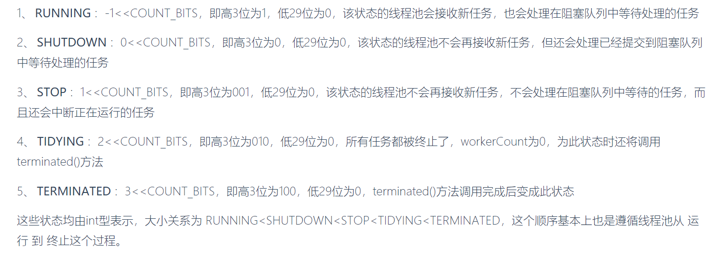
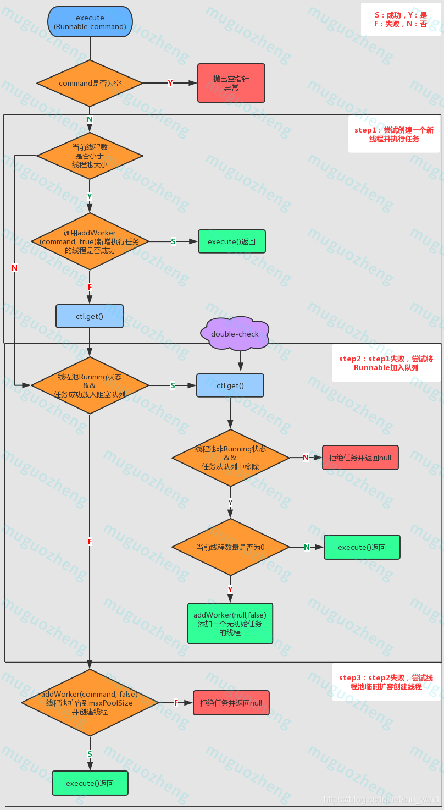
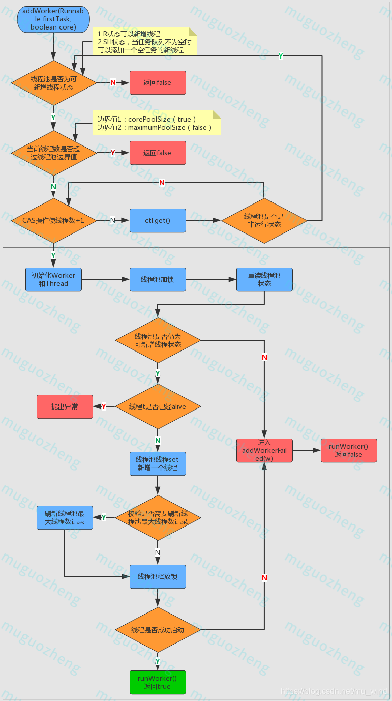
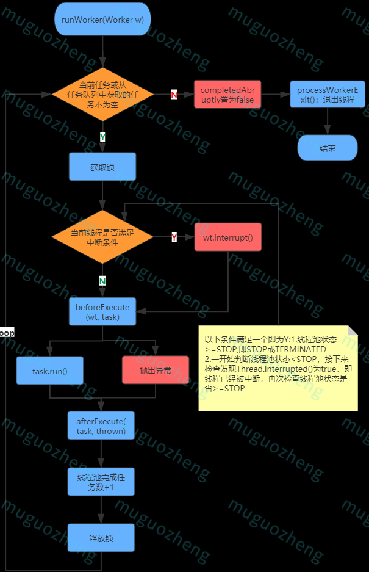
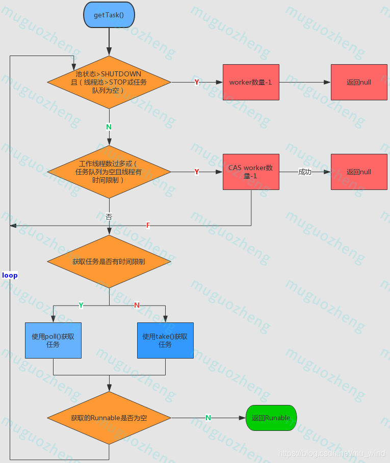

[TOC]


# 线程池

## 为什么需要线程池？

JVM 在 HotSpot 的线程模型下，JAVA 线程会一对一映射为**内核线程**

这意味着，在JAVA每次创建以及回收线程都会去**内核**创建以及回收

**创建和销毁线程**所花费的时间和资源可能比处理的任务花费的时间和资源要更多。


###线程池的优势
==线程池的出现是为了提高线程的复用性以及固定线程的数量==

* **降低资源消耗**：线程池通常会维护一些线程(数量为corePoolSize)，这些线程被重复使用来执行不同的任务，任务完成后不会销毁。在待处理任务量很大的时候，通过对线程资源的复用，避免了线程的频繁创建与销毁，从而降低了系统的资源消耗。
* **提高响应速度**：由于线程池维护了一批alive状态的线程，当任务到达时，不需要在创建线程，而是直接由这些线程去执行任务，从而减少了任务的等待时间。
* **提高线程的可管理性**：使用线程池可以对线程进行统一的分配，调优和监控。
  


## Executor
线程池的真正实现类可以看到时ThreadPoolExecutor




#### FixedThreadPool
固定容量线程池。其特点是最大线程数就是核心线程数，意味着线程池只能创建核心线程，**keepAliveTime**为0，即线程执行完后立即回收。任务队列为指定容量，默认值为 **Integer.MAX_VALUE**.适用于需要控制并发线程的场景。

#### SingleThreadPool
单线程线程池。特点是线程池只有一个线程，线程执行完任务立即回收，使用有界阻塞队列(容量未指定，使用默认值 **Integer.MAX_VALUE**)


#### ScheduledThreadPool
定时线程池。指定核心线程数量， 普通线程数量**无限**，线程执行完任务立即回收，任务队列为延时阻塞队列。这是一个比较特别的线程，使用与执行定时或周期性的任务

#### CachedThreadPool
缓存线程池，没有核心线程，普通线程为Integer.MAX_VALUE()，线程闲置60s，任务使用SynchronousQueue这种无容量的同步u队列，适用于任务量大但耗时低的场景。

## ThreadPoolExecutor 
ThreadPoolExecutor在构造的时候有几个重要的参数，分别是：
>corePoolSize(核心线程数量)
maximumPoolSize(最大线程数量)
keepAliveTime(线程空余时间)
workQueue(阻塞队列)
handler(任务拒绝策略)
```java
public ThreadPoolExecutor(int corePoolSize,
                              int maximumPoolSize,
                              long keepAliveTime,
                              TimeUnit unit,
                              BlockingQueue<Runnable> workQueue,
                              ThreadFactory threadFactory,
                              RejectedExecutionHandler handler)
```


线程池的执行流程是怎么样的呢？
任务提交的流程，来对应这几个参数：
1） 首先会判断运行线程数是否小于corePoolSize，如果小于，则直接创建新的线程执行任务
2）如果大于corePoolSize，判断workQueue阻塞队列是否已满，如果还没满，则将任务放到阻塞队列中
3）如果workQueue阻塞队列已经满了，则判断当前线程数是否大于maximumPoolSize，如果没大于则创建新的线程执行任务
4) 如果大于maximumPoolSize，则执行任务拒绝策略(具体是自己实现的handler)


一般将corePoolSize 和 maximumPoolSize 设置**相同数量**，
keepAliveTime指的是，当前**运行的线程数**大于**核心线程数**了，只要**空闲时间**达到了，就会对线程进行回收，

handler的拒绝策略:
> AbortPolicy:不执行新的任务，直接抛出异常，提示线程池已满
> DisCardPolicy:不执行新任务，也不抛出异常
> DisCardOldSetPolicy：将消息队列中的第一个任务替换为当前新进来的任务执行
> CallerRunsPolicy:直接调用execute来执行当前任务


线程数是怎么考量的：
>1.考量自己的业务是怎么样的
是cpu密集型还是io密集型
cpu密集型：一些进程绝大数时间都在计算上，称为cpu密集型。一些大量循坏的代码(例如，一些大量循环的代码)
io密集型：有一些进程在input和output上花费了大量时间，称为I/O密集型，比如搜索因引擎 爬虫等这种
2.假设运行应用的机器CPU核心数是N
那cpu密集型的可以先给到N+1,
IO密集型的可以给到2N


## 解读线程池

向线程池提交任务 是 **ThreadPoolExecutor** 的 **execute()** 方法，但在其内部，线程任务的处理其实是相当复杂的，涉及到 **ThreadPoolExecutor** 、 **Worker** 、 **Thread**三个类的6个方法。




### execute()
在  **ThreadPoolExecutor** 类中，任务提交方法的入口是 **execute(Runnable command)** 方法(submit()方法也是调用了execute()),该方法其实只是尝试做一件事：经过各种校验之后，通过**addWorker(Runnable command,boolean core)** 方法为线程池创建一个线程并执行任务，与之相对应，execute()的结果有两个。

#### **参数说明：**
Runnable command:待执行的任务

线程池状态： 

#### **执行流程：**

1. 通过 **ctl.get()** 得到线程池的当前线程数，如果线程数小于 **corePoolSize** ，则 调用 **addWorker(Runnable command,boolean core)** 方法创建新的线程执行任务，否则执行步骤2；
2. 步骤1失败，说明已经无法创建新线程，那么考虑将任务放入阻塞队列，等待执行完任务的线程来处理。基于此，判断线程池是否处于**Running**状态(只有**Running**状态的线程池可以接收新任务)，那么任务添加到任务队列成功则进入步骤3，失败则进入步骤4；
3. 来到这一步需要说明任务已经加入任务队列，这时要二次校验线程池的状态，会有以下情形：
* 线程池不再是 **Running** 状态了，需要将任务从任务队列中移除，如果移除成功则拒绝本次任务
* 线程池是**Running** 状态，则判断线程池工作线程是否为0，是则调用addWorker(command,true) 添加一个没有初始任务的线程(这个线程将去获取已经加入任务队列的本次任务并运行)，否则进入步骤4；
* 线程池不是**Running** 状态，但从任务队列移除任务失败(可能已被某线程获取？)，进入步骤4;
4. 将线程池扩容至maximumPoolSize 并调用  addWorker(commond，false)方法创建新的线程执行任务，失败则拒绝本次任务。

流程图：

```java
/**
 * 在将来的某个时候执行给定的任务。任务可以在新线程中执行，也可以在现有的池线程中执行。
 * 如果由于此执行器已关闭或已达到其容量而无法提交任务以供执行，则由当前的{@code RejectedExecutionHandler}处理该任务。
 * 
 * @param command the task to execute  待执行的任务命令
 */
public void execute(Runnable command) {
    if (command == null)
        throw new NullPointerException();
    /*
     * Proceed in 3 steps:
     * 
     * 1. 如果运行的线程少于corePoolSize，将尝试以给定的命令作为第一个任务启动新线程。
     *
     * 2. 如果一个任务可以成功排队，那么我们仍然需要仔细检查两点，其一，我们是否应该添加一个线程
     * （因为自从上次检查至今，一些存在的线程已经死亡），其二，线程池状态此时已改变成非运行态。因此，我们重新检查状态，如果检查不通过，则移除已经入列的任务，如果检查通过且线程池线程数为0，则启动新线程。
     * 
     * 3. 如果无法将任务加入任务队列，则将线程池扩容到极限容量并尝试创建一个新线程，如果失败则拒绝任务。
     */
    int c = ctl.get();
   
    // 步骤1：判断线程池当前线程数是否小于线程池大小
    if (workerCountOf(c) < corePoolSize) {
        // 增加一个工作线程并添加任务，成功则返回，否则进行步骤2
        // true代表使用coreSize作为边界约束，否则使用maximumPoolSize
        if (addWorker(command, true))
            return;
        c = ctl.get();
    }
    // 步骤2：不满足workerCountOf(c) < corePoolSize或addWorker失败，进入步骤2
    // 校验线程池是否是Running状态且任务是否成功放入workQueue（阻塞队列）
    if (isRunning(c) && workQueue.offer(command)) {
        int recheck = ctl.get();
        // 再次校验，如果线程池非Running且从任务队列中移除任务成功，则拒绝该任务
        if (! isRunning(recheck) && remove(command))
            reject(command);
        // 如果线程池工作线程数量为0，则新建一个空任务的线程
        else if (workerCountOf(recheck) == 0)
            // 如果线程池不是Running状态，是加入不进去的
            addWorker(null, false);
    }
    // 步骤3：如果线程池不是Running状态或任务入列失败，尝试扩容maxPoolSize后再次addWorker，失败则拒绝任务
    else if (!addWorker(command, false))
        reject(command);
}
```


### addWorker()
**addWorker(Runnable firstTask, boolean core)** 方法，顾名思义，向线程池添加一个带有任务的工作线程。

#### 参数说明：
1. **Runable firstTask**: 新创建的线程应该首先运行的任务（如果没有，则为空）
2. **boolean core**: 该参数决定了线程池容量的约束条件，则当前线程数量以何值为极限值。参数为**true** 则使用**corePoolSize** 作为约束值，否则使用 **maximumPoolSize**


#### 执行流程：
1. 外层循环判断线程池的状态是否可以新增工作线程。这层校验基于下面两个原则：
   * 线程池为**Running** 状态时，即可以接收新任务也可以 处理任务
   * 线程池为关闭状态时只能新增空任务的工作流程（**worker**）处理队列（**workQueue**）中的任务不能接收新任务

2. 内层循环向线程池添加工作线程并返回是否添加成功的结果。
   * 首先校验线程数是否已经超限制，是则返回false，否则进入下一步
   * 通过CAS使工作线程数+1， 成功则进入步骤3，失败则再次校验线程池是否是运行状态，是则继续内层循环，不是则返回外层循环

3. 核心线程数量+1 成功的后续操作：添加到工作线程集合，并启动工作线程
   * 首先获取锁之后，再次校验线程池状态(具体校验规则见代码注解)，通过则进入下一步，未通过则添加线程失败
   * 线程池状态校验通过后，在检查线程是否已经启动，是则抛出异常，否则尝试将线程加入线程池
   * 检查线程是否启动成功，成功则返回**true**， 失败则进入 **addWorkerFailed**方法
流程图：

```java
private boolean addWorker(Runnable firstTask, boolean core) {
    // 外层循环：判断线程池状态
    retry:
    for (;;) {
        int c = ctl.get();
        int rs = runStateOf(c);

        /** 
         * 1.线程池为非Running状态（Running状态则既可以新增核心线程也可以接受任务）
         * 2.线程为shutdown状态且firstTask为空且队列不为空
         * 3.满足条件1且条件2不满足，则返回false
         * 4.条件2解读：线程池为shutdown状态时且任务队列不为空时，可以新增空任务的线程来处理队列中的任务
         */
        if (rs >= SHUTDOWN &&
            ! (rs == SHUTDOWN &&
               firstTask == null &&
               ! workQueue.isEmpty()))
            return false;

		// 内层循环：线程池添加核心线程并返回是否添加成功的结果
        for (;;) {
            int wc = workerCountOf(c);
            // 校验线程池已有线程数量是否超限：
            // 1.线程池最大上限CAPACITY 
            // 2.corePoolSize或maximumPoolSize（取决于入参core）
            if (wc >= CAPACITY ||
                wc >= (core ? corePoolSize : maximumPoolSize)) 
                return false;
            // 通过CAS操作使工作线程数+1，跳出外层循环
            if (compareAndIncrementWorkerCount(c)) 
                break retry;
            // 线程+1失败，重读ctl
            c = ctl.get();   // Re-read ctl
            // 如果此时线程池状态不再是running，则重新进行外层循环
            if (runStateOf(c) != rs)
                continue retry;
            // 其他 CAS 失败是因为工作线程数量改变了，继续内层循环尝试CAS对线程数+1
            // else CAS failed due to workerCount change; retry inner loop
        }
    }

    /**
     * 核心线程数量+1成功的后续操作：添加到工作线程集合，并启动工作线程
     */
    boolean workerStarted = false;
    boolean workerAdded = false;
    Worker w = null;
    try {
        final ReentrantLock mainLock = this.mainLock;
        w = new Worker(firstTask);
        final Thread t = w.thread;
        if (t != null) {
            // 下面代码需要加锁：线程池主锁
            mainLock.lock(); 
            try {
                // 持锁期间重新检查，线程工厂创建线程失败或获取锁之前关闭的情况发生时，退出
                int c = ctl.get();
                int rs = runStateOf(c);

				// 再次检验线程池是否是running状态或线程池shutdown但线程任务为空
                if (rs < SHUTDOWN ||
                    (rs == SHUTDOWN && firstTask == null)) {
                    // 线程已经启动，则抛出非法线程状态异常
                    // 为什么会存在这种状态呢？未解决
                    if (t.isAlive()) // precheck that t is startable
                        throw new IllegalThreadStateException();
                    workers.add(w); //加入线程池
                    int s = workers.size();
                    // 如果当前工作线程数超过线程池曾经出现过的最大线程数，刷新后者值
                    if (s > largestPoolSize)
                        largestPoolSize = s; 
                    workerAdded = true;
                }
            } finally {
                mainLock.unlock();  // 释放锁
            }
            if (workerAdded) { // 工作线程添加成功，启动该线程
                t.start();
                workerStarted = true;
            }
        }
    } finally {
        //线程启动失败，则进入addWorkerFailed
        if (! workerStarted) 
            addWorkerFailed(w);
    }
    return workerStarted;
}


```
### Worker 类

**Worker**类是内部类，既实现了 Runable ,又继承了AQS, 所以既是一个可执行的任务，又可以达到锁的效果。

**Worker** 类主要维护正在运行任务的线程 的中断控制状态，以及其他次要的记录。这个类适时地继承了 **AbstractQueuedSynchronizer** 类，以简化获取和释放锁地过程，这样可以防止去中断正在运行中地任务，指挥中断在等待从任务队列中获取任务地线程。

```java
private final class Worker
    extends AbstractQueuedSynchronizer
    implements Runnable
{
    /**
     * This class will never be serialized, but we provide a
     * serialVersionUID to suppress a javac warning.
     */
    private static final long serialVersionUID = 6138294804551838833L;
 
    /** Thread this worker is running in.  Null if factory fails. */
    final Thread thread; 
     
    /** Initial task to run.  Possibly null. */
    Runnable firstTask;
     
    /** Per-thread task counter */
    volatile long completedTasks;
 
    /**
     * Creates with given first task and thread from ThreadFactory.
     * @param firstTask the first task (null if none)
     */
    // 通过构造函数初始化，
    Worker(Runnable firstTask) {
        //设置AQS的同步状态
        // state：锁状态，-1为初始值，0为unlock状态，1为lock状态
        setState(-1); // inhibit interrupts until runWorker  在调用runWorker前，禁止中断
       
        this.firstTask = firstTask;
        // 线程工厂创建一个线程
        this.thread = getThreadFactory().newThread(this); 
    }
 
    /** Delegates main run loop to outer runWorker  */
    public void run() {
        runWorker(this); //runWorker()是ThreadPoolExecutor的方法
    }
 
    // Lock methods
    // The value 0 represents the unlocked state. 0代表“没被锁定”状态
    // The value 1 represents the locked state. 1代表“锁定”状态
 
    protected boolean isHeldExclusively() {
        return getState() != 0;
    }
 
    /**
     * 尝试获取锁的方法
     * 重写AQS的tryAcquire()，AQS本来就是让子类来实现的
     */
    protected boolean tryAcquire(int unused) {
        // 判断原值为0，且重置为1，所以state为-1时，锁无法获取。
        // 每次都是0->1，保证了锁的不可重入性
        if (compareAndSetState(0, 1)) {
            // 设置exclusiveOwnerThread=当前线程
            setExclusiveOwnerThread(Thread.currentThread()); 
            return true;
        }
        return false;
    }
 
    /**
     * 尝试释放锁
     * 不是state-1，而是置为0
     */
    protected boolean tryRelease(int unused) {
        setExclusiveOwnerThread(null); 
        setState(0);
        return true;
    }
 
    public void lock()        { acquire(1); }
    public boolean tryLock()  { return tryAcquire(1); }
    public void unlock()      { release(1); }
    public boolean isLocked() { return isHeldExclusively(); }
 
    /**
     * 中断（如果运行）
     * shutdownNow时会循环对worker线程执行
     * 且不需要获取worker锁，即使在worker运行时也可以中断
     */
    void interruptIfStarted() {
        Thread t;
        //如果state>=0、t!=null、且t没有被中断
        //new Worker()时state==-1，说明不能中断
        if (getState() >= 0 && (t = thread) != null && !t.isInterrupted()) {
            try {
                t.interrupt();
            } catch (SecurityException ignore) {
            }
        }
    }
}


```


### runWorker()

**runWorker(Worker w)** 是线程池中真正处理任务地方法，前面地**execute()** 和 **addWorker()** 都是在为该方法做准备和铺垫。

**参数说明**：
1. Worker w：封装的Worker，携带了工作线程的诸多要素，包括**Runnable**（待处理任务），**lock**，completedTasks(记录线程池以完成任务数)

**执行流程**：
1. 判断当前任务或者从任务队列中获取的任务是否不为空，都为空则进入步骤2，否则进入步骤3

2. 任务为空，则将**completedAbruptly**置为 false (即线程不是突然终止)，并执行**processWorkerExit(w,completedAbruptly)** 方法进入线程退出程序

3. 任务不为空，则进入循环，并加锁

4. 判断是否为线程添加中断标识，以下两个条件满足其一则添加中断标识：
   * 线程池状态>=STOP, 即 **STOP** 或 **TERMINATED**
   * 一开始判断线程池状态< STOP, 接下来检查Thread.interrupted()为true，即线程已经被中断，再次检查线程池状态是否>= STOP (以消除该瞬间**shutdown**方法生效，使线程池 **STOP** 或 **TERMINATED**)
5. 执行前置方法 beforeExecute(wt,task) (该方法为空方法，由子类实现)后执行 task.run() 方法执行任务 (执行不成功抛出相应异常)
6. 执行后置方法 afterExecute(task,thrown) (该方法为空方法)后将线程池已完成的任务数+1，并释放锁
7. 再次进行循环条件判断。



```java
final void runWorker(Worker w) {
    Thread wt = Thread.currentThread();
    Runnable task = w.firstTask;
    w.firstTask = null;
    // allow interrupts
    // new Worker()是state==-1，此处是调用Worker类的tryRelease()方法，将state置为0，而interruptIfStarted()中只有state>=0才允许调用中断
    w.unlock(); 
            
    // 线程退出的原因，true是任务导致，false是线程正常退出
    boolean completedAbruptly = true; 
    try {
        // 当前任务和从任务队列中获取的任务都为空，方停止循环
        while (task != null || (task = getTask()) != null) {
            //上锁可以防止在shutdown()时终止正在运行的worker，而不是应对并发
            w.lock(); 
             
            // If pool is stopping, ensure thread is interrupted;
            // if not, ensure thread is not interrupted.  This
            // requires a recheck in second case to deal with
            // shutdownNow race while clearing interrupt
            /**
             * 判断1：确保只有在线程处于stop状态且wt未中断时，wt才会被设置中断标识
             * 条件1：线程池状态>=STOP,即STOP或TERMINATED
             * 条件2：一开始判断线程池状态<STOP，接下来检查发现Thread.interrupted()为true，即线程已经被中断，再次检查线程池状态是否>=STOP（以消除该瞬间shutdown方法生效，使线程池处于STOP或TERMINATED），
             * 条件1与条件2任意满意一个，且wt不是中断状态，则中断wt，否则进入下一步
             */
            if ((runStateAtLeast(ctl.get(), STOP) ||
                 (Thread.interrupted() &&
                  runStateAtLeast(ctl.get(), STOP))) &&
                !wt.isInterrupted())
                wt.interrupt(); //当前线程调用interrupt()中断
             
            try {
                //执行前（空方法，由子类重写实现）
                beforeExecute(wt, task);
                 
                Throwable thrown = null;
                try {
                    task.run();
                } 
                catch (RuntimeException x) {
                    thrown = x; throw x;
                } 
                catch (Error x) {
                    thrown = x; throw x;
                } 
                catch (Throwable x) {
                    thrown = x; throw new Error(x);
                } 
                finally {
                    //执行后（空方法，由子类重写实现）
                    afterExecute(task, thrown); 
                }
            } 
            finally {
                task = null; 
                w.completedTasks++; //完成任务数+1
                w.unlock(); //释放锁
            }
        }
        // 
        completedAbruptly = false;
    } 
    finally {
        //处理worker的退出
        processWorkerExit(w, completedAbruptly);
    }
}

```

#### getTask()
由函数调用关系图可知，在 **ThreadPoolExecutor** 类的视线中， **Runnable getTask()** 方法是为  **void runWorker(Worker w)** 方法服务的，它的作用就是在任务队列(workQueue) 中获取 task(Runnable).


执行流程：
1. 将timedOut（上次获取任务是否超时）置为false（首次执行方法，无上次，自然为false），进入一个无限循环
2. 如果线程池为Shutdown状态且任务队列为空（线程池shutdown状态可以处理任务队列中的任务，不再接受新任务，这个是重点）或者线程池为STOP或TERMINATED状态，则意味着线程池不必再获取任务了，当前工作线程数量-1并返回null，否则进入步骤3
3. 如果线程池数量超限制或者时间超限且（任务队列为空或当前线程数>1），则进入步骤4，否则进入步骤5。
4. 移除工作线程，成功则返回null，不成功则进入下轮循环。
5. 尝试用poll() 或者 take()（具体用哪个取决于timed的值）获取任务，如果任务不为空，则返回该任务。如果为空，则将timeOut 置为 true进入下一轮循环。如果获取任务过程发生异常，则将 timeOut置为 false 后进入下一轮循环。


```java
private Runnable getTask() {
    // 最新一次poll是否超时
    boolean timedOut = false; // Did the last poll() time out?

    for (;;) {
        int c = ctl.get();
        int rs = runStateOf(c);

        // Check if queue empty only if necessary.
        /**
         * 条件1：线程池状态SHUTDOWN、STOP、TERMINATED状态
         * 条件2：线程池STOP、TERMINATED状态或workQueue为空
         * 条件1与条件2同时为true，则workerCount-1，并且返回null
         * 注：条件2是考虑到SHUTDOWN状态的线程池不会接受任务，但仍会处理任务
         */
        if (rs >= SHUTDOWN && (rs >= STOP || workQueue.isEmpty())) {
            decrementWorkerCount();
            return null;
        }

        int wc = workerCountOf(c);

        // Are workers subject to culling?
        /**
         * 下列两个条件满足任意一个，则给当前正在尝试获取任务的工作线程设置阻塞时间限制（超时会被销毁？不太确定这点），否则线程可以一直保持活跃状态
         * 1.allowCoreThreadTimeOut：当前线程是否以keepAliveTime为超时时限等待任务
         * 2.当前线程数量已经超越了核心线程数
         */
        boolean timed = allowCoreThreadTimeOut || wc > corePoolSize;
            
        // 两个条件全部为true，则通过CAS使工作线程数-1，即剔除工作线程
        // 条件1：工作线程数大于maximumPoolSize，或（工作线程阻塞时间受限且上次在任务队列拉取任务超时）
        // 条件2：wc > 1或任务队列为空
        if ((wc > maximumPoolSize || (timed && timedOut))
            && (wc > 1 || workQueue.isEmpty())) {
            // 移除工作线程，成功则返回null，不成功则进入下轮循环
            if (compareAndDecrementWorkerCount(c))
                return null;
            continue;
        }

	    // 执行到这里，说明已经经过前面重重校验，开始真正获取task了
        try {
            // 如果工作线程阻塞时间受限，则使用poll(),否则使用take()
            // poll()设定阻塞时间，而take()无时间限制，直到拿到结果为止
            Runnable r = timed ?
                workQueue.poll(keepAliveTime, TimeUnit.NANOSECONDS) :
                workQueue.take();
            // r不为空，则返回该Runnable
            if (r != null)
                return r;
            // 没能获取到Runable，则将最近获取任务是否超时设置为true
            timedOut = true;
        } catch (InterruptedException retry) {
            // 响应中断，进入下一次循环前将最近获取任务超时状态置为false
            timedOut = false;
        }
    }
}

```


###processWorkerExit()
**processWorkerExit(Worker w,boolean completedAbruptly)** 执行线程退出的方法
**参数说明**：
1. Worker w: 要结束的工作线程
2. Boolean completedAbruptly: 是否突然完成(异常导致)，如果工作线程因为用户异常死亡，则**completedAbruptly** 参数为 true

**执行流程**：
1. 如果 completedAbruptly 为 true，即工作线程因为异常突然死亡，则执行工作线程-1操作。
2. 主线程获取锁后，线程池已经完成的任务数追加 w（当前工作线程） 完成的任务数，并从worker的set集合中移除当前worker。
3. 根据线程池状态进行判断是否执行tryTerminate()结束线程池。
4. 是否需要增加工作线程，如果线程池还没有完全终止，仍需要保持一定数量的线程。
   * 如果当前线程是突然终止的，调用addWorker()创建工作线程
   * 当前线程不是突然终止，但当前工作线程数量小于线程池需要维护的线程数量，则创建工作线程。需要维护的线程数量为corePoolSize（取决于成员变量 allowCoreThreadTimeOut是否为 false）或1。
  
**源码解读**：
```java
/**
 * Performs cleanup and bookkeeping for a dying worker. Called
 * only from worker threads. Unless completedAbruptly is set,
 * assumes that workerCount has already been adjusted to account
 * for exit.  This method removes thread from worker set, and
 * possibly terminates the pool or replaces the worker if either
 * it exited due to user task exception or if fewer than
 * corePoolSize workers are running or queue is non-empty but
 * there are no workers.
 *
 * @param w the worker
 * @param completedAbruptly if the worker died due to user exception
 */
private void processWorkerExit(Worker w, boolean completedAbruptly) {
    /**
     * 1.工作线程-1操作
     * 1）如果completedAbruptly 为true，说明工作线程发生异常，那么将正在工作的线程数量-1
     * 2）如果completedAbruptly 为false，说明工作线程无任务可以执行，由getTask()执行worker-1操作
     */
    if (completedAbruptly) // If abrupt, then workerCount wasn't adjusted
        decrementWorkerCount();

    // 2.从线程set集合中移除工作线程，该过程需要加锁
    final ReentrantLock mainLock = this.mainLock;
    mainLock.lock();
    try {
        // 将该worker已完成的任务数追加到线程池已完成的任务数
        completedTaskCount += w.completedTasks;
        // HashSet<Worker>中移除该worker
        workers.remove(w);
    } finally {
        mainLock.unlock();
    }
    
	// 3.根据线程池状态进行判断是否结束线程池
    tryTerminate();
	
	/**
     * 4.是否需要增加工作线程
     * 线程池状态是running 或 shutdown
     * 如果当前线程是突然终止的，addWorker()
     * 如果当前线程不是突然终止的，但当前线程数量 < 要维护的线程数量，addWorker()
     * 故如果调用线程池shutdown()，直到workQueue为空前，线程池都会维持corePoolSize个线程，然后再逐渐销毁这corePoolSize个线程
     */
    int c = ctl.get();
    if (runStateLessThan(c, STOP)) {
       if (!completedAbruptly) {
            int min = allowCoreThreadTimeOut ? 0 : corePoolSize;
            if (min == 0 && ! workQueue.isEmpty())
                min = 1;
            if (workerCountOf(c) >= min)
                return; // replacement not needed
        }
        addWorker(null, false);
    }
}

```


参考文章：
深入Java线程池：从设计思想到源码解读：https://blog.csdn.net/mu_wind/article/details/113806680

深入理解线程和线程池（图文详解）：https://blog.csdn.net/weixin_40271838/article/details/79998327

面试造火箭: 线程池