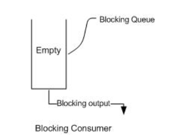
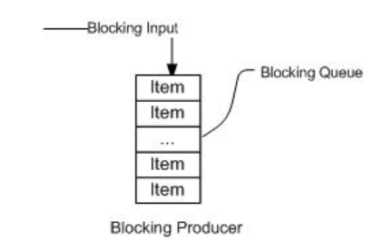
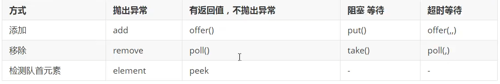

[toc]


#阻塞队列(BlockingQueue)

## 什么是阻塞队列
BlockingQueue 继承了Queue接口，是队列的一种。 Queue 和 BlockingQueue 都是在Java 5加入的。

在常见的生产者消费者模型种，有常见的阻塞场景

当队列中没有数据的情况下，消费者端的所有线程都会自然阻塞（挂起），直到有数据放入队列


而队列中填满数据的时候，生产者端的所有线程都会自动阻塞，直到队列中有空的位置，线程被自动唤醒，


```java
public interface BlockingQueue<E> extends Queue<E> {
...
}
```
BlockingQueue有5种最主要的实现如下：

* ArrayBlockingQueue
* LinkedBlockingQueue
* SynchronousQueue
* DelayQueue
* PriorityBlockingQueue

## 阻塞队列API

