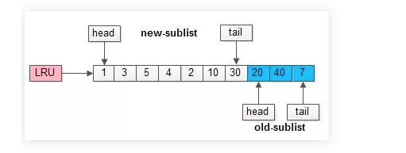
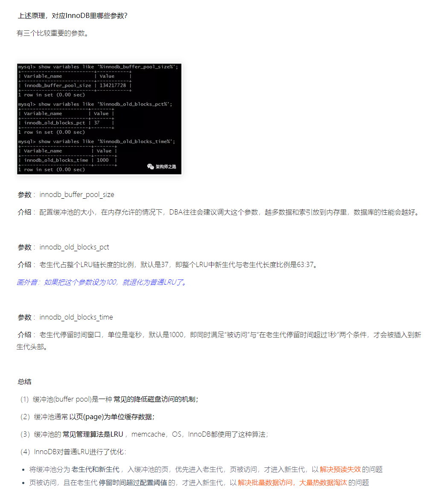
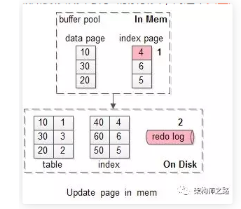
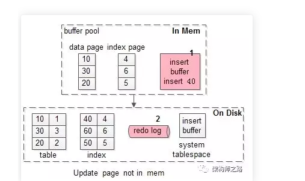

[toc]
# MySql 缓冲池（buffer pool）和写缓存（change buffer）和redo log

## buffer pool 的使用场景（对于读请求，降低磁盘IO访问）

>InnoDB的缓冲池。

InnoDB 的缓冲池缓存什么？有什么用？
**缓存表数据与索引数据**，把磁盘上的数据加载到缓冲池，避免每次访问都进行磁盘IO，起到加速访问的作用。

速度快，那为啥不把所有数据都放到缓冲池里？
凡事都具备两面性，抛开数据易失性不说，访问快速的反面是存储容量小：
（1） 缓存访问快，但容量小，数据库存储了200G数据，缓存容量可能只有64G；
（2） 内存访问快，但容量小，买一台笔记本磁盘可能有2T，以“最大限度”的降低磁盘访问。

如何管理与淘汰缓冲池，使得性能最大化呢？
在介绍具体细节之前，先介绍下“预读”的概念。
### 什么是预读？
磁盘读写，并不是按需读取，而是按页读取，一次至少读一页数据，如果未来要读取的数据就在页中，就能够省去后续的磁盘IO，提高效率。

### 预读为什么有效？
数据访问，通常都遵循“集中读写”的原则，使用一些数据，大概率时会用附近的数据，这就是所谓的“局部性原理”，它表明提前加载是有效的，确实能够减少磁盘IO。

### 按页（4K）读取，和InnoDB的缓冲池涉及有啥关系？
（1）磁盘访问按页读取能够提高性能，所以**缓冲池一般也是按页缓存数据**；
（2）预读机制启示了我们，能把 一些“可能要访问”的页提前加入缓冲池，**避免未来的磁盘IO操作**

### InnoDB 采用LRU来管理缓冲页？
传统的LRU: 把入缓冲池的页放到LRU 的头部，作为最近访问的元素，从而最晚被淘汰，这里又分两种情况：
（1）页已经在缓冲池里，那就只做“移至LRU头部”的动作，而没有页被淘汰
（2）页不在缓冲池里，除了做“放入LRU头部”的动作，还要做“淘汰LRU尾部页”的动作；

然而MySQL不直接用LRU算法呢
这里存在两个问题：
1. 预读失效
2. 缓冲池污染

### 什么是预读失效？

由于预读（Read-Ahead）,提前把页放入了缓冲池，但最终MySQL并没有从页中读取数据，称为预读失效。

### 如何对预读失效进行优化？
要优化预读失效，思路是：
（1）让预读失败的页，停留在缓冲池LRU里的时间尽可能短；
（2）让真正被读取的页，才挪到缓冲池LRU的头部
具体方法是：
（1）将LRU分为两个部分：
* **新生代**（new sublist）
* **老生代**（old sublist）
（2）新生代首尾相连，即：新生代的尾连接着老年代的头

（3） 新页加入缓冲池时，之加入到老年代的头部
* 如果数据真正被读取 **（预读成功），才会加入到新生代的头部**
* 如果数据**没有被读取**，则会比新生代里的“热数据页”更早被淘汰出缓冲池

### 什么是MySQL缓冲池污染？

当某一个SQL语句，要**批量扫描大量数据**时，可能导致把缓冲池的所有页都替换出去，**导致大量热数据被换出**，MySQL性能急剧下降，这种情况叫缓冲池污染。

这时候MySQL 缓冲池加入了一个“**新生代停留时间窗口**”的机制：
（1）假设T=老生代停留时间窗口;
 (2) 插入老生代头部的页，即使立刻被访问，并不会立刻放入新生代头部
 (3) 只有满足“被访问”并且“在老生代停留时间”大于T，才会被新生代头部；

## change buffer 的使用场景（对写请求减少磁盘IO）

### 情况一，加入要修改页号为4的索引页，而这个页正好在缓冲池内

如上图序号1-2：
（1）直接修改缓冲池中的页，一次内存操作
（2）写入redo log，一次磁盘顺序写操作

是否会出现一致性问题？
并不会。
（1）读取，会命中缓冲池的页；
（2）缓冲池LRU数据淘汰，会把“脏页”刷回磁盘
（3）数据库异常崩溃，能够从redo log中恢复数据

什么时候缓冲池中的页，会刷到磁盘上呢？
定期刷磁盘，而不是每次刷磁盘，能够

### 情况二，假如要修改页号为40的索引页，而这个页正好不在缓冲池内。

(1) 先把需要为40的索引页，从磁盘加载到缓冲池，一次磁盘随机读操作
(2) 修改缓冲池中的页，一次内存操作
(3) 写入redo log，一次磁盘顺序写操作

而没有命中缓冲池的时候，至少产生一次磁盘IO，对于写多读少的业务场景，是否还有优化的空间呢？

这即是将要讨论的写缓冲（change buffer).

在MySQL5.5之前，叫插入缓冲(insert buffer)，只针对insert做了优化；现在对delete和update也有效，叫做写缓冲(change buffer)。

 它是一种应用在**非唯一普通索引页**(non-unique secondary index page)不在缓冲池中，对页进行了写操作，并不会立刻**将磁盘页加载到缓冲池**，而仅仅记录缓冲变更(buffer changes)，等未来数据被读取时，再将数据合并(merge)恢复到缓冲池中的技术。写缓冲的目的是降低写操作的磁盘IO，提升数据库性能。

 InnoDB 加入写缓冲优化，上文“情况二”流程会有什么变化？
 

 加入写缓冲优化后，流程优化为：
 （1） 在写缓冲中记录这个操作，一次内存操作；
 （2） 写入redo log，一次磁盘顺序写操作
 其性能与，这个索引页在缓冲池中，相近。

 是否会出现一致性问题？
 （1）数据崩溃时，能从redo log 恢复数据
 （2）会被定期flush到磁盘
 （3）数据读取时，会merge

 #### 为什么写缓冲优化，仅适用于非唯一索引页？
 因为如果索引设置了唯一（unique）属性，在进行修改操作时，InnoDB 必须进行唯一性检查。 也就是说，**索引页即使不再缓冲池，磁盘上的页读取无法避免**，此时就应该直接把相应的页放入缓冲池在进行修改，而不应该再整些缓冲这个幺蛾子。

 除了数据页被访问，还有哪些场景会触发刷写缓冲中的数据呢？

（1） 有一个后台线程，认为数据库空闲时
（2） 数据库缓冲池不够用时
（3） 数据库正常关闭时
（4） redo log 写满时

#### 什么业务场景，适合开启InnoDB的写缓冲机制？
什么时候不合适，如上文分析，当
（1） 数据库都是唯一索引；
（2）或者，写入一个数据后，会立即读取它

什么时候时候写缓冲：
（1） 数据库大多都是非唯一索引
（2） 业务写多读少，或者不是写后立刻读取；

