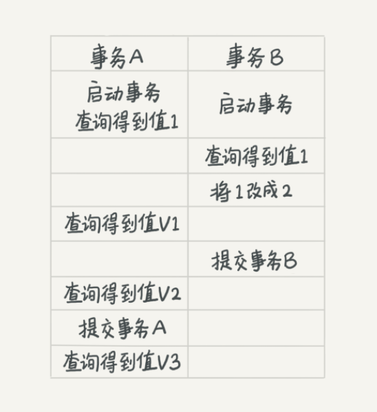
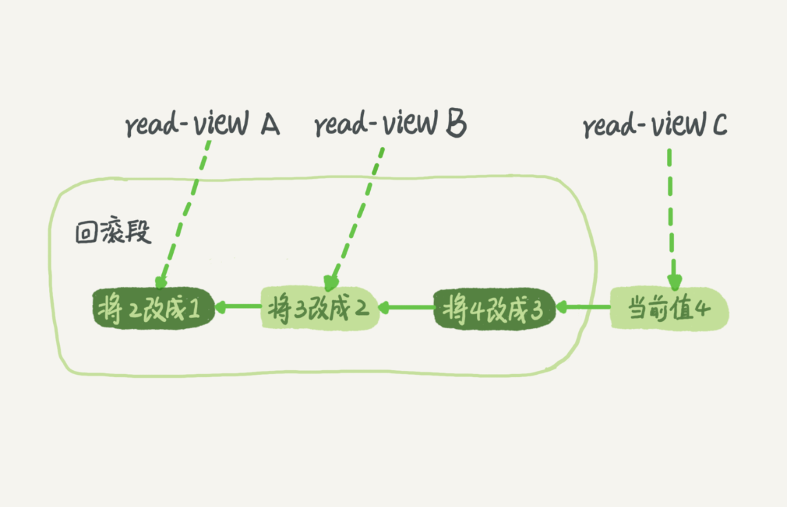

[TOC]
# MySQL事务

## MySQL事务是什么？

事务就是要保证一组数据库操作，要么全部操作，要么全部失败。

在MySQL中，事务支持都是在**引擎**实现的。

MySQL是一个支持多引擎的系统，但不是所有的引擎都支持事务。**MyISAM**引擎就不支持事务，这也是MyISAM 被 InnoDB取代的重要原因之一。

## 事务的特性

ACID:

**原子性(Atomic)**: 一个事务就是最小的工作单元，要么执行成功提交，要么执行失败回滚。

**一致性(Consistence)**:就是事务的执行不影响数据库的完整性，保证事务只能把数据库从一个有效(正确)的状态“转移”到另一个有效(正确)的状态，不能执行完一个事务后，使得数据库不符合数据库定义的规则，例如有某个有唯一性约束的字段存在两个相同的值，破坏了唯一性。

**隔离性(isolation)**: 就是事务在执行过程中，两个事务之间是隔离的，事务在执行成功之前，所做的修改对其他事务是不可见的。

**持久性(durability)**:事务执行成功后，对数据的修改是永久的，即使发生故障也不会发生数据。

## MySQL 的隔离级别是怎么样的？

* **读未提交**：一个事务还没提交时，它做的变更就能被他的事务看到。 可能会有**脏读**的问题，读到一些未提交的脏数据。
  
* **读提交**：一个事务提交之后，它做的变更才会被其他事务看到。可能会出现**幻读**的情况。

  
* **可重复读**：在事务开始的时候，记录当时的状态，在第二次读取同一行数据时，除非是本事务做的修改，否则读取都是事务开始时的数据。可以解决 **脏读** 的问题。这是MySQL的默认的事务隔离等级。(MySQL 在可重复读的隔离级别下，通过MVCC机制和Next-key Lock解决了幻读的问题)
  
* **可串行化**：强制事务串行执行，会让读取每一行都加锁，读用读锁，写用写锁，读写锁互斥，可以解决幻读的问题。并发比较多的话可能会造成大量的超时等待和锁竞争。如果业务并发的特别少或者没有并发，同时又要求数据及时可靠的话。

用极客时间的一张图来分析这几个隔离级别：

* 若隔离级别是“**读未提交**”：则 V1的值为2. 尽管事务B没有提交，但是已经被A看到了， V2 和 V3 都是2

* 若隔离级别是“**读提交**”：则 V1 的值为1， 事务B的更新在提交后才能被A看到，所以，V3的值也是2。
* 若隔离级别是“**可重复读**”：则 V1 的值1， V2是1 。  V3是2。
* 若隔离级别是“**可串行化**”： 则在事务B 执行将1 改为2 的时候，会被锁住。直到事务A提交后，事务B才可以继续执行。所以在A的角度上看， V1 的值 是1， V2的值为1，V3 的值是2.

## 事务隔离的实现

根据“**可重复读**”这一隔离级别具体是怎么实现的。

在MySQL中，实际上每条记录在更新的时候都会同时记录一条**回滚**操作。记录上的最新值，通过回滚操作，都可以得到前一个状态的值。（回滚操作记录在undo log中）。

假设一个值从1 被按顺序 2,3,4, 在回滚日志里面就会有类似下面的记录。

当前值是4，但是在查询这条记录的时候，不同时刻启动的事务会有不同的 read-view。如图中看到的，在视图 A,B,C里面，这一个记录的值分别是1，2，4，同一条记录在系统中可以存在多个版本，就是数据库的多版本并发控制（MVCC）。

对于read-view A，要得到1，就需要把当前值依次执行图中所有的回滚操作得到。

同时发现，即使现在有一个事务正在将4改为5，这个事务跟read-view A， B，C对应的事务是不会冲突的。

回滚日志删除 （当系统里没有比这个回滚日志更早的read-view的时候，就不需要回滚了）

## MySQL是如何解读幻读的问题？
幻读 就是事务执行过程中，在查询一个范围的数据时，有新的数据插入到这个范围，导致两次查询的数据不一致。 因为读 分为快照读和实时读。

### 快照读
普通的 select 语句都是 普通度，也就是读取的数据都是事务开始时那个状态的数据，普通读的幻读问题可以通过MVCC来解决

### 实时读
SELECT *** FOR UPDATE 在查询时会先申请X锁

SELECT *** IN SHARE MODE 在查询时会先申请S锁

X锁(排他锁)
S锁(共享锁)

就是实时读，就是读取的是实时的数据，而不快照数据，读的时候会加Next-Key Lock锁住当前的记录，以及左右两个区间的间隙，这样在读的时候就不能往我们的查询范围插入数据了。