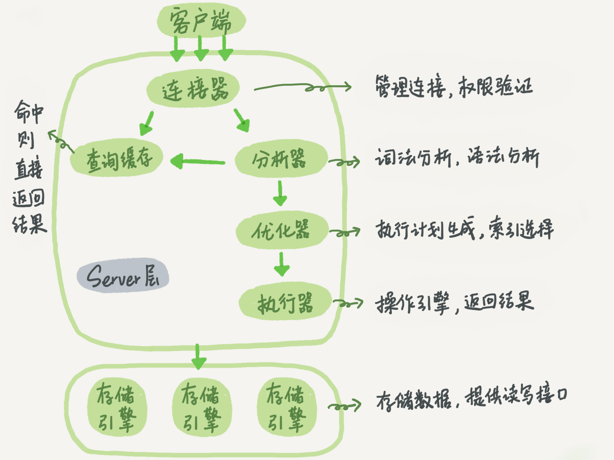
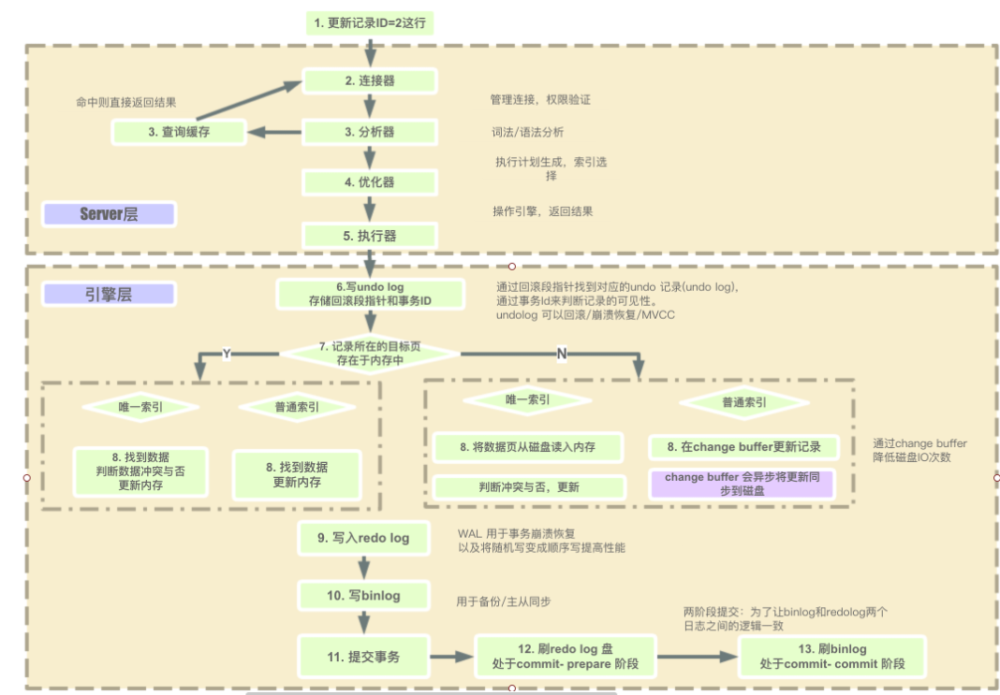
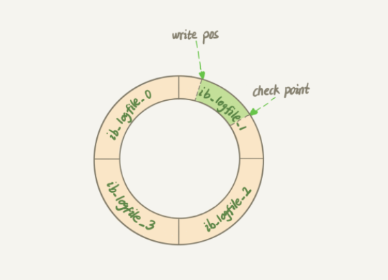
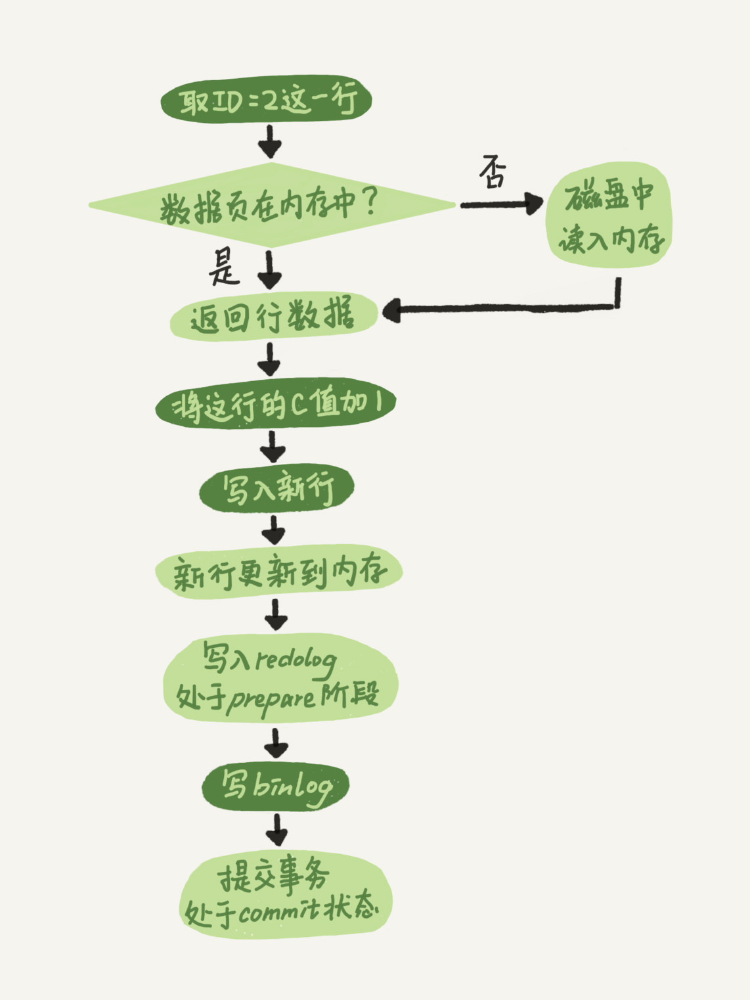

# Mysql



由上述的架构示意图，可以看到， MYSQL 可以分为 Server层 跟 存储引擎层两部分。


Server 层包括连接器、查询缓存、分析器、优化器、执行器等，涵盖 MySQL 的大多数核心服务功能，以及所有的内置函数（如日期、时间、数学和加密函数等），所有跨存储引擎的功能都在这一层实现，比如存储过程、触发器、视图等。


而存储引擎层负责数据的存储和提取。其架构模式是插件式的，支持 InnoDB、MyISAM、Memory 等多个存储引擎。现在最常用的存储引擎是 InnoDB，它从 MySQL 5.5.5 版本开始成为了默认存储引擎。

## 一条MySQL查询语句的执行过程是怎么样的？

### 连接器
第一步，连接数据库，这时候接待你的就是连接器。 连接器负责跟客户端建立连接，获取权限，维持和管理连接。连接命令一般如下：
```mysql
mysql -u root -p
```

之后发送语句给Mysql server，如果是查询语句则会先去查询缓存中看，有的话直接返回。（由于查询缓存的失效非常频繁，只要有一个表的更新，这个表上的查询缓存都会被清空）。因此， ==MYSQL 8.0 版本将查询缓存的整块功能删掉了。==


### 分析器
如果没有命中缓存，则要开始真正的执行语句了。首先，MYSQL 需要知道你要做什么，因此需要对SQL语句进行解析。


分析器首先会做“词法分析”。你输入的由多个字符串和空格组成一条 SQL 语句， MYSQL 需要识别里面的字符串分别是什么，代表什么。

MYSQL 从你输入的“select” 这个关键字识别出来，这是一个查询语句。 它也要把字符串 “T” 识别成 “表名T” , 把字符串 “ID” 识别成 “列 ID”。

做完了这些识别以后，就要做“语法分析”。 根据词法分析的结构，语法分析器会根据语法规则，判断你输入的SQL 语句是否满足MYSQL 语法。


### 优化器
经过了分析器， MYSQL就知道 命令的内容了，再开始执行之前，还需要经过**优化器**的处理。

优化器 是在表里面有多个索引的时候，决定使用哪个索引；或者在一个语句有多表关联(join)的时候，决定各个表的连接顺序。

优化器阶段完成后，这个语句的执行方案就确定下来了，然后进入执行器阶段。


### 执行器
MYSQL 通过分析器知道了要做什么， 知道优化器知道如何做， 然后进入执行器阶段，开始执行语句。

执行的时候需要判断对表 有没有查询的权限，如果没有，就会返回没有权限的错误。

如果有权限，就打开表继续执行。打开表的时候，执行器就会根据表的引擎定义，去使用这个引擎提供的接口。


## MYSQL 更新语句是如何执行的？


查询语句走过的流程，更新语句同样会走一遍。

假设更新语句如下：
```java
update T set c=c+1 where ID=2;
```
1. 首先执行连接器
2. 在一个表上有更新的时候，跟这个表有关的缓存失效，因此更新语句会把表上的缓存结果全部清空。
3. 分析器会通过词法与语法解析知道这是一条更新语句。
4. 优化器决定使用哪个索引
5. 执行器负责具体执行，找到该行，然后更新。
6. 与查询流程不一样的是，更新流程还设计到两个重要的日志模块， redo log(重做日志) 和binlog(归档日志)


### redo log（保证了事务的持久性，因为一次事务只修改一个数据页的几个字节，刷到磁盘浪费）
具体来说， 当有一条记录需要更新的时候， InnoDB 引擎就会先把记录 写到**redo log**里面，然后更新内存，这个时候更新就算完成了。同时， InnoDB 引擎会在适当的时候，将这个操作记录更新到磁盘里面，而这个更新往往在系统比较空闲的时候做。


而 InnoDB的redo  log 是固定大小的， 从头开始写，写到末尾就回到开头循环写，如下图所示：


write pos 是当前记录的位置，一边写一边后移，写完3号文件之后就回到0号文件。 check point 是当前要擦除的位置，往后推移并且循环，擦除记录前要把记录更新到数据文件。

write pos 和checkpoint 之间的表示还空着的部分，可以用于记录新的操作。如果write pos 追上checkpoint，表示“粉板”满了，这时候不能再执行新的更新，得停下来擦除记录，把checkpoint推进一下。


有了redo log, InnoDB就可以保证 即使数据库发生异常重启，之前提交的记录都不会丢失，这个能力称为crash-safe

### binlog

上面的redo log 是InnoDB 引擎特有的日志，而Server层也有自己的日志，称为 binlog(归档日志)

而为什么有两份日志呢？

因为最开始的时候MySQL里没有InnoDB引擎。MySQL 自带的引擎是MyISAM, 但是MyISAM 没有crash-safe 的能力，binlog日志只能用于归档。而InnoDB 是另一个公司以插件形式引入MySQL 的，既然只依靠binlog是没有crash-safe能力的，所以InnoDB 使用另外一套日志系统---也就是redo log来实现crash-safe能力的。


### 两种日志的不同
1. redo log是 InnoDB 引擎特有的; binlog 是MySQL 的 Server层实现的，所有引擎都可以使用
2. redo log 是物理日志， 记录的是“在某个数据页上做了什么修改”; binlog 是逻辑日志，记录的这个语句的原始逻辑，比如“给ID=2这一行的c字段加1”。
3. redo log 是循环写的，空间固定会用完； binlog 是可以可以追加写入的。“追加写”是指binlog文件写到一定大小后会切换到下一个，并不会覆盖以前的日志。
4. 除了这两个日志以外，还有一个 undolog，它是一种逻辑日志，是旧数据的备份。有两个作用用于事务回滚和MVCC。 执行一条insert语句时，会记录一条相反的delete语句到日志，执行一条update语句时，会记录一条相反的update 语句到日志中。


### update 语句的执行流程图



### 两阶段提交
从上面可以看到，redo log 的写入分为 prepare 和commit 两个步骤。

而这样做是为了让 两份日志 之间的逻辑一致。


用上面的update 语句来做例子，假设当前 ID=2 的行， 字段c的值是0. 假设执行update语句过程中 在写完第一个日志后，第二个日志还没有写完期间发生了crash，会出现什么情况呢？

1. **先写 redo log 后写 binlog** 。 假设在redo log 写完， binlog 还没有写完的时候，MySQL 进程异常重启。 由于 redo log写完之后，系统即使崩溃，仍然能够把数据回复回来，所以这里的c=1.
但是由于binlog 没写完就crash了，这时候binlog里面就没有记录这个语句。因此，之后备份日志的时候，存起来的binlog里面没有这条语句。 如果用binlog来恢复临时库的时候，由于这个语句的binlog丢失，这个临时库就会少了这一次更新，回复出来的这一行c的值就是0，与原库的值不同。
2. **先写 binlog 后写redo log** 。 如果binlog 写完之后 crash，由于redo log 还没写，崩溃恢复以后这个事务无效，所以这一行c的值是0. 但是binlog 里面已经记录了 “把c从0改为1”这个日志。所以，在之后用binlog 来恢复的时候就多了一个事务出来，回复出来的这一行c的值就是1，与原库的值不同。

