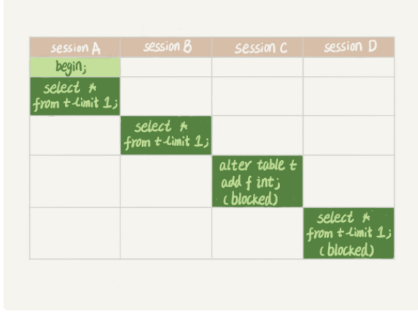
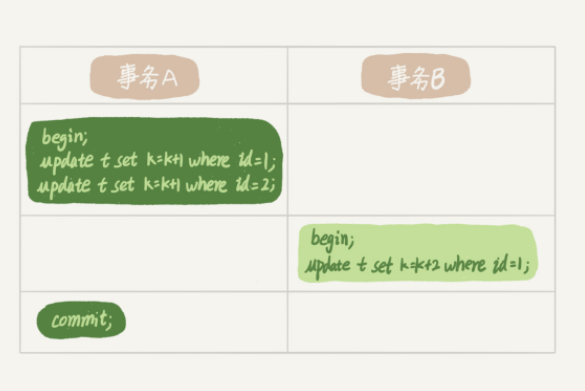
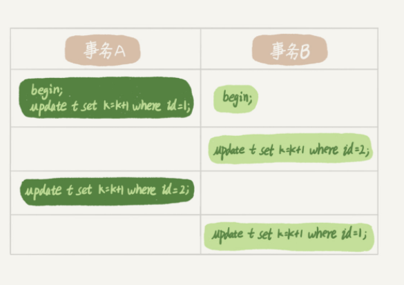

# MySQL 有哪些锁？


## 全局锁

全局锁对整个数据库实例加锁。 让整个库处于只读状态的时候，可以使用这个命令，之后其他线程的一下语句会被阻塞： 数据更新语句（数据的增删改），数据定义语句（包括建表，修改表结构等）和更新类事务的提交语句。

最常用的场景是 **全库逻辑备份**， 把整库每个表都select 出来存成文本。

有以下三种方式：

### 1. 全局锁
```sql
Flush tables with read lock
```
让整个库处于只读状态

### 2.利用innodb的事务隔离性（可重复读）
可以设置一个参数-single-transaction，这样导数据的时候就会开启一个事务，这样利用innodb的mvcc机制可以保证在事务执行过程中，读到的数据都跟事务开始时的一致，并且执行过程中，其他事务可以执行更新操作， 不会对他造成影响。这种方法必须要求数据库所有表的引擎都是innodb才行。

### 3. set global readonly =true
readonly 方式可以让全库进入只读状态，但是建议还是用FTWRL 方式，原因如下：
* 在有些系统中，readonly的值会被用来做其他逻辑，比如用来判断一个库是主库还是备库。因此，修改global变量的方式影响面更大。
* 在异常处理机制上有差异， 如果执行FTWRL 命令之后由于客户端发生异常断开,那么MySQL会自动释放这个全局锁， 而将整个库设置为readonly之后，如果客户端发生异常，则数据库就会一直保持 readonly 状态，这样会导致整个库长时间处于不可写状态，风险较高。

## 表级锁
MySQL 的表级锁 有两种： 一种是表锁，一种是元数据锁

### 表锁
```sql
lock tables user_table  read/write
```
与FTWRL类似，可以用unlock tables 主动释放锁，客户端断开的时候自动释放

来对表进行加读锁和写锁。

加读锁后， 表对所有线程都是只能读，即便是当前线程也只能读，不然会数据不一致。

加写锁后，表是对当前线程读写（表级别的写锁，本线程可以读写。），其他线程不能读，不然数据不一致。

在没有更细粒度的锁的时候，表锁是最常用的处理并发的方式。而对于InnoDB 这种支持行锁的引擎，一般不适用lock tables命令来控制并发，毕竟锁住整个表的影响还是太大。


### 元数据锁(MDL)
另一类表级的锁是MDL(metadata lock)

MDL 是为了保证读写的正确性。(如果一个查询正在遍历一个表中的数据，而执行期间另一个线程对这个表结构做变更，删了一列，那么查询线程拿到的结果跟表结构对不上，肯定是不行的)。

MDL 锁不需要显式使用，在访问一个表的时候会被自动加上。当对一个表做增删改查操作的时候，加MDL读锁；要当对表做结构变更操作的时候，加MDL写锁。

* 读锁之间不互斥，因此可以有多个线程同时对一张表进行增删改查。
* 读写锁之间，写锁之间是互斥的，用来保证变更表结构操作的安全性。因此，如果有两个线程要同时给一个表加字段，其中一个要等另一个执行完才能开始执行。

MDL 锁是针对表结构的锁，而增删改查是不会影响表结构，因此 读锁之间是不互斥的，而写锁是保证表结构不能被并行修改，如果存在读锁，那么写锁需要等待读锁释放。

而元数据锁有一个问题如下：


可以看到session A 先启动，这时候会对表t加一个读锁。由于session B 需要的也是MDL读锁，因此可以执行。

而session C 需要写锁，被阻塞， 但是之后所有要在表t上新申请MDL读锁的请求也会被session C 阻塞。 这时候这个表不能读写了。

（这是因为申请MDL锁会形成一个队列，队列中写锁获取优先级高于读锁，一旦出现写锁等待，不但当前操作会被阻塞，同时还会阻塞后续该表的所有操作。）
参考：https://blog.csdn.net/q2878948/article/details/96430129

那么如何安全地给小表加一个字段？

设定一个等待时间，如果指定的时间获取到MDL写锁最好，如果拿不到也不阻塞后面的业务语句。

```sql

ALTER TABLE tbl_name NOWAIT add column ...
ALTER TABLE tbl_name WAIT N add column ... 
```

## 行锁
MySQL 的行锁是在引擎层由各个引擎自己实现的。但并不是所有的引擎都支持行锁，比如MyISAM 引擎就不支持行锁（MyISAM不适合并发，适用于读多写少的场景）。 不支持行锁意味着并发控制只能使用表锁，对于这种引擎的表，同一张表上任何时刻只能有一个更新在执行，这就会影响到业务并发度。InnoDB是支持行锁的，这也是MyISAM 被InnoDB替代的重要原因之一。


行锁是针对数据表中行记录的锁。这很好理解，比如事务A更新了一行，而这时候事务B也要更新同一行，则必须等事务A的操作完成后才能进行更新。


### 两阶段锁



在上图中，事务B的update 语句会被阻塞，直到事务A执行commit之后，事务B才能继续执行。


也就是说，在InnoDB事务中， 行锁实在**需要的时候**才加上的，但并不是不需要了就立即释放，而是要等到事务结束时才释放。这个就是两阶段锁协议。

而知道了两阶段锁协议后， 我们可以这样使用事务：
==如果事务中需要锁多个行，要把最可能造成锁冲突，最可能影响并发度的锁尽量往后放。==


举极客时间的例子：


在这里如果有一个顾客C也同时买票，那么这两个事务冲突的部分就是语句2.因为他们要更新同一个影院账户的余额，需要修改同一行数据。

根据两阶段锁协议，无论怎么安排语句顺序，所有的操作需要的行锁都是在事务提交的时候才释放的。所以，如果你把语句2 安排到最后，比如按照3，1，2，的顺序，那么影院账户余额这一行的锁时间就最少，最大程度的减少了事务之间的锁等待，提升了并发度。


### 死锁和死锁检测
当并发系统中不同线程出现循环资源依赖，涉及的线程都在等待别的线程释放资源时，就会导致这几个线程都进入无限等待的状态，称为死锁。



这里事务A在等待事务B释放id=2的行锁，而事务B在等待事务A释放id=1的行锁，进入了死锁状态。


当死锁出现时，有两种策略：

* 直接进入等待，直到超时， 通过设置 innodb_lock_wait_timeout来设置
* 发起死锁检测，发现死锁后，主动回滚锁链条中的某一个事务，让其他事务得以继续执行。将参数innodb_deadlock_detect设置为on，表示开启这个逻辑。

在innodb_lock_wait_timeout 的默认值是50s，因此第一个策略等待时间过长


因此大多都采用第二种策略：主动死锁检测，但是死锁检测需要查看依赖的线程有没有被别人锁住，因此检测的时候非常耗费CPU资源。


# 参考文章：
极客时间 MySQL45讲:
[全局锁he表锁：给表加个字段怎么有这么多阻碍？](https://time.geekbang.org/column/article/69862)
[行锁功过：怎么减少对性能的影响](https://time.geekbang.org/column/article/70215)

[一条MySQL更新语句的执行过程是什么样的？](https://github.com/NotFound9/interviewGuide/blob/master/docs/MySQLNote.md)
