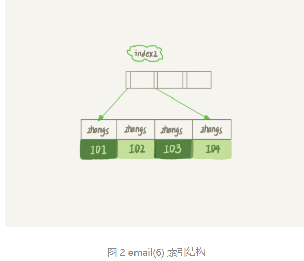

[toc]

# MySQL索引

## 索引是什么？

<font color=red>索引的出现其实是为了提高数据查询的效率，就像书的目录一样</font>

索引的优点是
1. 大大减少了服务器需要扫描的数据量。
2. 帮助服务器避免排序带来的性能开销。
3. 把随机IO变成顺序IO


## 索引的常见模型
索引的出现是为了提高查询效率，但是实现索引的方式却有很多种，例如哈希表，数组，二叉搜索树。


## InnoDB的索引模型
在InnoDB中，表都是根据 主键顺序以 索引的形式存放的，这种存储方式的表称为索引组织表。 而InnoDB使用了B+树索引模型，所以数据double存储在B+树中。

每一个索引在InnoDB 里面对应一颗B+树。
假设，有一个主键列为ID的表，表中有字段k，并且在k上有索引。
这个表的建表语句是：
```sql

mysql> create table T(
id int primary key, 
k int not null, 
name varchar(16),
index (k))engine=InnoDB;
```


根据上图，根据叶子节点的内容，索引类型分为主键索引和非主键索引。

主键索引的叶子节点存的是**整行数据**。 在 InnoDB里， 主键索引也被称为**聚簇索引**(clustered index)。
非主键索引的叶子节点内容是**主键的值**。在 InnoDB里，非主键索引也被称为**二级索引**
(secondary index)。

可以发现，非主键索引查询方式是先查到主键，然后在去主键的索引树在搜索，这个过程叫**回表**。


## 索引维护
B+树 为了维护索引有序性，插入新值的时候需要做必要的维护。

例如在上面这个图，如果插入的新的行ID值为700，则只需要在R5的记录后面插入新纪录。
但是如果ID=400，则相对麻烦。需要逻辑上挪动后面的数据，空出位置。

因此采用自增主键的方式：```NOT NULL PRIMARY KEY AUTO_INCREMENT```
来保证主键的有序插入。


## 覆盖索引

在上面的内容中，如果
要查找 select ID from T where k between 3 and 5，这时只需要查ID的值，而ID的值在k索引树上了，因此可以直接查询结果，不需要回表。也就是说，在这个查询里面，索引k已经“覆盖了”我们的查询需求， 我们称之为**覆盖索引**。


**覆盖索引可以减少树的搜索次数，显著提升查询性能，所以使用覆盖索引是一个常用的性能优化手段。**


## 联合索引
联合索引就是多列索引，可以多个字段建立一个索引

### 最左前缀原则

“B+树”这种索引结构，可以利用索引的“最左前缀”，来定位记录。

以下图（name，age）这个联合索引分析。


当逻辑需求是所有名字是“张三”的人时，可以快速定位到ID4,然后向后遍历得到所有需要的结果。

如果要查所有名字第一个字是“张”的人，你的SQL语句的条件是“where name like ‘张%’”。这时候可以用到索引


可以看到，不只是索引的全部定义，只要满足最左前缀，就可以利用索引来加速键锁。这个最左前缀可以是联合索引的最左N个字段，也可以是字符串索引的最左M个字符。


### 索引下推
前面的最左前缀可以用于在索引中定位记录。 然而那些不符合最左前缀的部分，会如何。

继续以上面的联合索引（name,age）为例
```sql

mysql> select * from tuser where name like '张%' and age=10 and ismale=1;
```

在在 MySQL 5.6 之前，只能从 ID3 开始一个个回表。到主键索引上找出数据行，再对比字段值。
如下图所示：


而在MySQL 5.6 引入的索引下推优化（index condition pushdown)， 可以在索引遍历过程中，对索引中包含的字段先做判断，直接过滤掉不满足条件的记录，减少回表次数。


## 主键，唯一性索引，普通索引的区别
一个表中可以有多个唯一性索引，但只能有一个主键。

1. 在查询时，如果是使用的是主键，或者是唯一性索引，查到后就返回了，普通索引还会继续向后遍历，直到第一个不满足条件的才会返回，普通索引会多检索几次，几乎没有什么影响。

2. 更新时普通索引需要判断唯一性


3. 主键是聚集索引，普通所以是非聚集索引。


### 普通索引和唯一性索引，如何选择

#### 查询
查询过程在上面说过，
* 对于普通索引来说，查找到满足条件的第一个记录后，需要查找下一个记录，直到碰到第一个不满足条件的才返回

* 对于唯一性索引来说，由于索引定义了唯一性，查找到的第一个满足条件的记录后，就会停止继续检索。

由于InnoDB的数据是按数据页来读写的，也就是说，找到记录的时候，那一个数据页都在内存里了，对于普通索引的来说，著需要多做一次“查找和判断下一条记录”的操作，就只需要一次指针和一次计算。

因此，在计算平均性能差异时，这个操作成本对于现在的CPU来说可以忽略不计。


#### 更新

而更新一个数据页时，如果数据页在内存中就直接更新，而如果这个数据页还没有在内存中的话，在不影响数据一致性的前提下，InnoDB会将这些更新操作缓存在change buffer中，这样就不需要从磁盘中读入这个数据页了。在下次查询需要访问的这个数据页的时候，将数据页读入内存，然后执行 **change buffer**中与这个页有关的操作。通过这种方式就能保证这个数据逻辑的正确性。


change buffer 是可以持久化的数据，将change buffer中的操作应用到原数据页，得到最新结果的过程称为merge。除了访问这个数据页会触发merge外，系统有后台线程会定期merge。除了访问这个数据页会触发merge外，系统有后台线程会定期merge。在数据库正常
shutdown的过程中，也会执行merge操作。


但是对于唯一性索引来说，所有的更新操作是否要先判断这个操作是否违反唯一性约束。比如插入某条数据的时候，需要判断是否存在该索引，这需要将数据读入到内存，而数据在内存的时候，直接更新内存就可，就没必要使用change buffer了。

因此，唯一性索引的更新不能使用change buffer，因此只有普通索引可以使用。


#### change buffer 和redo log


change buffer 和redo log 都是尽量减少随机读写。但是实际上是不一样的。

假设要在表上执行插入 语句：
```sql
mysql> insert into t(id,k) values(id1,k1),(id2,k2);
```
假设当前 k 索引树的状态，查找到位置后， k1所在的数据页在内存(InnoDB buffer pool)


这条更新语句做了如下的操作：
1. Page 1 在内存中，直接更新内存；
2. Page 2 没有在内存中，就在内存的change buffer区域，记录下“我要往Page 2插入一行”这个信息
3. 将上述两个动作记录redo log中(图中3和4).

执行完这些后，事务可以完成了，这条更新语句实际上写了两处内存，然后写了一处磁盘。


而这时候如果要执行一个select * from t where k in (k1, k2) 读请求呢？


从图中可以看到：
1. 读 Page1 的时候，直接有内存返回。
2. 读 Page2 的时候，需要把Page2从磁盘读入内存，然后根据change buffer的操作日志，生成正确的版本并返回结果。

可以看到，直到需要读Page 2的时候，这个数据页才会被读入内存中。


如果要简单对比这两个机制在提升更新性能上的收益的话，redo log主要节省的是随机写磁盘的IO消耗（转成顺序写），而change buffer 主要节省的是随机读磁盘的io消耗。


## 字符串索引
几乎所有的系统都支持邮箱登录，如何在邮箱的字段上建立合理的索引？

假设，现在维护一个支持邮箱登录的系统，用户表是这么定义的：
```sql

mysql> create table SUser(
ID bigint unsigned primary key,
email varchar(64), 
... 
)engine=innodb; 
```
而业务代码中一定会出现类似于这样的语句：
```java

mysql> select f1, f2 from SUser where email='xxx';

```

然而，MySQL是支持前缀索引的，可以定义字符串的一部分作为索引。（默认地，如果你创建地索引地语句不支持前缀长度，那么索引你就会包含整个字符串）。


比如，这两个email字段上创建索引地语句：
```java

mysql> alter table SUser add index index1(email);
或
mysql> alter table SUser add index index2(email(6));

```


第一个语句创建地index1 索引里面，包含了每个记录地整个字符串；而第二个语句创建地index2索引里面。对于每个记录都是只取前6个字节。




可以看到，使用前缀索引这个结构，占用的空间会更小，这就是使用前缀索引的优势。然而，这可能会增加额外的记录扫描记录。


那么看看下面这个语句，在这两个索引顶一下分别是怎么执行的。

```java
select id,name,email from SUser where email='zhangssxyz@xxx.com';
```

如果使用的是**index1**(即email整个字符串的索引结构)，执行顺序是这样的：

1. 从index1 索引树找到满足索引值‘zhangssxyz@xxx.com’的这条记录，取得ID2的值；
2. 到主键上查到主键值是ID2的行，判断email的值是正确的，将这行记录加入结果集；
3. 取index1索引树刚刚查到的位置的下一条记录，发现已经不满足email=‘zhangssxyz@xxx.com’的条件了，循环结束，


这个过程，只需要回主键索引取一次数据，所以系统默认只扫描了一行。


如果使用的是**index2**(即email(6)索引结构)，执行顺序是这样的：
1. 从index2索引树找到满足索引值是‘zhangs’的记录，找到的第一个是ID1;
2. 到主键上查到主键值是ID1的行，判断出email的值不是‘email的值’不是‘zhangssxyz@xxx.com’,这行记录丢弃
3. 取index2上刚刚查到的位置的下一条记录，发现仍然是‘zhangs’，取出ID2,
4. 再到ID索引上取整行然后判断，这次值对了，将这行记录加入结果集；
5. 重复上一步

这个过程中，要回主键索引取4次数据，也就是扫描了4行。


<font color=red>使用前缀索引后，可能会导致查询语句读数据的次数变多</font>

使用前缀索引，定义好长度，就可以做到既节省空间，又不用额外增加太多的查询成本。

### 前缀索引对覆盖索引的影响
使用了前缀索引可能会增加扫描行数，这回影响到性能。其实，前缀索引的影响不止如此，再看另外的场景。

先来看看这个SQL语句：
```sql

select id,email from SUser where email='zhangssxyz@xxx.com';
```

与前面例子的SQL语句：
```sql
select id,name,email from SUser where email='zhangssxyz@xxx.com';
```


这个语句只要求返回id和email字段
所以，如果使用 idnex1（即email整个字符串的索引结构）的话，可以利用覆盖索引，从index1 查到结果后可以直接返回了，不需要回到ID索引再去查一次。如果index2的话，就不得不回到id 索引再查一下。