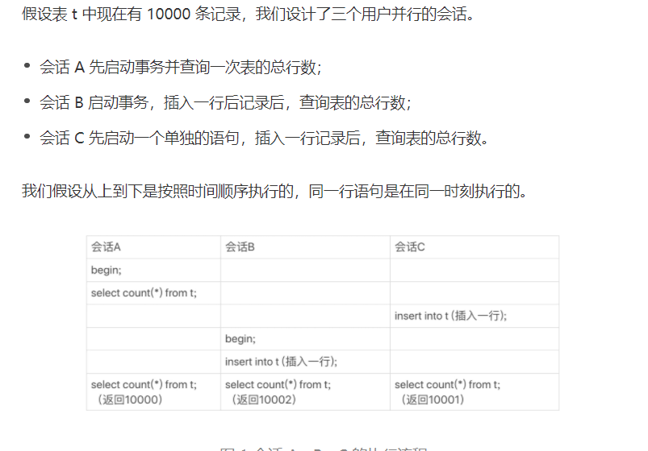

# count(*) 的原理

## count(*)的实现方式
* MyISAM 引擎把一个表的总行数存在了磁盘上，因此执行count(*)的时候会直接返回这个数，效率很高。
* InnoDB引擎就麻烦，它执行count(*)的时候，需要把数据一行一行地从引擎里面读出来，然后累积计数。

## 为什么InnoDB不跟MyISAM一样，也把数字存起来？
这是因为MVCC，导致InnoDB返回多少行也是不确定的。

## count(*) count(主键 id) count（字段） count(1)等不同用法的性能，有哪些差别？

在分析性能差异的时候，

以下分析基于InnoDB引擎。

count()是一个聚合函数，对于返回的结果集，一行行地判断，如果count函数地参数不是NULL，累加值就加1，否则不加。最后返回累计值。

所以，count(*),count(主键id)和count(1)都表示返回条件地结果集的总行数；而count(字段)，则表示返回满足条件的数据行里面，参数“字段”不为NULL 的总个数。

**对于count(主键id)来说**，InnoDB引擎会遍历整张表，把每一行的id都取出来，返回给server层，server层拿到id后，判断是不可能为空的，就按行累加。

**对于count(1)来说**，InnoDB引擎遍历整张表，但不取值，server层对于返回的每一行，放一个数字“1”进行，判断不可能为空的，按行累加。

这里可以对比判断count(1)比count(id)快，因为从引擎返回的id 会涉及到解析数据行，以及拷贝字段值的操作。

对于**count(字段)来说**：
1. 如果这个“字段”是定义为not null的话，一行行地从记录里面读出这个字段，判断不能为null，按行累加；
2. 如果这个“字段”定义允许为null，那么执行地时候，判断到有可能有null，还要取出值来再判断一下，不是null才累加。

对于count(*) 来说,Mysql做了优化，并不会取出全部字段，
count(*)肯定不是null，按行累加。

