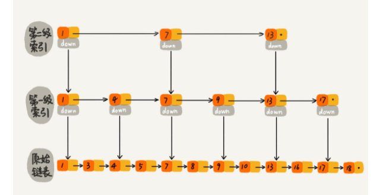
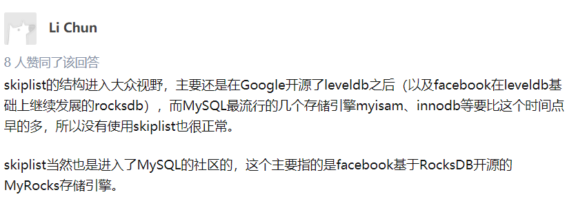
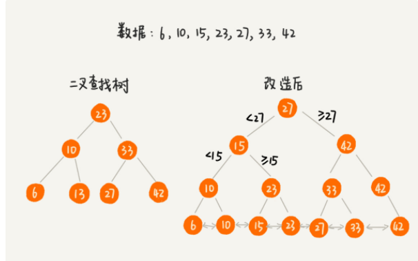
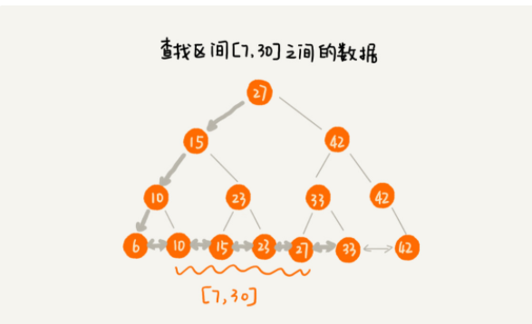
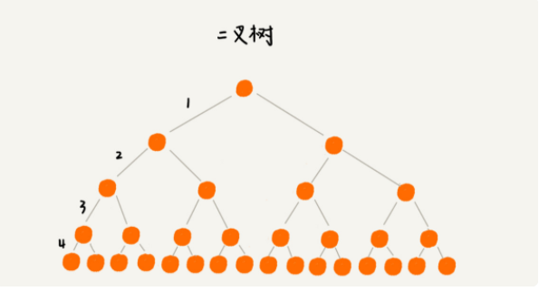
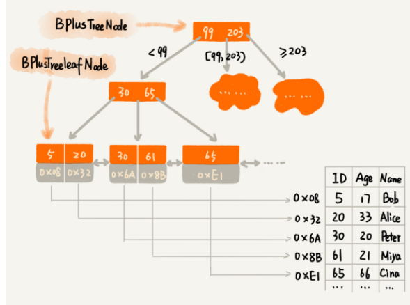
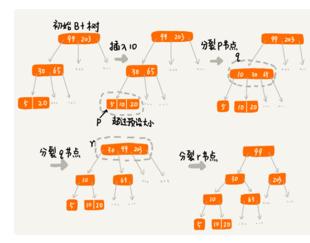
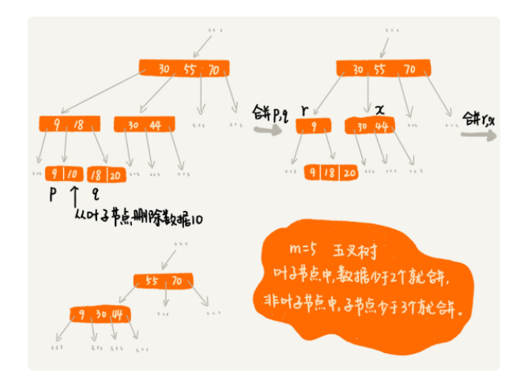

#[toc]
# 数据库的索引数据结构

数据库通过索引来查找数据，那么索引的数据结构是如何实现的？

假设我们要解决的问题，包含这样两个常用的需求：

* 根据某个值查找数据，比如 select * from user where id=1234;
* 根据区间值来查找某些数据，比如 select * from user where id>1234 and id<2345
  
既然是要解决问题，就要保证 性能方面的问题，即**执行效率和存储空间**

## 如何用其他数据结构来实现索引？

### 散列表
散列表的查询性能很好，时间复杂度是O(1).但是，散列表不能支持按照区间快速查找数据。 因此，不能用散列表。

###  平衡二叉查找树

尽管平衡二叉查找树查询的性能也很高，时间复杂度是O（log(n)）。而且，对树进行中序遍历，还可以得到一个从小到大有序的数据序列

### 跳表
跳表是链表之上加上多层索引构成的。它支持快速地插入，查找，删除数据，对应的事件复杂度是O(log n)。并且，跳表也支持按照区间快速地查找数据。我们只需要定位到区间起点值对应在链表中的节点，然后从这个节点开始，顺序遍历链表，直到区间重点对应的节点为止，这期间遍历得到的数据就是满足区间值的数据。

Tips:那么为什么Mysql的索引不支持跳表呢？ 
贴上知乎的答案：

### 改造二叉查找树来解决这个问题

为了让二叉查找树支持按照区间来查找数据， 可以对二叉查找树进行如下改造： 书中的节点不存储数据本身，而是只是作为索引。除此之外，把每个叶子节点串在一条链表上，链表中的数据是从小到大有序的。经过改造之后的二叉树， 就像图中这样，有点类似跳表了。

而改造之后，如果要求某个区间的数据。只需要拿区间的起始值，在书中进行查找，当查找到某个叶子节点之后，再顺着链表往后遍历，直到链表中的结点数据值大于区间的终止值位置。所有遍历到的数据，就是符合区间值的所有数据。

但是，如果要为几千万，几亿的数据构建索引，如果将索引存储在内存中，尽管内存访问的速度非常快，查询的效率非常高，但是占用的内存会非常多。

比如说，给一亿个数据构建二叉查找树索引，那么索引会包含大约一亿个字节，那就需要大约1GB的内存。给一个表建立索引，就需要1GB. 这样一来表多起来的话，内存是无法满足的。

那么利用时间换空间的思路，把索引存储在硬盘中，而非内存中。

这样，二叉查找树，经过改造之后，就支持区间查找的功能。而这里， 把树存储在硬盘中，每个节点的读取，都对应一次磁盘IO操作。树的高度就等于每次查询数据时磁盘IO操作的次数。==（磁盘IO非常耗时，因此接下来的优化重点是减少磁盘IO操作，也就是说，降低树的高度）==

如果把索引构建成m叉树，高度就会减小。如图所示，给16个数据构建二叉树索引，树的高度是4，查找一个数据，就需要4个磁盘IO操作（如果根节点存储在内存中，其他节点存储在磁盘中）。 那么如果m是100，那么一亿个数据构建索引，只需要3次磁盘IO就能获取到数据。磁盘IO变少了，查找数据的效率也就提高了。

那么 m值是不是越大越好，

因为操作系统都是按照页（一夜大小通常是4KB）的大小读取数据的，一次会读一页的数据。如果要读取的数据量超过一页的大小，就会触发多次IO操作。所以，在选择m的时候，尽量让每个节点的大小等于一个页的大小。读取一个节点，只需要一次磁盘IO操作。

这就是B+树的数据结构，

因为对B+树来说，m的值是根据页的大小实现算好的，每次节点最多只能有m个子节点。在往数据库写入数据的过程中，这样就有可能使索引中某些节点的子节点个数超过m个。

这样一来就可以将父节点分裂为两个节点，这种级联反应可以从下往上，一直影响到根节点。

同理，可以设定一个阈值，在B+树种，这个阈值等于m/2。如果每个节点的子节点个数小于m/2，我们就将它跟相邻的兄弟节点合并。 如果合并之后超过m，再分裂。

下图举了一个删除操作的例子，（图中的 B+ 树是一个五叉树。我们限定叶子节点中，数据的个数少于 2 个就合并节点；非叶子节点中，子节点的个数少于 3 个就合并节点。）。

### B+树的特点
* 每个节点中子节点的个数不能超过m，也不能小于m/2
* 根节点的子节点个数可以不超过m/2，这时一个例外；
* m叉树只存储索引，并不真正存储数据，这个优点而类似跳表
* 通过链表将叶子节点串联在一起，可以方便按区间查找
* 一般情况，根节点存储在内存中，其他节点存储在磁盘中

## B树跟B+树的区别

除了B+树，还有B树，B-树， 实际上，B-树就是B树，这里的‘-’只是一个连接符。

B树实际上是低配版的B+树，它们的不同点主要集中在这几个地方：
* B+ 树中的节点不存储数据，只是索引，而B树中的节点存储数据（因此B树结点存储的key更少，树会更高）
* B 树中的叶子节点不需要链表来串联（只能依靠中序遍历来进行范围查询）
  
B 树只是一个每个节点的子节点个数不能小于 m/2 的 m 叉树。