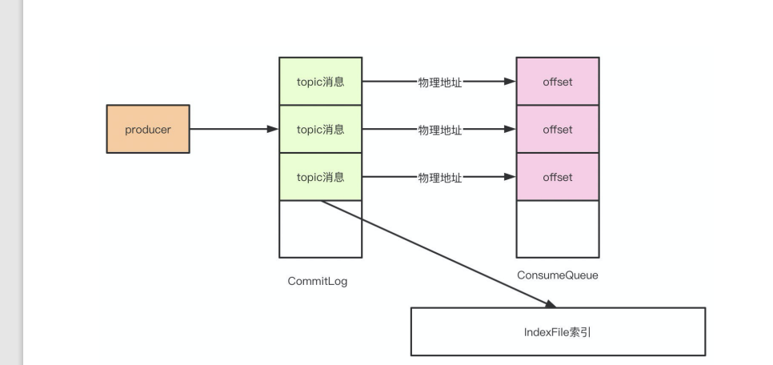

# RocketMQ 常用面经

## 为什么RocketMQ 不使用Zookeeper作为注册中心呢

1. Zookeeper 并不能保证服务的高可用，zookeeper 满足的是CP，也就是zookeeper 并不能保证服务的可用性，zookeeper 在进行选举的时候，整个选举的时间太长，期间整个集群都处于不可用的状态，这对于一个注册中心来说是不能接受的。

2.  消息发送应该弱依赖注册中心，而RocketMQ 的设计理念也是基于此，生产者在第一次发送消息的时候从NameServer获取到Broker 地址后缓存到本地，如果NameServer 整个集群不可用，短时间内对于生产者和消费这并不会产生太大影响。

## Broker 是怎么保存数据的？
RocketMQ主要的存储文件包括commitlog文件，consumequeue文件，indexfile文件。

Broker在收到消息之后，会把消息保存在commitlog 的文件当中，而同时在分布式的存储当中，每个broker 都会保存一部分topic 的数据，同时，每个topic 对应的messagequeue下都会生成consumequeue文件用于保存commitlog的物理位置偏移量offset，indexfile中都会保存key 和offset的对应关系。

## Master和Slave 之间是怎么同步数据的呢？
消息在master 和slave 之间的同步是根据raft协议来进行的：
1. 在broker收到消息后，会被标记为uncommitted状态
2. 然后会把消息发送给所有的slave
3. slave在收到消息后返回ack给master
4. master在收到半数的ack之后，把消息标记为committed
5. 发送committed消息给所有的slave，slave也被修改状态为committed

## RokcetMQ 为什么速度快？
是因为使用了顺序存储，Page Cache 和异步刷盘。
1. 在写入commitlog的时候是顺序写入的，这样比随机写入的性能就会提高很多
2. 写入commitlog 的时候并不会写入磁盘，先写入操作系统的PageCache
3. 最后由操作系统异步将缓存中的数据刷到磁盘。