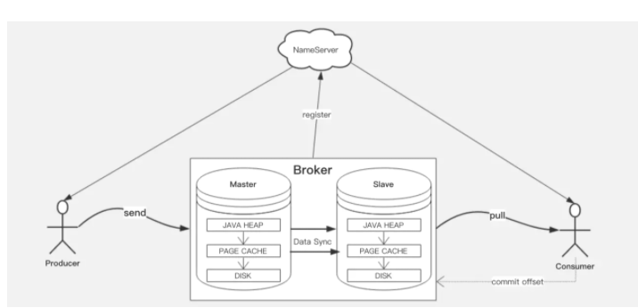

# RocketMQ 如何保证消息不丢失，如何保证消息不被重复消费

## 1.消息整体处理过程

这里我们将消息的整体处理阶段分为3个阶段进行分析：

Producer发送消息阶段。

Broker处理消息阶段。

Consumer消费消息阶段。

## Producer 发送消息阶段
发送消息阶段涉及到Producer到broker的网络通信，因此丢失消息的几率一定会有，那RocketMQ在此阶段用了哪些手段保证消息不丢失了（或者说降低丢失的可能性）。

### 手段一：提供SYNC的发送消息方式，等待broker处理结果。
RocketMQ提供了3种发送消息方式，分别是：
同步发送：Producer 向broker 发送消息，阻塞当前线程等待broker 响应发送结果。

异步发送：Producer 首先构建一个向broker发送消息的任务，将该任务提交给线程池，等执行完该任务时，回调用户自定义的回调函数，执行处理结果。

Oneway发送： Oneway 方式只负责发送请求，不等待应答，Producer 只负责把请求发出去，而不处理响应结果。

### 手段二：发送消息如果失败或者超时，则重新发送。
发送重试源码如下，本质其实就是一个for循环，当发送消息发生异常的时候重新循环发送。默认重试3次，重试次数可以通过producer指定。
### 手段三：broker提供多master模式，即使某台broker宕机了，保证消息可以投递到另外一台正常的broker上。
如果broker只有一个节点，则broker宕机了，即使producer有重试机制，也没用，因此利用多主模式，当某台broker宕机了，换一台broker进行投递。

producer消息发送方式虽然有3种，但为了减小丢失消息的可能性尽量采用同步发送的发送方式，同步等待发送结果，利用**同步发送+重试机制+多个master**节点，尽可能减少消息丢失的可能性。

## Broker处理消息阶段

### 手段四：提供同步刷盘的策略
当消息投递到broker之后，会先存在page cache，然后根据broker设置的刷盘策略是否立即刷盘，也就是如果刷盘策略为异步，broker并不会等待消息落盘就会返回producer成功，也就是说当broker 所在的服务器突然宕机，则会丢失部分页的消息。

### 手段五：提供主从模式，同时主从支持同步双写
即使broker 设置了同步刷盘，如果主broker 磁盘损坏，也就是会导致消息丢失。因此可以给broker指定slave，同时设置master为SYNC_MASTER, 然后将slave设置为同步刷盘策略。

此模式下，producer每发送一条消息，都会等消息投递到master和slave都落盘成功了，broker 才会当作消息投递成功，保证消息不丢失。

## Consumer处理消息阶段

### 手段六：consumer默认提供的是At least Once机制

从producer投递消息到broker，即使前面这些过程保证了消息正常持久化，但如果consumer消费消息没有消费到也不能理解为消息绝对的可靠。因此RockerMQ默认提供了At least Once机制保证消息可靠消费。

何为At least Once？

Consumer先pull 消息到本地，消费完成后，才向服务器返回ack。

通常消费消息的ack机制一般分为两种思路：

1、先提交后消费；

2、先消费，消费成功后再提交；

思路一可以解决重复消费的问题但是会丢失消息，因此Rocketmq默认实现的是思路二，由各自consumer业务方保证幂等来解决重复消费问题。

### 手段七：消费消息重试机制

当消费消息失败了，如果不提供重试消息的能力，则也不能算完全的可靠消费，因此RocketMQ本身提供了重新消费消息的能力。

consumer端要保证消费消息的可靠性，主要通过At least Once+消费重试机制保证。