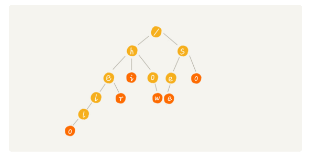
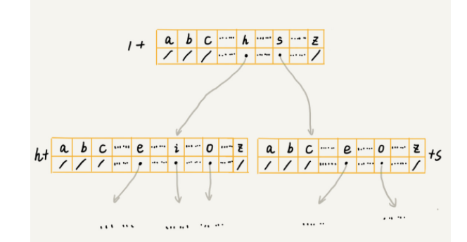

# Trie 树

## 什么是Trie树

Trie树，也叫“字典树”。是一种树形结构。**它是一种专门处理字符串匹配的数据结构，用来解决在一组字符串集合中快速查找某个字符串的问题。**


Trie树的本质，就是利用**字符串之间的公众前缀，将重复的前缀合并在一起**。


根节点不包含任何信息。每个节点表示一个字符串中的字符，从根节点到红色节点的一条路径表示一个字符串（注意：红色节点并不都是叶子节点）


## 如何实现一颗Trie树？


Trie树主要有两个操作，一个是将**字符串集合构造成Trie 树**。 这个过程分解开来的话，就是一个将字符串插入到Trie树的过程。 另一个在**Trie树中查询一个字符串**。


### 如何存储一个Trie树？

Trie树是一个**多叉树**。一个节点的左右子节点是通过两个指针来存储的，对于多叉树来说，该如何存储一个节点的所有子节点的指针。

利用一个数组来存储，
```java

class TrieNode {
  char data;
  TrieNode[] children=new TrieNode[26];
}
```


当我们在Trie树种查找字符串的时候，就可以通过字符的ASCII码减去'a'的ASCII码，迅速找到匹配的子节点的指针。

代码如下：
```java

public class Trie {
  private TrieNode root = new TrieNode('/'); // 存储无意义字符

  // 往Trie树中插入一个字符串
  public void insert(char[] text) {
    TrieNode p = root;
    for (int i = 0; i < text.length; ++i) {
      int index = text[i] - 'a';
      if (p.children[index] == null) {
        TrieNode newNode = new TrieNode(text[i]);
        p.children[index] = newNode;
      }
      p = p.children[index];
    }
    p.isEndingChar = true;
  }

  // 在Trie树中查找一个字符串
  public boolean find(char[] pattern) {
    TrieNode p = root;
    for (int i = 0; i < pattern.length; ++i) {
      int index = pattern[i] - 'a';
      if (p.children[index] == null) {
        return false; // 不存在pattern
      }
      p = p.children[index];
    }
    if (p.isEndingChar == false) return false; // 不能完全匹配，只是前缀
    else return true; // 找到pattern
  }

  public class TrieNode {
    public char data;
    public TrieNode[] children = new TrieNode[26];
    public boolean isEndingChar = false;
    public TrieNode(char data) {
      this.data = data;
    }
  }
}
```


### Trie树的时间复杂度

在Trie 树中，如果要在一组字符串中，频繁地查询某些字符串，用Trie树会非常高效。构建Trie树过程，需要扫描所有字符串，时间复杂度O(n)(n表示所有字符串地长度和)。但是一旦构建成功后，后续地查询操作会非常高效。


